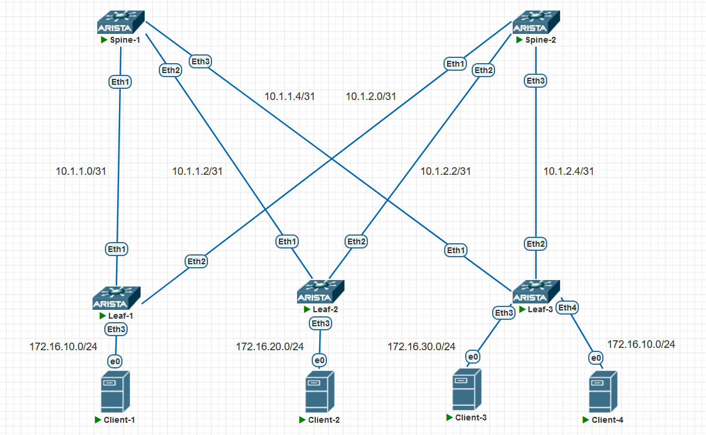

# Домашнее задание №1
## Проектирование адресного пространства

### Задачи:

- Собрать схему CLOS;
- Распределить адресное пространство.

## Выполнение:

### Собранная схема сети




### Таблица адресов

| hostname | interface |   IP/MASK   | Description |
| :------: | :-------: | :----------: | :---------: |
|  leaf-1  | Loopback0 | 10.1.254.1 /32 |            |
|  leaf-1  |  Eth 1  | 10.1.1.1 /31 | Spine-1 |
|  leaf-1  |  Eth 2  | 10.1.2.1 /31 | Spine-2 |
|          |          |              |            |
|  leaf-2  | Loopback0 | 10.1.254.2 /32 |            |
|  leaf-2  |  Eth 1  | 10.1.1.3 /31 | Spine-1 |
|  leaf-2  |  Eth 2  | 10.1.2.3 /31 | Spine-2 |
|          |          |              |            |
|  leaf-3  | Loopback0 | 10.1.254.3 /32 |            |
|  leaf-3  |  Eth 1  | 10.1.1.5 /31 | Spine-1 |
|  leaf-3  |  Eth 2  | 10.1.2.5 /31 | Spine-2 |
|          |          |              |            |
| Spine-1 | Loopback0 | 10.1.254.101/32 |            |
| Spine-1 |  Eth 1    | 10.1.1.0/31 |  Leaf-1  |
| Spine-1 |  Eth 2    | 10.1.1.2/31 |  Leaf-2  |
| Spine-1 |  Eth 3    | 10.1.1.4/31 |  Leaf-3  |
|         |           |             |            |
| Spine-2 | Loopback0 | 10.1.254.102/32 |            |
| Spine-2 |  Eth 1    | 10.1.2.0/31 |  Leaf-1  |
| Spine-2 |  Eth 2    | 10.1.2.2/31 |  Leaf-2  |
| Spine-2 |  Eth 3    | 10.1.2.2/31 |  Leaf-3  |

### Конфигурация оборудования

- #### [Leaf-1]

```
hostname Leaf-1

interface Ethernet1
   description Spine-1
   no switchport
   ip address 10.1.1.1/31

interface Ethernet2
   description Spine-2
   no switchport
   ip address 10.1.2.1/31
  
interface Loopback1
  ip address 10.1.254.1/32
```

- #### [Leaf-2]

```
hostname Leaf-2

interface Ethernet1
   description Spine-1
   no switchport
   ip address 10.1.1.3/31
!
interface Ethernet2
   description Spine-2
   no switchport
   ip address 10.1.2.3/31
  
interface Loopback0
  ip address 10.1.254.2/32
```

- #### [Leaf-3]

```
hostname Leaf-3

interface Ethernet1
   description Spine-1
   no switchport
   ip address 10.1.1.5/31
!
interface Ethernet2
   description Spine-2
   no switchport
   ip address 10.1.2.5/31
  
interface Loopback0
  ip address 10.1.254.3/32
```

- #### [Spine-1]

```
hostname Spine-1

interface Ethernet1
   description Leaf-1
   no switchport
   ip address 10.1.1.0/31
!
interface Ethernet2
   description Leaf-2
   no switchport
   ip address 10.1.1.2/31
!
interface Ethernet3
   description Leaf-3
   no switchport
   ip address 10.1.1.4/31

interface Loopback0
  ip address 10.1.254.101/32
```

- #### [Spine-2]

```
hostname Spine-2

interface Ethernet1
   description Leaf-1
   no switchport
   ip address 10.1.2.0/31
!
interface Ethernet2
   description Leaf-2
   no switchport
   ip address 10.1.2.2/31
!
interface Ethernet3
   description Leaf-3
   no switchport
   ip address 10.1.2.4/31
  
interface Loopback0
  ip address 10.1.254.102/32
```

### Проверка доступности

- #### Spine-1

~~~
Spine-1#ping 10.1.1.1
PING 10.1.1.1 (10.1.1.1) 72(100) bytes of data.
80 bytes from 10.1.1.1: icmp_seq=1 ttl=64 time=10.0 ms
80 bytes from 10.1.1.1: icmp_seq=2 ttl=64 time=1.79 ms
80 bytes from 10.1.1.1: icmp_seq=3 ttl=64 time=1.87 ms
80 bytes from 10.1.1.1: icmp_seq=4 ttl=64 time=1.77 ms
80 bytes from 10.1.1.1: icmp_seq=5 ttl=64 time=2.00 ms

--- 10.1.1.1 ping statistics ---
5 packets transmitted, 5 received, 0% packet loss, time 34ms
rtt min/avg/max/mdev = 1.772/3.506/10.081/3.288 ms, ipg/ewma 8.726/6.683 ms

Spine-1#ping 10.1.1.3
PING 10.1.1.3 (10.1.1.3) 72(100) bytes of data.
80 bytes from 10.1.1.3: icmp_seq=1 ttl=64 time=8.43 ms
80 bytes from 10.1.1.3: icmp_seq=2 ttl=64 time=1.74 ms
80 bytes from 10.1.1.3: icmp_seq=3 ttl=64 time=1.82 ms
80 bytes from 10.1.1.3: icmp_seq=4 ttl=64 time=1.74 ms
80 bytes from 10.1.1.3: icmp_seq=5 ttl=64 time=1.72 ms

--- 10.1.1.3 ping statistics ---
5 packets transmitted, 5 received, 0% packet loss, time 30ms
rtt min/avg/max/mdev = 1.725/3.095/8.433/2.669 ms, ipg/ewma 7.566/5.671 ms

Spine-1#ping 10.1.1.5
PING 10.1.1.5 (10.1.1.5) 72(100) bytes of data.
80 bytes from 10.1.1.5: icmp_seq=1 ttl=64 time=3.32 ms
80 bytes from 10.1.1.5: icmp_seq=2 ttl=64 time=1.74 ms
80 bytes from 10.1.1.5: icmp_seq=3 ttl=64 time=1.59 ms
80 bytes from 10.1.1.5: icmp_seq=4 ttl=64 time=1.52 ms
80 bytes from 10.1.1.5: icmp_seq=5 ttl=64 time=1.53 ms

--- 10.1.1.5 ping statistics ---
5 packets transmitted, 5 received, 0% packet loss, time 13ms
rtt min/avg/max/mdev = 1.529/1.945/3.325/0.694 ms, ipg/ewma 3.283/2.606 ms
~~~

- #### Spine-2

~~~
Spine-2#ping 10.1.2.1
PING 10.1.2.1 (10.1.2.1) 72(100) bytes of data.
80 bytes from 10.1.2.1: icmp_seq=1 ttl=64 time=19.0 ms
80 bytes from 10.1.2.1: icmp_seq=2 ttl=64 time=6.42 ms
80 bytes from 10.1.2.1: icmp_seq=3 ttl=64 time=2.01 ms
80 bytes from 10.1.2.1: icmp_seq=4 ttl=64 time=2.53 ms
80 bytes from 10.1.2.1: icmp_seq=5 ttl=64 time=2.02 ms

--- 10.1.2.1 ping statistics ---
5 packets transmitted, 5 received, 0% packet loss, time 65ms
rtt min/avg/max/mdev = 2.014/6.415/19.073/6.541 ms, pipe 2, ipg/ewma 16.250/12.442 ms

Spine-2#ping 10.1.2.3
PING 10.1.2.3 (10.1.2.3) 72(100) bytes of data.
80 bytes from 10.1.2.3: icmp_seq=1 ttl=64 time=8.14 ms
80 bytes from 10.1.2.3: icmp_seq=2 ttl=64 time=1.67 ms
80 bytes from 10.1.2.3: icmp_seq=3 ttl=64 time=1.71 ms
80 bytes from 10.1.2.3: icmp_seq=4 ttl=64 time=1.71 ms
80 bytes from 10.1.2.3: icmp_seq=5 ttl=64 time=1.60 ms

--- 10.1.2.3 ping statistics ---
5 packets transmitted, 5 received, 0% packet loss, time 28ms
rtt min/avg/max/mdev = 1.604/2.971/8.149/2.589 ms, ipg/ewma 7.235/5.469 ms

Spine-2#ping 10.1.2.5
PING 10.1.2.5 (10.1.2.5) 72(100) bytes of data.
80 bytes from 10.1.2.5: icmp_seq=1 ttl=64 time=2.68 ms
80 bytes from 10.1.2.5: icmp_seq=2 ttl=64 time=1.69 ms
80 bytes from 10.1.2.5: icmp_seq=3 ttl=64 time=1.73 ms
80 bytes from 10.1.2.5: icmp_seq=4 ttl=64 time=1.63 ms
80 bytes from 10.1.2.5: icmp_seq=5 ttl=64 time=1.53 ms

--- 10.1.2.5 ping statistics ---
5 packets transmitted, 5 received, 0% packet loss, time 11ms
rtt min/avg/max/mdev = 1.530/1.857/2.689/0.421 ms, ipg/ewma 2.845/2.254 ms

~~~
