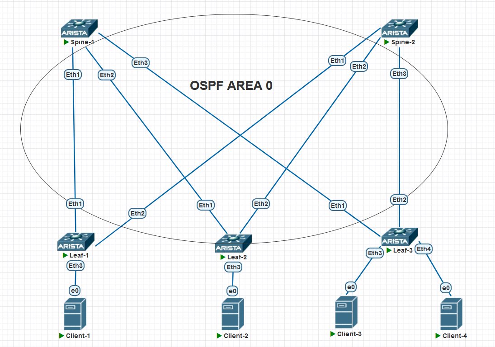

## OSPF

### Цели:
- настроить OSPF в Underlay-сети, для IP-связанности между всеми устройствами

### Описание выполнения лабораторной работы:
- запустить процесс OSPF на каждом L3-коммутаторе
- назначить Router ID каждому устройству
- все интерфейсы, кроме клиентских, L3-коммутаторов располагаются в Backbone Area
- все интерфейсы, участвующие в OSPF, должны быть переведены в режим point-to-point
- запустить процесс BFD на каждом физическом интерфейсе, участвующем в OSPF

### Физическая схема сети:



### Настройка OSPF и BFD:

#### <u>Настройка SPINE1:</u>

```
router ospf 1
   router-id 10.0.254.101

interface Ethernet1
   description Leaf-1
   ip ospf neighbor bfd
   ip ospf network point-to-point
   ip ospf area 0.0.0.0
!
interface Ethernet2
   description Leaf-2
   ip ospf neighbor bfd
   ip ospf network point-to-point
   ip ospf area 0.0.0.0
!
interface Ethernet3
   description Leaf-3
   ip ospf neighbor bfd
   ip ospf network point-to-point
   ip ospf area 0.0.0.0

interface Loopback0
   ip ospf area 0.0.0.0

```
#### <u>Настройка SPINE2:</u>
```
router ospf 1
   router-id 10.0.254.102

interface Ethernet1
   description Leaf-1
   ip ospf neighbor bfd
   ip ospf network point-to-point
   ip ospf area 0.0.0.0
!
interface Ethernet2
   description Leaf-2
   ip ospf neighbor bfd
   ip ospf network point-to-point
   ip ospf area 0.0.0.0
!
interface Ethernet3
   description Leaf-3
   ip ospf neighbor bfd
   ip ospf network point-to-point
   ip ospf area 0.0.0.0

interface Loopback0
   ip ospf area 0.0.0.0

```
#### <u>Настройка LEAF1:</u>
```
router ospf 1
   router-id 10.0.254.1

interface Ethernet1
   description Spine-1
   ip ospf neighbor bfd
   ip ospf network point-to-point
   ip ospf area 0.0.0.0
!
interface Ethernet2
   description Spine-2
   ip ospf neighbor bfd
   ip ospf network point-to-point
   ip ospf area 0.0.0.0

```
#### <u>Настройка LEAF2:</u>
```
router ospf 1
   router-id 10.0.254.2  

interface Ethernet1
   description Spine-1
   ip ospf neighbor bfd
   ip ospf network point-to-point
   ip ospf area 0.0.0.0
!
interface Ethernet2
   description Spine-2
   ip ospf neighbor bfd
   ip ospf network point-to-point
   ip ospf area 0.0.0.0
```
#### <u>Настройка LEAF3:</u>

```
router ospf 1
   router-id 10.0.254.3  

interface Ethernet1
   description Spine-1
   ip ospf neighbor bfd
   ip ospf network point-to-point
   ip ospf area 0.0.0.0
!
interface Ethernet2
   description Spine-2
   ip ospf neighbor bfd
   ip ospf network point-to-point
   ip ospf area 0.0.0.0
```
### Проверка соседства, таблицы маршрутизации и доступности Loopback соседей:

<details>
<summary>Проверка на SPINE1</summary>

```
Spine-1#show ip ospf neighbor
Neighbor ID     Instance VRF      Pri State                  Dead Time   Address         Interface
10.0.254.1      1        default  0   FULL                   00:00:35    10.1.1.1        Ethernet1
10.0.254.2      1        default  0   FULL                   00:00:35    10.1.1.3        Ethernet2
10.0.254.3      1        default  0   FULL                   00:00:34    10.1.1.5        Ethernet3
Spine-1#

Spine-1#show ip route ospf


 O        10.1.2.0/31 [110/20] via 10.1.1.1, Ethernet1
 O        10.1.2.2/31 [110/20] via 10.1.1.3, Ethernet2
 O        10.1.2.4/31 [110/20] via 10.1.1.5, Ethernet3
 O        10.1.254.1/32 [110/20] via 10.1.1.1, Ethernet1
 O        10.1.254.3/32 [110/20] via 10.1.1.5, Ethernet3
 O        10.1.254.2/31 [110/20] via 10.1.1.3, Ethernet2
 O        10.1.254.102/32 [110/30] via 10.1.1.1, Ethernet1
                                   via 10.1.1.3, Ethernet2
                                   via 10.1.1.5, Ethernet3

Spine-1#ping 10.1.254.1 source 10.1.254.101
PING 10.1.254.1 (10.1.254.1) from 10.1.254.101 : 72(100) bytes of data.
80 bytes from 10.1.254.1: icmp_seq=1 ttl=64 time=2.83 ms

Spine-1#ping 10.1.254.2 source 10.1.254.101
PING 10.1.254.2 (10.1.254.2) from 10.1.254.101 : 72(100) bytes of data.
80 bytes from 10.1.254.2: icmp_seq=1 ttl=64 time=2.53 ms

Spine-1#ping 10.1.254.3 source 10.1.254.101
PING 10.1.254.3 (10.1.254.3) from 10.1.254.101 : 72(100) bytes of data.
80 bytes from 10.1.254.3: icmp_seq=1 ttl=64 time=2.20 ms


```
</details>
<details>
<summary>Проверка на SPINE2</summary>

```
Spine-2#show ip ospf neighbor
Neighbor ID     Instance VRF      Pri State                  Dead Time   Address         Interface
10.0.254.1      1        default  0   FULL                   00:00:33    10.1.2.1        Ethernet1
10.0.254.2      1        default  0   FULL                   00:00:33    10.1.2.3        Ethernet2
10.0.254.3      1        default  0   FULL                   00:00:31    10.1.2.5        Ethernet3
Spine-2#
Spine-2#show ip route ospf

 O        10.1.1.0/31 [110/20] via 10.1.2.1, Ethernet1
 O        10.1.1.2/31 [110/20] via 10.1.2.3, Ethernet2
 O        10.1.1.4/31 [110/20] via 10.1.2.5, Ethernet3
 O        10.1.254.1/32 [110/20] via 10.1.2.1, Ethernet1
 O        10.1.254.3/32 [110/20] via 10.1.2.5, Ethernet3
 O        10.1.254.2/31 [110/20] via 10.1.2.3, Ethernet2
 O        10.1.254.101/32 [110/30] via 10.1.2.1, Ethernet1
                                   via 10.1.2.3, Ethernet2
                                   via 10.1.2.5, Ethernet3


Spine-2#ping 10.1.254.1 source 10.1.254.102
PING 10.1.254.1 (10.1.254.1) from 10.1.254.102 : 72(100) bytes of data.
80 bytes from 10.1.254.1: icmp_seq=1 ttl=64 time=3.84 ms


Spine-2#ping 10.1.254.2 source 10.1.254.102
PING 10.1.254.2 (10.1.254.2) from 10.1.254.102 : 72(100) bytes of data.
80 bytes from 10.1.254.2: icmp_seq=1 ttl=64 time=2.49 ms


Spine-2#ping 10.1.254.3 source 10.1.254.102
PING 10.1.254.3 (10.1.254.3) from 10.1.254.102 : 72(100) bytes of data.
80 bytes from 10.1.254.3: icmp_seq=1 ttl=64 time=2.39 ms
```
</details>
<details>
<summary>Проверка на LEAF1</summary>

```
Leaf-1#show ip ospf neighbor
Neighbor ID     Instance VRF      Pri State                  Dead Time   Address         Interface
10.0.254.101    1        default  0   FULL                   00:00:35    10.1.1.0        Ethernet1
10.0.254.102    1        default  0   FULL                   00:00:29    10.1.2.0        Ethernet2
Leaf-1#show ip route ospf

VRF: default
Codes: C - connected, S - static, K - kernel,
       O - OSPF, IA - OSPF inter area, E1 - OSPF external type 1,
       E2 - OSPF external type 2, N1 - OSPF NSSA external type 1,
       N2 - OSPF NSSA external type2, B - BGP, B I - iBGP, B E - eBGP,
       R - RIP, I L1 - IS-IS level 1, I L2 - IS-IS level 2,
       O3 - OSPFv3, A B - BGP Aggregate, A O - OSPF Summary,
       NG - Nexthop Group Static Route, V - VXLAN Control Service,
       DH - DHCP client installed default route, M - Martian,
       DP - Dynamic Policy Route, L - VRF Leaked,
       G  - gRIBI, RC - Route Cache Route

 O        10.1.1.2/31 [110/20] via 10.1.1.0, Ethernet1
 O        10.1.1.4/31 [110/20] via 10.1.1.0, Ethernet1
 O        10.1.2.2/31 [110/20] via 10.1.2.0, Ethernet2
 O        10.1.2.4/31 [110/20] via 10.1.2.0, Ethernet2
 O        10.1.254.3/32 [110/30] via 10.1.1.0, Ethernet1
                                 via 10.1.2.0, Ethernet2
 O        10.1.254.2/31 [110/30] via 10.1.1.0, Ethernet1
                                 via 10.1.2.0, Ethernet2
 O        10.1.254.101/32 [110/20] via 10.1.1.0, Ethernet1
 O        10.1.254.102/32 [110/20] via 10.1.2.0, Ethernet2


```
</details>
<details>
<summary>Проверка на LEAF2</summary>

```
Leaf-2#show ip ospf neighbor
Neighbor ID     Instance VRF      Pri State                  Dead Time   Address         Interface
10.0.254.101    1        default  0   FULL                   00:00:34    10.1.1.2        Ethernet1
10.0.254.102    1        default  0   FULL                   00:00:29    10.1.2.2        Ethernet2
Leaf-2#show ip route ospf

VRF: default
Codes: C - connected, S - static, K - kernel,
       O - OSPF, IA - OSPF inter area, E1 - OSPF external type 1,
       E2 - OSPF external type 2, N1 - OSPF NSSA external type 1,
       N2 - OSPF NSSA external type2, B - BGP, B I - iBGP, B E - eBGP,
       R - RIP, I L1 - IS-IS level 1, I L2 - IS-IS level 2,
       O3 - OSPFv3, A B - BGP Aggregate, A O - OSPF Summary,
       NG - Nexthop Group Static Route, V - VXLAN Control Service,
       DH - DHCP client installed default route, M - Martian,
       DP - Dynamic Policy Route, L - VRF Leaked,
       G  - gRIBI, RC - Route Cache Route

 O        10.1.1.0/31 [110/20] via 10.1.1.2, Ethernet1
 O        10.1.1.4/31 [110/20] via 10.1.1.2, Ethernet1
 O        10.1.2.0/31 [110/20] via 10.1.2.2, Ethernet2
 O        10.1.2.4/31 [110/20] via 10.1.2.2, Ethernet2
 O        10.1.254.1/32 [110/30] via 10.1.1.2, Ethernet1
                                 via 10.1.2.2, Ethernet2
 O        10.1.254.3/32 [110/30] via 10.1.1.2, Ethernet1
                                 via 10.1.2.2, Ethernet2
 O        10.1.254.101/32 [110/20] via 10.1.1.2, Ethernet1
 O        10.1.254.102/32 [110/20] via 10.1.2.2, Ethernet2
```
</details>
<details>
<summary>Проверка на LEAF3</summary>

```
Leaf-3#show ip ospf neighbor
Neighbor ID     Instance VRF      Pri State                  Dead Time   Address         Interface
10.0.254.101    1        default  0   FULL                   00:00:30    10.1.1.4        Ethernet1
10.0.254.102    1        default  0   FULL                   00:00:36    10.1.2.4        Ethernet2
Leaf-3#
Leaf-3#show ip route ospf

VRF: default
Codes: C - connected, S - static, K - kernel,
       O - OSPF, IA - OSPF inter area, E1 - OSPF external type 1,
       E2 - OSPF external type 2, N1 - OSPF NSSA external type 1,
       N2 - OSPF NSSA external type2, B - BGP, B I - iBGP, B E - eBGP,
       R - RIP, I L1 - IS-IS level 1, I L2 - IS-IS level 2,
       O3 - OSPFv3, A B - BGP Aggregate, A O - OSPF Summary,
       NG - Nexthop Group Static Route, V - VXLAN Control Service,
       DH - DHCP client installed default route, M - Martian,
       DP - Dynamic Policy Route, L - VRF Leaked,
       G  - gRIBI, RC - Route Cache Route

 O        10.1.1.0/31 [110/20] via 10.1.1.4, Ethernet1
 O        10.1.1.2/31 [110/20] via 10.1.1.4, Ethernet1
 O        10.1.2.0/31 [110/20] via 10.1.2.4, Ethernet2
 O        10.1.2.2/31 [110/20] via 10.1.2.4, Ethernet2
 O        10.1.254.1/32 [110/30] via 10.1.1.4, Ethernet1
                                 via 10.1.2.4, Ethernet2
 O        10.1.254.2/31 [110/30] via 10.1.1.4, Ethernet1
                                 via 10.1.2.4, Ethernet2
 O        10.1.254.101/32 [110/20] via 10.1.1.4, Ethernet1
 O        10.1.254.102/32 [110/20] via 10.1.2.4, Ethernet2


```
</details>

Также прилагаются полные конфигурационные файлы всего оборудования сети.
