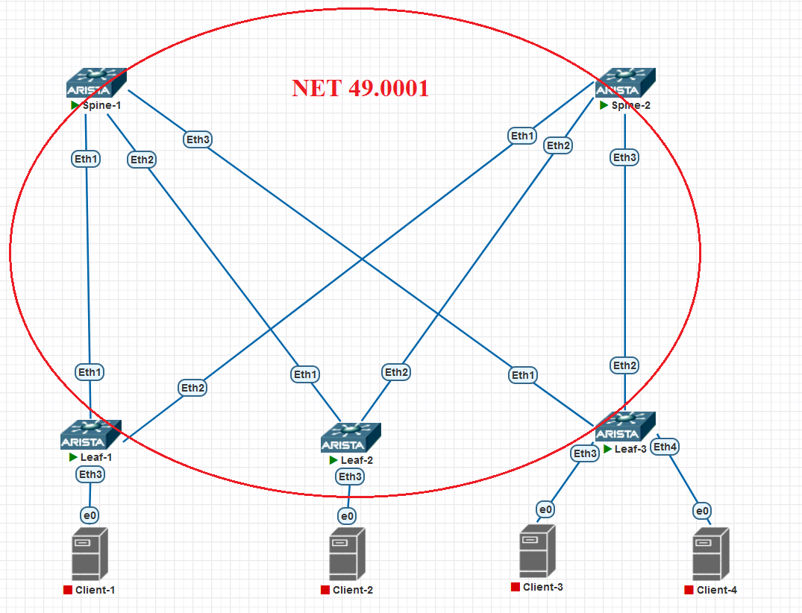

### IS-IS

### Цели:
- настроить IS-IS в Underlay-сети, для IP-связанности между всеми устройствами

### Описание выполнения лабораторной работы:
- запустить процесс IS-IS на каждом L3-коммутаторе
- Задать is-type Level-2
- все  L3-коммутаторы располагаются в Area 0001
- все интерфейсы, участвующие в IS-IS, должны быть переведены в режим point-to-point
- запустить процесс BFD на каждом физическом интерфейсе, участвующем в IS-IS

### Физическая схема сети:


#### <u>Таблица адресов Loopback0 и Net, настроенных на устройствах:</u>

|Device|IP Address Lo0|Net|
|:-:|:-:|:-:|:-:|
|Spine1|10.1.254.101|49.0001.0000.0000.0101.00|
|Spine1|10.1.254.102|49.0001.0000.0000.0102.00|
|Leaf1|10.1.254.1|49.0001.0000.0000.0001.00|
|Leaf1|10.1.254.2|49.0001.0000.0000.0002.00|
|Leaf1|10.1.254.3|49.0001.0000.0000.0003.00|

### Настройка IS-IS и BFD:

#### <u>Настройка SPINE1:</u>

```
router isis 1
   net 49.0100.0000.0000.0101.00
   is-type level-2
   address-family ipv4 unicast

interface Ethernet1
   description Leaf-1
   isis enable 1
   isis bfd
   isis network point-to-point
!
interface Ethernet2
   description Leaf-2
   isis enable 1
   isis bfd
   isis network point-to-point
!
interface Ethernet3
   description Leaf-3
   isis enable 1
   isis bfd
   isis network point-to-point

interface Loopback0
   isis enable 1

```
#### <u>Настройка SPINE2:</u>
```
router isis 1
   net 49.0100.0000.0000.0102.00
   is-type level-2
   address-family ipv4 unicast

interface Ethernet1
   description Leaf-1
   isis enable 1
   isis bfd
   isis network point-to-point
!
interface Ethernet2
   description Leaf-2
   isis enable 1
   isis bfd
   isis network point-to-point
!
interface Ethernet3
   description Leaf-3
   isis enable 1
   isis bfd
   isis network point-to-point

interface Loopback0
   isis enable 1

```
#### <u>Настройка LEAF1:</u>
```
router isis 1
   net 49.0100.0000.0000.0001.00
   is-type level-2
   address-family ipv4 unicast

interface Ethernet1
   description Spine-1
   isis enable 1
   isis bfd
   isis network point-to-point
!
interface Ethernet2
   description Spine-2
   isis enable 1
   isis bfd
   isis network point-to-point


interface Loopback0
   isis enable 1

```
#### <u>Настройка LEAF2:</u>
```
router isis 1
   net 49.0100.0000.0000.0002.00
   is-type level-2
   address-family ipv4 unicast

interface Ethernet1
   description Spine-1
   isis enable 1
   isis bfd
   isis network point-to-point
!
interface Ethernet2
   description Spine-2
   isis enable 1
   isis bfd
   isis network point-to-point


interface Loopback0
   isis enable 1

```
#### <u>Настройка LEAF3:</u>

```
router isis 1
   net 49.0100.0000.0000.0003.00
   is-type level-2
   address-family ipv4 unicast

interface Ethernet1
   description Spine-1
   isis enable 1
   isis bfd
   isis network point-to-point
!
interface Ethernet2
   description Spine-2
   isis enable 1
   isis bfd
   isis network point-to-point


interface Loopback0
   isis enable 1

```
### Проверка соседства, таблицы маршрутизации и доступности Loopback соседей:

<details>
<summary>Проверка на SPINE1</summary>

```
Spine-1#show isis neighbors

Instance  VRF      System Id        Type Interface          SNPA              State Hold time   Circuit Id
1         default  Leaf-1           L2   Ethernet1          P2P               UP    27          08
1         default  Leaf-2           L2   Ethernet2          P2P               UP    27          08
1         default  Leaf-3           L2   Ethernet3          P2P               UP    29          0C
Spine-1#
Spine-1#show ip route isis

VRF: default
Codes: C - connected, S - static, K - kernel,
       O - OSPF, IA - OSPF inter area, E1 - OSPF external type 1,
       E2 - OSPF external type 2, N1 - OSPF NSSA external type 1,
       N2 - OSPF NSSA external type2, B - BGP, B I - iBGP, B E - eBGP,
       R - RIP, I L1 - IS-IS level 1, I L2 - IS-IS level 2,
       O3 - OSPFv3, A B - BGP Aggregate, A O - OSPF Summary,
       NG - Nexthop Group Static Route, V - VXLAN Control Service,
       DH - DHCP client installed default route, M - Martian,
       DP - Dynamic Policy Route, L - VRF Leaked,
       G  - gRIBI, RC - Route Cache Route

 I L2     10.1.2.0/31 [115/20] via 10.1.1.1, Ethernet1
 I L2     10.1.2.2/31 [115/20] via 10.1.1.3, Ethernet2
 I L2     10.1.2.4/31 [115/20] via 10.1.1.5, Ethernet3
 I L2     10.1.254.1/32 [115/20] via 10.1.1.1, Ethernet1
 I L2     10.1.254.3/32 [115/20] via 10.1.1.5, Ethernet3
 I L2     10.1.254.2/31 [115/20] via 10.1.1.3, Ethernet2
 I L2     10.1.254.102/32 [115/30] via 10.1.1.1, Ethernet1
                                   via 10.1.1.3, Ethernet2
                                   via 10.1.1.5, Ethernet3

Spine-1#ping 10.1.254.1 source 10.1.254.101
PING 10.1.254.1 (10.1.254.1) from 10.1.254.101 : 72(100) bytes of data.
80 bytes from 10.1.254.1: icmp_seq=1 ttl=64 time=2.76 ms

Spine-1#ping 10.1.254.2 source 10.1.254.101
PING 10.1.254.2 (10.1.254.2) from 10.1.254.101 : 72(100) bytes of data.
80 bytes from 10.1.254.2: icmp_seq=1 ttl=64 time=2.53 ms

Spine-1#ping 10.1.254.3 source 10.1.254.101
PING 10.1.254.3 (10.1.254.3) from 10.1.254.101 : 72(100) bytes of data.
80 bytes from 10.1.254.3: icmp_seq=1 ttl=64 time=2.66 ms


```
</details>
<details>
<summary>Проверка на SPINE2</summary>

```
Spine-2#show isis neighbors

Instance  VRF      System Id        Type Interface          SNPA              State Hold time   Circuit Id
1         default  Leaf-1           L2   Ethernet1          P2P               UP    24          09
1         default  Leaf-2           L2   Ethernet2          P2P               UP    25          09
1         default  Leaf-3           L2   Ethernet3          P2P               UP    28          0D
Spine-2#
Spine-2#show ip route isis

VRF: default
Codes: C - connected, S - static, K - kernel,
       O - OSPF, IA - OSPF inter area, E1 - OSPF external type 1,
       E2 - OSPF external type 2, N1 - OSPF NSSA external type 1,
       N2 - OSPF NSSA external type2, B - BGP, B I - iBGP, B E - eBGP,
       R - RIP, I L1 - IS-IS level 1, I L2 - IS-IS level 2,
       O3 - OSPFv3, A B - BGP Aggregate, A O - OSPF Summary,
       NG - Nexthop Group Static Route, V - VXLAN Control Service,
       DH - DHCP client installed default route, M - Martian,
       DP - Dynamic Policy Route, L - VRF Leaked,
       G  - gRIBI, RC - Route Cache Route

 I L2     10.1.1.0/31 [115/20] via 10.1.2.1, Ethernet1
 I L2     10.1.1.2/31 [115/20] via 10.1.2.3, Ethernet2
 I L2     10.1.1.4/31 [115/20] via 10.1.2.5, Ethernet3
 I L2     10.1.254.1/32 [115/20] via 10.1.2.1, Ethernet1
 I L2     10.1.254.3/32 [115/20] via 10.1.2.5, Ethernet3
 I L2     10.1.254.2/31 [115/20] via 10.1.2.3, Ethernet2
 I L2     10.1.254.101/32 [115/30] via 10.1.2.1, Ethernet1
                                   via 10.1.2.3, Ethernet2
                                   via 10.1.2.5, Ethernet3

Spine-2#ping 10.1.254.1 source 10.1.254.102
PING 10.1.254.1 (10.1.254.1) from 10.1.254.102 : 72(100) bytes of data.
80 bytes from 10.1.254.1: icmp_seq=1 ttl=64 time=3.25 ms


Spine-2#ping 10.1.254.2 source 10.1.254.102
PING 10.1.254.2 (10.1.254.2) from 10.1.254.102 : 72(100) bytes of data.
80 bytes from 10.1.254.2: icmp_seq=1 ttl=64 time=2.89 ms


Spine-2#ping 10.1.254.3 source 10.1.254.102
PING 10.1.254.3 (10.1.254.3) from 10.1.254.102 : 72(100) bytes of data.
80 bytes from 10.1.254.3: icmp_seq=1 ttl=64 time=2.52 ms
```
</details>
<details>
<summary>Проверка на LEAF1</summary>

```
Leaf-1#show isis neighbors

Instance  VRF      System Id        Type Interface          SNPA              State Hold time   Circuit Id
1         default  Spine-1          L2   Ethernet1          P2P               UP    22          0C
1         default  Spine-2          L2   Ethernet2          P2P               UP    30          0C
Leaf-1#
Leaf-1#show ip route isis

VRF: default
Codes: C - connected, S - static, K - kernel,
       O - OSPF, IA - OSPF inter area, E1 - OSPF external type 1,
       E2 - OSPF external type 2, N1 - OSPF NSSA external type 1,
       N2 - OSPF NSSA external type2, B - BGP, B I - iBGP, B E - eBGP,
       R - RIP, I L1 - IS-IS level 1, I L2 - IS-IS level 2,
       O3 - OSPFv3, A B - BGP Aggregate, A O - OSPF Summary,
       NG - Nexthop Group Static Route, V - VXLAN Control Service,
       DH - DHCP client installed default route, M - Martian,
       DP - Dynamic Policy Route, L - VRF Leaked,
       G  - gRIBI, RC - Route Cache Route

 I L2     10.1.1.2/31 [115/20] via 10.1.1.0, Ethernet1
 I L2     10.1.1.4/31 [115/20] via 10.1.1.0, Ethernet1
 I L2     10.1.2.2/31 [115/20] via 10.1.2.0, Ethernet2
 I L2     10.1.2.4/31 [115/20] via 10.1.2.0, Ethernet2
 I L2     10.1.254.3/32 [115/30] via 10.1.1.0, Ethernet1
                                 via 10.1.2.0, Ethernet2
 I L2     10.1.254.2/31 [115/30] via 10.1.1.0, Ethernet1
                                 via 10.1.2.0, Ethernet2
 I L2     10.1.254.101/32 [115/20] via 10.1.1.0, Ethernet1
 I L2     10.1.254.102/32 [115/20] via 10.1.2.0, Ethernet2


```
</details>
<details>
<summary>Проверка на LEAF2</summary>

```
Leaf-2#show isis neighbors

Instance  VRF      System Id        Type Interface          SNPA              State Hold time   Circuit Id
1         default  Spine-1          L2   Ethernet1          P2P               UP    26          0D
1         default  Spine-2          L2   Ethernet2          P2P               UP    23          0D
Leaf-2#
Leaf-2#
Leaf-2#show ip route isis

VRF: default
Codes: C - connected, S - static, K - kernel,
       O - OSPF, IA - OSPF inter area, E1 - OSPF external type 1,
       E2 - OSPF external type 2, N1 - OSPF NSSA external type 1,
       N2 - OSPF NSSA external type2, B - BGP, B I - iBGP, B E - eBGP,
       R - RIP, I L1 - IS-IS level 1, I L2 - IS-IS level 2,
       O3 - OSPFv3, A B - BGP Aggregate, A O - OSPF Summary,
       NG - Nexthop Group Static Route, V - VXLAN Control Service,
       DH - DHCP client installed default route, M - Martian,
       DP - Dynamic Policy Route, L - VRF Leaked,
       G  - gRIBI, RC - Route Cache Route

 I L2     10.1.1.0/31 [115/20] via 10.1.1.2, Ethernet1
 I L2     10.1.1.4/31 [115/20] via 10.1.1.2, Ethernet1
 I L2     10.1.2.0/31 [115/20] via 10.1.2.2, Ethernet2
 I L2     10.1.2.4/31 [115/20] via 10.1.2.2, Ethernet2
 I L2     10.1.254.1/32 [115/30] via 10.1.1.2, Ethernet1
                                 via 10.1.2.2, Ethernet2
 I L2     10.1.254.3/32 [115/30] via 10.1.1.2, Ethernet1
                                 via 10.1.2.2, Ethernet2
 I L2     10.1.254.101/32 [115/20] via 10.1.1.2, Ethernet1
 I L2     10.1.254.102/32 [115/20] via 10.1.2.2, Ethernet2

```
</details>
<details>
<summary>Проверка на LEAF3</summary>

```
Leaf-3#show isis neighbors

Instance  VRF      System Id        Type Interface          SNPA              State Hold time   Circuit Id
1         default  Spine-1          L2   Ethernet1          P2P               UP    27          0E
1         default  Spine-2          L2   Ethernet2          P2P               UP    30          0E
Leaf-3#
Leaf-3#show ip route isis

VRF: default
Codes: C - connected, S - static, K - kernel,
       O - OSPF, IA - OSPF inter area, E1 - OSPF external type 1,
       E2 - OSPF external type 2, N1 - OSPF NSSA external type 1,
       N2 - OSPF NSSA external type2, B - BGP, B I - iBGP, B E - eBGP,
       R - RIP, I L1 - IS-IS level 1, I L2 - IS-IS level 2,
       O3 - OSPFv3, A B - BGP Aggregate, A O - OSPF Summary,
       NG - Nexthop Group Static Route, V - VXLAN Control Service,
       DH - DHCP client installed default route, M - Martian,
       DP - Dynamic Policy Route, L - VRF Leaked,
       G  - gRIBI, RC - Route Cache Route

 I L2     10.1.1.0/31 [115/20] via 10.1.1.4, Ethernet1
 I L2     10.1.1.2/31 [115/20] via 10.1.1.4, Ethernet1
 I L2     10.1.2.0/31 [115/20] via 10.1.2.4, Ethernet2
 I L2     10.1.2.2/31 [115/20] via 10.1.2.4, Ethernet2
 I L2     10.1.254.1/32 [115/30] via 10.1.1.4, Ethernet1
                                 via 10.1.2.4, Ethernet2
 I L2     10.1.254.2/31 [115/30] via 10.1.1.4, Ethernet1
                                 via 10.1.2.4, Ethernet2
 I L2     10.1.254.101/32 [115/20] via 10.1.1.4, Ethernet1
 I L2     10.1.254.102/32 [115/20] via 10.1.2.4, Ethernet2


```
</details>

Также прилагаются полные конфигурационные файлы всего оборудования сети.
