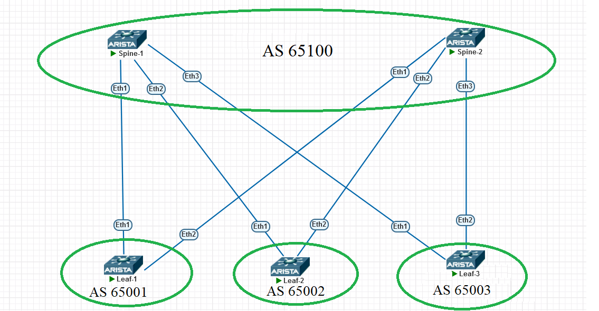

### eBGP

### Цели:
- настроить eBGP в Underlay-сети

### Описание выполнения лабораторной работы:
- Включить протокол BGP
- Задать Router-ID
- Поднять BGP сесси между Spine и Leaf
- Настоить BFD и ECMP
- Анонсировать в BGP IP-адреса Loopback 0

### Физическая схема сети:


#### <u>Таблица Loopback0/Router-ID и ASn, настроенных на устройствах:</u>

|Device|IP Lo0/Router-ID |ASn|
|:-:|:-:|:-:|
|Spine1|10.1.254.101|65100|
|Spine2|10.1.254.102|65100|
|Leaf1|10.1.254.1|65001|
|Leaf2|10.1.254.2|65002|
|Leaf3|10.1.254.3|65003|

### Настройка BGP/ICMP/BFD:

#### <u>Настройка SPINE1:</u>

```
router bgp 65100
   router-id 10.1.254.101
   maximum-paths 4 ecmp 4
   neighbor 10.1.1.1 remote-as 65001
   neighbor 10.1.1.1 bfd
   neighbor 10.1.1.3 remote-as 65002
   neighbor 10.1.1.3 bfd
   neighbor 10.1.1.5 remote-as 65003
   neighbor 10.1.1.5 bfd
   network 10.1.254.101/32
```
#### <u>Настройка SPINE2:</u>
```
router bgp 65100
   router-id 10.1.254.102
   maximum-paths 4 ecmp 4
   neighbor 10.1.2.1 remote-as 65001
   neighbor 10.1.2.1 bfd
   neighbor 10.1.2.3 remote-as 65002
   neighbor 10.1.2.3 bfd
   neighbor 10.1.2.5 remote-as 65003
   neighbor 10.1.2.5 bfd
   network 10.1.254.102/32
```
#### <u>Настройка LEAF1:</u>
```
router bgp 65001
   maximum-paths 4 ecmp 4
   router-id 10.1.254.1
   neighbor SPINE peer group
   neighbor SPINE remote-as 65100
   neighbor SPINE bfd
   neighbor 10.1.1.0 peer group SPINE
   neighbor 10.1.2.0 peer group SPINE
   network 10.1.254.1/32
```
#### <u>Настройка LEAF2:</u>
```
router bgp 65002
   router-id 10.1.254.2
   maximum-paths 4 ecmp 4
   neighbor SPINE peer group
   neighbor SPINE remote-as 65100
   neighbor SPINE bfd
   neighbor 10.1.1.2 peer group SPINE
   neighbor 10.1.2.2 peer group SPINE
   network 10.1.254.2/32
```
#### <u>Настройка LEAF3:</u>

```
ip prefix-list Loopback0 seq 10 permit 10.1.254.3/32
!
route-map Lo0 permit 10
   match ip address prefix-list Loopback0

router bgp 65003
   router-id 10.1.254.3
   maximum-paths 4 ecmp 4
   neighbor SPINE peer group
   neighbor SPINE remote-as 65100
   neighbor SPINE bfd
   neighbor 10.1.1.4 peer group SPINE
   neighbor 10.1.2.4 peer group SPINE
   redistribute connected route-map Lo0

```
### Проверка соседства, таблицы маршрутизации, BFD и доступности Loopback соседей:

<details>
<summary>Проверка на SPINE1</summary>

```
Spine-1#show ip bgp summary
BGP summary information for VRF default
Router identifier 10.1.254.101, local AS number 65100
Neighbor Status Codes: m - Under maintenance
  Neighbor         V AS           MsgRcvd   MsgSent  InQ OutQ  Up/Down State   PfxRcd PfxAcc
  10.1.1.1         4 65001             42        42    0    0 00:28:30 Estab   1      1
  10.1.1.3         4 65002             51        46    0    0 00:24:40 Estab   1      1
  10.1.1.5         4 65003             43        42    0    0 00:28:12 Estab   1      1
Spine-1#show ip bgp
BGP routing table information for VRF default
Router identifier 10.1.254.101, local AS number 65100
Route status codes: s - suppressed, * - valid, > - active, E - ECMP head, e - ECMP
                    S - Stale, c - Contributing to ECMP, b - backup, L - labeled-unicast
                    % - Pending BGP convergence
Origin codes: i - IGP, e - EGP, ? - incomplete
RPKI Origin Validation codes: V - valid, I - invalid, U - unknown
AS Path Attributes: Or-ID - Originator ID, C-LST - Cluster List, LL Nexthop - Link Local Nexthop

          Network                Next Hop              Metric  AIGP       LocPref Weight  Path
 * >      10.1.254.1/32          10.1.1.1              0       -          100     0       65001 i
 * >      10.1.254.2/32          10.1.1.3              0       -          100     0       65002 i
 * >      10.1.254.3/32          10.1.1.5              0       -          100     0       65003 i
 * >      10.1.254.101/32        -                     -       -          -       0       i
Spine-1#show ip route bgp

VRF: default
Codes: C - connected, S - static, K - kernel,
       O - OSPF, IA - OSPF inter area, E1 - OSPF external type 1,
       E2 - OSPF external type 2, N1 - OSPF NSSA external type 1,
       N2 - OSPF NSSA external type2, B - BGP, B I - iBGP, B E - eBGP,
       R - RIP, I L1 - IS-IS level 1, I L2 - IS-IS level 2,
       O3 - OSPFv3, A B - BGP Aggregate, A O - OSPF Summary,
       NG - Nexthop Group Static Route, V - VXLAN Control Service,
       DH - DHCP client installed default route, M - Martian,
       DP - Dynamic Policy Route, L - VRF Leaked,
       G  - gRIBI, RC - Route Cache Route

 B E      10.1.254.1/32 [200/0] via 10.1.1.1, Ethernet1
 B E      10.1.254.2/32 [200/0] via 10.1.1.3, Ethernet2
 B E      10.1.254.3/32 [200/0] via 10.1.1.5, Ethernet3

Spine-1#show bfd peers
VRF name: default
-----------------
DstAddr       MyDisc    YourDisc  Interface/Transport    Type           LastUp
--------- ----------- ----------- -------------------- ------- ----------------
10.1.1.1   514065166  1442279471        Ethernet1(12)  normal   06/03/24 13:47
10.1.1.3  1024802196  4109376265        Ethernet2(13)  normal   06/03/24 13:51
10.1.1.5    20711508  1710096124        Ethernet3(14)  normal   06/03/24 13:47

         LastDown            LastDiag    State
-------------------- ------------------- -----
               NA       No Diagnostic       Up
   06/03/24 13:51       No Diagnostic       Up
               NA       No Diagnostic       Up


```
</details>
<details>
<summary>Проверка на SPINE2</summary>

```
Spine-2#show ip bgp sum
BGP summary information for VRF default
Router identifier 10.1.254.102, local AS number 65100
Neighbor Status Codes: m - Under maintenance
  Neighbor         V AS           MsgRcvd   MsgSent  InQ OutQ  Up/Down State   PfxRcd PfxAcc
  10.1.2.1         4 65001            104       102    0    0 01:21:07 Estab   1      1
  10.1.2.3         4 65002            102       102    0    0 01:21:13 Estab   1      1
  10.1.2.5         4 65003            101       101    0    0 01:21:14 Estab   1      1
Spine-2#show ip bgp
BGP routing table information for VRF default
Router identifier 10.1.254.102, local AS number 65100
Route status codes: s - suppressed, * - valid, > - active, E - ECMP head, e - ECMP
                    S - Stale, c - Contributing to ECMP, b - backup, L - labeled-unicast
                    % - Pending BGP convergence
Origin codes: i - IGP, e - EGP, ? - incomplete
RPKI Origin Validation codes: V - valid, I - invalid, U - unknown
AS Path Attributes: Or-ID - Originator ID, C-LST - Cluster List, LL Nexthop - Link Local Nexthop

          Network                Next Hop              Metric  AIGP       LocPref Weight  Path
 * >      10.1.254.1/32          10.1.2.1              0       -          100     0       65001 i
 * >      10.1.254.2/32          10.1.2.3              0       -          100     0       65002 i
 * >      10.1.254.3/32          10.1.2.5              0       -          100     0       65003 i
 * >      10.1.254.102/32        -                     -       -          -       0       i
Spine-2#show ip route bgp

VRF: default
Codes: C - connected, S - static, K - kernel,
       O - OSPF, IA - OSPF inter area, E1 - OSPF external type 1,
       E2 - OSPF external type 2, N1 - OSPF NSSA external type 1,
       N2 - OSPF NSSA external type2, B - BGP, B I - iBGP, B E - eBGP,
       R - RIP, I L1 - IS-IS level 1, I L2 - IS-IS level 2,
       O3 - OSPFv3, A B - BGP Aggregate, A O - OSPF Summary,
       NG - Nexthop Group Static Route, V - VXLAN Control Service,
       DH - DHCP client installed default route, M - Martian,
       DP - Dynamic Policy Route, L - VRF Leaked,
       G  - gRIBI, RC - Route Cache Route

 B E      10.1.254.1/32 [200/0] via 10.1.2.1, Ethernet1
 B E      10.1.254.2/32 [200/0] via 10.1.2.3, Ethernet2
 B E      10.1.254.3/32 [200/0] via 10.1.2.5, Ethernet3
```
</details>
<details>
<summary>Проверка на LEAF1</summary>
```
Leaf-1#show ip bgp summary
BGP summary information for VRF default
Router identifier 10.1.254.1, local AS number 65001
Neighbor Status Codes: m - Under maintenance
  Neighbor         V AS           MsgRcvd   MsgSent  InQ OutQ  Up/Down State   PfxRcd PfxAcc
  10.1.1.0         4 65100             31        30    0    0 00:20:27 Estab   3      3
  10.1.2.0         4 65100             31        32    0    0 00:20:27 Estab   3      3

Leaf-1#show ip bgp
BGP routing table information for VRF default
Router identifier 10.1.254.1, local AS number 65001
Route status codes: s - suppressed, * - valid, > - active, E - ECMP head, e - ECMP
                    S - Stale, c - Contributing to ECMP, b - backup, L - labeled-unicast
                    % - Pending BGP convergence
Origin codes: i - IGP, e - EGP, ? - incomplete
RPKI Origin Validation codes: V - valid, I - invalid, U - unknown
AS Path Attributes: Or-ID - Originator ID, C-LST - Cluster List, LL Nexthop - Link Local Nexthop

          Network                Next Hop              Metric  AIGP       LocPref Weight  Path
 * >      10.1.254.1/32          -                     -       -          -       0       i
 * >Ec    10.1.254.2/32          10.1.1.0              0       -          100     0       65100 65002 i
 *  ec    10.1.254.2/32          10.1.2.0              0       -          100     0       65100 65002 i
 * >Ec    10.1.254.3/32          10.1.1.0              0       -          100     0       65100 65003 i
 *  ec    10.1.254.3/32          10.1.2.0              0       -          100     0       65100 65003 i
 * >      10.1.254.101/32        10.1.1.0              0       -          100     0       65100 i
 * >      10.1.254.102/32        10.1.2.0              0       -          100     0       65100 i
Leaf-1#show ip route bgp

VRF: default
Codes: C - connected, S - static, K - kernel,
       O - OSPF, IA - OSPF inter area, E1 - OSPF external type 1,
       E2 - OSPF external type 2, N1 - OSPF NSSA external type 1,
       N2 - OSPF NSSA external type2, B - BGP, B I - iBGP, B E - eBGP,
       R - RIP, I L1 - IS-IS level 1, I L2 - IS-IS level 2,
       O3 - OSPFv3, A B - BGP Aggregate, A O - OSPF Summary,
       NG - Nexthop Group Static Route, V - VXLAN Control Service,
       DH - DHCP client installed default route, M - Martian,
       DP - Dynamic Policy Route, L - VRF Leaked,
       G  - gRIBI, RC - Route Cache Route

 B E      10.1.254.2/32 [200/0] via 10.1.1.0, Ethernet1
                                via 10.1.2.0, Ethernet2
 B E      10.1.254.3/32 [200/0] via 10.1.1.0, Ethernet1
                                via 10.1.2.0, Ethernet2
 B E      10.1.254.101/32 [200/0] via 10.1.1.0, Ethernet1
 B E      10.1.254.102/32 [200/0] via 10.1.2.0, Ethernet2


Leaf-1#show bfd peers
VRF name: default
-----------------
DstAddr       MyDisc    YourDisc  Interface/Transport    Type           LastUp
--------- ----------- ----------- -------------------- ------- ----------------
10.1.1.0   531597187  2910335558         Ethernet1(8)  normal   06/05/24 13:22
10.1.2.0  1739057702  2175385858         Ethernet2(9)  normal   06/05/24 13:22

   LastDown            LastDiag    State
-------------- ------------------- -----
         NA       No Diagnostic       Up
         NA       No Diagnostic       Up

Leaf-1#ping 10.1.254.3 source 10.1.254.1
PING 10.1.254.3 (10.1.254.3) from 10.1.254.1 : 72(100) bytes of data.
80 bytes from 10.1.254.3: icmp_seq=1 ttl=63 time=10.4 ms
80 bytes from 10.1.254.3: icmp_seq=2 ttl=63 time=3.39 ms
80 bytes from 10.1.254.3: icmp_seq=3 ttl=63 time=4.70 ms
80 bytes from 10.1.254.3: icmp_seq=4 ttl=63 time=3.07 ms
80 bytes from 10.1.254.3: icmp_seq=5 ttl=63 time=3.20 ms

--- 10.1.254.3 ping statistics ---
5 packets transmitted, 5 received, 0% packet loss, time 38ms
rtt min/avg/max/mdev = 3.077/4.962/10.442/2.802 ms, ipg/ewma 9.569/7.591 ms
Leaf-1#ping 10.1.254.2 source 10.1.254.1
PING 10.1.254.2 (10.1.254.2) from 10.1.254.1 : 72(100) bytes of data.
80 bytes from 10.1.254.2: icmp_seq=1 ttl=63 time=5.54 ms
80 bytes from 10.1.254.2: icmp_seq=2 ttl=63 time=3.45 ms
80 bytes from 10.1.254.2: icmp_seq=3 ttl=63 time=3.97 ms
80 bytes from 10.1.254.2: icmp_seq=4 ttl=63 time=3.49 ms
80 bytes from 10.1.254.2: icmp_seq=5 ttl=63 time=3.37 ms

--- 10.1.254.2 ping statistics ---
5 packets transmitted, 5 received, 0% packet loss, time 21ms
rtt min/avg/max/mdev = 3.374/3.968/5.545/0.816 ms, ipg/ewma 5.339/4.724 ms

```
</details>
<details>
<summary>Проверка на LEAF2</summary>

```
Leaf-2#show ip bgp su
BGP summary information for VRF default
Router identifier 10.1.254.2, local AS number 65002
Neighbor Status Codes: m - Under maintenance
  Neighbor         V AS           MsgRcvd   MsgSent  InQ OutQ  Up/Down State   PfxRcd PfxAcc
  10.1.1.2         4 65100            107       105    0    0 01:25:45 Estab   3      3
  10.1.2.2         4 65100            108       107    0    0 01:25:12 Estab   3      3
Leaf-2#show ip bgp
BGP routing table information for VRF default
Router identifier 10.1.254.2, local AS number 65002
Route status codes: s - suppressed, * - valid, > - active, E - ECMP head, e - ECMP
                    S - Stale, c - Contributing to ECMP, b - backup, L - labeled-unicast
                    % - Pending BGP convergence
Origin codes: i - IGP, e - EGP, ? - incomplete
RPKI Origin Validation codes: V - valid, I - invalid, U - unknown
AS Path Attributes: Or-ID - Originator ID, C-LST - Cluster List, LL Nexthop - Link Local Nexthop

          Network                Next Hop              Metric  AIGP       LocPref Weight  Path
 * >Ec    10.1.254.1/32          10.1.1.2              0       -          100     0       65100 65001 i
 *  ec    10.1.254.1/32          10.1.2.2              0       -          100     0       65100 65001 i
 * >      10.1.254.2/32          -                     -       -          -       0       i
 * >Ec    10.1.254.3/32          10.1.1.2              0       -          100     0       65100 65003 i
 *  ec    10.1.254.3/32          10.1.2.2              0       -          100     0       65100 65003 i
 * >      10.1.254.101/32        10.1.1.2              0       -          100     0       65100 i
 * >      10.1.254.102/32        10.1.2.2              0       -          100     0       65100 i
Leaf-2#show ip route bgp

VRF: default
Codes: C - connected, S - static, K - kernel,
       O - OSPF, IA - OSPF inter area, E1 - OSPF external type 1,
       E2 - OSPF external type 2, N1 - OSPF NSSA external type 1,
       N2 - OSPF NSSA external type2, B - BGP, B I - iBGP, B E - eBGP,
       R - RIP, I L1 - IS-IS level 1, I L2 - IS-IS level 2,
       O3 - OSPFv3, A B - BGP Aggregate, A O - OSPF Summary,
       NG - Nexthop Group Static Route, V - VXLAN Control Service,
       DH - DHCP client installed default route, M - Martian,
       DP - Dynamic Policy Route, L - VRF Leaked,
       G  - gRIBI, RC - Route Cache Route

 B E      10.1.254.1/32 [200/0] via 10.1.1.2, Ethernet1
                                via 10.1.2.2, Ethernet2
 B E      10.1.254.3/32 [200/0] via 10.1.1.2, Ethernet1
                                via 10.1.2.2, Ethernet2
 B E      10.1.254.101/32 [200/0] via 10.1.1.2, Ethernet1
 B E      10.1.254.102/32 [200/0] via 10.1.2.2, Ethernet2

Leaf-2#ping 10.1.254.1 source 10.1.254.2
PING 10.1.254.1 (10.1.254.1) from 10.1.254.2 : 72(100) bytes of data.
80 bytes from 10.1.254.1: icmp_seq=1 ttl=63 time=3.91 ms
80 bytes from 10.1.254.1: icmp_seq=2 ttl=63 time=3.36 ms
80 bytes from 10.1.254.1: icmp_seq=3 ttl=63 time=3.31 ms
80 bytes from 10.1.254.1: icmp_seq=4 ttl=63 time=3.55 ms
80 bytes from 10.1.254.1: icmp_seq=5 ttl=63 time=3.14 ms

--- 10.1.254.1 ping statistics ---
5 packets transmitted, 5 received, 0% packet loss, time 19ms
rtt min/avg/max/mdev = 3.143/3.457/3.919/0.270 ms, ipg/ewma 4.915/3.677 ms
Leaf-2#ping 10.1.254.3 source 10.1.254.2
PING 10.1.254.3 (10.1.254.3) from 10.1.254.2 : 72(100) bytes of data.
80 bytes from 10.1.254.3: icmp_seq=1 ttl=63 time=3.65 ms
80 bytes from 10.1.254.3: icmp_seq=2 ttl=63 time=3.23 ms
80 bytes from 10.1.254.3: icmp_seq=3 ttl=63 time=3.23 ms
80 bytes from 10.1.254.3: icmp_seq=4 ttl=63 time=3.35 ms
80 bytes from 10.1.254.3: icmp_seq=5 ttl=63 time=3.24 ms

--- 10.1.254.3 ping statistics ---
5 packets transmitted, 5 received, 0% packet loss, time 16ms
rtt min/avg/max/mdev = 3.234/3.346/3.654/0.160 ms, ipg/ewma 4.140/3.495 ms

```
</details>
<details>
<summary>Проверка на LEAF3</summary>

```
Leaf-3#show ip bgp summary
BGP summary information for VRF default
Router identifier 10.1.254.3, local AS number 65003
Neighbor Status Codes: m - Under maintenance
  Neighbor         V AS           MsgRcvd   MsgSent  InQ OutQ  Up/Down State   PfxRcd PfxAcc
  10.1.1.4         4 65100            105       105    0    0 01:24:15 Estab   3      3
  10.1.2.4         4 65100            104       104    0    0 01:23:58 Estab   3      3
Leaf-3#show ip bgp
BGP routing table information for VRF default
Router identifier 10.1.254.3, local AS number 65003
Route status codes: s - suppressed, * - valid, > - active, E - ECMP head, e - ECMP
                    S - Stale, c - Contributing to ECMP, b - backup, L - labeled-unicast
                    % - Pending BGP convergence
Origin codes: i - IGP, e - EGP, ? - incomplete
RPKI Origin Validation codes: V - valid, I - invalid, U - unknown
AS Path Attributes: Or-ID - Originator ID, C-LST - Cluster List, LL Nexthop - Link Local Nexthop

          Network                Next Hop              Metric  AIGP       LocPref Weight  Path
 * >Ec    10.1.254.1/32          10.1.1.4              0       -          100     0       65100 65001 i
 *  ec    10.1.254.1/32          10.1.2.4              0       -          100     0       65100 65001 i
 * >Ec    10.1.254.2/32          10.1.1.4              0       -          100     0       65100 65002 i
 *  ec    10.1.254.2/32          10.1.2.4              0       -          100     0       65100 65002 i
 * >      10.1.254.3/32          -                     -       -          -       0       i
 * >      10.1.254.101/32        10.1.1.4              0       -          100     0       65100 i
 * >      10.1.254.102/32        10.1.2.4              0       -          100     0       65100 i
Leaf-3#show ip route bgp

VRF: default
Codes: C - connected, S - static, K - kernel,
       O - OSPF, IA - OSPF inter area, E1 - OSPF external type 1,
       E2 - OSPF external type 2, N1 - OSPF NSSA external type 1,
       N2 - OSPF NSSA external type2, B - BGP, B I - iBGP, B E - eBGP,
       R - RIP, I L1 - IS-IS level 1, I L2 - IS-IS level 2,
       O3 - OSPFv3, A B - BGP Aggregate, A O - OSPF Summary,
       NG - Nexthop Group Static Route, V - VXLAN Control Service,
       DH - DHCP client installed default route, M - Martian,
       DP - Dynamic Policy Route, L - VRF Leaked,
       G  - gRIBI, RC - Route Cache Route

 B E      10.1.254.1/32 [200/0] via 10.1.1.4, Ethernet1
                                via 10.1.2.4, Ethernet2
 B E      10.1.254.2/32 [200/0] via 10.1.1.4, Ethernet1
                                via 10.1.2.4, Ethernet2
 B E      10.1.254.101/32 [200/0] via 10.1.1.4, Ethernet1
 B E      10.1.254.102/32 [200/0] via 10.1.2.4, Ethernet2

Leaf-3#ping 10.1.254.1 source 10.1.254.3
PING 10.1.254.1 (10.1.254.1) from 10.1.254.3 : 72(100) bytes of data.
80 bytes from 10.1.254.1: icmp_seq=1 ttl=63 time=4.49 ms
80 bytes from 10.1.254.1: icmp_seq=2 ttl=63 time=3.13 ms
80 bytes from 10.1.254.1: icmp_seq=3 ttl=63 time=3.01 ms
80 bytes from 10.1.254.1: icmp_seq=4 ttl=63 time=3.14 ms
80 bytes from 10.1.254.1: icmp_seq=5 ttl=63 time=3.34 ms

--- 10.1.254.1 ping statistics ---
5 packets transmitted, 5 received, 0% packet loss, time 17ms
rtt min/avg/max/mdev = 3.019/3.424/4.490/0.544 ms, ipg/ewma 4.324/3.944 ms
Leaf-3#ping 10.1.254.2 source 10.1.254.3
PING 10.1.254.2 (10.1.254.2) from 10.1.254.3 : 72(100) bytes of data.
80 bytes from 10.1.254.2: icmp_seq=1 ttl=63 time=3.89 ms
80 bytes from 10.1.254.2: icmp_seq=2 ttl=63 time=4.06 ms
80 bytes from 10.1.254.2: icmp_seq=3 ttl=63 time=3.43 ms
80 bytes from 10.1.254.2: icmp_seq=4 ttl=63 time=4.53 ms
80 bytes from 10.1.254.2: icmp_seq=5 ttl=63 time=3.76 ms

--- 10.1.254.2 ping statistics ---
5 packets transmitted, 5 received, 0% packet loss, time 25ms
rtt min/avg/max/mdev = 3.437/3.937/4.531/0.361 ms, ipg/ewma 6.351/3.916 ms


```
</details>

Также прилагаются полные конфигурационные файлы всего оборудования сети.
