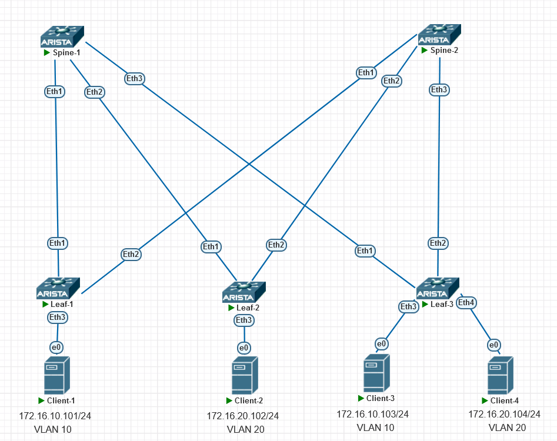

### Overlay. VxLAN EVPN L2

### Цели:
- Настроить Overlay на основе VxLAN EVPN для L2 связанности между клиентами

### Описание выполнения лабораторной работы:
- Для Undelay и Overlay используется eBGP
- Поднять eBGP EVPN сесси на Spine и Leaf между Loppback интерфейсами
- Создать и настроить интерфейсы VxLAN на всех LEAF-коммутаторах 
- Привязтать VLAN к VNI
- Задать RT/RD для VNI

### Физическая схема сети:


#### <u>Таблица Loopback0/Router-ID и ASn, настроенных на устройствах:</u>

|Device|IP Lo0/Router-ID |ASn|
|:-:|:-:|:-:|
|Spine1|10.1.254.101|65100|
|Spine2|10.1.254.102|65100|
|Leaf1|10.1.254.1|65001|
|Leaf2|10.1.254.2|65002|
|Leaf3|10.1.254.3|65003|


#### <u>Таблица VLAN/VNI RD/RT на устройствах:</u>

|Device|VLAN|VNI|RD|RT|
|:-:|:-:|:-:|:-:|:-:|
|Leaf1|10|100010|65001:10|10:100010|
|Leaf2|20|100020|65002:20|20:100020|
|Leaf3|10|100010|65003:10|10:100010|
||20|100020|65003:20|20:100020|

### Настройка:

#### <u>Настройка SPINE1:</u>

```
router bgp 65100
   router-id 10.1.254.101
   no bgp default ipv4-unicast
   maximum-paths 4 ecmp 4
   neighbor EVPN peer group
   neighbor EVPN next-hop-unchanged
   neighbor EVPN update-source Loopback0
   neighbor EVPN bfd
   neighbor EVPN ebgp-multihop 3
   neighbor EVPN send-community extended
   neighbor LEAF peer group
   neighbor LEAF bfd
   neighbor 10.1.1.1 peer group LEAF
   neighbor 10.1.1.1 remote-as 65001
   neighbor 10.1.1.3 peer group LEAF
   neighbor 10.1.1.3 remote-as 65002
   neighbor 10.1.1.5 peer group LEAF
   neighbor 10.1.1.5 remote-as 65003
   neighbor 10.1.254.1 peer group EVPN
   neighbor 10.1.254.1 remote-as 65001
   neighbor 10.1.254.2 peer group EVPN
   neighbor 10.1.254.2 remote-as 65002
   neighbor 10.1.254.3 peer group EVPN
   neighbor 10.1.254.3 remote-as 65003
   !
   address-family evpn
      neighbor EVPN activate
   !
   address-family ipv4
      neighbor LEAF activate
      network 10.1.254.101/32
```
#### <u>Настройка SPINE2:</u>
```
router bgp 65100
   router-id 10.1.254.102
   no bgp default ipv4-unicast
   maximum-paths 4 ecmp 4
   neighbor EVPN peer group
   neighbor EVPN next-hop-unchanged
   neighbor EVPN update-source Loopback0
   neighbor EVPN bfd
   neighbor EVPN ebgp-multihop 3
   neighbor EVPN send-community extended
   neighbor LEAF peer group
   neighbor LEAF bfd
   neighbor 10.1.2.1 peer group LEAF
   neighbor 10.1.2.1 remote-as 65001
   neighbor 10.1.2.3 peer group LEAF
   neighbor 10.1.2.3 remote-as 65002
   neighbor 10.1.2.5 peer group LEAF
   neighbor 10.1.2.5 remote-as 65003
   neighbor 10.1.254.1 peer group EVPN
   neighbor 10.1.254.1 remote-as 65001
   neighbor 10.1.254.2 peer group EVPN
   neighbor 10.1.254.2 remote-as 65002
   neighbor 10.1.254.3 peer group EVPN
   neighbor 10.1.254.3 remote-as 65003
   !
   address-family evpn
      neighbor EVPN activate
   !
   address-family ipv4
      neighbor LEAF activate
      network 10.1.254.102/32

```
#### <u>Настройка LEAF1:</u>
```
vlan 10

!
interface Ethernet3
   description Client-1
   mtu 9000
   switchport access vlan 10
!
!
interface Vxlan1
   vxlan source-interface Loopback0
   vxlan udp-port 4789
   vxlan vlan 10 vni 100010
   vxlan learn-restrict any
!
router bgp 65001
   router-id 10.1.254.1
   no bgp default ipv4-unicast
   maximum-paths 4 ecmp 4
   neighbor EVPN peer group
   neighbor EVPN remote-as 65100
   neighbor EVPN update-source Loopback0
   neighbor EVPN bfd
   neighbor EVPN ebgp-multihop 3
   neighbor EVPN send-community extended
   neighbor SPINE peer group
   neighbor SPINE remote-as 65100
   neighbor SPINE bfd
   neighbor 10.1.1.0 peer group SPINE
   neighbor 10.1.2.0 peer group SPINE
   neighbor 10.1.254.101 peer group EVPN
   neighbor 10.1.254.102 peer group EVPN
   !
   vlan 10
      rd 65001:10
      route-target both 10:100010
      redistribute learned
   !
   address-family evpn
      neighbor EVPN activate
   !
   address-family ipv4
      neighbor SPINE activate
      network 10.1.254.1/32
```
#### <u>Настройка LEAF2:</u>
```


vlan 20
!
   
interface Ethernet3
   description Client-2
   mtu 9000
   switchport access vlan 20
!
interface Vxlan1
   vxlan source-interface Loopback0
   vxlan udp-port 4789
   vxlan vlan 20 vni 100020
   vxlan learn-restrict any
!
router bgp 65002
   router-id 10.1.254.2
   no bgp default ipv4-unicast
   maximum-paths 4 ecmp 4
   neighbor EVPN peer group
   neighbor EVPN remote-as 65100
   neighbor EVPN update-source Loopback0
   neighbor EVPN bfd
   neighbor EVPN ebgp-multihop 3
   neighbor EVPN send-community extended
   neighbor SPINE peer group
   neighbor SPINE remote-as 65100
   neighbor SPINE bfd
   neighbor 10.1.1.2 peer group SPINE
   neighbor 10.1.2.2 peer group SPINE
   neighbor 10.1.254.101 peer group EVPN
   neighbor 10.1.254.102 peer group EVPN
   !
   vlan 20
      rd 65002:20
      route-target both 20:100020
      redistribute learned
   !
   address-family evpn
      neighbor EVPN activate
   !
   address-family ipv4
      neighbor SPINE activate
      network 10.1.254.2/32
```
#### <u>Настройка LEAF3:</u>

```
vlan 10,20
!
interface Ethernet3
   description Client-3
   mtu 9000
   switchport access vlan 10
!
interface Ethernet4
   description Client-4
   mtu 9000
   switchport access vlan 20
!
interface Vxlan1
   vxlan source-interface Loopback0
   vxlan udp-port 4789
   vxlan vlan 10 vni 100010
   vxlan vlan 20 vni 100020
   vxlan learn-restrict any
!
ip prefix-list Loopback0 seq 10 permit 10.1.254.3/32
!
route-map Lo0 permit 10
   match ip address prefix-list Loopback0
!
router bgp 65003
   router-id 10.1.254.3
   no bgp default ipv4-unicast
   maximum-paths 4 ecmp 4
   neighbor EVPN peer group
   neighbor EVPN remote-as 65100
   neighbor EVPN update-source Loopback0
   neighbor EVPN bfd
   neighbor EVPN ebgp-multihop 3
   neighbor EVPN send-community extended
   neighbor SPINE peer group
   neighbor SPINE remote-as 65100
   neighbor SPINE bfd
   neighbor 10.1.1.4 peer group SPINE
   neighbor 10.1.2.4 peer group SPINE
   neighbor 10.1.254.101 peer group EVPN
   neighbor 10.1.254.102 peer group EVPN
   redistribute connected route-map Lo0
   !
   vlan 10
      rd 65003:10
      route-target both 10:100010
      redistribute learned
   !
   vlan 20
      rd 65003:20
      route-target both 20:100020
      redistribute learned
   !
   address-family evpn
      neighbor EVPN activate
   !
   address-family ipv4
      neighbor SPINE activate
```
### Проверка:

<details>
<summary>Проверка на SPINE1</summary>

```
Spine-1#show bgp evpn summary
BGP summary information for VRF default
Router identifier 10.1.254.101, local AS number 65100
Neighbor Status Codes: m - Under maintenance
  Neighbor         V AS           MsgRcvd   MsgSent  InQ OutQ  Up/Down State   PfxRcd PfxAcc
  10.1.254.1       4 65001            744       740    0    0 10:17:10 Estab   4      4
  10.1.254.2       4 65002            740       743    0    0 10:17:19 Estab   3      3
  10.1.254.3       4 65003            741       738    0    0 10:17:27 Estab   5      5

Spine-1#show bgp evpn
BGP routing table information for VRF default
Router identifier 10.1.254.101, local AS number 65100
Route status codes: s - suppressed, * - valid, > - active, E - ECMP head, e - ECMP
                    S - Stale, c - Contributing to ECMP, b - backup
                    % - Pending BGP convergence
Origin codes: i - IGP, e - EGP, ? - incomplete
AS Path Attributes: Or-ID - Originator ID, C-LST - Cluster List, LL Nexthop - Link Local Nexthop

          Network                Next Hop              Metric  LocPref Weight  Path
 * >     RD: 65001:10 mac-ip 5032.1403.e600
                                 10.1.254.1            -       100     0       65001 i
 * >     RD: 65003:10 mac-ip 5047.d103.e800
                                 10.1.254.3            -       100     0       65003 i
 * >     RD: 65002:20 mac-ip 504c.c003.e700
                                 10.1.254.2            -       100     0       65002 i
 * >     RD: 65003:20 mac-ip 507d.8403.e900
                                 10.1.254.3            -       100     0       65003 i
 * >     RD: 65001:10 imet 10.1.254.1
                                 10.1.254.1            -       100     0       65001 i
 * >     RD: 65002:20 imet 10.1.254.2
                                 10.1.254.2            -       100     0       65002 i
 * >     RD: 65003:10 imet 10.1.254.3
                                 10.1.254.3            -       100     0       65003 i
 * >     RD: 65003:20 imet 10.1.254.3
                                 10.1.254.3            -       100     0       65003 i


```
</details>
<details>
<summary>Проверка на SPINE2</summary>

```
Spine-2#show bgp evpn summary
BGP summary information for VRF default
Router identifier 10.1.254.102, local AS number 65100
Neighbor Status Codes: m - Under maintenance
  Neighbor         V AS           MsgRcvd   MsgSent  InQ OutQ  Up/Down State   PfxRcd PfxAcc
  10.1.254.1       4 65001            106       107    0    0 01:22:25 Estab   2      2
  10.1.254.2       4 65002            105       109    0    0 01:22:33 Estab   2      2
  10.1.254.3       4 65003            109       106    0    0 01:22:34 Estab   4      4


Spine-2#show bgp evpn
BGP routing table information for VRF default
Router identifier 10.1.254.102, local AS number 65100
Route status codes: s - suppressed, * - valid, > - active, E - ECMP head, e - ECMP
                    S - Stale, c - Contributing to ECMP, b - backup
                    % - Pending BGP convergence
Origin codes: i - IGP, e - EGP, ? - incomplete
AS Path Attributes: Or-ID - Originator ID, C-LST - Cluster List, LL Nexthop - Link Local Nexthop

          Network                Next Hop              Metric  LocPref Weight  Path
 * >     RD: 65001:10 mac-ip 5032.1403.e600
                                 10.1.254.1            -       100     0       65001 i
 * >     RD: 65003:10 mac-ip 5047.d103.e800
                                 10.1.254.3            -       100     0       65003 i
 * >     RD: 65002:20 mac-ip 504c.c003.e700
                                 10.1.254.2            -       100     0       65002 i
 * >     RD: 65003:20 mac-ip 507d.8403.e900
                                 10.1.254.3            -       100     0       65003 i
 * >     RD: 65001:10 imet 10.1.254.1
                                 10.1.254.1            -       100     0       65001 i
 * >     RD: 65002:20 imet 10.1.254.2
                                 10.1.254.2            -       100     0       65002 i
 * >     RD: 65003:10 imet 10.1.254.3
                                 10.1.254.3            -       100     0       65003 i
 * >     RD: 65003:20 imet 10.1.254.3
                                 10.1.254.3            -       100     0       65003 i

```
</details>
<details>
<summary>Проверка на LEAF1</summary>

```
Leaf-1#show bgp evpn summary
BGP summary information for VRF default
Router identifier 10.1.254.1, local AS number 65001
Neighbor Status Codes: m - Under maintenance
  Neighbor         V AS           MsgRcvd   MsgSent  InQ OutQ  Up/Down State   PfxRcd PfxAcc
  10.1.254.101     4 65100             12        16    0    0 00:03:24 Estab   4      4
  10.1.254.102     4 65100             12        10    0    0 00:03:33 Estab   4      4


Leaf-1#show vxlan vtep
Remote VTEPS for Vxlan1:

VTEP             Tunnel Type(s)
---------------- --------------
10.1.254.3       flood, unicast

Total number of remote VTEPS:  1


Leaf-1#show vxlan vni
VNI to VLAN Mapping for Vxlan1
VNI          VLAN       Source       Interface       802.1Q Tag
------------ ---------- ------------ --------------- ----------
100010       10         static       Ethernet3       untagged
                                     Vxlan1          10


Leaf-1#show bgp evpn
BGP routing table information for VRF default
Router identifier 10.1.254.1, local AS number 65001
Route status codes: s - suppressed, * - valid, > - active, E - ECMP head, e - ECMP
                    S - Stale, c - Contributing to ECMP, b - backup
                    % - Pending BGP convergence
Origin codes: i - IGP, e - EGP, ? - incomplete
AS Path Attributes: Or-ID - Originator ID, C-LST - Cluster List, LL Nexthop - Link Local Nexthop

          Network                Next Hop              Metric  LocPref Weight  Path
 * >     RD: 65001:10 mac-ip 5032.1403.e600
                                 -                     -       -       0       i
 * >Ec   RD: 65003:10 mac-ip 5047.d103.e800
                                 10.1.254.3            -       100     0       65100 65003 i
 *  ec   RD: 65003:10 mac-ip 5047.d103.e800
                                 10.1.254.3            -       100     0       65100 65003 i
 * >Ec   RD: 65002:20 mac-ip 504c.c003.e700
                                 10.1.254.2            -       100     0       65100 65002 i
 *  ec   RD: 65002:20 mac-ip 504c.c003.e700
                                 10.1.254.2            -       100     0       65100 65002 i
 * >Ec   RD: 65003:20 mac-ip 507d.8403.e900
                                 10.1.254.3            -       100     0       65100 65003 i
 *  ec   RD: 65003:20 mac-ip 507d.8403.e900
                                 10.1.254.3            -       100     0       65100 65003 i
 * >     RD: 65001:10 imet 10.1.254.1
                                 -                     -       -       0       i
 * >Ec   RD: 65002:20 imet 10.1.254.2
                                 10.1.254.2            -       100     0       65100 65002 i
 *  ec   RD: 65002:20 imet 10.1.254.2
                                 10.1.254.2            -       100     0       65100 65002 i
 * >Ec   RD: 65003:10 imet 10.1.254.3
                                 10.1.254.3            -       100     0       65100 65003 i
 *  ec   RD: 65003:10 imet 10.1.254.3
                                 10.1.254.3            -       100     0       65100 65003 i
 * >Ec   RD: 65003:20 imet 10.1.254.3
                                 10.1.254.3            -       100     0       65100 65003 i
 *  ec   RD: 65003:20 imet 10.1.254.3
                                 10.1.254.3            -       100     0       65100 65003 i
Leaf-1#show vxlan address-table
          Vxlan Mac Address Table
----------------------------------------------------------------------

VLAN  Mac Address     Type      Prt  VTEP             Moves   Last Move
----  -----------     ----      ---  ----             -----   ---------
  10  5047.d103.e800  EVPN      Vx1  10.1.254.3       1       0:48:28 ago
Total Remote Mac Addresses for this criterion: 1

Leaf-1#sh mac address-table
          Mac Address Table
------------------------------------------------------------------

Vlan    Mac Address       Type        Ports      Moves   Last Move
----    -----------       ----        -----      -----   ---------
  10    5032.1403.e600    DYNAMIC     Et3        1       0:48:31 ago
  10    5047.d103.e800    DYNAMIC     Vx1        1       0:48:48 ago
Total Mac Addresses for this criterion: 2

          Multicast Mac Address Table
------------------------------------------------------------------

Vlan    Mac Address       Type        Ports
----    -----------       ----        -----
Total Mac Addresses for this criterion: 0
Leaf-1#

```
</details>
<details>
<summary>Проверка на LEAF2</summary>

```
Leaf-2#show bgp evpn summary
BGP summary information for VRF default
Router identifier 10.1.254.2, local AS number 65002
Neighbor Status Codes: m - Under maintenance
  Neighbor         V AS           MsgRcvd   MsgSent  InQ OutQ  Up/Down State   PfxRcd PfxAcc
  10.1.254.101     4 65100             67        69    0    0 00:50:16 Estab   6      6
  10.1.254.102     4 65100             68        67    0    0 00:50:33 Estab   6      6
Leaf-2#
Leaf-2#show vxlan vtep
Remote VTEPS for Vxlan1:

VTEP             Tunnel Type(s)
---------------- --------------
10.1.254.3       unicast, flood

Total number of remote VTEPS:  1
Leaf-2#
Leaf-2#show vxlan vni
VNI to VLAN Mapping for Vxlan1
VNI          VLAN       Source       Interface       802.1Q Tag
------------ ---------- ------------ --------------- ----------
100020       20         static       Ethernet3       untagged
                                     Vxlan1          20

VNI to dynamic VLAN Mapping for Vxlan1
VNI       VLAN       VRF       Source
--------- ---------- --------- ------------

Leaf-2#
Leaf-2#show bgp evpn
BGP routing table information for VRF default
Router identifier 10.1.254.2, local AS number 65002
Route status codes: s - suppressed, * - valid, > - active, E - ECMP head, e - ECMP
                    S - Stale, c - Contributing to ECMP, b - backup
                    % - Pending BGP convergence
Origin codes: i - IGP, e - EGP, ? - incomplete
AS Path Attributes: Or-ID - Originator ID, C-LST - Cluster List, LL Nexthop - Link Local Nexthop

          Network                Next Hop              Metric  LocPref Weight  Path
 * >Ec   RD: 65001:10 mac-ip 5032.1403.e600
                                 10.1.254.1            -       100     0       65100 65001 i
 *  ec   RD: 65001:10 mac-ip 5032.1403.e600
                                 10.1.254.1            -       100     0       65100 65001 i
 * >Ec   RD: 65003:10 mac-ip 5047.d103.e800
                                 10.1.254.3            -       100     0       65100 65003 i
 *  ec   RD: 65003:10 mac-ip 5047.d103.e800
                                 10.1.254.3            -       100     0       65100 65003 i
 * >     RD: 65002:20 mac-ip 504c.c003.e700
                                 -                     -       -       0       i
 * >Ec   RD: 65003:20 mac-ip 507d.8403.e900
                                 10.1.254.3            -       100     0       65100 65003 i
 *  ec   RD: 65003:20 mac-ip 507d.8403.e900
                                 10.1.254.3            -       100     0       65100 65003 i
 * >Ec   RD: 65001:10 imet 10.1.254.1
                                 10.1.254.1            -       100     0       65100 65001 i
 *  ec   RD: 65001:10 imet 10.1.254.1
                                 10.1.254.1            -       100     0       65100 65001 i
 * >     RD: 65002:20 imet 10.1.254.2
                                 -                     -       -       0       i
 * >Ec   RD: 65003:10 imet 10.1.254.3
                                 10.1.254.3            -       100     0       65100 65003 i
 *  ec   RD: 65003:10 imet 10.1.254.3
                                 10.1.254.3            -       100     0       65100 65003 i
 * >Ec   RD: 65003:20 imet 10.1.254.3
                                 10.1.254.3            -       100     0       65100 65003 i
 *  ec   RD: 65003:20 imet 10.1.254.3
                                 10.1.254.3            -       100     0       65100 65003 i
Leaf-2#
Leaf-2#show vxlan address-table
          Vxlan Mac Address Table
----------------------------------------------------------------------

VLAN  Mac Address     Type      Prt  VTEP             Moves   Last Move
----  -----------     ----      ---  ----             -----   ---------
  20  507d.8403.e900  EVPN      Vx1  10.1.254.3       1       0:47:45 ago
Total Remote Mac Addresses for this criterion: 1
Leaf-2#
Leaf-2#sh mac address-table
          Mac Address Table
------------------------------------------------------------------

Vlan    Mac Address       Type        Ports      Moves   Last Move
----    -----------       ----        -----      -----   ---------
  20    504c.c003.e700    DYNAMIC     Et3        1       0:48:01 ago
  20    507d.8403.e900    DYNAMIC     Vx1        1       0:48:01 ago
Total Mac Addresses for this criterion: 2

          Multicast Mac Address Table
------------------------------------------------------------------

Vlan    Mac Address       Type        Ports
----    -----------       ----        -----
Total Mac Addresses for this criterion: 0
Leaf-2#

```
</details>
<details>
<summary>Проверка на LEAF3</summary>

```
Leaf-3# show bgp evp summary
BGP summary information for VRF default
Router identifier 10.1.254.3, local AS number 65003
Neighbor Status Codes: m - Under maintenance
  Neighbor         V AS           MsgRcvd   MsgSent  InQ OutQ  Up/Down State   PfxRcd PfxAcc
  10.1.254.101     4 65100            104       106    0    0 01:20:37 Estab   4      4
  10.1.254.102     4 65100            103       108    0    0 01:20:56 Estab   4      4
Leaf-3# show bgp evpn
BGP routing table information for VRF default
Router identifier 10.1.254.3, local AS number 65003
Route status codes: s - suppressed, * - valid, > - active, E - ECMP head, e - ECMP
                    S - Stale, c - Contributing to ECMP, b - backup
                    % - Pending BGP convergence
Origin codes: i - IGP, e - EGP, ? - incomplete
AS Path Attributes: Or-ID - Originator ID, C-LST - Cluster List, LL Nexthop - Link Local Nexthop

          Network                Next Hop              Metric  LocPref Weight  Path
 * >Ec   RD: 65001:10 mac-ip 5032.1403.e600
                                 10.1.254.1            -       100     0       65100 65001 i
 *  ec   RD: 65001:10 mac-ip 5032.1403.e600
                                 10.1.254.1            -       100     0       65100 65001 i
 * >     RD: 65003:10 mac-ip 5047.d103.e800
                                 -                     -       -       0       i
 * >Ec   RD: 65002:20 mac-ip 504c.c003.e700
                                 10.1.254.2            -       100     0       65100 65002 i
 *  ec   RD: 65002:20 mac-ip 504c.c003.e700
                                 10.1.254.2            -       100     0       65100 65002 i
 * >     RD: 65003:20 mac-ip 507d.8403.e900
                                 -                     -       -       0       i
 * >Ec   RD: 65001:10 imet 10.1.254.1
                                 10.1.254.1            -       100     0       65100 65001 i
 *  ec   RD: 65001:10 imet 10.1.254.1
                                 10.1.254.1            -       100     0       65100 65001 i
 * >Ec   RD: 65002:20 imet 10.1.254.2
                                 10.1.254.2            -       100     0       65100 65002 i
 *  ec   RD: 65002:20 imet 10.1.254.2
                                 10.1.254.2            -       100     0       65100 65002 i
 * >     RD: 65003:10 imet 10.1.254.3
                                 -                     -       -       0       i
 * >     RD: 65003:20 imet 10.1.254.3
                                 -                     -       -       0       i
Leaf-3#
Leaf-3#show vxlan vtep
Remote VTEPS for Vxlan1:

VTEP             Tunnel Type(s)
---------------- --------------
10.1.254.1       flood, unicast
10.1.254.2       flood, unicast

Total number of remote VTEPS:  2
Leaf-3#
Leaf-3#show vxlan vni
VNI to VLAN Mapping for Vxlan1
VNI          VLAN       Source       Interface       802.1Q Tag
------------ ---------- ------------ --------------- ----------
100010       10         static       Ethernet3       untagged
                                     Vxlan1          10
100020       20         static       Ethernet4       untagged
                                     Vxlan1          20

VNI to dynamic VLAN Mapping for Vxlan1
VNI       VLAN       VRF       Source
--------- ---------- --------- ------------

Leaf-3#
Leaf-3#show vxlan address-table
          Vxlan Mac Address Table
----------------------------------------------------------------------

VLAN  Mac Address     Type      Prt  VTEP             Moves   Last Move
----  -----------     ----      ---  ----             -----   ---------
  10  5032.1403.e600  EVPN      Vx1  10.1.254.1       1       1:20:47 ago
  20  504c.c003.e700  EVPN      Vx1  10.1.254.2       1       1:17:17 ago
Total Remote Mac Addresses for this criterion: 2
Leaf-3#
Leaf-3#show mac address-table
          Mac Address Table
------------------------------------------------------------------

Vlan    Mac Address       Type        Ports      Moves   Last Move
----    -----------       ----        -----      -----   ---------
  10    5032.1403.e600    DYNAMIC     Vx1        1       1:20:52 ago
  10    5047.d103.e800    DYNAMIC     Et3        1       1:21:22 ago
  20    504c.c003.e700    DYNAMIC     Vx1        1       1:17:22 ago
  20    507d.8403.e900    DYNAMIC     Et4        1       0:27:59 ago
Total Mac Addresses for this criterion: 4

          Multicast Mac Address Table
------------------------------------------------------------------

Vlan    Mac Address       Type        Ports
----    -----------       ----        -----
Total Mac Addresses for this criterion: 0


```
</details>

Также прилагаются полные конфигурационные файлы всего оборудования сети.
