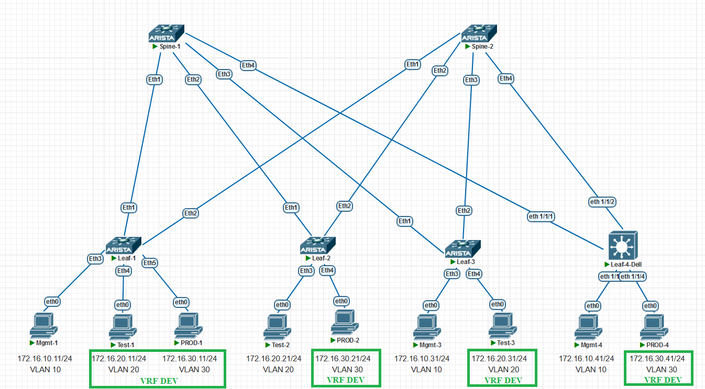

### Overlay. VxLAN EVPN L3

### Цели:
- Настроить Overlay на основе VxLAN EVPN для маршрутизации между клиентами

### Описание выполнения лабораторной работы:
- Создать VRF
- Привязтать клиентов к VRF
- Приязать VRF к L3VNI
- Задать RT/RD для L3VNI

### Физическая схема сети:


#### <u>Таблица Loopback0/Router-ID и ASn, настроенных на устройствах:</u>

|Device|IP Lo0/Router-ID |ASn|
|:-:|:-:|:-:|
|Spine1|10.1.254.101|65100|
|Spine2|10.1.254.102|65100|
|Leaf1|10.1.254.1|65001|
|Leaf2|10.1.254.2|65002|
|Leaf3|10.1.254.3|65003|
|Leaf4|10.1.254.4|65004|

#### <u>Таблица VLAN/VNI/RD/RT на устройствах:</u>

|Device|VLAN|VNI|RD|RT|
|:-:|:-:|:-:|:-:|:-:|
|Leaf1|10|100010|65001:10|10:100010|
||20|100020|65001:20|20:100020|
||30|100030|65001:30|30:100030|
|||999|65001:999|999:999|
|Leaf2|20|100020|65002:20|20:100020|
||30|100030|65002:30|30:100030|
|||999|65003:999|999:999|
|Leaf3|10|100010|65003:10|10:100010|
||20|100020|65003:20|20:100020|
|||999|65003:999|999:999|
|Leaf3|10|100010|65003:10|10:100010|
||30|100020|65003:20|20:100020|
|Leaf4|10|100010|auto|10:100010|
||20|100020|auto|20:100020|
|||999|10.1.254.4:999|999:999|

У Dell auto-rd Loopback:Virtual-network, например 10.1.254.4:30

VLAN 20,30 находятся в VRF DEV, он же L3VNI 999

### Настройка:

#### <u>Настройка SPINE1:</u>

```
router bgp 65100
   router-id 10.1.254.101
   no bgp default ipv4-unicast
   maximum-paths 4 ecmp 4
   neighbor EVPN peer group
   neighbor EVPN next-hop-unchanged
   neighbor EVPN update-source Loopback0
   neighbor EVPN bfd
   neighbor EVPN ebgp-multihop 3
   neighbor EVPN send-community extended
   neighbor LEAF peer group
   neighbor LEAF bfd
   neighbor 10.1.1.1 peer group LEAF
   neighbor 10.1.1.1 remote-as 65001
   neighbor 10.1.1.3 peer group LEAF
   neighbor 10.1.1.3 remote-as 65002
   neighbor 10.1.1.5 peer group LEAF
   neighbor 10.1.1.5 remote-as 65003
   neighbor 10.1.1.7 peer group LEAF
   neighbor 10.1.1.7 remote-as 65004
   neighbor 10.1.254.1 peer group EVPN
   neighbor 10.1.254.1 remote-as 65001
   neighbor 10.1.254.2 peer group EVPN
   neighbor 10.1.254.2 remote-as 65002
   neighbor 10.1.254.3 peer group EVPN
   neighbor 10.1.254.3 remote-as 65003
   neighbor 10.1.254.4 peer group EVPN
   neighbor 10.1.254.4 remote-as 65004
   !
   address-family evpn
      neighbor EVPN activate
   !
   address-family ipv4
      neighbor LEAF activate
      network 10.1.254.101/32
```
#### <u>Настройка SPINE2:</u>
```
router bgp 65100
   router-id 10.1.254.102
   no bgp default ipv4-unicast
   maximum-paths 4 ecmp 4
   neighbor EVPN peer group
   neighbor EVPN next-hop-unchanged
   neighbor EVPN update-source Loopback0
   neighbor EVPN bfd
   neighbor EVPN ebgp-multihop 3
   neighbor EVPN send-community extended
   neighbor LEAF peer group
   neighbor LEAF bfd
   neighbor 10.1.2.1 peer group LEAF
   neighbor 10.1.2.1 remote-as 65001
   neighbor 10.1.2.3 peer group LEAF
   neighbor 10.1.2.3 remote-as 65002
   neighbor 10.1.2.5 peer group LEAF
   neighbor 10.1.2.5 remote-as 65003
   neighbor 10.1.2.7 peer group LEAF
   neighbor 10.1.2.7 remote-as 65004
   neighbor 10.1.254.1 peer group EVPN
   neighbor 10.1.254.1 remote-as 65001
   neighbor 10.1.254.2 peer group EVPN
   neighbor 10.1.254.2 remote-as 65002
   neighbor 10.1.254.3 peer group EVPN
   neighbor 10.1.254.3 remote-as 65003
   neighbor 10.1.254.4 peer group EVPN
   neighbor 10.1.254.4 remote-as 65004
   !
   address-family evpn
      neighbor EVPN activate
   !
   address-family ipv4
      neighbor LEAF activate
      network 10.1.254.102/32

```
#### <u>Настройка LEAF1:</u>
```

interface Vlan10
   no autostate
   ip address 172.16.10.1/24
!
interface Vlan20
   vrf DEV
   ip address 172.16.20.201/24
   ip virtual-router address 172.16.20.1
!
interface Vlan30
   vrf DEV
   ip address 172.16.30.1/24
!
interface Vxlan1
   vxlan source-interface Loopback0
   vxlan udp-port 4789
   vxlan vlan 10 vni 100010
   vxlan vlan 20 vni 100020
   vxlan vlan 30 vni 100030
   vxlan vrf DEV vni 999
!
ip routing
ip routing vrf DEV
!

router bgp 65001
   router-id 10.1.254.1
   no bgp default ipv4-unicast
   maximum-paths 4 ecmp 4
   neighbor EVPN peer group
   neighbor EVPN remote-as 65100
   neighbor EVPN update-source Loopback0
   neighbor EVPN bfd
   neighbor EVPN ebgp-multihop 3
   neighbor EVPN send-community extended
   neighbor SPINE peer group
   neighbor SPINE remote-as 65100
   neighbor SPINE bfd
   neighbor 10.1.1.0 peer group SPINE
   neighbor 10.1.2.0 peer group SPINE
   neighbor 10.1.254.101 peer group EVPN
   neighbor 10.1.254.102 peer group EVPN
   !
   vlan 10
      rd 65001:10
      route-target both 10:100010
      redistribute learned
   !
   vlan 20
      rd 65001:20
      route-target both 20:100020
      redistribute learned
   !
   vlan 30
      rd 65001:30
      route-target both 30:100030
      redistribute learned 
   !
   vrf DEV
      rd 65001:999
      route-target import evpn 999:999
      route-target export evpn 999:999
!
  address-family evpn
      neighbor EVPN activate
   !
   address-family ipv4
      neighbor SPINE activate
      network 10.1.254.1/32
```
#### <u>Настройка LEAF2:</u>
```


vlan 20
   name Test
!
vlan 30
   name PROD
!
vrf instance DEV
!
interface Vlan20
   no autostate
   vrf DEV
   ip address 172.16.20.1/24
!
interface Vlan30
   no autostate
   vrf DEV
   ip address 172.16.30.1/24
!
interface Vxlan1
   vxlan source-interface Loopback0
   vxlan udp-port 4789
   vxlan vlan 20 vni 100020
   vxlan vlan 30 vni 100030
   vxlan vrf DEV vni 999
!
!
ip routing
ip routing vrf DEV
!
router bgp 65002
   router-id 10.1.254.2
   no bgp default ipv4-unicast
   maximum-paths 4 ecmp 4
   neighbor EVPN peer group
   neighbor EVPN remote-as 65100
   neighbor EVPN update-source Loopback0
   neighbor EVPN bfd
   neighbor EVPN ebgp-multihop 3
   neighbor EVPN send-community extended
   neighbor SPINE peer group
   neighbor SPINE remote-as 65100
   neighbor SPINE bfd
   neighbor 10.1.1.2 peer group SPINE
   neighbor 10.1.2.2 peer group SPINE
   neighbor 10.1.254.101 peer group EVPN
   neighbor 10.1.254.102 peer group EVPN
   !
   vlan 20
      rd 65002:20
      route-target both 20:100020
      redistribute learned
   !
   vlan 30
      rd 65002:30
      route-target both 30:100030
      redistribute learned
   !
   vrf DEV
      rd 65002:999
      route-target import evpn 999:999
      route-target export evpn 999:999
   !
   address-family evpn
      neighbor EVPN activate
   !
   address-family ipv4
      neighbor SPINE activate
      network 10.1.254.2/32
   !
```
#### <u>Настройка LEAF3:</u>

```
vlan10
   name Mgmt
!
vlan 20
   name Test
!
vrf instance DEV

interface Vlan10
   no autostate
   ip address 172.16.10.1/24
!
interface Vlan20
   no autostate
   vrf DEV
   ip address 172.16.20.1/24
!
interface Vxlan1
   vxlan source-interface Loopback0
   vxlan udp-port 4789
   vxlan vlan 10 vni 100010
   vxlan vlan 20 vni 100020
   vxlan vrf DEV vni 999
!
!
ip routing
ip routing vrf DEV
!
ip prefix-list Loopback0 seq 10 permit 10.1.254.3/32
!
route-map Lo0 permit 10
   match ip address prefix-list Loopback0
!
router bgp 65003
   router-id 10.1.254.3
   no bgp default ipv4-unicast
   maximum-paths 4 ecmp 4
   neighbor EVPN peer group
   neighbor EVPN remote-as 65100
   neighbor EVPN update-source Loopback0
   neighbor EVPN bfd
   neighbor EVPN ebgp-multihop 3
   neighbor EVPN send-community extended
   neighbor SPINE peer group
   neighbor SPINE remote-as 65100
   neighbor SPINE bfd
   neighbor 10.1.1.4 peer group SPINE
   neighbor 10.1.2.4 peer group SPINE
   neighbor 10.1.254.101 peer group EVPN
   neighbor 10.1.254.102 peer group EVPN
   redistribute connected route-map Lo0
   !
   vlan 10
      rd 65003:10
      route-target both 10:100010
      redistribute learned
   !
   vlan 20
      rd 65003:20
      route-target both 20:100020
      redistribute learned
   !
   vrf DEV
      rd 65003:999
      route-target import evpn 999:999
      route-target export evpn 999:999
   !
   address-family evpn
      neighbor EVPN activate
   !
   address-family ipv4
      neighbor SPINE activate
```
#### <u>Настройка LEAF4-Dell:</u>

```
ip vrf default
!
ip vrf DEV
!

virtual-network 10
 vxlan-vni 100010
!
virtual-network 30
 vxlan-vni 100030

!
interface vlan10
 virtual-network 10
 no shutdown
!
interface vlan30
 virtual-network 30
 no shutdown
 ip vrf forwarding DEV

interface loopback0
 no shutdown
 ip address 10.1.254.4/32
!
nve
 source-interface loopback0

!

interface virtual-network30
 no shutdown
 ip vrf forwarding DEV
 ip address 172.16.30.204/24
 ip virtual-router address 172.16.30.1


router bgp 65004
 router-id 10.1.254.4
 !
 address-family ipv4 unicast
  network 10.1.254.4/32
 !
 neighbor 10.1.2.6
  bfd
  remote-as 65100
  no shutdown
  !
  address-family ipv4 unicast
 !
 neighbor 10.1.254.102
  ebgp-multihop 4
  remote-as 65100
  send-community extended
  update-source loopback0
  no shutdown
  !
  address-family ipv4 unicast
   no activate
  !
  address-family l2vpn evpn
   activate
 !
 neighbor 10.1.254.101
  ebgp-multihop 4
  remote-as 65100
  send-community extended
  update-source loopback0
  no shutdown
  !
  address-family ipv4 unicast
   no activate
  !
  address-family l2vpn evpn
   activate
 !
 neighbor 10.1.1.6
  bfd
  remote-as 65100
  no shutdown
  !
  address-family ipv4 unicast
 !
 vrf DEV
  !
  address-family ipv4 unicast
   redistribute l2vpn evpn
!
evpn
 !
 evi 10
  vni 100010
  rd auto
  route-target 10:100010 both
 !
 evi 30
  vni 100030
  rd auto
  route-target 30:100030 both
 !
 vrf DEV
  vni 999
  rd 10.1.254.4:999
  route-target 999:999 both
  advertise ipv4 bgp
!


```


### Проверка:

<details>
<summary>Проверка на SPINE1</summary>

```
Spine-1#show bgp evpn
BGP routing table information for VRF default
Router identifier 10.1.254.101, local AS number 65100
Route status codes: s - suppressed, * - valid, > - active, E - ECMP head, e - ECMP
                    S - Stale, c - Contributing to ECMP, b - backup
                    % - Pending BGP convergence
Origin codes: i - IGP, e - EGP, ? - incomplete
AS Path Attributes: Or-ID - Originator ID, C-LST - Cluster List, LL Nexthop - Link Local Nexthop

          Network                Next Hop              Metric  LocPref Weight  Path
 * >     RD: 10.1.254.4:30 mac-ip 0000.0000.1111 172.16.30.1
                                 10.1.254.4            -       100     0       65004 ?
 * >     RD: 10.1.254.4:30 mac-ip 0050.7966.6851
                                 10.1.254.4            -       100     0       65004 ?
 * >     RD: 10.1.254.4:30 mac-ip 0050.7966.6851 172.16.30.41
                                 10.1.254.4            -       100     0       65004 ?
 * >     RD: 65001:30 mac-ip 0050.7966.6852
                                 10.1.254.1            -       100     0       65001 i
 * >     RD: 65001:30 mac-ip 0050.7966.6852 172.16.30.11
                                 10.1.254.1            -       100     0       65001 i
 * >     RD: 65001:10 mac-ip 0050.7966.6854
                                 10.1.254.1            -       100     0       65001 i
 * >     RD: 65001:10 mac-ip 0050.7966.6854 172.16.10.11
                                 10.1.254.1            -       100     0       65001 i
 * >     RD: 65003:10 mac-ip 0050.7966.6855
                                 10.1.254.3            -       100     0       65003 i
 * >     RD: 65003:20 mac-ip 0050.7966.6856
                                 10.1.254.3            -       100     0       65003 i
 * >     RD: 65003:20 mac-ip 0050.7966.6856 172.16.20.31
                                 10.1.254.3            -       100     0       65003 i
 * >     RD: 10.1.254.4:10 mac-ip 0050.7966.6857
                                 10.1.254.4            -       100     0       65004 ?
 * >     RD: 65002:30 mac-ip 0050.7966.6859
                                 10.1.254.2            -       100     0       65002 i
 * >     RD: 65002:30 mac-ip 0050.7966.6859 172.16.30.21
                                 10.1.254.2            -       100     0       65002 i
 * >     RD: 10.1.254.4:30 mac-ip 504b.8b04.5003 172.16.30.204
                                 10.1.254.4            -       100     0       65004 ?
 * >     RD: 65001:10 imet 10.1.254.1
                                 10.1.254.1            -       100     0       65001 i
 * >     RD: 65001:20 imet 10.1.254.1
                                 10.1.254.1            -       100     0       65001 i
 * >     RD: 65001:30 imet 10.1.254.1
                                 10.1.254.1            -       100     0       65001 i
 * >     RD: 65002:20 imet 10.1.254.2
                                 10.1.254.2            -       100     0       65002 i
 * >     RD: 65002:30 imet 10.1.254.2
                                 10.1.254.2            -       100     0       65002 i
 * >     RD: 65003:10 imet 10.1.254.3
                                 10.1.254.3            -       100     0       65003 i
 * >     RD: 65003:20 imet 10.1.254.3
                                 10.1.254.3            -       100     0       65003 i
 * >     RD: 10.1.254.4:10 imet 10.1.254.4
                                 10.1.254.4            -       100     0       65004 ?
 * >     RD: 10.1.254.4:30 imet 10.1.254.4
                                 10.1.254.4            -       100     0       65004 ?
Spine-1#

```
</details>
<details>
<summary>Проверка на SPINE2</summary>

```

Spine-2#show bgp evpn
BGP routing table information for VRF default
Router identifier 10.1.254.102, local AS number 65100
Route status codes: s - suppressed, * - valid, > - active, E - ECMP head, e - ECMP
                    S - Stale, c - Contributing to ECMP, b - backup
                    % - Pending BGP convergence
Origin codes: i - IGP, e - EGP, ? - incomplete
AS Path Attributes: Or-ID - Originator ID, C-LST - Cluster List, LL Nexthop - Link Local Nexthop

          Network                Next Hop              Metric  LocPref Weight  Path
 * >     RD: 10.1.254.4:30 mac-ip 0000.0000.1111 172.16.30.1
                                 10.1.254.4            -       100     0       65004 ?
 * >     RD: 10.1.254.4:30 mac-ip 0050.7966.6851
                                 10.1.254.4            -       100     0       65004 ?
 * >     RD: 10.1.254.4:30 mac-ip 0050.7966.6851 172.16.30.41
                                 10.1.254.4            -       100     0       65004 ?
 * >     RD: 65001:30 mac-ip 0050.7966.6852
                                 10.1.254.1            -       100     0       65001 i
 * >     RD: 65001:30 mac-ip 0050.7966.6852 172.16.30.11
                                 10.1.254.1            -       100     0       65001 i
 * >     RD: 65001:10 mac-ip 0050.7966.6854
                                 10.1.254.1            -       100     0       65001 i
 * >     RD: 65001:10 mac-ip 0050.7966.6854 172.16.10.11
                                 10.1.254.1            -       100     0       65001 i
 * >     RD: 65003:10 mac-ip 0050.7966.6855
                                 10.1.254.3            -       100     0       65003 i
 * >     RD: 65003:20 mac-ip 0050.7966.6856
                                 10.1.254.3            -       100     0       65003 i
 * >     RD: 65003:20 mac-ip 0050.7966.6856 172.16.20.31
                                 10.1.254.3            -       100     0       65003 i
 * >     RD: 10.1.254.4:10 mac-ip 0050.7966.6857
                                 10.1.254.4            -       100     0       65004 ?
 * >     RD: 65002:30 mac-ip 0050.7966.6859
                                 10.1.254.2            -       100     0       65002 i
 * >     RD: 65002:30 mac-ip 0050.7966.6859 172.16.30.21
                                 10.1.254.2            -       100     0       65002 i
 * >     RD: 10.1.254.4:30 mac-ip 504b.8b04.5003 172.16.30.204
                                 10.1.254.4            -       100     0       65004 ?
 * >     RD: 65001:10 imet 10.1.254.1
                                 10.1.254.1            -       100     0       65001 i
 * >     RD: 65001:20 imet 10.1.254.1
                                 10.1.254.1            -       100     0       65001 i
 * >     RD: 65001:30 imet 10.1.254.1
                                 10.1.254.1            -       100     0       65001 i
 * >     RD: 65002:20 imet 10.1.254.2
                                 10.1.254.2            -       100     0       65002 i
 * >     RD: 65002:30 imet 10.1.254.2
                                 10.1.254.2            -       100     0       65002 i
 * >     RD: 65003:10 imet 10.1.254.3
                                 10.1.254.3            -       100     0       65003 i
 * >     RD: 65003:20 imet 10.1.254.3
                                 10.1.254.3            -       100     0       65003 i
 * >     RD: 10.1.254.4:10 imet 10.1.254.4
                                 10.1.254.4            -       100     0       65004 ?
 * >     RD: 10.1.254.4:30 imet 10.1.254.4
                                 10.1.254.4            -       100     0       65004 ?
Spine-2#


```
</details>
<details>
<summary>Проверка на LEAF1</summary>

```
Leaf-1#show bgp evpn route-type mac-ip
BGP routing table information for VRF default
Router identifier 10.1.254.1, local AS number 65001
Route status codes: s - suppressed, * - valid, > - active, E - ECMP head, e - ECMP
                    S - Stale, c - Contributing to ECMP, b - backup
                    % - Pending BGP convergence
Origin codes: i - IGP, e - EGP, ? - incomplete
AS Path Attributes: Or-ID - Originator ID, C-LST - Cluster List, LL Nexthop - Link Local Nexthop

          Network                Next Hop              Metric  LocPref Weight  Path
 * >Ec   RD: 10.1.254.4:30 mac-ip 0000.0000.1111 172.16.30.1
                                 10.1.254.4            -       100     0       65100 65004 ?
 *  ec   RD: 10.1.254.4:30 mac-ip 0000.0000.1111 172.16.30.1
                                 10.1.254.4            -       100     0       65100 65004 ?
 * >Ec   RD: 10.1.254.4:30 mac-ip 0050.7966.6851
                                 10.1.254.4            -       100     0       65100 65004 ?
 *  ec   RD: 10.1.254.4:30 mac-ip 0050.7966.6851
                                 10.1.254.4            -       100     0       65100 65004 ?
 * >Ec   RD: 10.1.254.4:30 mac-ip 0050.7966.6851 172.16.30.41
                                 10.1.254.4            -       100     0       65100 65004 ?
 *  ec   RD: 10.1.254.4:30 mac-ip 0050.7966.6851 172.16.30.41
                                 10.1.254.4            -       100     0       65100 65004 ?
 * >     RD: 65001:30 mac-ip 0050.7966.6852
                                 -                     -       -       0       i
 * >     RD: 65001:30 mac-ip 0050.7966.6852 172.16.30.11
                                 -                     -       -       0       i
 * >Ec   RD: 65002:20 mac-ip 0050.7966.6853
                                 10.1.254.2            -       100     0       65100 65002 i
 *  ec   RD: 65002:20 mac-ip 0050.7966.6853
                                 10.1.254.2            -       100     0       65100 65002 i
 * >Ec   RD: 65002:20 mac-ip 0050.7966.6853 172.16.20.21
                                 10.1.254.2            -       100     0       65100 65002 i
 *  ec   RD: 65002:20 mac-ip 0050.7966.6853 172.16.20.21
                                 10.1.254.2            -       100     0       65100 65002 i
 * >Ec   RD: 65003:20 mac-ip 0050.7966.6856
                                 10.1.254.3            -       100     0       65100 65003 i
 *  ec   RD: 65003:20 mac-ip 0050.7966.6856
                                 10.1.254.3            -       100     0       65100 65003 i
 * >Ec   RD: 65003:20 mac-ip 0050.7966.6856 172.16.20.31
                                 10.1.254.3            -       100     0       65100 65003 i
 *  ec   RD: 65003:20 mac-ip 0050.7966.6856 172.16.20.31
                                 10.1.254.3            -       100     0       65100 65003 i
 * >     RD: 65001:20 mac-ip 0050.7966.6858
                                 -                     -       -       0       i
 * >     RD: 65001:20 mac-ip 0050.7966.6858 172.16.20.11
                                 -                     -       -       0       i
 * >Ec   RD: 65002:30 mac-ip 0050.7966.6859
                                 10.1.254.2            -       100     0       65100 65002 i
 *  ec   RD: 65002:30 mac-ip 0050.7966.6859
                                 10.1.254.2            -       100     0       65100 65002 i
 * >Ec   RD: 65002:30 mac-ip 0050.7966.6859 172.16.30.21
                                 10.1.254.2            -       100     0       65100 65002 i
 *  ec   RD: 65002:30 mac-ip 0050.7966.6859 172.16.30.21
                                 10.1.254.2            -       100     0       65100 65002 i
 * >Ec   RD: 10.1.254.4:30 mac-ip 504b.8b04.5003 172.16.30.204
                                 10.1.254.4            -       100     0       65100 65004 ?
 *  ec   RD: 10.1.254.4:30 mac-ip 504b.8b04.5003 172.16.30.204
                                 10.1.254.4            -       100     0       65100 65004 ?

Leaf-1#

Leaf-1#show vxlan flood vtep
          VXLAN Flood VTEP Table
--------------------------------------------------------------------------------

VLANS                            Ip Address
-----------------------------   ------------------------------------------------
10                              10.1.254.3      10.1.254.4
20                              10.1.254.2      10.1.254.3
30                              10.1.254.2      10.1.254.4
Leaf-1#
Leaf-1#

Leaf-1#show vxlan vtep
Remote VTEPS for Vxlan1:

VTEP             Tunnel Type(s)
---------------- --------------
10.1.254.2       unicast, flood
10.1.254.3       unicast, flood
10.1.254.4       unicast, flood

Total number of remote VTEPS:  3
Leaf-1#

Leaf-1#show vxlan vni
VNI to VLAN Mapping for Vxlan1
VNI          VLAN       Source       Interface       802.1Q Tag
------------ ---------- ------------ --------------- ----------
100010       10         static       Ethernet3       untagged
                                     Vxlan1          10
100020       20         static       Ethernet4       untagged
                                     Vxlan1          20
100030       30         static       Ethernet5       untagged
                                     Vxlan1          30

VNI to dynamic VLAN Mapping for Vxlan1
VNI       VLAN       VRF       Source
--------- ---------- --------- ------------
999       4094       DEV       evpn

Leaf-1#
Leaf-1#
Leaf-1#show ip route vrf DEV

VRF: DEV
Codes: C - connected, S - static, K - kernel,
       O - OSPF, IA - OSPF inter area, E1 - OSPF external type 1,
       E2 - OSPF external type 2, N1 - OSPF NSSA external type 1,
       N2 - OSPF NSSA external type2, B - BGP, B I - iBGP, B E - eBGP,
       R - RIP, I L1 - IS-IS level 1, I L2 - IS-IS level 2,
       O3 - OSPFv3, A B - BGP Aggregate, A O - OSPF Summary,
       NG - Nexthop Group Static Route, V - VXLAN Control Service,
       DH - DHCP client installed default route, M - Martian,
       DP - Dynamic Policy Route, L - VRF Leaked,
       G  - gRIBI, RC - Route Cache Route

Gateway of last resort is not set

 B E      172.16.20.21/32 [200/0] via VTEP 10.1.254.2 VNI 999 router-mac 50:69:2e:f5:37:2c local-interface Vxlan1
 B E      172.16.20.31/32 [200/0] via VTEP 10.1.254.3 VNI 999 router-mac 50:6d:aa:7b:bb:d4 local-interface Vxlan1
 C        172.16.20.0/24 is directly connected, Vlan20
 B E      172.16.30.21/32 [200/0] via VTEP 10.1.254.2 VNI 999 router-mac 50:69:2e:f5:37:2c local-interface Vxlan1
 B E      172.16.30.41/32 [200/0] via VTEP 10.1.254.4 VNI 999 router-mac 50:4b:8b:04:50:03 local-interface Vxlan1
 B E      172.16.30.204/32 [200/0] via VTEP 10.1.254.4 VNI 999 router-mac 50:4b:8b:04:50:03 local-interface Vxlan1
 C        172.16.30.0/24 is directly connected, Vlan30

Leaf-1#

Leaf-1#show mac address-table
          Mac Address Table
------------------------------------------------------------------

Vlan    Mac Address       Type        Ports      Moves   Last Move
----    -----------       ----        -----      -----   ---------
  20    0050.7966.6853    DYNAMIC     Vx1        1       0:04:33 ago
  20    0050.7966.6856    DYNAMIC     Vx1        1       0:04:38 ago
  20    0050.7966.6858    DYNAMIC     Et4        1       0:04:38 ago
  30    0050.7966.6851    DYNAMIC     Vx1        1       15:10:41 ago
  30    0050.7966.6852    DYNAMIC     Et5        1       0:03:09 ago
  30    0050.7966.6859    DYNAMIC     Vx1        1       0:03:26 ago
  30    504b.8b04.5003    DYNAMIC     Vx1        1       3:40:02 ago
4094    504b.8b04.5003    DYNAMIC     Vx1        1       15:11:02 ago
4094    5069.2ef5.372c    DYNAMIC     Vx1        1       0:04:33 ago
4094    506d.aa7b.bbd4    DYNAMIC     Vx1        1       0:04:38 ago
Total Mac Addresses for this criterion: 10

          Multicast Mac Address Table
------------------------------------------------------------------

Vlan    Mac Address       Type        Ports
----    -----------       ----        -----
Total Mac Addresses for this criterion: 0


Leaf-1#show vxlan address-table
          Vxlan Mac Address Table
----------------------------------------------------------------------

VLAN  Mac Address     Type      Prt  VTEP             Moves   Last Move
----  -----------     ----      ---  ----             -----   ---------
  20  0050.7966.6853  EVPN      Vx1  10.1.254.2       1       0:05:13 ago
  20  0050.7966.6856  EVPN      Vx1  10.1.254.3       1       0:05:18 ago
  30  0050.7966.6851  EVPN      Vx1  10.1.254.4       1       15:11:22 ago
  30  0050.7966.6859  EVPN      Vx1  10.1.254.2       1       0:04:07 ago
  30  504b.8b04.5003  EVPN      Vx1  10.1.254.4       1       3:40:43 ago
4094  504b.8b04.5003  EVPN      Vx1  10.1.254.4       1       15:11:43 ago
4094  5069.2ef5.372c  EVPN      Vx1  10.1.254.2       1       0:05:13 ago
4094  506d.aa7b.bbd4  EVPN      Vx1  10.1.254.3       1       0:05:18 ago
Total Remote Mac Addresses for this criterion: 8


Leaf-1#show arp vrf DEV
Address         Age (sec)  Hardware Addr   Interface
172.16.20.11      1:13:39  0050.7966.6858  Vlan20, Ethernet4
172.16.20.31            -  0050.7966.6856  Vlan20, Vxlan1
172.16.30.11      0:00:17  0050.7966.6852  Vlan30, Ethernet5
172.16.30.21            -  0050.7966.6859  Vlan30, Vxlan1
172.16.30.41            -  0050.7966.6851  Vlan30, Vxlan1
172.16.30.204           -  504b.8b04.5003  Vlan30, Vxlan1
Leaf-1#
Leaf-1#
Leaf-1#show interfaces vxlan 1
Vxlan1 is up, line protocol is up (connected)
  Hardware is Vxlan
  Source interface is Loopback0 and is active with 10.1.254.1
  Replication/Flood Mode is headend with Flood List Source: EVPN
  Remote MAC learning via EVPN
  VNI mapping to VLANs
  Static VLAN to VNI mapping is
    [10, 100010]      [20, 100020]      [30, 100030]
  Dynamic VLAN to VNI mapping for 'evpn' is
    [4094, 999]
  Note: All Dynamic VLANs used by VCS are internal VLANs.
        Use 'show vxlan vni' for details.
  Static VRF to VNI mapping is
   [DEV, 999]
  Headend replication flood vtep list is:
    10 10.1.254.4      10.1.254.3
    20 10.1.254.2      10.1.254.3
    30 10.1.254.2      10.1.254.4
  Shared Router MAC is 0000.0000.0000
Leaf-1#


```
</details>
<details>
<summary>Проверка на LEAF2</summary>

```

Leaf-2#show bgp evpn route-type mac-ip
BGP routing table information for VRF default
Router identifier 10.1.254.2, local AS number 65002
Route status codes: s - suppressed, * - valid, > - active, E - ECMP head, e - ECMP
                    S - Stale, c - Contributing to ECMP, b - backup
                    % - Pending BGP convergence
Origin codes: i - IGP, e - EGP, ? - incomplete
AS Path Attributes: Or-ID - Originator ID, C-LST - Cluster List, LL Nexthop - Link Local Nexthop

          Network                Next Hop              Metric  LocPref Weight  Path
 * >Ec   RD: 10.1.254.4:30 mac-ip 0000.0000.1111 172.16.30.1
                                 10.1.254.4            -       100     0       65100 65004 ?
 *  ec   RD: 10.1.254.4:30 mac-ip 0000.0000.1111 172.16.30.1
                                 10.1.254.4            -       100     0       65100 65004 ?
 * >Ec   RD: 10.1.254.4:30 mac-ip 0050.7966.6851
                                 10.1.254.4            -       100     0       65100 65004 ?
 *  ec   RD: 10.1.254.4:30 mac-ip 0050.7966.6851
                                 10.1.254.4            -       100     0       65100 65004 ?
 * >Ec   RD: 10.1.254.4:30 mac-ip 0050.7966.6851 172.16.30.41
                                 10.1.254.4            -       100     0       65100 65004 ?
 *  ec   RD: 10.1.254.4:30 mac-ip 0050.7966.6851 172.16.30.41
                                 10.1.254.4            -       100     0       65100 65004 ?
 * >Ec   RD: 65001:30 mac-ip 0050.7966.6852
                                 10.1.254.1            -       100     0       65100 65001 i
 *  ec   RD: 65001:30 mac-ip 0050.7966.6852
                                 10.1.254.1            -       100     0       65100 65001 i
 * >Ec   RD: 65001:30 mac-ip 0050.7966.6852 172.16.30.11
                                 10.1.254.1            -       100     0       65100 65001 i
 *  ec   RD: 65001:30 mac-ip 0050.7966.6852 172.16.30.11
                                 10.1.254.1            -       100     0       65100 65001 i
 * >Ec   RD: 65001:10 mac-ip 0050.7966.6854
                                 10.1.254.1            -       100     0       65100 65001 i
 *  ec   RD: 65001:10 mac-ip 0050.7966.6854
                                 10.1.254.1            -       100     0       65100 65001 i
 * >Ec   RD: 65001:10 mac-ip 0050.7966.6854 172.16.10.11
                                 10.1.254.1            -       100     0       65100 65001 i
 *  ec   RD: 65001:10 mac-ip 0050.7966.6854 172.16.10.11
                                 10.1.254.1            -       100     0       65100 65001 i
 * >Ec   RD: 65003:10 mac-ip 0050.7966.6855
                                 10.1.254.3            -       100     0       65100 65003 i
 *  ec   RD: 65003:10 mac-ip 0050.7966.6855
                                 10.1.254.3            -       100     0       65100 65003 i
 * >Ec   RD: 65003:20 mac-ip 0050.7966.6856
                                 10.1.254.3            -       100     0       65100 65003 i
 *  ec   RD: 65003:20 mac-ip 0050.7966.6856
                                 10.1.254.3            -       100     0       65100 65003 i
 * >Ec   RD: 65003:20 mac-ip 0050.7966.6856 172.16.20.31
                                 10.1.254.3            -       100     0       65100 65003 i
 *  ec   RD: 65003:20 mac-ip 0050.7966.6856 172.16.20.31
                                 10.1.254.3            -       100     0       65100 65003 i
 * >Ec   RD: 10.1.254.4:10 mac-ip 0050.7966.6857
                                 10.1.254.4            -       100     0       65100 65004 ?
 *  ec   RD: 10.1.254.4:10 mac-ip 0050.7966.6857
                                 10.1.254.4            -       100     0       65100 65004 ?
 * >     RD: 65002:30 mac-ip 0050.7966.6859
                                 -                     -       -       0       i
 * >     RD: 65002:30 mac-ip 0050.7966.6859 172.16.30.21
                                 -                     -       -       0       i
 * >Ec   RD: 10.1.254.4:30 mac-ip 504b.8b04.5003 172.16.30.204
                                 10.1.254.4            -       100     0       65100 65004 ?
 *  ec   RD: 10.1.254.4:30 mac-ip 504b.8b04.5003 172.16.30.204
                                 10.1.254.4            -       100     0       65100 65004 ?
Leaf-2#

Leaf-2#show vxlan flood vtep
          VXLAN Flood VTEP Table
--------------------------------------------------------------------------------

VLANS                            Ip Address
-----------------------------   ------------------------------------------------
20                              10.1.254.1      10.1.254.3
30                              10.1.254.1      10.1.254.4
Leaf-2#
Leaf-2#
Leaf-2#show vxlan vtep
Remote VTEPS for Vxlan1:

VTEP             Tunnel Type(s)
---------------- --------------
10.1.254.1       flood
10.1.254.3       flood
10.1.254.4       unicast, flood

Total number of remote VTEPS:  3
Leaf-2#
Leaf-2#
Leaf-2#
Leaf-2#show vxlan vni
VNI to VLAN Mapping for Vxlan1
VNI          VLAN       Source       Interface       802.1Q Tag
------------ ---------- ------------ --------------- ----------
100020       20         static       Ethernet3       untagged
                                     Vxlan1          20
100030       30         static       Ethernet4       untagged
                                     Vxlan1          30

VNI to dynamic VLAN Mapping for Vxlan1
VNI       VLAN       VRF       Source
--------- ---------- --------- ------------
999       4094       DEV       evpn

Leaf-2#
Leaf-2#


Leaf-2#show ip route vrf DEV

VRF: DEV
Codes: C - connected, S - static, K - kernel,
       O - OSPF, IA - OSPF inter area, E1 - OSPF external type 1,
       E2 - OSPF external type 2, N1 - OSPF NSSA external type 1,
       N2 - OSPF NSSA external type2, B - BGP, B I - iBGP, B E - eBGP,
       R - RIP, I L1 - IS-IS level 1, I L2 - IS-IS level 2,
       O3 - OSPFv3, A B - BGP Aggregate, A O - OSPF Summary,
       NG - Nexthop Group Static Route, V - VXLAN Control Service,
       DH - DHCP client installed default route, M - Martian,
       DP - Dynamic Policy Route, L - VRF Leaked,
       G  - gRIBI, RC - Route Cache Route

Gateway of last resort is not set

 B E      172.16.20.11/32 [200/0] via VTEP 10.1.254.1 VNI 999 router-mac 50:ad:aa:2f:84:27 local-interface Vxlan1
 B E      172.16.20.31/32 [200/0] via VTEP 10.1.254.3 VNI 999 router-mac 50:6d:aa:7b:bb:d4 local-interface Vxlan1
 C        172.16.20.0/24 is directly connected, Vlan20
 B E      172.16.30.11/32 [200/0] via VTEP 10.1.254.1 VNI 999 router-mac 50:ad:aa:2f:84:27 local-interface Vxlan1
 B E      172.16.30.41/32 [200/0] via VTEP 10.1.254.4 VNI 999 router-mac 50:4b:8b:04:50:03 local-interface Vxlan1
 B E      172.16.30.204/32 [200/0] via VTEP 10.1.254.4 VNI 999 router-mac 50:4b:8b:04:50:03 local-interface Vxlan1
 C        172.16.30.0/24 is directly connected, Vlan30

Leaf-2#show mac address-table
          Mac Address Table
------------------------------------------------------------------

Vlan    Mac Address       Type        Ports      Moves   Last Move
----    -----------       ----        -----      -----   ---------
  20    0050.7966.6853    DYNAMIC     Et3        1       0:00:25 ago
  20    0050.7966.6856    DYNAMIC     Vx1        1       0:00:19 ago
  20    0050.7966.6858    DYNAMIC     Vx1        1       0:00:34 ago
  30    0050.7966.6851    DYNAMIC     Vx1        1       1:04:57 ago
  30    0050.7966.6852    DYNAMIC     Vx1        1       0:00:39 ago
  30    0050.7966.6859    DYNAMIC     Et4        1       0:01:00 ago
  30    504b.8b04.5003    DYNAMIC     Vx1        1       1:04:57 ago
4094    504b.8b04.5003    DYNAMIC     Vx1        1       1:04:57 ago
4094    506d.aa7b.bbd4    DYNAMIC     Vx1        1       0:00:19 ago
4094    50ad.aa2f.8427    DYNAMIC     Vx1        1       0:00:39 ago
Total Mac Addresses for this criterion: 10

          Multicast Mac Address Table
------------------------------------------------------------------

Vlan    Mac Address       Type        Ports
----    -----------       ----        -----
Total Mac Addresses for this criterion: 0
Leaf-2#

Leaf-2#show vxlan address-table
          Vxlan Mac Address Table
----------------------------------------------------------------------

VLAN  Mac Address     Type      Prt  VTEP             Moves   Last Move
----  -----------     ----      ---  ----             -----   ---------
  20  0050.7966.6856  EVPN      Vx1  10.1.254.3       1       0:01:07 ago
  20  0050.7966.6858  EVPN      Vx1  10.1.254.1       1       0:01:22 ago
  30  0050.7966.6851  EVPN      Vx1  10.1.254.4       1       1:05:45 ago
  30  0050.7966.6852  EVPN      Vx1  10.1.254.1       1       0:01:27 ago
  30  504b.8b04.5003  EVPN      Vx1  10.1.254.4       1       1:05:45 ago
4094  504b.8b04.5003  EVPN      Vx1  10.1.254.4       1       1:05:46 ago
4094  506d.aa7b.bbd4  EVPN      Vx1  10.1.254.3       1       0:01:07 ago
4094  50ad.aa2f.8427  EVPN      Vx1  10.1.254.1       1       0:01:27 ago
Total Remote Mac Addresses for this criterion: 8

Leaf-2#show ip arp vrf DEV
Address         Age (sec)  Hardware Addr   Interface
172.16.20.11            -  0050.7966.6858  Vlan20, Vxlan1
172.16.20.21      0:59:09  0050.7966.6853  Vlan20, Ethernet3
172.16.20.31            -  0050.7966.6856  Vlan20, Vxlan1
172.16.30.11            -  0050.7966.6852  Vlan30, Vxlan1
172.16.30.21      0:01:47  0050.7966.6859  Vlan30, Ethernet4
172.16.30.41            -  0050.7966.6851  Vlan30, Vxlan1
172.16.30.204           -  504b.8b04.5003  Vlan30, Vxlan1


Leaf-2#show interfaces vxlan 1
Vxlan1 is up, line protocol is up (connected)
  Hardware is Vxlan
  Source interface is Loopback0 and is active with 10.1.254.2
  Replication/Flood Mode is headend with Flood List Source: EVPN
  Remote MAC learning via EVPN
  VNI mapping to VLANs
  Static VLAN to VNI mapping is
    [20, 100020]      [30, 100030]
  Dynamic VLAN to VNI mapping for 'evpn' is
    [4094, 999]
  Note: All Dynamic VLANs used by VCS are internal VLANs.
        Use 'show vxlan vni' for details.
  Static VRF to VNI mapping is
   [DEV, 999]
  Headend replication flood vtep list is:
    20 10.1.254.3      10.1.254.1
    30 10.1.254.4      10.1.254.1
  Shared Router MAC is 0000.0000.0000


```
</details>
<details>
<summary>Проверка на LEAF3</summary>

```
Leaf-3#show bgp evpn route-type mac-ip
BGP routing table information for VRF default
Router identifier 10.1.254.3, local AS number 65003
Route status codes: s - suppressed, * - valid, > - active, E - ECMP head, e - ECMP
                    S - Stale, c - Contributing to ECMP, b - backup
                    % - Pending BGP convergence
Origin codes: i - IGP, e - EGP, ? - incomplete
AS Path Attributes: Or-ID - Originator ID, C-LST - Cluster List, LL Nexthop - Link Local Nexthop

          Network                Next Hop              Metric  LocPref Weight  Path
 * >Ec   RD: 10.1.254.4:30 mac-ip 0000.0000.1111 172.16.30.1
                                 10.1.254.4            -       100     0       65100 65004 ?
 *  ec   RD: 10.1.254.4:30 mac-ip 0000.0000.1111 172.16.30.1
                                 10.1.254.4            -       100     0       65100 65004 ?
 * >Ec   RD: 10.1.254.4:30 mac-ip 0050.7966.6851
                                 10.1.254.4            -       100     0       65100 65004 ?
 *  ec   RD: 10.1.254.4:30 mac-ip 0050.7966.6851
                                 10.1.254.4            -       100     0       65100 65004 ?
 * >Ec   RD: 10.1.254.4:30 mac-ip 0050.7966.6851 172.16.30.41
                                 10.1.254.4            -       100     0       65100 65004 ?
 *  ec   RD: 10.1.254.4:30 mac-ip 0050.7966.6851 172.16.30.41
                                 10.1.254.4            -       100     0       65100 65004 ?
 * >Ec   RD: 65001:30 mac-ip 0050.7966.6852
                                 10.1.254.1            -       100     0       65100 65001 i
 *  ec   RD: 65001:30 mac-ip 0050.7966.6852
                                 10.1.254.1            -       100     0       65100 65001 i
 * >Ec   RD: 65001:30 mac-ip 0050.7966.6852 172.16.30.11
                                 10.1.254.1            -       100     0       65100 65001 i
 *  ec   RD: 65001:30 mac-ip 0050.7966.6852 172.16.30.11
                                 10.1.254.1            -       100     0       65100 65001 i
 * >Ec   RD: 65002:20 mac-ip 0050.7966.6853
                                 10.1.254.2            -       100     0       65100 65002 i
 *  ec   RD: 65002:20 mac-ip 0050.7966.6853
                                 10.1.254.2            -       100     0       65100 65002 i
 * >Ec   RD: 65002:20 mac-ip 0050.7966.6853 172.16.20.21
                                 10.1.254.2            -       100     0       65100 65002 i
 *  ec   RD: 65002:20 mac-ip 0050.7966.6853 172.16.20.21
                                 10.1.254.2            -       100     0       65100 65002 i
 * >     RD: 65003:20 mac-ip 0050.7966.6856
                                 -                     -       -       0       i
 * >     RD: 65003:20 mac-ip 0050.7966.6856 172.16.20.31
                                 -                     -       -       0       i
 * >Ec   RD: 10.1.254.4:10 mac-ip 0050.7966.6857
                                 10.1.254.4            -       100     0       65100 65004 ?
 *  ec   RD: 10.1.254.4:10 mac-ip 0050.7966.6857
                                 10.1.254.4            -       100     0       65100 65004 ?
 * >Ec   RD: 65001:20 mac-ip 0050.7966.6858
                                 10.1.254.1            -       100     0       65100 65001 i
 *  ec   RD: 65001:20 mac-ip 0050.7966.6858
                                 10.1.254.1            -       100     0       65100 65001 i
 * >Ec   RD: 65001:20 mac-ip 0050.7966.6858 172.16.20.11
                                 10.1.254.1            -       100     0       65100 65001 i
 *  ec   RD: 65001:20 mac-ip 0050.7966.6858 172.16.20.11
                                 10.1.254.1            -       100     0       65100 65001 i
 * >Ec   RD: 65002:30 mac-ip 0050.7966.6859
                                 10.1.254.2            -       100     0       65100 65002 i
 *  ec   RD: 65002:30 mac-ip 0050.7966.6859
                                 10.1.254.2            -       100     0       65100 65002 i
 * >Ec   RD: 65002:30 mac-ip 0050.7966.6859 172.16.30.21
                                 10.1.254.2            -       100     0       65100 65002 i
 *  ec   RD: 65002:30 mac-ip 0050.7966.6859 172.16.30.21
                                 10.1.254.2            -       100     0       65100 65002 i
 * >Ec   RD: 10.1.254.4:30 mac-ip 504b.8b04.5003 172.16.30.204
                                 10.1.254.4            -       100     0       65100 65004 ?
 *  ec   RD: 10.1.254.4:30 mac-ip 504b.8b04.5003 172.16.30.204
                                 10.1.254.4            -       100     0       65100 65004 ?

Leaf-3#show vxlan flood vtep
          VXLAN Flood VTEP Table
--------------------------------------------------------------------------------

VLANS                            Ip Address
-----------------------------   ------------------------------------------------
10                              10.1.254.1      10.1.254.4
20                              10.1.254.1      10.1.254.2

Leaf-3#show vxlan vtep
Remote VTEPS for Vxlan1:

VTEP             Tunnel Type(s)
---------------- --------------
10.1.254.1       unicast, flood
10.1.254.2       unicast, flood
10.1.254.4       unicast, flood

Total number of remote VTEPS:  3


Leaf-3#show vxlan vni
VNI to VLAN Mapping for Vxlan1
VNI          VLAN       Source       Interface       802.1Q Tag
------------ ---------- ------------ --------------- ----------
100010       10         static       Ethernet3       untagged
                                     Vxlan1          10
100020       20         static       Ethernet4       untagged
                                     Vxlan1          20

VNI to dynamic VLAN Mapping for Vxlan1
VNI       VLAN       VRF       Source
--------- ---------- --------- ------------
999       4094       DEV       evpn


Leaf-3#show ip route vrf DEV

VRF: DEV
Codes: C - connected, S - static, K - kernel,
       O - OSPF, IA - OSPF inter area, E1 - OSPF external type 1,
       E2 - OSPF external type 2, N1 - OSPF NSSA external type 1,
       N2 - OSPF NSSA external type2, B - BGP, B I - iBGP, B E - eBGP,
       R - RIP, I L1 - IS-IS level 1, I L2 - IS-IS level 2,
       O3 - OSPFv3, A B - BGP Aggregate, A O - OSPF Summary,
       NG - Nexthop Group Static Route, V - VXLAN Control Service,
       DH - DHCP client installed default route, M - Martian,
       DP - Dynamic Policy Route, L - VRF Leaked,
       G  - gRIBI, RC - Route Cache Route

Gateway of last resort is not set

 B E      172.16.20.11/32 [200/0] via VTEP 10.1.254.1 VNI 999 router-mac 50:ad:aa:2f:84:27 local-interface Vxlan1
 B E      172.16.20.21/32 [200/0] via VTEP 10.1.254.2 VNI 999 router-mac 50:69:2e:f5:37:2c local-interface Vxlan1
 C        172.16.20.0/24 is directly connected, Vlan20
 B E      172.16.30.1/32 [200/0] via VTEP 10.1.254.4 VNI 999 router-mac 50:4b:8b:04:50:03 local-interface Vxlan1
 B E      172.16.30.11/32 [200/0] via VTEP 10.1.254.1 VNI 999 router-mac 50:ad:aa:2f:84:27 local-interface Vxlan1
 B E      172.16.30.21/32 [200/0] via VTEP 10.1.254.2 VNI 999 router-mac 50:69:2e:f5:37:2c local-interface Vxlan1
 B E      172.16.30.41/32 [200/0] via VTEP 10.1.254.4 VNI 999 router-mac 50:4b:8b:04:50:03 local-interface Vxlan1
 B E      172.16.30.204/32 [200/0] via VTEP 10.1.254.4 VNI 999 router-mac 50:4b:8b:04:50:03 local-interface Vxlan1


Leaf-3#show mac address-table
          Mac Address Table
------------------------------------------------------------------

Vlan    Mac Address       Type        Ports      Moves   Last Move
----    -----------       ----        -----      -----   ---------
  10    0050.7966.6857    DYNAMIC     Vx1        1       0:07:54 ago
  20    0050.7966.6853    DYNAMIC     Vx1        1       0:02:47 ago
  20    0050.7966.6856    DYNAMIC     Et4        1       0:02:40 ago
  20    0050.7966.6858    DYNAMIC     Vx1        1       0:02:55 ago
4094    504b.8b04.5003    DYNAMIC     Vx1        1       1:07:10 ago
4094    5069.2ef5.372c    DYNAMIC     Vx1        1       0:03:21 ago
4094    50ad.aa2f.8427    DYNAMIC     Vx1        1       0:03:00 ago
Total Mac Addresses for this criterion: 7

Leaf-3#show vxlan address-table
          Vxlan Mac Address Table
----------------------------------------------------------------------

VLAN  Mac Address     Type      Prt  VTEP             Moves   Last Move
----  -----------     ----      ---  ----             -----   ---------
  10  0050.7966.6857  EVPN      Vx1  10.1.254.4       1       0:07:48 ago
  20  0050.7966.6853  EVPN      Vx1  10.1.254.2       1       0:02:41 ago
  20  0050.7966.6858  EVPN      Vx1  10.1.254.1       1       0:02:50 ago
4094  504b.8b04.5003  EVPN      Vx1  10.1.254.4       1       1:07:05 ago
4094  5069.2ef5.372c  EVPN      Vx1  10.1.254.2       1       0:03:16 ago
4094  50ad.aa2f.8427  EVPN      Vx1  10.1.254.1       1       0:02:55 ago
Total Remote Mac Addresses for this criterion: 6

Leaf-3#show arp vrf DEV
Address         Age (sec)  Hardware Addr   Interface
172.16.20.11            -  0050.7966.6858  Vlan20, Vxlan1
172.16.20.21            -  0050.7966.6853  Vlan20, Vxlan1
172.16.20.31      1:00:33  0050.7966.6856  Vlan20, Ethernet4


Leaf-3#show interfaces vxlan 1
Vxlan1 is up, line protocol is up (connected)
  Hardware is Vxlan
  Source interface is Loopback0 and is active with 10.1.254.3
  Replication/Flood Mode is headend with Flood List Source: EVPN
  Remote MAC learning via EVPN
  VNI mapping to VLANs
  Static VLAN to VNI mapping is
    [10, 100010]      [20, 100020]
  Dynamic VLAN to VNI mapping for 'evpn' is
    [4094, 999]
  Note: All Dynamic VLANs used by VCS are internal VLANs.
        Use 'show vxlan vni' for details.
  Static VRF to VNI mapping is
   [DEV, 999]
  Headend replication flood vtep list is:
    10 10.1.254.4      10.1.254.1
    20 10.1.254.2      10.1.254.1
  Shared Router MAC is 0000.0000.0000


```
</details>
<details>
<summary>Проверка на LEAF4</summary>

```


Leaf-4-Dell# show ip bgp summary
BGP router identifier 10.1.254.4 local AS number 65004
Neighbor                                      AS          MsgRcvd     MsgSent     Up/Down           State/Pfx
10.1.1.6                                      65100       1089        1052        14:43:06          4
10.1.2.6                                      65100       1124        1095        15:48:46          4

Leaf-4-Dell# show ip bgp l2vpn evpn summary
BGP router identifier 10.1.254.4 local AS number 65004
Neighbor                                      AS          MsgRcvd     MsgSent     Up/Down           State/Pfx
10.1.254.101                                  65100       1151        1075        14:43:13          17
10.1.254.102                                  65100       1199        1112        15:48:54          17
Leaf-4-Dell#


Leaf-4-Dell# show ip bgp l2vpn evpn
BGP local RIB : Routes to be Added , Replaced , Withdrawn
BGP local router ID is 10.1.254.4
Status codes: s suppressed, S stale, d dampened, h history, * valid, > best
Path source: I - internal, a - aggregate, c - confed-external,
r - redistributed/network, S - stale
Origin codes: i - IGP, e - EGP, ? - incomplete
          Network                                 Next Hop                                Metric         LocPrf         Weight         Path
*         Route distinguisher: 253.233.0.0:20 VNI:100020
[2]:[0]:[48]:[00:50:79:66:68:58]:[0]:[0.0.0.0]/280          10.1.254.1                    0              100            0              65100 65001 i
*>        Route distinguisher: 253.233.0.0:20 VNI:100020
[2]:[0]:[48]:[00:50:79:66:68:58]:[0]:[0.0.0.0]/280          10.1.254.1                    0              100            0              65100 65001 i
*         Route distinguisher: 253.233.0.0:30 VNI:100030
[2]:[0]:[48]:[00:50:79:66:68:52]:[0]:[0.0.0.0]/280          10.1.254.1                    0              100            0              65100 65001 i
*>        Route distinguisher: 253.233.0.0:30 VNI:100030
[2]:[0]:[48]:[00:50:79:66:68:52]:[0]:[0.0.0.0]/280          10.1.254.1                    0              100            0              65100 65001 i
*         Route distinguisher: 253.234.0.0:20 VNI:100020
[2]:[0]:[48]:[00:50:79:66:68:53]:[0]:[0.0.0.0]/280          10.1.254.2                    0              100            0              65100 65002 i
*>        Route distinguisher: 253.234.0.0:20 VNI:100020
[2]:[0]:[48]:[00:50:79:66:68:53]:[0]:[0.0.0.0]/280          10.1.254.2                    0              100            0              65100 65002 i
*         Route distinguisher: 253.234.0.0:30 VNI:100030
[2]:[0]:[48]:[00:50:79:66:68:59]:[0]:[0.0.0.0]/280          10.1.254.2                    0              100            0              65100 65002 i
*>        Route distinguisher: 253.234.0.0:30 VNI:100030
[2]:[0]:[48]:[00:50:79:66:68:59]:[0]:[0.0.0.0]/280          10.1.254.2                    0              100            0              65100 65002 i
*         Route distinguisher: 253.235.0.0:20 VNI:100020
[2]:[0]:[48]:[00:50:79:66:68:56]:[0]:[0.0.0.0]/280          10.1.254.3                    0              100            0              65100 65003 i
*>        Route distinguisher: 253.235.0.0:20 VNI:100020
[2]:[0]:[48]:[00:50:79:66:68:56]:[0]:[0.0.0.0]/280          10.1.254.3                    0              100            0              65100 65003 i
*>r       Route distinguisher: 10.1.254.4:30 VNI:100030
[2]:[0]:[48]:[00:50:79:66:68:51]:[0]:[0.0.0.0]/304          10.1.254.4                    0              100            32768           ?
*         Route distinguisher: 253.233.0.0:20 VNI:100020
[2]:[0]:[48]:[00:50:79:66:68:58]:[32]:[172.16.20.11]/336    10.1.254.1                    0              100            0              65100 65001 i
*>        Route distinguisher: 253.233.0.0:20 VNI:100020
[2]:[0]:[48]:[00:50:79:66:68:58]:[32]:[172.16.20.11]/336    10.1.254.1                    0              100            0              65100 65001 i
*         Route distinguisher: 253.233.0.0:30 VNI:100030
[2]:[0]:[48]:[00:50:79:66:68:52]:[32]:[172.16.30.11]/336    10.1.254.1                    0              100            0              65100 65001 i
*>        Route distinguisher: 253.233.0.0:30 VNI:100030
[2]:[0]:[48]:[00:50:79:66:68:52]:[32]:[172.16.30.11]/336    10.1.254.1                    0              100            0              65100 65001 i
*         Route distinguisher: 253.234.0.0:20 VNI:100020
[2]:[0]:[48]:[00:50:79:66:68:53]:[32]:[172.16.20.21]/336    10.1.254.2                    0              100            0              65100 65002 i
*>        Route distinguisher: 253.234.0.0:20 VNI:100020
[2]:[0]:[48]:[00:50:79:66:68:53]:[32]:[172.16.20.21]/336    10.1.254.2                    0              100            0              65100 65002 i
*         Route distinguisher: 253.234.0.0:30 VNI:100030
[2]:[0]:[48]:[00:50:79:66:68:59]:[32]:[172.16.30.21]/336    10.1.254.2                    0              100            0              65100 65002 i
*>        Route distinguisher: 253.234.0.0:30 VNI:100030
[2]:[0]:[48]:[00:50:79:66:68:59]:[32]:[172.16.30.21]/336    10.1.254.2                    0              100            0              65100 65002 i
*         Route distinguisher: 253.235.0.0:20 VNI:100020
[2]:[0]:[48]:[00:50:79:66:68:56]:[32]:[172.16.20.31]/336    10.1.254.3                    0              100            0              65100 65003 i
*>        Route distinguisher: 253.235.0.0:20 VNI:100020
[2]:[0]:[48]:[00:50:79:66:68:56]:[32]:[172.16.20.31]/336    10.1.254.3                    0              100            0              65100 65003 i
*>r       Route distinguisher: 10.1.254.4:30 VNI:100030
[2]:[0]:[48]:[00:00:00:00:11:11]:[32]:[172.16.30.1]/336     10.1.254.4                    0              100            32768           ?
*>r       Route distinguisher: 10.1.254.4:30 VNI:100030
[2]:[0]:[48]:[00:50:79:66:68:51]:[32]:[172.16.30.41]/336    10.1.254.4                    0              100            32768           ?
*>r       Route distinguisher: 10.1.254.4:30 VNI:100030
[2]:[0]:[48]:[50:4b:8b:04:50:03]:[32]:[172.16.30.204]/336   10.1.254.4                    0              100            32768           ?
*         Route distinguisher: 253.233.0.0:10
[3]:[0]:[32]:[10.1.254.1]/152                               10.1.254.1                    0              100            0              65100 65001 i
*>        Route distinguisher: 253.233.0.0:10
[3]:[0]:[32]:[10.1.254.1]/152                               10.1.254.1                    0              100            0              65100 65001 i
*         Route distinguisher: 253.233.0.0:20
[3]:[0]:[32]:[10.1.254.1]/152                               10.1.254.1                    0              100            0              65100 65001 i
*>        Route distinguisher: 253.233.0.0:20
[3]:[0]:[32]:[10.1.254.1]/152                               10.1.254.1                    0              100            0              65100 65001 i
*         Route distinguisher: 253.233.0.0:30
[3]:[0]:[32]:[10.1.254.1]/152                               10.1.254.1                    0              100            0              65100 65001 i
*>        Route distinguisher: 253.233.0.0:30
[3]:[0]:[32]:[10.1.254.1]/152                               10.1.254.1                    0              100            0              65100 65001 i
*         Route distinguisher: 253.234.0.0:20
[3]:[0]:[32]:[10.1.254.2]/152                               10.1.254.2                    0              100            0              65100 65002 i
*>        Route distinguisher: 253.234.0.0:20
[3]:[0]:[32]:[10.1.254.2]/152                               10.1.254.2                    0              100            0              65100 65002 i
*         Route distinguisher: 253.234.0.0:30
[3]:[0]:[32]:[10.1.254.2]/152                               10.1.254.2                    0              100            0              65100 65002 i
*>        Route distinguisher: 253.234.0.0:30
[3]:[0]:[32]:[10.1.254.2]/152                               10.1.254.2                    0              100            0              65100 65002 i
*         Route distinguisher: 253.235.0.0:10
[3]:[0]:[32]:[10.1.254.3]/152                               10.1.254.3                    0              100            0              65100 65003 i
*>        Route distinguisher: 253.235.0.0:10
[3]:[0]:[32]:[10.1.254.3]/152                               10.1.254.3                    0              100            0              65100 65003 i
*         Route distinguisher: 253.235.0.0:20
[3]:[0]:[32]:[10.1.254.3]/152                               10.1.254.3                    0              100            0              65100 65003 i
*>        Route distinguisher: 253.235.0.0:20
[3]:[0]:[32]:[10.1.254.3]/152                               10.1.254.3                    0              100            0              65100 65003 i
*>r       Route distinguisher: 10.1.254.4:10
[3]:[0]:[32]:[10.1.254.4]/152                               10.1.254.4                    0              100            32768           ?
*>r       Route distinguisher: 10.1.254.4:30
[3]:[0]:[32]:[10.1.254.4]/152                               10.1.254.4                    0              100            32768           ?
Leaf-4-Dell#


Leaf-4-Dell# show ip route vrf DEV
Codes: C - connected
       S - static
       B - BGP, IN - internal BGP, EX - external BGP, EV - EVPN BGP
       O - OSPF, IA - OSPF inter area, N1 - OSPF NSSA external type 1,
       N2 - OSPF NSSA external type 2, E1 - OSPF external type 1,
       E2 - OSPF external type 2, * - candidate default,
       + - summary route, > - non-active route
Gateway of last resort is not set
  Destination                 Gateway                                        Dist/Metric       Last Change
----------------------------------------------------------------------------------------------------------
  B  EV 172.16.20.11/32     via 10.1.254.1                                   200/0             00:04:36
  B  EV 172.16.20.21/32     via 10.1.254.2                                   200/0             00:03:55
  B  EV 172.16.20.31/32     via 10.1.254.3                                   200/0             00:05:09
  C     172.16.30.0/24      via 172.16.30.204        virtual-network30       0/0               03:08:23
  B  EV 172.16.30.11/32     via 10.1.254.1                                   200/0             00:02:48
  B  EV 172.16.30.21/32     via 10.1.254.2                                   200/0             00:01:09
Leaf-4-Dell#
Leaf-4-Dell#


Leaf-4-Dell# show nve re
remote-vtep replicators
Leaf-4-Dell# show nve remote-vtep
IP Address: 10.1.254.1,  State: up, Encap: VxLAN
   VNI list: 100010,100030
   L3VNI list: 999
IP Address: 10.1.254.2,  State: up, Encap: VxLAN
   VNI list: 100030
   L3VNI list: 999
IP Address: 10.1.254.3,  State: up, Encap: VxLAN
   VNI list: 100010
   L3VNI list: 999

Leaf-4-Dell#
Leaf-4-Dell#

Leaf-4-Dell# show mac address-table nve vxlan-vni 100030
Virtual-Network     VNI          MAC Address         Type        Remote-VTEP
------------------------------------------------------------------------
30                  100030       00:50:79:66:68:52   dynamic         VxLAN(10.1.254.1)
30                  100030       00:50:79:66:68:59   dynamic         VxLAN(10.1.254.2)
Leaf-4-Dell#


Leaf-4-Dell# show ip arp vrf DEV
Codes: pv <vlan-id> - private vlan where the mac is originally learnt
Address        Hardware address    Interface                     Egress Interface
------------------------------------------------------------------------------------------
172.16.30.41   00:50:79:66:68:51   virtual-network30             ethernet1/1/4


```
</details>
<details>
<summary>Проверка на серверах</summary>

```


Test-3:

Test-3> ping 172.16.20.11
84 bytes from 172.16.20.11 icmp_seq=1 ttl=64 time=8.869 ms
84 bytes from 172.16.20.11 icmp_seq=2 ttl=64 time=9.905 ms

Test-3> ping 172.16.20.21
84 bytes from 172.16.20.21 icmp_seq=1 ttl=64 time=15.402 ms
84 bytes from 172.16.20.21 icmp_seq=2 ttl=64 time=10.389 ms

Test-3> ping 172.16.30.11
84 bytes from 172.16.30.11 icmp_seq=1 ttl=62 time=15.219 ms
84 bytes from 172.16.30.11 icmp_seq=2 ttl=62 time=10.353 ms

Test-3> ping 172.16.30.21
84 bytes from 172.16.30.21 icmp_seq=1 ttl=62 time=18.982 ms
84 bytes from 172.16.30.21 icmp_seq=2 ttl=62 time=10.979 ms

Test-3> ping 172.16.30.41
84 bytes from 172.16.30.41 icmp_seq=1 ttl=62 time=7.943 ms
84 bytes from 172.16.30.41 icmp_seq=2 ttl=62 time=6.876 ms


Prod-2:

PROD-2> ping 172.16.20.11
84 bytes from 172.16.20.11 icmp_seq=1 ttl=62 time=47.175 ms
84 bytes from 172.16.20.11 icmp_seq=2 ttl=62 time=10.025 ms

PROD-2> ping 172.16.20.21
84 bytes from 172.16.20.21 icmp_seq=1 ttl=63 time=17.670 ms
84 bytes from 172.16.20.21 icmp_seq=2 ttl=63 time=9.606 ms

PROD-2> ping 172.16.20.31
84 bytes from 172.16.20.31 icmp_seq=1 ttl=62 time=84.716 ms
84 bytes from 172.16.20.31 icmp_seq=2 ttl=62 time=10.371 ms

PROD-2> ping 172.16.30.11
84 bytes from 172.16.30.11 icmp_seq=1 ttl=64 time=9.901 ms

PROD-2> ping 172.16.30.41
84 bytes from 172.16.30.41 icmp_seq=1 ttl=64 time=7.470 ms
84 bytes from 172.16.30.41 icmp_seq=2 ttl=64 time=5.674 ms

Prod-4:

Prod-4> ping 172.16.30.11
84 bytes from 172.16.30.11 icmp_seq=1 ttl=64 time=7.315 ms
84 bytes from 172.16.30.11 icmp_seq=2 ttl=64 time=5.557 ms

Prod-4> ping 172.16.30.21
84 bytes from 172.16.30.21 icmp_seq=1 ttl=64 time=5.377 ms
84 bytes from 172.16.30.21 icmp_seq=2 ttl=64 time=6.811 ms


Prod-4> ping 172.16.20.11
84 bytes from 172.16.20.11 icmp_seq=1 ttl=62 time=6.629 ms
84 bytes from 172.16.20.11 icmp_seq=2 ttl=62 time=6.222 ms


Prod-4> ping 172.16.20.21
84 bytes from 172.16.20.21 icmp_seq=1 ttl=62 time=6.797 ms
84 bytes from 172.16.20.21 icmp_seq=2 ttl=62 time=6.399 ms


Prod-4> ping 172.16.20.31
84 bytes from 172.16.20.31 icmp_seq=1 ttl=62 time=7.287 ms
84 bytes from 172.16.20.31 icmp_seq=2 ttl=62 time=6.934 ms


```
</details>

Также прилагаются полные конфигурационные файлы всего оборудования сети.
