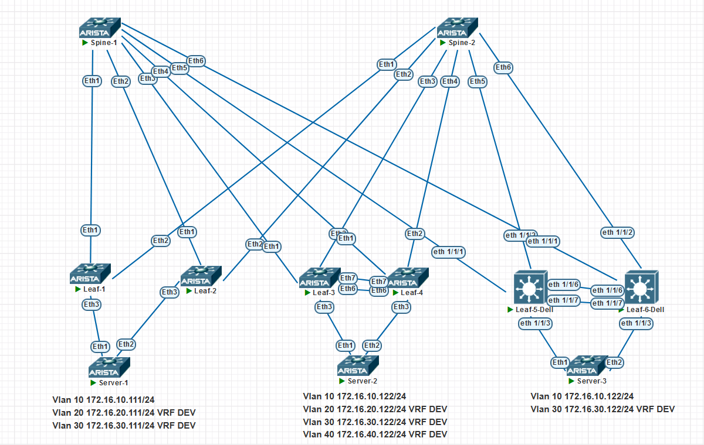

### Overlay. VxLAN EVPN Multihoming

### Цели:
- Настроить отказоустойчивое подключение клиентов с использованием EVPN Multihoming


### Описание выполнения лабораторной работы:
- Выбрать технологии для Multihoming
- Настроить ESI/MLAG/VLT на Leaf-парах.


### Физическая схема сети:


#### <u>Таблица Loopback0/Router-ID и ASn, настроенных на устройствах:</u>

|Device|IP Lo/Router-ID |ASn||
|:-:|:-:|:-:|:-:|
|Spine1|10.1.254.101|65100|
|Spine2|10.1.254.102|65100|
|Leaf1|10.1.254.1|65001|
|Leaf2|10.1.254.2|65002|
|Leaf3/4|10.1.254.3 / 4|65003|
|Leaf5/6|10.1.254.5 / 6|65004|

#### <u>Таблица VTEP IP/AS устройствах:</u>

|Device|VTEP IP|ASn||
|:-:|:-:|:-:|:-:|
|Leaf1|10.1.254.1|65001|ESI|
|Leaf1|10.1.254.2|65002|ESI|
|Leaf3/4|10.1.254.203|65003|MLAG|
|Leaf5/6|10.1.254.204|65004|VLT|                                                              

#### <u>Таблица VLAN/VNI/RD/RT на устройствах:</u>

|Device|VLAN|VNI|RD|RT|
|:-:|:-:|:-:|:-:|:-:|
|Leaf1/2|10|100010|65001:10|10:100010|
||20|100020|65001:20|20:100020|
||30|100030|65001:30|30:100030|
|||999|65001:999|999:999|
|Leaf2|20|100020|65002:20|20:100020|
||30|100030|65002:30|30:100030|
|||999|65003:999|999:999|
|Leaf3/4|10|100010|65003:10|10:100010|
||20|100020|65003:20|20:100020|
||30|100020|65003:30|30:100030|
||40|100020|65003:40|40:100040|
|||999|65003:999|999:999|
|Leaf5/6|10|100010|65003:10|10:100010|
||30|100020|65003:20|20:100020|
|Leaf4|10|100010|auto|10:100010|
||20|100020|auto|20:100020|
|||999|10.1.254.4:999|999:999|

У Dell auto-rd Loopback:Virtual-network, например 10.1.254.4:30
DellOS10 не отображает Route-Type 1 и 4
VLAN 20,30,40 находятся в VRF DEV, он же L3VNI 999

### Настройка:

#### <u>Настройка SPINE1:</u>

```
router bgp 65100
   router-id 10.1.254.101
   no bgp default ipv4-unicast
   maximum-paths 4 ecmp 4
   neighbor EVPN peer group
   neighbor EVPN next-hop-unchanged
   neighbor EVPN update-source Loopback0
   neighbor EVPN bfd
   neighbor EVPN ebgp-multihop 3
   neighbor EVPN send-community extended
   neighbor LEAF peer group
   neighbor LEAF bfd
   neighbor 10.1.1.1 peer group LEAF
   neighbor 10.1.1.1 remote-as 65001
   neighbor 10.1.1.3 peer group LEAF
   neighbor 10.1.1.3 remote-as 65002
   neighbor 10.1.1.5 peer group LEAF
   neighbor 10.1.1.5 remote-as 65003
   neighbor 10.1.1.7 peer group LEAF
   neighbor 10.1.1.7 remote-as 65003
   neighbor 10.1.1.9 peer group LEAF
   neighbor 10.1.1.9 remote-as 65004
   neighbor 10.1.1.11 peer group LEAF
   neighbor 10.1.1.11 remote-as 65004
   neighbor 10.1.254.1 peer group EVPN
   neighbor 10.1.254.1 remote-as 65001
   neighbor 10.1.254.2 peer group EVPN
   neighbor 10.1.254.2 remote-as 65002
   neighbor 10.1.254.3 peer group EVPN
   neighbor 10.1.254.3 remote-as 65003
   neighbor 10.1.254.4 peer group EVPN
   neighbor 10.1.254.4 remote-as 65003
   neighbor 10.1.254.5 peer group EVPN
   neighbor 10.1.254.5 remote-as 65004
   neighbor 10.1.254.6 peer group EVPN
   neighbor 10.1.254.6 remote-as 65004
   !
   address-family evpn
      neighbor EVPN activate
   !
   address-family ipv4
      neighbor LEAF activate
      network 10.1.254.101/32

```
#### <u>Настройка SPINE2:</u>
```
router bgp 65100
   router-id 10.1.254.102
   no bgp default ipv4-unicast
   maximum-paths 4 ecmp 4
   neighbor EVPN peer group
   neighbor EVPN next-hop-unchanged
   neighbor EVPN update-source Loopback0
   neighbor EVPN bfd
   neighbor EVPN ebgp-multihop 3
   neighbor EVPN send-community extended
   neighbor LEAF peer group
   neighbor LEAF bfd
   neighbor 10.1.2.1 peer group LEAF
   neighbor 10.1.2.1 remote-as 65001
   neighbor 10.1.2.3 peer group LEAF
   neighbor 10.1.2.3 remote-as 65002
   neighbor 10.1.2.5 peer group LEAF
   neighbor 10.1.2.5 remote-as 65003
   neighbor 10.1.2.7 peer group LEAF
   neighbor 10.1.2.7 remote-as 65003
   neighbor 10.1.2.9 peer group LEAF
   neighbor 10.1.2.9 remote-as 65004
   neighbor 10.1.2.11 peer group LEAF
   neighbor 10.1.2.11 remote-as 65004
   neighbor 10.1.254.1 peer group EVPN
   neighbor 10.1.254.1 remote-as 65001
   neighbor 10.1.254.2 peer group EVPN
   neighbor 10.1.254.2 remote-as 65002
   neighbor 10.1.254.3 peer group EVPN
   neighbor 10.1.254.3 remote-as 65003
   neighbor 10.1.254.4 peer group EVPN
   neighbor 10.1.254.4 remote-as 65003
   neighbor 10.1.254.5 peer group EVPN
   neighbor 10.1.254.5 remote-as 65004
   neighbor 10.1.254.6 peer group EVPN
   neighbor 10.1.254.6 remote-as 65004
   !
   address-family evpn
      neighbor EVPN activate
   !
   address-family ipv4
      neighbor LEAF activate
      network 10.1.254.102/32

```
#### <u>Настройка LEAF1/2:</u>
```

interface Ethernet3
   switchport trunk allowed vlan 10,20,30
   switchport mode trunk
   !
   evpn ethernet-segment
      identifier 00aa:bbbb:1111:1111:1111
      route-target import 12:23:11:11:11:11


Остальные настройки как в Лабе 6


```
#### <u>Настройка LEAF3:</u>
```

vlan 40
!
vlan 4090
   name Mlag
!
vlan 4091
   name iBGP-peer


interface Ethernet3
   description Server-2
   channel-group 10 mode active

interface Ethernet6
   description MLAG-peer
   mtu 9000
   channel-group 100 mode active
!
interface Ethernet7
   description MLAG-peer
   mtu 9000
   channel-group 100 mode active


interface Port-Channel10
   description Server-2
   switchport mode trunk
   mlag 10
!

interface Port-Channel100
   description MLAG
   switchport mode trunk

interface Loopback1
   ip address 10.1.254.3/32
!
interface Loopback1
   ip address 10.1.254.203/32


!
interface Vlan40
   no autostate
   vrf DEV
   ip address 172.16.40.253/24
   ip virtual-router address 172.16.40.1
!
interface Vlan4090
   ip address 10.1.255.0/31
!
interface Vlan4091
   ip address 10.1.251.0/31
!
interface Vxlan1
   vxlan source-interface Loopback1
   vxlan udp-port 4789
   vxlan vlan 10 vni 100010
   vxlan vlan 20 vni 100020
   vxlan vlan 30 vni 100030
   vxlan vlan 40 vni 100040
   vxlan vrf DEV vni 999
!
ip virtual-router mac-address 00:00:00:00:11:11

router bgp 65003
   neighbor iBGP peer group
   neighbor iBGP remote-as 65003
   neighbor iBGP next-hop-self
   neighbor iBGP bfd
   neighbor 10.1.251.1 peer group iBGP

```
#### <u>Настройка LEAF4:</u>

```
vlan 40
!
vlan 4090
   name Mlag
!
vlan 4091
   name iBGP-peer


interface Ethernet3
   description Server-2
   channel-group 10 mode active

interface Ethernet6
   description MLAG-peer
   mtu 9000
   channel-group 100 mode active
!
interface Ethernet7
   description MLAG-peer
   mtu 9000
   channel-group 100 mode active


interface Port-Channel10
   description Server-2
   switchport mode trunk
   mlag 10
!

interface Port-Channel100
   description MLAG
   switchport mode trunk

interface Loopback1
   ip address 10.1.254.4/32
!
interface Loopback1
   ip address 10.1.254.203/32


!
interface Vlan40
   no autostate
   vrf DEV
   ip address 172.16.40.254/24
   ip virtual-router address 172.16.40.1
!
interface Vlan4090
   ip address 10.1.255.1/31
!
interface Vlan4091
   ip address 10.1.251.1/31
!
interface Vxlan1
   vxlan source-interface Loopback1
   vxlan udp-port 4789
   vxlan vlan 10 vni 100010
   vxlan vlan 20 vni 100020
   vxlan vlan 30 vni 100030
   vxlan vlan 40 vni 100040
   vxlan vrf DEV vni 999
!
ip virtual-router mac-address 00:00:00:00:11:11

router bgp 65003
   neighbor iBGP peer group
   neighbor iBGP remote-as 65003
   neighbor iBGP next-hop-self
   neighbor iBGP bfd
   neighbor 10.1.251.0 peer group iBGP

```
#### <u>Настройка LEAF5:</u>

```
interface vlan4000
 no shutdown
 ip address 10.1.255.2/31
!
interface vlan4001
 no shutdown
 ip address 10.1.251.2/31
!
interface port-channel10
 no shutdown
 switchport mode trunk
 switchport access vlan 1
 switchport trunk allowed vlan 10,30
 vlt-port-channel 10


interface ethernet1/1/3
 description Servers-3
 no shutdown
 channel-group 10 mode active
 no switchport


interface loopback0
 no shutdown
 ip address 10.1.254.5/32
!
interface loopback1
 no shutdown
 ip address 10.1.254.204/32
!
nve
 source-interface loopback1


+ eBGP/iBGP/evpn/virtual-network

```

#### <u>Настройка LEAF6:</u>

```
interface vlan4000
 no shutdown
 ip address 10.1.255.2/31
!
interface vlan4001
 no shutdown
 ip address 10.1.251.2/31
!
interface port-channel10
 no shutdown
 switchport mode trunk
 switchport access vlan 1
 switchport trunk allowed vlan 10,30
 vlt-port-channel 10


interface ethernet1/1/3
 description Servers-3
 no shutdown
 channel-group 10 mode active
 no switchport


interface loopback0
 no shutdown
 ip address 10.1.254.5/32
!
interface loopback1
 no shutdown
 ip address 10.1.254.204/32
!
nve
 source-interface loopback1


+ eBGP/iBGP/evpn/virtual-network


```

### Проверка:

<details>
<summary>Проверка на Leaf-1</summary>

```

Leaf-1#show bgp evpn instance vlan 10
EVPN instance: VLAN 10
  Route distinguisher: 65001:10
  Route target import: Route-Target-AS:10:100010
  Route target export: Route-Target-AS:10:100010
  Service interface: VLAN-based
  Local IP address: 10.1.254.1
  Encapsulation type: VXLAN
  Local ethernet segment:
    ESI: 00aa:bbbb:1111:1111:1111
      Interface: Port-Channel10
      Mode: all-active
      State: up
      ES-Import RT: 12:23:11:11:11:11
      DF election algorithm: modulus
      Designated forwarder: 10.1.254.1
      Non-Designated forwarder: 10.1.254.2
Leaf-1#show bgp evpn instance vlan 20
EVPN instance: VLAN 20
  Route distinguisher: 65001:20
  Route target import: Route-Target-AS:20:100020
  Route target export: Route-Target-AS:20:100020
  Service interface: VLAN-based
  Local IP address: 10.1.254.1
  Encapsulation type: VXLAN
  Local ethernet segment:
    ESI: 00aa:bbbb:1111:1111:1111
      Interface: Port-Channel10
      Mode: all-active
      State: up
      ES-Import RT: 12:23:11:11:11:11
      DF election algorithm: modulus
      Designated forwarder: 10.1.254.1
      Non-Designated forwarder: 10.1.254.2
Leaf-1#show bgp evpn instance vlan 30
EVPN instance: VLAN 30
  Route distinguisher: 65001:30
  Route target import: Route-Target-AS:30:100030
  Route target export: Route-Target-AS:30:100030
  Service interface: VLAN-based
  Local IP address: 10.1.254.1
  Encapsulation type: VXLAN
  Local ethernet segment:
    ESI: 00aa:bbbb:1111:1111:1111
      Interface: Port-Channel10
      Mode: all-active
      State: up
      ES-Import RT: 12:23:11:11:11:11
      DF election algorithm: modulus
      Designated forwarder: 10.1.254.1
      Non-Designated forwarder: 10.1.254.2
Leaf-1#
Leaf-1#
Leaf-1#show vxlan vni
VNI to VLAN Mapping for Vxlan1
VNI          VLAN       Source       Interface            802.1Q Tag
------------ ---------- ------------ -------------------- ----------
100010       10         static       Port-Channel10       10
                                     Vxlan1               10
100020       20         static       Ethernet4            untagged
                                     Port-Channel10       20
                                     Vxlan1               20
100030       30         static       Ethernet5            untagged
                                     Port-Channel10       30
                                     Vxlan1               30

VNI to dynamic VLAN Mapping for Vxlan1
VNI       VLAN       VRF       Source
--------- ---------- --------- ------------
999       4094       DEV       evpn

Leaf-1#show vxlan vtep
Remote VTEPS for Vxlan1:

VTEP               Tunnel Type(s)
------------------ --------------
10.1.254.2         flood, unicast
10.1.254.203       flood, unicast
10.1.254.204       flood, unicast

Total number of remote VTEPS:  3
Leaf-1#show vxlan flood vtep
          VXLAN Flood VTEP Table
--------------------------------------------------------------------------------

VLANS                            Ip Address
-----------------------------   ------------------------------------------------
10,30                           10.1.254.2      10.1.254.203    10.1.254.204
20                              10.1.254.2      10.1.254.203
Leaf-1#show bgp evpn
BGP routing table information for VRF default
Router identifier 10.1.254.1, local AS number 65001
Route status codes: s - suppressed, * - valid, > - active, E - ECMP head, e - ECMP
                    S - Stale, c - Contributing to ECMP, b - backup
                    % - Pending BGP convergence
Origin codes: i - IGP, e - EGP, ? - incomplete
AS Path Attributes: Or-ID - Originator ID, C-LST - Cluster List, LL Nexthop - Link Local Nexthop

          Network                Next Hop              Metric  LocPref Weight  Path
 * >     RD: 65001:10 auto-discovery 0 00aa:bbbb:1111:1111:1111
                                 -                     -       -       0       i
 * >     RD: 65001:20 auto-discovery 0 00aa:bbbb:1111:1111:1111
                                 -                     -       -       0       i
 * >     RD: 65001:30 auto-discovery 0 00aa:bbbb:1111:1111:1111
                                 -                     -       -       0       i
 * >Ec   RD: 65002:10 auto-discovery 0 00aa:bbbb:1111:1111:1111
                                 10.1.254.2            -       100     0       65100 65002 i
 *  ec   RD: 65002:10 auto-discovery 0 00aa:bbbb:1111:1111:1111
                                 10.1.254.2            -       100     0       65100 65002 i
 * >Ec   RD: 65002:20 auto-discovery 0 00aa:bbbb:1111:1111:1111
                                 10.1.254.2            -       100     0       65100 65002 i
 *  ec   RD: 65002:20 auto-discovery 0 00aa:bbbb:1111:1111:1111
                                 10.1.254.2            -       100     0       65100 65002 i
 * >Ec   RD: 65002:30 auto-discovery 0 00aa:bbbb:1111:1111:1111
                                 10.1.254.2            -       100     0       65100 65002 i
 *  ec   RD: 65002:30 auto-discovery 0 00aa:bbbb:1111:1111:1111
                                 10.1.254.2            -       100     0       65100 65002 i
 * >     RD: 10.1.254.1:1 auto-discovery 00aa:bbbb:1111:1111:1111
                                 -                     -       -       0       i
 * >Ec   RD: 10.1.254.2:1 auto-discovery 00aa:bbbb:1111:1111:1111
                                 10.1.254.2            -       100     0       65100 65002 i
 *  ec   RD: 10.1.254.2:1 auto-discovery 00aa:bbbb:1111:1111:1111
                                 10.1.254.2            -       100     0       65100 65002 i
 * >Ec   RD: 10.1.254.204:30 mac-ip 0000.0000.1111 172.16.30.1
                                 10.1.254.204          -       100     0       65100 65004 ?
 *  ec   RD: 10.1.254.204:30 mac-ip 0000.0000.1111 172.16.30.1
                                 10.1.254.204          -       100     0       65100 65004 ?
 * >Ec   RD: 65003:20 mac-ip 5036.5687.88d2
                                 10.1.254.203          -       100     0       65100 65003 i
 *  ec   RD: 65003:20 mac-ip 5036.5687.88d2
                                 10.1.254.203          -       100     0       65100 65003 i
 * >Ec   RD: 65003:30 mac-ip 5036.5687.88d2
                                 10.1.254.203          -       100     0       65100 65003 i
 *  ec   RD: 65003:30 mac-ip 5036.5687.88d2
                                 10.1.254.203          -       100     0       65100 65003 i
 * >Ec   RD: 65003:40 mac-ip 5036.5687.88d2
                                 10.1.254.203          -       100     0       65100 65003 i
 *  ec   RD: 65003:40 mac-ip 5036.5687.88d2
                                 10.1.254.203          -       100     0       65100 65003 i
 * >Ec   RD: 65003:20 mac-ip 5036.5687.88d2 172.16.20.122
                                 10.1.254.203          -       100     0       65100 65003 i
 *  ec   RD: 65003:20 mac-ip 5036.5687.88d2 172.16.20.122
                                 10.1.254.203          -       100     0       65100 65003 i
 * >Ec   RD: 65003:30 mac-ip 5036.5687.88d2 172.16.30.122
                                 10.1.254.203          -       100     0       65100 65003 i
 *  ec   RD: 65003:30 mac-ip 5036.5687.88d2 172.16.30.122
                                 10.1.254.203          -       100     0       65100 65003 i
 * >Ec   RD: 65003:40 mac-ip 5036.5687.88d2 172.16.40.122
                                 10.1.254.203          -       100     0       65100 65003 i
 *  ec   RD: 65003:40 mac-ip 5036.5687.88d2 172.16.40.122
                                 10.1.254.203          -       100     0       65100 65003 i
 * >Ec   RD: 10.1.254.204:30 mac-ip 504e.0904.9202
                                 10.1.254.204          -       100     0       65100 65004 ?
 *  ec   RD: 10.1.254.204:30 mac-ip 504e.0904.9202
                                 10.1.254.204          -       100     0       65100 65004 ?
 * >Ec   RD: 10.1.254.204:30 mac-ip 504e.0904.9203
                                 10.1.254.204          -       100     0       65100 65004 ?
 *  ec   RD: 10.1.254.204:30 mac-ip 504e.0904.9203
                                 10.1.254.204          -       100     0       65100 65004 ?
 * >Ec   RD: 10.1.254.204:30 mac-ip 504e.0904.9203 172.16.30.206
                                 10.1.254.204          -       100     0       65100 65004 ?
 *  ec   RD: 10.1.254.204:30 mac-ip 504e.0904.9203 172.16.30.206
                                 10.1.254.204          -       100     0       65100 65004 ?
 * >     RD: 65001:10 mac-ip 5074.72d7.50f0
                                 -                     -       -       0       i
 * >     RD: 65001:20 mac-ip 5074.72d7.50f0
                                 -                     -       -       0       i
 * >     RD: 65001:30 mac-ip 5074.72d7.50f0
                                 -                     -       -       0       i
 * >     RD: 65001:10 mac-ip 5074.72d7.50f0 172.16.10.111
                                 -                     -       -       0       i
 * >Ec   RD: 65002:10 mac-ip 5074.72d7.50f0 172.16.10.111
                                 10.1.254.2            -       100     0       65100 65002 i
 *  ec   RD: 65002:10 mac-ip 5074.72d7.50f0 172.16.10.111
                                 10.1.254.2            -       100     0       65100 65002 i
 * >     RD: 65001:20 mac-ip 5074.72d7.50f0 172.16.20.111
                                 -                     -       -       0       i
 * >Ec   RD: 65002:20 mac-ip 5074.72d7.50f0 172.16.20.111
                                 10.1.254.2            -       100     0       65100 65002 i
 *  ec   RD: 65002:20 mac-ip 5074.72d7.50f0 172.16.20.111
                                 10.1.254.2            -       100     0       65100 65002 i
 * >     RD: 65001:30 mac-ip 5074.72d7.50f0 172.16.30.111
                                 -                     -       -       0       i
 * >Ec   RD: 65002:30 mac-ip 5074.72d7.50f0 172.16.30.111
                                 10.1.254.2            -       100     0       65100 65002 i
 *  ec   RD: 65002:30 mac-ip 5074.72d7.50f0 172.16.30.111
                                 10.1.254.2            -       100     0       65100 65002 i
 * >Ec   RD: 10.1.254.204:30 mac-ip 5088.a504.5002
                                 10.1.254.204          -       100     0       65100 65004 ?
 *  ec   RD: 10.1.254.204:30 mac-ip 5088.a504.5002
                                 10.1.254.204          -       100     0       65100 65004 ?
 * >Ec   RD: 10.1.254.204:30 mac-ip 5088.a504.5003
                                 10.1.254.204          -       100     0       65100 65004 ?
 *  ec   RD: 10.1.254.204:30 mac-ip 5088.a504.5003
                                 10.1.254.204          -       100     0       65100 65004 ?
 * >Ec   RD: 10.1.254.204:30 mac-ip 5088.a504.5003 172.16.30.205
                                 10.1.254.204          -       100     0       65100 65004 ?
 *  ec   RD: 10.1.254.204:30 mac-ip 5088.a504.5003 172.16.30.205
                                 10.1.254.204          -       100     0       65100 65004 ?
 * >Ec   RD: 10.1.254.204:10 mac-ip 508b.0bc2.8f39
                                 10.1.254.204          -       100     0       65100 65004 ?
 *  ec   RD: 10.1.254.204:10 mac-ip 508b.0bc2.8f39
                                 10.1.254.204          -       100     0       65100 65004 ?
 * >Ec   RD: 10.1.254.204:30 mac-ip 508b.0bc2.8f39
                                 10.1.254.204          -       100     0       65100 65004 ?
 *  ec   RD: 10.1.254.204:30 mac-ip 508b.0bc2.8f39
                                 10.1.254.204          -       100     0       65100 65004 ?
 * >     RD: 65001:10 imet 10.1.254.1
                                 -                     -       -       0       i
 * >     RD: 65001:20 imet 10.1.254.1
                                 -                     -       -       0       i
 * >     RD: 65001:30 imet 10.1.254.1
                                 -                     -       -       0       i
 * >Ec   RD: 65002:10 imet 10.1.254.2
                                 10.1.254.2            -       100     0       65100 65002 i
 *  ec   RD: 65002:10 imet 10.1.254.2
                                 10.1.254.2            -       100     0       65100 65002 i
 * >Ec   RD: 65002:20 imet 10.1.254.2
                                 10.1.254.2            -       100     0       65100 65002 i
 *  ec   RD: 65002:20 imet 10.1.254.2
                                 10.1.254.2            -       100     0       65100 65002 i
 * >Ec   RD: 65002:30 imet 10.1.254.2
                                 10.1.254.2            -       100     0       65100 65002 i
 *  ec   RD: 65002:30 imet 10.1.254.2
                                 10.1.254.2            -       100     0       65100 65002 i
 * >Ec   RD: 65003:10 imet 10.1.254.203
                                 10.1.254.203          -       100     0       65100 65003 i
 *  ec   RD: 65003:10 imet 10.1.254.203
                                 10.1.254.203          -       100     0       65100 65003 i
 * >Ec   RD: 65003:20 imet 10.1.254.203
                                 10.1.254.203          -       100     0       65100 65003 i
 *  ec   RD: 65003:20 imet 10.1.254.203
                                 10.1.254.203          -       100     0       65100 65003 i
 * >Ec   RD: 65003:30 imet 10.1.254.203
                                 10.1.254.203          -       100     0       65100 65003 i
 *  ec   RD: 65003:30 imet 10.1.254.203
                                 10.1.254.203          -       100     0       65100 65003 i
 * >Ec   RD: 65003:40 imet 10.1.254.203
                                 10.1.254.203          -       100     0       65100 65003 i
 *  ec   RD: 65003:40 imet 10.1.254.203
                                 10.1.254.203          -       100     0       65100 65003 i
 * >Ec   RD: 10.1.254.204:10 imet 10.1.254.204
                                 10.1.254.204          -       100     0       65100 65004 ?
 *  ec   RD: 10.1.254.204:10 imet 10.1.254.204
                                 10.1.254.204          -       100     0       65100 65004 ?
 * >Ec   RD: 10.1.254.204:30 imet 10.1.254.204
                                 10.1.254.204          -       100     0       65100 65004 ?
 *  ec   RD: 10.1.254.204:30 imet 10.1.254.204
                                 10.1.254.204          -       100     0       65100 65004 ?
 * >     RD: 10.1.254.1:1 ethernet-segment 00aa:bbbb:1111:1111:1111 10.1.254.1
                                 -                     -       -       0       i
 * >Ec   RD: 10.1.254.2:1 ethernet-segment 00aa:bbbb:1111:1111:1111 10.1.254.2
                                 10.1.254.2            -       100     0       65100 65002 i
 *  ec   RD: 10.1.254.2:1 ethernet-segment 00aa:bbbb:1111:1111:1111 10.1.254.2
                                 10.1.254.2            -       100     0       65100 65002 i
Leaf-1#
Leaf-1#
Leaf-1#show vxlan address-table
          Vxlan Mac Address Table
----------------------------------------------------------------------

VLAN  Mac Address     Type      Prt  VTEP             Moves   Last Move
----  -----------     ----      ---  ----             -----   ---------
  10  508b.0bc2.8f39  EVPN      Vx1  10.1.254.204     1       0:11:07 ago
  20  5036.5687.88d2  EVPN      Vx1  10.1.254.203     1       0:10:44 ago
  30  5036.5687.88d2  EVPN      Vx1  10.1.254.203     1       0:04:11 ago
  30  504e.0904.9202  STATIC    Vx1  10.1.254.204
  30  504e.0904.9203  STATIC    Vx1  10.1.254.204
  30  5088.a504.5002  STATIC    Vx1  10.1.254.204
  30  5088.a504.5003  STATIC    Vx1  10.1.254.204
  30  508b.0bc2.8f39  EVPN      Vx1  10.1.254.204     1       0:10:53 ago
4094  501b.f858.0e2e  EVPN      Vx1  10.1.254.2       1       0:48:02 ago
4094  504e.0904.9203  EVPN      Vx1  10.1.254.204     1       0:14:23 ago
4094  507a.e93c.68eb  EVPN      Vx1  10.1.254.203     1       0:06:34 ago
4094  5088.a504.5003  EVPN      Vx1  10.1.254.204     1       0:14:29 ago
Total Remote Mac Addresses for this criterion: 12
Leaf-1#show mac address-table
          Mac Address Table
------------------------------------------------------------------

Vlan    Mac Address       Type        Ports      Moves   Last Move
----    -----------       ----        -----      -----   ---------
  10    5074.72d7.50f0    DYNAMIC     Po10       2       0:11:11 ago
  10    508b.0bc2.8f39    DYNAMIC     Vx1        1       0:11:07 ago
  20    5036.5687.88d2    DYNAMIC     Vx1        1       0:10:44 ago
  20    5074.72d7.50f0    DYNAMIC     Po10       2       0:06:43 ago
  30    5036.5687.88d2    DYNAMIC     Vx1        1       0:04:11 ago
  30    504e.0904.9202    STATIC      Vx1
  30    504e.0904.9203    STATIC      Vx1
  30    5074.72d7.50f0    DYNAMIC     Po10       2       0:10:53 ago
  30    5088.a504.5002    STATIC      Vx1
  30    5088.a504.5003    STATIC      Vx1
  30    508b.0bc2.8f39    DYNAMIC     Vx1        1       0:10:53 ago
4094    501b.f858.0e2e    DYNAMIC     Vx1        1       0:48:02 ago
4094    504e.0904.9203    DYNAMIC     Vx1        1       0:14:23 ago
4094    507a.e93c.68eb    DYNAMIC     Vx1        1       0:06:34 ago
4094    5088.a504.5003    DYNAMIC     Vx1        1       0:14:29 ago
Total Mac Addresses for this criterion: 15

          Multicast Mac Address Table
------------------------------------------------------------------

Vlan    Mac Address       Type        Ports
----    -----------       ----        -----
Total Mac Addresses for this criterion: 0
Leaf-1#show ip route vrf DEV

VRF: DEV
Codes: C - connected, S - static, K - kernel,
       O - OSPF, IA - OSPF inter area, E1 - OSPF external type 1,
       E2 - OSPF external type 2, N1 - OSPF NSSA external type 1,
       N2 - OSPF NSSA external type2, B - BGP, B I - iBGP, B E - eBGP,
       R - RIP, I L1 - IS-IS level 1, I L2 - IS-IS level 2,
       O3 - OSPFv3, A B - BGP Aggregate, A O - OSPF Summary,
       NG - Nexthop Group Static Route, V - VXLAN Control Service,
       DH - DHCP client installed default route, M - Martian,
       DP - Dynamic Policy Route, L - VRF Leaked,
       G  - gRIBI, RC - Route Cache Route

Gateway of last resort is not set

 B E      172.16.20.122/32 [200/0] via VTEP 10.1.254.203 VNI 999 router-mac 50:7a:e9:3c:68:eb local-interface Vxlan1
 C        172.16.20.0/24 is directly connected, Vlan20
 B E      172.16.30.122/32 [200/0] via VTEP 10.1.254.203 VNI 999 router-mac 50:7a:e9:3c:68:eb local-interface Vxlan1
 B E      172.16.30.205/32 [200/0] via VTEP 10.1.254.204 VNI 999 router-mac 50:88:a5:04:50:03 local-interface Vxlan1
 B E      172.16.30.206/32 [200/0] via VTEP 10.1.254.204 VNI 999 router-mac 50:4e:09:04:92:03 local-interface Vxlan1
 C        172.16.30.0/24 is directly connected, Vlan30
 B E      172.16.40.122/32 [200/0] via VTEP 10.1.254.203 VNI 999 router-mac 50:7a:e9:3c:68:eb local-interface Vxlan1


```
</details>
<details>
<summary>Проверка на Leaf-2</summary>

```

Leaf-2#show bgp evpn instance vlan 10
EVPN instance: VLAN 10
  Route distinguisher: 65002:10
  Route target import: Route-Target-AS:10:100010
  Route target export: Route-Target-AS:10:100010
  Service interface: VLAN-based
  Local IP address: 10.1.254.2
  Encapsulation type: VXLAN
  Local ethernet segment:
    ESI: 00aa:bbbb:1111:1111:1111
      Interface: Port-Channel10
      Mode: all-active
      State: up
      ES-Import RT: 12:23:11:11:11:11
      DF election algorithm: modulus
      Designated forwarder: 10.1.254.1
      Non-Designated forwarder: 10.1.254.2
Leaf-2#show bgp evpn instance vlan 20
EVPN instance: VLAN 20
  Route distinguisher: 65002:20
  Route target import: Route-Target-AS:20:100020
  Route target export: Route-Target-AS:20:100020
  Service interface: VLAN-based
  Local IP address: 10.1.254.2
  Encapsulation type: VXLAN
  Local ethernet segment:
    ESI: 00aa:bbbb:1111:1111:1111
      Interface: Port-Channel10
      Mode: all-active
      State: up
      ES-Import RT: 12:23:11:11:11:11
      DF election algorithm: modulus
      Designated forwarder: 10.1.254.1
      Non-Designated forwarder: 10.1.254.2
Leaf-2#show bgp evpn instance vlan 30
EVPN instance: VLAN 30
  Route distinguisher: 65002:30
  Route target import: Route-Target-AS:30:100030
  Route target export: Route-Target-AS:30:100030
  Service interface: VLAN-based
  Local IP address: 10.1.254.2
  Encapsulation type: VXLAN
  Local ethernet segment:
    ESI: 00aa:bbbb:1111:1111:1111
      Interface: Port-Channel10
      Mode: all-active
      State: up
      ES-Import RT: 12:23:11:11:11:11
      DF election algorithm: modulus
      Designated forwarder: 10.1.254.1
      Non-Designated forwarder: 10.1.254.2
Leaf-2#
Leaf-2#
Leaf-2#show vxlan vni
VNI to VLAN Mapping for Vxlan1
VNI          VLAN       Source       Interface            802.1Q Tag
------------ ---------- ------------ -------------------- ----------
100010       10         static       Port-Channel10       10
                                     Vxlan1               10
100020       20         static       Port-Channel10       20
                                     Vxlan1               20
100030       30         static       Ethernet4            untagged
                                     Port-Channel10       30
                                     Vxlan1               30

VNI to dynamic VLAN Mapping for Vxlan1
VNI       VLAN       VRF       Source
--------- ---------- --------- ------------
999       4094       DEV       evpn

Leaf-2#show vxlan vtep
Remote VTEPS for Vxlan1:

VTEP               Tunnel Type(s)
------------------ --------------
10.1.254.1         unicast, flood
10.1.254.203       unicast, flood
10.1.254.204       unicast, flood

Total number of remote VTEPS:  3
Leaf-2#show vxlan flood vtep
          VXLAN Flood VTEP Table
--------------------------------------------------------------------------------

VLANS                            Ip Address
-----------------------------   ------------------------------------------------
10,30                           10.1.254.1      10.1.254.203    10.1.254.204
20                              10.1.254.1      10.1.254.203
Leaf-2#show bgp evpn
BGP routing table information for VRF default
Router identifier 10.1.254.2, local AS number 65002
Route status codes: s - suppressed, * - valid, > - active, E - ECMP head, e - ECMP
                    S - Stale, c - Contributing to ECMP, b - backup
                    % - Pending BGP convergence
Origin codes: i - IGP, e - EGP, ? - incomplete
AS Path Attributes: Or-ID - Originator ID, C-LST - Cluster List, LL Nexthop - Link Local Nexthop

          Network                Next Hop              Metric  LocPref Weight  Path
 * >Ec   RD: 65001:10 auto-discovery 0 00aa:bbbb:1111:1111:1111
                                 10.1.254.1            -       100     0       65100 65001 i
 *  ec   RD: 65001:10 auto-discovery 0 00aa:bbbb:1111:1111:1111
                                 10.1.254.1            -       100     0       65100 65001 i
 * >Ec   RD: 65001:20 auto-discovery 0 00aa:bbbb:1111:1111:1111
                                 10.1.254.1            -       100     0       65100 65001 i
 *  ec   RD: 65001:20 auto-discovery 0 00aa:bbbb:1111:1111:1111
                                 10.1.254.1            -       100     0       65100 65001 i
 * >Ec   RD: 65001:30 auto-discovery 0 00aa:bbbb:1111:1111:1111
                                 10.1.254.1            -       100     0       65100 65001 i
 *  ec   RD: 65001:30 auto-discovery 0 00aa:bbbb:1111:1111:1111
                                 10.1.254.1            -       100     0       65100 65001 i
 * >     RD: 65002:10 auto-discovery 0 00aa:bbbb:1111:1111:1111
                                 -                     -       -       0       i
 * >     RD: 65002:20 auto-discovery 0 00aa:bbbb:1111:1111:1111
                                 -                     -       -       0       i
 * >     RD: 65002:30 auto-discovery 0 00aa:bbbb:1111:1111:1111
                                 -                     -       -       0       i
 * >Ec   RD: 10.1.254.1:1 auto-discovery 00aa:bbbb:1111:1111:1111
                                 10.1.254.1            -       100     0       65100 65001 i
 *  ec   RD: 10.1.254.1:1 auto-discovery 00aa:bbbb:1111:1111:1111
                                 10.1.254.1            -       100     0       65100 65001 i
 * >     RD: 10.1.254.2:1 auto-discovery 00aa:bbbb:1111:1111:1111
                                 -                     -       -       0       i
 * >Ec   RD: 10.1.254.204:30 mac-ip 0000.0000.1111 172.16.30.1
                                 10.1.254.204          -       100     0       65100 65004 ?
 *  ec   RD: 10.1.254.204:30 mac-ip 0000.0000.1111 172.16.30.1
                                 10.1.254.204          -       100     0       65100 65004 ?
 * >Ec   RD: 65003:20 mac-ip 5036.5687.88d2
                                 10.1.254.203          -       100     0       65100 65003 i
 *  ec   RD: 65003:20 mac-ip 5036.5687.88d2
                                 10.1.254.203          -       100     0       65100 65003 i
 * >Ec   RD: 65003:30 mac-ip 5036.5687.88d2
                                 10.1.254.203          -       100     0       65100 65003 i
 *  ec   RD: 65003:30 mac-ip 5036.5687.88d2
                                 10.1.254.203          -       100     0       65100 65003 i
 * >Ec   RD: 65003:40 mac-ip 5036.5687.88d2
                                 10.1.254.203          -       100     0       65100 65003 i
 *  ec   RD: 65003:40 mac-ip 5036.5687.88d2
                                 10.1.254.203          -       100     0       65100 65003 i
 * >Ec   RD: 65003:20 mac-ip 5036.5687.88d2 172.16.20.122
                                 10.1.254.203          -       100     0       65100 65003 i
 *  ec   RD: 65003:20 mac-ip 5036.5687.88d2 172.16.20.122
                                 10.1.254.203          -       100     0       65100 65003 i
 * >Ec   RD: 65003:30 mac-ip 5036.5687.88d2 172.16.30.122
                                 10.1.254.203          -       100     0       65100 65003 i
 *  ec   RD: 65003:30 mac-ip 5036.5687.88d2 172.16.30.122
                                 10.1.254.203          -       100     0       65100 65003 i
 * >Ec   RD: 65003:40 mac-ip 5036.5687.88d2 172.16.40.122
                                 10.1.254.203          -       100     0       65100 65003 i
 *  ec   RD: 65003:40 mac-ip 5036.5687.88d2 172.16.40.122
                                 10.1.254.203          -       100     0       65100 65003 i
 * >Ec   RD: 10.1.254.204:30 mac-ip 504e.0904.9202
                                 10.1.254.204          -       100     0       65100 65004 ?
 *  ec   RD: 10.1.254.204:30 mac-ip 504e.0904.9202
                                 10.1.254.204          -       100     0       65100 65004 ?
 * >Ec   RD: 10.1.254.204:30 mac-ip 504e.0904.9203
                                 10.1.254.204          -       100     0       65100 65004 ?
 *  ec   RD: 10.1.254.204:30 mac-ip 504e.0904.9203
                                 10.1.254.204          -       100     0       65100 65004 ?
 * >Ec   RD: 10.1.254.204:30 mac-ip 504e.0904.9203 172.16.30.206
                                 10.1.254.204          -       100     0       65100 65004 ?
 *  ec   RD: 10.1.254.204:30 mac-ip 504e.0904.9203 172.16.30.206
                                 10.1.254.204          -       100     0       65100 65004 ?
 * >Ec   RD: 65001:30 mac-ip 5074.72d7.50f0
                                 10.1.254.1            -       100     0       65100 65001 i
 *  ec   RD: 65001:30 mac-ip 5074.72d7.50f0
                                 10.1.254.1            -       100     0       65100 65001 i
 * >     RD: 65002:10 mac-ip 5074.72d7.50f0
                                 -                     -       -       0       i
 * >     RD: 65002:20 mac-ip 5074.72d7.50f0
                                 -                     -       -       0       i
 * >Ec   RD: 65001:10 mac-ip 5074.72d7.50f0 172.16.10.111
                                 10.1.254.1            -       100     0       65100 65001 i
 *  ec   RD: 65001:10 mac-ip 5074.72d7.50f0 172.16.10.111
                                 10.1.254.1            -       100     0       65100 65001 i
 * >     RD: 65002:10 mac-ip 5074.72d7.50f0 172.16.10.111
                                 -                     -       -       0       i
 * >Ec   RD: 65001:20 mac-ip 5074.72d7.50f0 172.16.20.111
                                 10.1.254.1            -       100     0       65100 65001 i
 *  ec   RD: 65001:20 mac-ip 5074.72d7.50f0 172.16.20.111
                                 10.1.254.1            -       100     0       65100 65001 i
 * >     RD: 65002:20 mac-ip 5074.72d7.50f0 172.16.20.111
                                 -                     -       -       0       i
 * >Ec   RD: 65001:30 mac-ip 5074.72d7.50f0 172.16.30.111
                                 10.1.254.1            -       100     0       65100 65001 i
 *  ec   RD: 65001:30 mac-ip 5074.72d7.50f0 172.16.30.111
                                 10.1.254.1            -       100     0       65100 65001 i
 * >     RD: 65002:30 mac-ip 5074.72d7.50f0 172.16.30.111
                                 -                     -       -       0       i
 * >Ec   RD: 10.1.254.204:30 mac-ip 5088.a504.5002
                                 10.1.254.204          -       100     0       65100 65004 ?
 *  ec   RD: 10.1.254.204:30 mac-ip 5088.a504.5002
                                 10.1.254.204          -       100     0       65100 65004 ?
 * >Ec   RD: 10.1.254.204:30 mac-ip 5088.a504.5003
                                 10.1.254.204          -       100     0       65100 65004 ?
 *  ec   RD: 10.1.254.204:30 mac-ip 5088.a504.5003
                                 10.1.254.204          -       100     0       65100 65004 ?
 * >Ec   RD: 10.1.254.204:30 mac-ip 5088.a504.5003 172.16.30.205
                                 10.1.254.204          -       100     0       65100 65004 ?
 *  ec   RD: 10.1.254.204:30 mac-ip 5088.a504.5003 172.16.30.205
                                 10.1.254.204          -       100     0       65100 65004 ?
 * >Ec   RD: 10.1.254.204:10 mac-ip 508b.0bc2.8f39
                                 10.1.254.204          -       100     0       65100 65004 ?
 *  ec   RD: 10.1.254.204:10 mac-ip 508b.0bc2.8f39
                                 10.1.254.204          -       100     0       65100 65004 ?
 * >Ec   RD: 10.1.254.204:30 mac-ip 508b.0bc2.8f39
                                 10.1.254.204          -       100     0       65100 65004 ?
 *  ec   RD: 10.1.254.204:30 mac-ip 508b.0bc2.8f39
                                 10.1.254.204          -       100     0       65100 65004 ?
 * >Ec   RD: 65001:10 imet 10.1.254.1
                                 10.1.254.1            -       100     0       65100 65001 i
 *  ec   RD: 65001:10 imet 10.1.254.1
                                 10.1.254.1            -       100     0       65100 65001 i
 * >Ec   RD: 65001:20 imet 10.1.254.1
                                 10.1.254.1            -       100     0       65100 65001 i
 *  ec   RD: 65001:20 imet 10.1.254.1
                                 10.1.254.1            -       100     0       65100 65001 i
 * >Ec   RD: 65001:30 imet 10.1.254.1
                                 10.1.254.1            -       100     0       65100 65001 i
 *  ec   RD: 65001:30 imet 10.1.254.1
                                 10.1.254.1            -       100     0       65100 65001 i
 * >     RD: 65002:10 imet 10.1.254.2
                                 -                     -       -       0       i
 * >     RD: 65002:20 imet 10.1.254.2
                                 -                     -       -       0       i
 * >     RD: 65002:30 imet 10.1.254.2
                                 -                     -       -       0       i
 * >Ec   RD: 65003:10 imet 10.1.254.203
                                 10.1.254.203          -       100     0       65100 65003 i
 *  ec   RD: 65003:10 imet 10.1.254.203
                                 10.1.254.203          -       100     0       65100 65003 i
 * >Ec   RD: 65003:20 imet 10.1.254.203
                                 10.1.254.203          -       100     0       65100 65003 i
 *  ec   RD: 65003:20 imet 10.1.254.203
                                 10.1.254.203          -       100     0       65100 65003 i
 * >Ec   RD: 65003:30 imet 10.1.254.203
                                 10.1.254.203          -       100     0       65100 65003 i
 *  ec   RD: 65003:30 imet 10.1.254.203
                                 10.1.254.203          -       100     0       65100 65003 i
 * >Ec   RD: 65003:40 imet 10.1.254.203
                                 10.1.254.203          -       100     0       65100 65003 i
 *  ec   RD: 65003:40 imet 10.1.254.203
                                 10.1.254.203          -       100     0       65100 65003 i
 * >Ec   RD: 10.1.254.204:10 imet 10.1.254.204
                                 10.1.254.204          -       100     0       65100 65004 ?
 *  ec   RD: 10.1.254.204:10 imet 10.1.254.204
                                 10.1.254.204          -       100     0       65100 65004 ?
 * >Ec   RD: 10.1.254.204:30 imet 10.1.254.204
                                 10.1.254.204          -       100     0       65100 65004 ?
 *  ec   RD: 10.1.254.204:30 imet 10.1.254.204
                                 10.1.254.204          -       100     0       65100 65004 ?
 * >Ec   RD: 10.1.254.1:1 ethernet-segment 00aa:bbbb:1111:1111:1111 10.1.254.1
                                 10.1.254.1            -       100     0       65100 65001 i
 *  ec   RD: 10.1.254.1:1 ethernet-segment 00aa:bbbb:1111:1111:1111 10.1.254.1
                                 10.1.254.1            -       100     0       65100 65001 i
 * >     RD: 10.1.254.2:1 ethernet-segment 00aa:bbbb:1111:1111:1111 10.1.254.2
                                 -                     -       -       0       i
Leaf-2#
Leaf-2#
Leaf-2#show vxlan address-table
          Vxlan Mac Address Table
----------------------------------------------------------------------

VLAN  Mac Address     Type      Prt  VTEP             Moves   Last Move
----  -----------     ----      ---  ----             -----   ---------
  10  508b.0bc2.8f39  EVPN      Vx1  10.1.254.204     1       0:11:42 ago
  20  5036.5687.88d2  EVPN      Vx1  10.1.254.203     1       0:11:19 ago
  30  5036.5687.88d2  EVPN      Vx1  10.1.254.203     1       0:04:46 ago
  30  504e.0904.9202  STATIC    Vx1  10.1.254.204
  30  504e.0904.9203  STATIC    Vx1  10.1.254.204
  30  5074.72d7.50f0  EVPN      Vx1  0.0.0.0          1       0:09:22 ago
  30  5088.a504.5002  STATIC    Vx1  10.1.254.204
  30  5088.a504.5003  STATIC    Vx1  10.1.254.204
  30  508b.0bc2.8f39  EVPN      Vx1  10.1.254.204     1       0:11:28 ago
4094  504e.0904.9203  EVPN      Vx1  10.1.254.204     1       0:14:58 ago
4094  506b.3761.8b6b  EVPN      Vx1  10.1.254.1       1       0:48:37 ago
4094  507a.e93c.68eb  EVPN      Vx1  10.1.254.203     1       0:07:09 ago
4094  5088.a504.5003  EVPN      Vx1  10.1.254.204     1       0:15:04 ago
Total Remote Mac Addresses for this criterion: 13
Leaf-2#show mac address-table
          Mac Address Table
------------------------------------------------------------------

Vlan    Mac Address       Type        Ports      Moves   Last Move
----    -----------       ----        -----      -----   ---------
  10    5074.72d7.50f0    DYNAMIC     Po10       1       0:00:18 ago
  10    508b.0bc2.8f39    DYNAMIC     Vx1        1       0:11:42 ago
  20    5036.5687.88d2    DYNAMIC     Vx1        1       0:11:19 ago
  20    5074.72d7.50f0    DYNAMIC     Po10       1       0:00:03 ago
  30    5036.5687.88d2    DYNAMIC     Vx1        1       0:04:46 ago
  30    504e.0904.9202    STATIC      Vx1
  30    504e.0904.9203    STATIC      Vx1
  30    5074.72d7.50f0    DYNAMIC     Po10       1       0:09:22 ago
  30    5088.a504.5002    STATIC      Vx1
  30    5088.a504.5003    STATIC      Vx1
  30    508b.0bc2.8f39    DYNAMIC     Vx1        1       0:11:28 ago
4094    504e.0904.9203    DYNAMIC     Vx1        1       0:14:58 ago
4094    506b.3761.8b6b    DYNAMIC     Vx1        1       0:48:37 ago
4094    507a.e93c.68eb    DYNAMIC     Vx1        1       0:07:09 ago
4094    5088.a504.5003    DYNAMIC     Vx1        1       0:15:04 ago
Total Mac Addresses for this criterion: 15

          Multicast Mac Address Table
------------------------------------------------------------------

Vlan    Mac Address       Type        Ports
----    -----------       ----        -----
Total Mac Addresses for this criterion: 0
Leaf-2#show ip route vrf DEV

VRF: DEV
Codes: C - connected, S - static, K - kernel,
       O - OSPF, IA - OSPF inter area, E1 - OSPF external type 1,
       E2 - OSPF external type 2, N1 - OSPF NSSA external type 1,
       N2 - OSPF NSSA external type2, B - BGP, B I - iBGP, B E - eBGP,
       R - RIP, I L1 - IS-IS level 1, I L2 - IS-IS level 2,
       O3 - OSPFv3, A B - BGP Aggregate, A O - OSPF Summary,
       NG - Nexthop Group Static Route, V - VXLAN Control Service,
       DH - DHCP client installed default route, M - Martian,
       DP - Dynamic Policy Route, L - VRF Leaked,
       G  - gRIBI, RC - Route Cache Route

Gateway of last resort is not set

 B E      172.16.20.122/32 [200/0] via VTEP 10.1.254.203 VNI 999 router-mac 50:7a:e9:3c:68:eb local-interface Vxlan1
 C        172.16.20.0/24 is directly connected, Vlan20
 B E      172.16.30.122/32 [200/0] via VTEP 10.1.254.203 VNI 999 router-mac 50:7a:e9:3c:68:eb local-interface Vxlan1
 B E      172.16.30.205/32 [200/0] via VTEP 10.1.254.204 VNI 999 router-mac 50:88:a5:04:50:03 local-interface Vxlan1
 B E      172.16.30.206/32 [200/0] via VTEP 10.1.254.204 VNI 999 router-mac 50:4e:09:04:92:03 local-interface Vxlan1
 C        172.16.30.0/24 is directly connected, Vlan30
 B E      172.16.40.122/32 [200/0] via VTEP 10.1.254.203 VNI 999 router-mac 50:7a:e9:3c:68:eb local-interface Vxlan1


```
</details>
<details>
<summary>Проверка на Leaf-3</summary>

```

Leaf-3#show mlag
MLAG Configuration:
domain-id                          :                 100
local-interface                    :            Vlan4090
peer-address                       :          10.1.255.1
peer-link                          :     Port-Channel100
peer-config                        :          consistent

MLAG Status:
state                              :              Active
negotiation status                 :           Connected
peer-link status                   :                  Up
local-int status                   :                  Up
system-id                          :   52:7a:e9:3c:68:eb
dual-primary detection             :            Disabled
dual-primary interface errdisabled :               False

MLAG Ports:
Disabled                           :                   0
Configured                         :                   0
Inactive                           :                   0
Active-partial                     :                   0
Active-full                        :                   1

Leaf-3#show mlag interfaces
                                                                 local/remote
   mlag       desc             state       local       remote          status
---------- ---------- ----------------- ----------- ------------ ------------
     10                  active-full        Po10         Po10           up/up


Leaf-3#show vxlan vni
VNI to VLAN Mapping for Vxlan1
VNI          VLAN       Source       Interface            802.1Q Tag
------------ ---------- ------------ -------------------- ----------
100010       10         static       Port-Channel10       10
                                     Vxlan1               10
100020       20         static       Ethernet4            untagged
                                     Port-Channel10       20
                                     Vxlan1               20
100030       30         static       PeerEthernet4        untagged
                                     Port-Channel10       30
                                     Vxlan1               30
100040       40         static       Port-Channel10       40
                                     Vxlan1               40

VNI to dynamic VLAN Mapping for Vxlan1
VNI       VLAN       VRF       Source
--------- ---------- --------- ------------
999       4093       DEV       evpn

Leaf-3#show vxlan vtep
Remote VTEPS for Vxlan1:

VTEP               Tunnel Type(s)
------------------ --------------
10.1.254.1         unicast, flood
10.1.254.2         unicast, flood
10.1.254.204       unicast, flood

Total number of remote VTEPS:  3
Leaf-3#show vxlan flood vtep
          VXLAN Flood VTEP Table
--------------------------------------------------------------------------------

VLANS                            Ip Address
-----------------------------   ------------------------------------------------
10,30                           10.1.254.1      10.1.254.2      10.1.254.204
20                              10.1.254.1      10.1.254.2
Leaf-3#show bgp evpn
BGP routing table information for VRF default
Router identifier 10.1.254.3, local AS number 65003
Route status codes: s - suppressed, * - valid, > - active, E - ECMP head, e - ECMP
                    S - Stale, c - Contributing to ECMP, b - backup
                    % - Pending BGP convergence
Origin codes: i - IGP, e - EGP, ? - incomplete
AS Path Attributes: Or-ID - Originator ID, C-LST - Cluster List, LL Nexthop - Link Local Nexthop

          Network                Next Hop              Metric  LocPref Weight  Path
 * >Ec   RD: 65001:10 auto-discovery 0 00aa:bbbb:1111:1111:1111
                                 10.1.254.1            -       100     0       65100 65001 i
 *  ec   RD: 65001:10 auto-discovery 0 00aa:bbbb:1111:1111:1111
                                 10.1.254.1            -       100     0       65100 65001 i
 * >Ec   RD: 65001:20 auto-discovery 0 00aa:bbbb:1111:1111:1111
                                 10.1.254.1            -       100     0       65100 65001 i
 *  ec   RD: 65001:20 auto-discovery 0 00aa:bbbb:1111:1111:1111
                                 10.1.254.1            -       100     0       65100 65001 i
 * >Ec   RD: 65001:30 auto-discovery 0 00aa:bbbb:1111:1111:1111
                                 10.1.254.1            -       100     0       65100 65001 i
 *  ec   RD: 65001:30 auto-discovery 0 00aa:bbbb:1111:1111:1111
                                 10.1.254.1            -       100     0       65100 65001 i
 * >Ec   RD: 65002:10 auto-discovery 0 00aa:bbbb:1111:1111:1111
                                 10.1.254.2            -       100     0       65100 65002 i
 *  ec   RD: 65002:10 auto-discovery 0 00aa:bbbb:1111:1111:1111
                                 10.1.254.2            -       100     0       65100 65002 i
 * >Ec   RD: 65002:20 auto-discovery 0 00aa:bbbb:1111:1111:1111
                                 10.1.254.2            -       100     0       65100 65002 i
 *  ec   RD: 65002:20 auto-discovery 0 00aa:bbbb:1111:1111:1111
                                 10.1.254.2            -       100     0       65100 65002 i
 * >Ec   RD: 65002:30 auto-discovery 0 00aa:bbbb:1111:1111:1111
                                 10.1.254.2            -       100     0       65100 65002 i
 *  ec   RD: 65002:30 auto-discovery 0 00aa:bbbb:1111:1111:1111
                                 10.1.254.2            -       100     0       65100 65002 i
 * >Ec   RD: 10.1.254.1:1 auto-discovery 00aa:bbbb:1111:1111:1111
                                 10.1.254.1            -       100     0       65100 65001 i
 *  ec   RD: 10.1.254.1:1 auto-discovery 00aa:bbbb:1111:1111:1111
                                 10.1.254.1            -       100     0       65100 65001 i
 * >Ec   RD: 10.1.254.2:1 auto-discovery 00aa:bbbb:1111:1111:1111
                                 10.1.254.2            -       100     0       65100 65002 i
 *  ec   RD: 10.1.254.2:1 auto-discovery 00aa:bbbb:1111:1111:1111
                                 10.1.254.2            -       100     0       65100 65002 i
 * >Ec   RD: 10.1.254.204:30 mac-ip 0000.0000.1111 172.16.30.1
                                 10.1.254.204          -       100     0       65100 65004 ?
 *  ec   RD: 10.1.254.204:30 mac-ip 0000.0000.1111 172.16.30.1
                                 10.1.254.204          -       100     0       65100 65004 ?
 * >     RD: 65003:10 mac-ip 5036.5687.88d2
                                 -                     -       -       0       i
 * >     RD: 65003:20 mac-ip 5036.5687.88d2
                                 -                     -       -       0       i
 * >     RD: 65003:30 mac-ip 5036.5687.88d2
                                 -                     -       -       0       i
 * >     RD: 65003:40 mac-ip 5036.5687.88d2
                                 -                     -       -       0       i
 * >     RD: 65003:20 mac-ip 5036.5687.88d2 172.16.20.122
                                 -                     -       -       0       i
 * >     RD: 65003:30 mac-ip 5036.5687.88d2 172.16.30.122
                                 -                     -       -       0       i
 * >     RD: 65003:40 mac-ip 5036.5687.88d2 172.16.40.122
                                 -                     -       -       0       i
 * >Ec   RD: 10.1.254.204:30 mac-ip 504e.0904.9202
                                 10.1.254.204          -       100     0       65100 65004 ?
 *  ec   RD: 10.1.254.204:30 mac-ip 504e.0904.9202
                                 10.1.254.204          -       100     0       65100 65004 ?
 * >Ec   RD: 10.1.254.204:30 mac-ip 504e.0904.9203
                                 10.1.254.204          -       100     0       65100 65004 ?
 *  ec   RD: 10.1.254.204:30 mac-ip 504e.0904.9203
                                 10.1.254.204          -       100     0       65100 65004 ?
 * >Ec   RD: 10.1.254.204:30 mac-ip 504e.0904.9203 172.16.30.206
                                 10.1.254.204          -       100     0       65100 65004 ?
 *  ec   RD: 10.1.254.204:30 mac-ip 504e.0904.9203 172.16.30.206
                                 10.1.254.204          -       100     0       65100 65004 ?
 * >Ec   RD: 65001:10 mac-ip 5074.72d7.50f0
                                 10.1.254.1            -       100     0       65100 65001 i
 *  ec   RD: 65001:10 mac-ip 5074.72d7.50f0
                                 10.1.254.1            -       100     0       65100 65001 i
 * >Ec   RD: 65001:20 mac-ip 5074.72d7.50f0
                                 10.1.254.1            -       100     0       65100 65001 i
 *  ec   RD: 65001:20 mac-ip 5074.72d7.50f0
                                 10.1.254.1            -       100     0       65100 65001 i
 * >Ec   RD: 65001:30 mac-ip 5074.72d7.50f0
                                 10.1.254.1            -       100     0       65100 65001 i
 *  ec   RD: 65001:30 mac-ip 5074.72d7.50f0
                                 10.1.254.1            -       100     0       65100 65001 i
 * >Ec   RD: 65001:10 mac-ip 5074.72d7.50f0 172.16.10.111
                                 10.1.254.1            -       100     0       65100 65001 i
 *  ec   RD: 65001:10 mac-ip 5074.72d7.50f0 172.16.10.111
                                 10.1.254.1            -       100     0       65100 65001 i
 * >Ec   RD: 65002:10 mac-ip 5074.72d7.50f0 172.16.10.111
                                 10.1.254.2            -       100     0       65100 65002 i
 *  ec   RD: 65002:10 mac-ip 5074.72d7.50f0 172.16.10.111
                                 10.1.254.2            -       100     0       65100 65002 i
 * >Ec   RD: 65001:20 mac-ip 5074.72d7.50f0 172.16.20.111
                                 10.1.254.1            -       100     0       65100 65001 i
 *  ec   RD: 65001:20 mac-ip 5074.72d7.50f0 172.16.20.111
                                 10.1.254.1            -       100     0       65100 65001 i
 * >Ec   RD: 65002:20 mac-ip 5074.72d7.50f0 172.16.20.111
                                 10.1.254.2            -       100     0       65100 65002 i
 *  ec   RD: 65002:20 mac-ip 5074.72d7.50f0 172.16.20.111
                                 10.1.254.2            -       100     0       65100 65002 i
 * >Ec   RD: 65001:30 mac-ip 5074.72d7.50f0 172.16.30.111
                                 10.1.254.1            -       100     0       65100 65001 i
 *  ec   RD: 65001:30 mac-ip 5074.72d7.50f0 172.16.30.111
                                 10.1.254.1            -       100     0       65100 65001 i
 * >Ec   RD: 65002:30 mac-ip 5074.72d7.50f0 172.16.30.111
                                 10.1.254.2            -       100     0       65100 65002 i
 *  ec   RD: 65002:30 mac-ip 5074.72d7.50f0 172.16.30.111
                                 10.1.254.2            -       100     0       65100 65002 i
 * >Ec   RD: 10.1.254.204:30 mac-ip 5088.a504.5002
                                 10.1.254.204          -       100     0       65100 65004 ?
 *  ec   RD: 10.1.254.204:30 mac-ip 5088.a504.5002
                                 10.1.254.204          -       100     0       65100 65004 ?
 * >Ec   RD: 10.1.254.204:30 mac-ip 5088.a504.5003
                                 10.1.254.204          -       100     0       65100 65004 ?
 *  ec   RD: 10.1.254.204:30 mac-ip 5088.a504.5003
                                 10.1.254.204          -       100     0       65100 65004 ?
 * >Ec   RD: 10.1.254.204:30 mac-ip 5088.a504.5003 172.16.30.205
                                 10.1.254.204          -       100     0       65100 65004 ?
 *  ec   RD: 10.1.254.204:30 mac-ip 5088.a504.5003 172.16.30.205
                                 10.1.254.204          -       100     0       65100 65004 ?
 * >Ec   RD: 10.1.254.204:10 mac-ip 508b.0bc2.8f39
                                 10.1.254.204          -       100     0       65100 65004 ?
 *  ec   RD: 10.1.254.204:10 mac-ip 508b.0bc2.8f39
                                 10.1.254.204          -       100     0       65100 65004 ?
 * >Ec   RD: 10.1.254.204:30 mac-ip 508b.0bc2.8f39
                                 10.1.254.204          -       100     0       65100 65004 ?
 *  ec   RD: 10.1.254.204:30 mac-ip 508b.0bc2.8f39
                                 10.1.254.204          -       100     0       65100 65004 ?
 * >Ec   RD: 65001:10 imet 10.1.254.1
                                 10.1.254.1            -       100     0       65100 65001 i
 *  ec   RD: 65001:10 imet 10.1.254.1
                                 10.1.254.1            -       100     0       65100 65001 i
 * >Ec   RD: 65001:20 imet 10.1.254.1
                                 10.1.254.1            -       100     0       65100 65001 i
 *  ec   RD: 65001:20 imet 10.1.254.1
                                 10.1.254.1            -       100     0       65100 65001 i
 * >Ec   RD: 65001:30 imet 10.1.254.1
                                 10.1.254.1            -       100     0       65100 65001 i
 *  ec   RD: 65001:30 imet 10.1.254.1
                                 10.1.254.1            -       100     0       65100 65001 i
 * >Ec   RD: 65002:10 imet 10.1.254.2
                                 10.1.254.2            -       100     0       65100 65002 i
 *  ec   RD: 65002:10 imet 10.1.254.2
                                 10.1.254.2            -       100     0       65100 65002 i
 * >Ec   RD: 65002:20 imet 10.1.254.2
                                 10.1.254.2            -       100     0       65100 65002 i
 *  ec   RD: 65002:20 imet 10.1.254.2
                                 10.1.254.2            -       100     0       65100 65002 i
 * >Ec   RD: 65002:30 imet 10.1.254.2
                                 10.1.254.2            -       100     0       65100 65002 i
 *  ec   RD: 65002:30 imet 10.1.254.2
                                 10.1.254.2            -       100     0       65100 65002 i
 * >     RD: 65003:10 imet 10.1.254.203
                                 -                     -       -       0       i
 * >     RD: 65003:20 imet 10.1.254.203
                                 -                     -       -       0       i
 * >     RD: 65003:30 imet 10.1.254.203
                                 -                     -       -       0       i
 * >     RD: 65003:40 imet 10.1.254.203
                                 -                     -       -       0       i
 * >Ec   RD: 10.1.254.204:10 imet 10.1.254.204
                                 10.1.254.204          -       100     0       65100 65004 ?
 *  ec   RD: 10.1.254.204:10 imet 10.1.254.204
                                 10.1.254.204          -       100     0       65100 65004 ?
 * >Ec   RD: 10.1.254.204:30 imet 10.1.254.204
                                 10.1.254.204          -       100     0       65100 65004 ?
 *  ec   RD: 10.1.254.204:30 imet 10.1.254.204
                                 10.1.254.204          -       100     0       65100 65004 ?
 * >Ec   RD: 10.1.254.1:1 ethernet-segment 00aa:bbbb:1111:1111:1111 10.1.254.1
                                 10.1.254.1            -       100     0       65100 65001 i
 *  ec   RD: 10.1.254.1:1 ethernet-segment 00aa:bbbb:1111:1111:1111 10.1.254.1
                                 10.1.254.1            -       100     0       65100 65001 i
 * >Ec   RD: 10.1.254.2:1 ethernet-segment 00aa:bbbb:1111:1111:1111 10.1.254.2
                                 10.1.254.2            -       100     0       65100 65002 i
 *  ec   RD: 10.1.254.2:1 ethernet-segment 00aa:bbbb:1111:1111:1111 10.1.254.2
                                 10.1.254.2            -       100     0       65100 65002 i
Leaf-3#
Leaf-3#
Leaf-3#show vxlan address-table
          Vxlan Mac Address Table
----------------------------------------------------------------------

VLAN  Mac Address     Type      Prt  VTEP             Moves   Last Move
----  -----------     ----      ---  ----             -----   ---------
  10  5074.72d7.50f0  EVPN      Vx1  10.1.254.1       1       0:13:13 ago
                                     10.1.254.2
  10  508b.0bc2.8f39  EVPN      Vx1  10.1.254.204     1       0:08:48 ago
  20  5074.72d7.50f0  EVPN      Vx1  10.1.254.1       1       0:05:58 ago
                                     10.1.254.2
  30  504e.0904.9202  STATIC    Vx1  10.1.254.204
  30  504e.0904.9203  STATIC    Vx1  10.1.254.204
  30  5074.72d7.50f0  EVPN      Vx1  10.1.254.1       1       0:11:43 ago
                                     10.1.254.2
  30  5088.a504.5002  STATIC    Vx1  10.1.254.204
  30  5088.a504.5003  STATIC    Vx1  10.1.254.204
  30  508b.0bc2.8f39  EVPN      Vx1  10.1.254.204     1       0:08:34 ago
4093  501b.f858.0e2e  EVPN      Vx1  10.1.254.2       1       0:45:43 ago
4093  504e.0904.9203  EVPN      Vx1  10.1.254.204     1       0:12:04 ago
4093  506b.3761.8b6b  EVPN      Vx1  10.1.254.1       1       0:45:43 ago
4093  5088.a504.5003  EVPN      Vx1  10.1.254.204     1       0:12:10 ago
Total Remote Mac Addresses for this criterion: 13
Leaf-3#show mac address-table
          Mac Address Table
------------------------------------------------------------------

Vlan    Mac Address       Type        Ports      Moves   Last Move
----    -----------       ----        -----      -----   ---------
  10    5036.5687.88d2    DYNAMIC     Po10       1       0:08:52 ago
  10    5074.72d7.50f0    DYNAMIC     Vx1        1       0:13:13 ago
  10    507a.e93c.68eb    STATIC      Po100
  10    508b.0bc2.8f39    DYNAMIC     Vx1        1       0:08:48 ago
  20    5036.5687.88d2    DYNAMIC     Po10       1       0:08:25 ago
  20    5074.72d7.50f0    DYNAMIC     Vx1        1       0:05:58 ago
  20    507a.e93c.68eb    STATIC      Po100
  30    5036.5687.88d2    DYNAMIC     Po10       1       0:01:53 ago
  30    504e.0904.9202    STATIC      Vx1
  30    504e.0904.9203    STATIC      Vx1
  30    5074.72d7.50f0    DYNAMIC     Vx1        1       0:11:43 ago
  30    507a.e93c.68eb    STATIC      Po100
  30    5088.a504.5002    STATIC      Vx1
  30    5088.a504.5003    STATIC      Vx1
  30    508b.0bc2.8f39    DYNAMIC     Vx1        1       0:08:34 ago
  40    5036.5687.88d2    DYNAMIC     Po10       1       0:04:04 ago
  40    507a.e93c.68eb    STATIC      Po100
4090    507a.e93c.68eb    STATIC      Po100
4091    507a.e93c.68eb    STATIC      Po100
4093    501b.f858.0e2e    DYNAMIC     Vx1        1       0:45:43 ago
4093    504e.0904.9203    DYNAMIC     Vx1        1       0:12:04 ago
4093    506b.3761.8b6b    DYNAMIC     Vx1        1       0:45:43 ago
4093    507a.e93c.68eb    STATIC      Po100
4093    5088.a504.5003    DYNAMIC     Vx1        1       0:12:10 ago
Total Mac Addresses for this criterion: 24

          Multicast Mac Address Table
------------------------------------------------------------------

Vlan    Mac Address       Type        Ports
----    -----------       ----        -----
Total Mac Addresses for this criterion: 0
Leaf-3#show ip route vrf DEV

VRF: DEV
Codes: C - connected, S - static, K - kernel,
       O - OSPF, IA - OSPF inter area, E1 - OSPF external type 1,
       E2 - OSPF external type 2, N1 - OSPF NSSA external type 1,
       N2 - OSPF NSSA external type2, B - BGP, B I - iBGP, B E - eBGP,
       R - RIP, I L1 - IS-IS level 1, I L2 - IS-IS level 2,
       O3 - OSPFv3, A B - BGP Aggregate, A O - OSPF Summary,
       NG - Nexthop Group Static Route, V - VXLAN Control Service,
       DH - DHCP client installed default route, M - Martian,
       DP - Dynamic Policy Route, L - VRF Leaked,
       G  - gRIBI, RC - Route Cache Route

Gateway of last resort is not set

 B E      172.16.20.111/32 [200/0] via VTEP 10.1.254.2 VNI 999 router-mac 50:1b:f8:58:0e:2e local-interface Vxlan1
                                   via VTEP 10.1.254.1 VNI 999 router-mac 50:6b:37:61:8b:6b local-interface Vxlan1
 C        172.16.20.0/24 is directly connected, Vlan20
 B E      172.16.30.111/32 [200/0] via VTEP 10.1.254.2 VNI 999 router-mac 50:1b:f8:58:0e:2e local-interface Vxlan1
                                   via VTEP 10.1.254.1 VNI 999 router-mac 50:6b:37:61:8b:6b local-interface Vxlan1
 B E      172.16.30.205/32 [200/0] via VTEP 10.1.254.204 VNI 999 router-mac 50:88:a5:04:50:03 local-interface Vxlan1
 B E      172.16.30.206/32 [200/0] via VTEP 10.1.254.204 VNI 999 router-mac 50:4e:09:04:92:03 local-interface Vxlan1
 C        172.16.30.0/24 is directly connected, Vlan30
 C        172.16.40.0/24 is directly connected, Vlan40


```
</details>
<details>
<summary>Проверка на Leaf-4</summary>

```


Leaf-4#show vxlan vni
VNI to VLAN Mapping for Vxlan1
VNI          VLAN       Source       Interface            802.1Q Tag
------------ ---------- ------------ -------------------- ----------
100010       10         static       Port-Channel10       10
                                     Vxlan1               10
100020       20         static       PeerEthernet4        untagged
                                     Port-Channel10       20
                                     Vxlan1               20
100030       30         static       Ethernet4            untagged
                                     Port-Channel10       30
                                     Vxlan1               30
100040       40         static       Port-Channel10       40
                                     Vxlan1               40

VNI to dynamic VLAN Mapping for Vxlan1
VNI       VLAN       VRF       Source
--------- ---------- --------- ------------
999       4093       DEV       evpn

Leaf-4#show vxlan vtep
Remote VTEPS for Vxlan1:

VTEP               Tunnel Type(s)
------------------ --------------
10.1.254.1         flood, unicast
10.1.254.2         flood, unicast
10.1.254.204       flood, unicast

Total number of remote VTEPS:  3
Leaf-4#show vxlan flood vtep
          VXLAN Flood VTEP Table
--------------------------------------------------------------------------------

VLANS                            Ip Address
-----------------------------   ------------------------------------------------
10,30                           10.1.254.1      10.1.254.2      10.1.254.204
20                              10.1.254.1      10.1.254.2
Leaf-4#show bgp evpn
BGP routing table information for VRF default
Router identifier 10.1.254.4, local AS number 65003
Route status codes: s - suppressed, * - valid, > - active, E - ECMP head, e - ECMP
                    S - Stale, c - Contributing to ECMP, b - backup
                    % - Pending BGP convergence
Origin codes: i - IGP, e - EGP, ? - incomplete
AS Path Attributes: Or-ID - Originator ID, C-LST - Cluster List, LL Nexthop - Link Local Nexthop

          Network                Next Hop              Metric  LocPref Weight  Path
 * >Ec   RD: 65001:10 auto-discovery 0 00aa:bbbb:1111:1111:1111
                                 10.1.254.1            -       100     0       65100 65001 i
 *  ec   RD: 65001:10 auto-discovery 0 00aa:bbbb:1111:1111:1111
                                 10.1.254.1            -       100     0       65100 65001 i
 * >Ec   RD: 65001:20 auto-discovery 0 00aa:bbbb:1111:1111:1111
                                 10.1.254.1            -       100     0       65100 65001 i
 *  ec   RD: 65001:20 auto-discovery 0 00aa:bbbb:1111:1111:1111
                                 10.1.254.1            -       100     0       65100 65001 i
 * >Ec   RD: 65001:30 auto-discovery 0 00aa:bbbb:1111:1111:1111
                                 10.1.254.1            -       100     0       65100 65001 i
 *  ec   RD: 65001:30 auto-discovery 0 00aa:bbbb:1111:1111:1111
                                 10.1.254.1            -       100     0       65100 65001 i
 * >Ec   RD: 65002:10 auto-discovery 0 00aa:bbbb:1111:1111:1111
                                 10.1.254.2            -       100     0       65100 65002 i
 *  ec   RD: 65002:10 auto-discovery 0 00aa:bbbb:1111:1111:1111
                                 10.1.254.2            -       100     0       65100 65002 i
 * >Ec   RD: 65002:20 auto-discovery 0 00aa:bbbb:1111:1111:1111
                                 10.1.254.2            -       100     0       65100 65002 i
 *  ec   RD: 65002:20 auto-discovery 0 00aa:bbbb:1111:1111:1111
                                 10.1.254.2            -       100     0       65100 65002 i
 * >Ec   RD: 65002:30 auto-discovery 0 00aa:bbbb:1111:1111:1111
                                 10.1.254.2            -       100     0       65100 65002 i
 *  ec   RD: 65002:30 auto-discovery 0 00aa:bbbb:1111:1111:1111
                                 10.1.254.2            -       100     0       65100 65002 i
 * >Ec   RD: 10.1.254.1:1 auto-discovery 00aa:bbbb:1111:1111:1111
                                 10.1.254.1            -       100     0       65100 65001 i
 *  ec   RD: 10.1.254.1:1 auto-discovery 00aa:bbbb:1111:1111:1111
                                 10.1.254.1            -       100     0       65100 65001 i
 * >Ec   RD: 10.1.254.2:1 auto-discovery 00aa:bbbb:1111:1111:1111
                                 10.1.254.2            -       100     0       65100 65002 i
 *  ec   RD: 10.1.254.2:1 auto-discovery 00aa:bbbb:1111:1111:1111
                                 10.1.254.2            -       100     0       65100 65002 i
 * >Ec   RD: 10.1.254.204:30 mac-ip 0000.0000.1111 172.16.30.1
                                 10.1.254.204          -       100     0       65100 65004 ?
 *  ec   RD: 10.1.254.204:30 mac-ip 0000.0000.1111 172.16.30.1
                                 10.1.254.204          -       100     0       65100 65004 ?
 * >     RD: 65003:20 mac-ip 5036.5687.88d2
                                 -                     -       -       0       i
 * >     RD: 65003:30 mac-ip 5036.5687.88d2
                                 -                     -       -       0       i
 * >     RD: 65003:40 mac-ip 5036.5687.88d2
                                 -                     -       -       0       i
 * >     RD: 65003:20 mac-ip 5036.5687.88d2 172.16.20.122
                                 -                     -       -       0       i
 * >     RD: 65003:30 mac-ip 5036.5687.88d2 172.16.30.122
                                 -                     -       -       0       i
 * >     RD: 65003:40 mac-ip 5036.5687.88d2 172.16.40.122
                                 -                     -       -       0       i
 * >Ec   RD: 10.1.254.204:30 mac-ip 504e.0904.9202
                                 10.1.254.204          -       100     0       65100 65004 ?
 *  ec   RD: 10.1.254.204:30 mac-ip 504e.0904.9202
                                 10.1.254.204          -       100     0       65100 65004 ?
 * >Ec   RD: 10.1.254.204:30 mac-ip 504e.0904.9203
                                 10.1.254.204          -       100     0       65100 65004 ?
 *  ec   RD: 10.1.254.204:30 mac-ip 504e.0904.9203
                                 10.1.254.204          -       100     0       65100 65004 ?
 * >Ec   RD: 10.1.254.204:30 mac-ip 504e.0904.9203 172.16.30.206
                                 10.1.254.204          -       100     0       65100 65004 ?
 *  ec   RD: 10.1.254.204:30 mac-ip 504e.0904.9203 172.16.30.206
                                 10.1.254.204          -       100     0       65100 65004 ?
 * >Ec   RD: 65001:10 mac-ip 5074.72d7.50f0
                                 10.1.254.1            -       100     0       65100 65001 i
 *  ec   RD: 65001:10 mac-ip 5074.72d7.50f0
                                 10.1.254.1            -       100     0       65100 65001 i
 * >Ec   RD: 65001:20 mac-ip 5074.72d7.50f0
                                 10.1.254.1            -       100     0       65100 65001 i
 *  ec   RD: 65001:20 mac-ip 5074.72d7.50f0
                                 10.1.254.1            -       100     0       65100 65001 i
 * >Ec   RD: 65001:30 mac-ip 5074.72d7.50f0
                                 10.1.254.1            -       100     0       65100 65001 i
 *  ec   RD: 65001:30 mac-ip 5074.72d7.50f0
                                 10.1.254.1            -       100     0       65100 65001 i
 * >Ec   RD: 65001:10 mac-ip 5074.72d7.50f0 172.16.10.111
                                 10.1.254.1            -       100     0       65100 65001 i
 *  ec   RD: 65001:10 mac-ip 5074.72d7.50f0 172.16.10.111
                                 10.1.254.1            -       100     0       65100 65001 i
 * >Ec   RD: 65002:10 mac-ip 5074.72d7.50f0 172.16.10.111
                                 10.1.254.2            -       100     0       65100 65002 i
 *  ec   RD: 65002:10 mac-ip 5074.72d7.50f0 172.16.10.111
                                 10.1.254.2            -       100     0       65100 65002 i
 * >Ec   RD: 65001:20 mac-ip 5074.72d7.50f0 172.16.20.111
                                 10.1.254.1            -       100     0       65100 65001 i
 *  ec   RD: 65001:20 mac-ip 5074.72d7.50f0 172.16.20.111
                                 10.1.254.1            -       100     0       65100 65001 i
 * >Ec   RD: 65002:20 mac-ip 5074.72d7.50f0 172.16.20.111
                                 10.1.254.2            -       100     0       65100 65002 i
 *  ec   RD: 65002:20 mac-ip 5074.72d7.50f0 172.16.20.111
                                 10.1.254.2            -       100     0       65100 65002 i
 * >Ec   RD: 65001:30 mac-ip 5074.72d7.50f0 172.16.30.111
                                 10.1.254.1            -       100     0       65100 65001 i
 *  ec   RD: 65001:30 mac-ip 5074.72d7.50f0 172.16.30.111
                                 10.1.254.1            -       100     0       65100 65001 i
 * >Ec   RD: 65002:30 mac-ip 5074.72d7.50f0 172.16.30.111
                                 10.1.254.2            -       100     0       65100 65002 i
 *  ec   RD: 65002:30 mac-ip 5074.72d7.50f0 172.16.30.111
                                 10.1.254.2            -       100     0       65100 65002 i
 * >Ec   RD: 10.1.254.204:30 mac-ip 5088.a504.5002
                                 10.1.254.204          -       100     0       65100 65004 ?
 *  ec   RD: 10.1.254.204:30 mac-ip 5088.a504.5002
                                 10.1.254.204          -       100     0       65100 65004 ?
 * >Ec   RD: 10.1.254.204:30 mac-ip 5088.a504.5003
                                 10.1.254.204          -       100     0       65100 65004 ?
 *  ec   RD: 10.1.254.204:30 mac-ip 5088.a504.5003
                                 10.1.254.204          -       100     0       65100 65004 ?
 * >Ec   RD: 10.1.254.204:30 mac-ip 5088.a504.5003 172.16.30.205
                                 10.1.254.204          -       100     0       65100 65004 ?
 *  ec   RD: 10.1.254.204:30 mac-ip 5088.a504.5003 172.16.30.205
                                 10.1.254.204          -       100     0       65100 65004 ?
 * >Ec   RD: 10.1.254.204:10 mac-ip 508b.0bc2.8f39
                                 10.1.254.204          -       100     0       65100 65004 ?
 *  ec   RD: 10.1.254.204:10 mac-ip 508b.0bc2.8f39
                                 10.1.254.204          -       100     0       65100 65004 ?
 * >Ec   RD: 10.1.254.204:30 mac-ip 508b.0bc2.8f39
                                 10.1.254.204          -       100     0       65100 65004 ?
 *  ec   RD: 10.1.254.204:30 mac-ip 508b.0bc2.8f39
                                 10.1.254.204          -       100     0       65100 65004 ?
 * >Ec   RD: 65001:10 imet 10.1.254.1
                                 10.1.254.1            -       100     0       65100 65001 i
 *  ec   RD: 65001:10 imet 10.1.254.1
                                 10.1.254.1            -       100     0       65100 65001 i
 * >Ec   RD: 65001:20 imet 10.1.254.1
                                 10.1.254.1            -       100     0       65100 65001 i
 *  ec   RD: 65001:20 imet 10.1.254.1
                                 10.1.254.1            -       100     0       65100 65001 i
 * >Ec   RD: 65001:30 imet 10.1.254.1
                                 10.1.254.1            -       100     0       65100 65001 i
 *  ec   RD: 65001:30 imet 10.1.254.1
                                 10.1.254.1            -       100     0       65100 65001 i
 * >Ec   RD: 65002:10 imet 10.1.254.2
                                 10.1.254.2            -       100     0       65100 65002 i
 *  ec   RD: 65002:10 imet 10.1.254.2
                                 10.1.254.2            -       100     0       65100 65002 i
 * >Ec   RD: 65002:20 imet 10.1.254.2
                                 10.1.254.2            -       100     0       65100 65002 i
 *  ec   RD: 65002:20 imet 10.1.254.2
                                 10.1.254.2            -       100     0       65100 65002 i
 * >Ec   RD: 65002:30 imet 10.1.254.2
                                 10.1.254.2            -       100     0       65100 65002 i
 *  ec   RD: 65002:30 imet 10.1.254.2
                                 10.1.254.2            -       100     0       65100 65002 i
 * >     RD: 65003:10 imet 10.1.254.203
                                 -                     -       -       0       i
 * >     RD: 65003:20 imet 10.1.254.203
                                 -                     -       -       0       i
 * >     RD: 65003:30 imet 10.1.254.203
                                 -                     -       -       0       i
 * >     RD: 65003:40 imet 10.1.254.203
                                 -                     -       -       0       i
 * >Ec   RD: 10.1.254.204:10 imet 10.1.254.204
                                 10.1.254.204          -       100     0       65100 65004 ?
 *  ec   RD: 10.1.254.204:10 imet 10.1.254.204
                                 10.1.254.204          -       100     0       65100 65004 ?
 * >Ec   RD: 10.1.254.204:30 imet 10.1.254.204
                                 10.1.254.204          -       100     0       65100 65004 ?
 *  ec   RD: 10.1.254.204:30 imet 10.1.254.204
                                 10.1.254.204          -       100     0       65100 65004 ?
 * >Ec   RD: 10.1.254.1:1 ethernet-segment 00aa:bbbb:1111:1111:1111 10.1.254.1
                                 10.1.254.1            -       100     0       65100 65001 i
 *  ec   RD: 10.1.254.1:1 ethernet-segment 00aa:bbbb:1111:1111:1111 10.1.254.1
                                 10.1.254.1            -       100     0       65100 65001 i
 * >Ec   RD: 10.1.254.2:1 ethernet-segment 00aa:bbbb:1111:1111:1111 10.1.254.2
                                 10.1.254.2            -       100     0       65100 65002 i
 *  ec   RD: 10.1.254.2:1 ethernet-segment 00aa:bbbb:1111:1111:1111 10.1.254.2
                                 10.1.254.2            -       100     0       65100 65002 i
Leaf-4#
Leaf-4#
Leaf-4#show vxlan address-table
          Vxlan Mac Address Table
----------------------------------------------------------------------

VLAN  Mac Address     Type      Prt  VTEP             Moves   Last Move
----  -----------     ----      ---  ----             -----   ---------
  10  5074.72d7.50f0  EVPN      Vx1  10.1.254.1       1       0:14:00 ago
                                     10.1.254.2
  10  508b.0bc2.8f39  EVPN      Vx1  10.1.254.204     1       0:09:35 ago
  20  5074.72d7.50f0  EVPN      Vx1  10.1.254.1       1       0:06:45 ago
                                     10.1.254.2
  30  504e.0904.9202  STATIC    Vx1  10.1.254.204
  30  504e.0904.9203  STATIC    Vx1  10.1.254.204
  30  5074.72d7.50f0  EVPN      Vx1  10.1.254.1       1       0:12:30 ago
                                     10.1.254.2
  30  5088.a504.5002  STATIC    Vx1  10.1.254.204
  30  5088.a504.5003  STATIC    Vx1  10.1.254.204
  30  508b.0bc2.8f39  EVPN      Vx1  10.1.254.204     1       0:09:21 ago
4093  501b.f858.0e2e  EVPN      Vx1  10.1.254.2       1       0:46:30 ago
4093  504e.0904.9203  EVPN      Vx1  10.1.254.204     1       0:12:51 ago
4093  506b.3761.8b6b  EVPN      Vx1  10.1.254.1       1       0:46:30 ago
4093  5088.a504.5003  EVPN      Vx1  10.1.254.204     1       0:12:57 ago
Total Remote Mac Addresses for this criterion: 13
Leaf-4#show mac address-table
          Mac Address Table
------------------------------------------------------------------

Vlan    Mac Address       Type        Ports      Moves   Last Move
----    -----------       ----        -----      -----   ---------
   1    507f.5b75.92f3    STATIC      Po100
  10    5074.72d7.50f0    DYNAMIC     Vx1        1       0:14:00 ago
  10    507f.5b75.92f3    STATIC      Po100
  10    508b.0bc2.8f39    DYNAMIC     Vx1        1       0:09:35 ago
  20    5036.5687.88d2    DYNAMIC     Po10       1       0:09:12 ago
  20    5074.72d7.50f0    DYNAMIC     Vx1        1       0:06:45 ago
  20    507f.5b75.92f3    STATIC      Po100
  30    5036.5687.88d2    DYNAMIC     Po10       1       0:02:39 ago
  30    504e.0904.9202    STATIC      Vx1
  30    504e.0904.9203    STATIC      Vx1
  30    5074.72d7.50f0    DYNAMIC     Vx1        1       0:12:30 ago
  30    507f.5b75.92f3    STATIC      Po100
  30    5088.a504.5002    STATIC      Vx1
  30    5088.a504.5003    STATIC      Vx1
  30    508b.0bc2.8f39    DYNAMIC     Vx1        1       0:09:21 ago
  40    5036.5687.88d2    DYNAMIC     Po10       1       0:04:51 ago
  40    507f.5b75.92f3    STATIC      Po100
4090    507f.5b75.92f3    STATIC      Po100
4091    507f.5b75.92f3    STATIC      Po100
4093    501b.f858.0e2e    DYNAMIC     Vx1        1       0:46:30 ago
4093    504e.0904.9203    DYNAMIC     Vx1        1       0:12:51 ago
4093    506b.3761.8b6b    DYNAMIC     Vx1        1       0:46:30 ago
4093    507f.5b75.92f3    STATIC      Po100
4093    5088.a504.5003    DYNAMIC     Vx1        1       0:12:57 ago
Total Mac Addresses for this criterion: 24

          Multicast Mac Address Table
------------------------------------------------------------------

Vlan    Mac Address       Type        Ports
----    -----------       ----        -----
Total Mac Addresses for this criterion: 0
Leaf-4#show ip route vrf DEV

VRF: DEV
Codes: C - connected, S - static, K - kernel,
       O - OSPF, IA - OSPF inter area, E1 - OSPF external type 1,
       E2 - OSPF external type 2, N1 - OSPF NSSA external type 1,
       N2 - OSPF NSSA external type2, B - BGP, B I - iBGP, B E - eBGP,
       R - RIP, I L1 - IS-IS level 1, I L2 - IS-IS level 2,
       O3 - OSPFv3, A B - BGP Aggregate, A O - OSPF Summary,
       NG - Nexthop Group Static Route, V - VXLAN Control Service,
       DH - DHCP client installed default route, M - Martian,
       DP - Dynamic Policy Route, L - VRF Leaked,
       G  - gRIBI, RC - Route Cache Route

Gateway of last resort is not set

 B E      172.16.20.111/32 [200/0] via VTEP 10.1.254.2 VNI 999 router-mac 50:1b:f8:58:0e:2e local-interface Vxlan1
                                   via VTEP 10.1.254.1 VNI 999 router-mac 50:6b:37:61:8b:6b local-interface Vxlan1
 C        172.16.20.0/24 is directly connected, Vlan20
 B E      172.16.30.111/32 [200/0] via VTEP 10.1.254.2 VNI 999 router-mac 50:1b:f8:58:0e:2e local-interface Vxlan1
                                   via VTEP 10.1.254.1 VNI 999 router-mac 50:6b:37:61:8b:6b local-interface Vxlan1
 B E      172.16.30.205/32 [200/0] via VTEP 10.1.254.204 VNI 999 router-mac 50:88:a5:04:50:03 local-interface Vxlan1
 B E      172.16.30.206/32 [200/0] via VTEP 10.1.254.204 VNI 999 router-mac 50:4e:09:04:92:03 local-interface Vxlan1
 C        172.16.30.0/24 is directly connected, Vlan30
 C        172.16.40.0/24 is directly connected, Vlan40

Leaf-4#show arp vrf DEV
Address         Age (sec)  Hardware Addr   Interface
172.16.20.111           -  5074.72d7.50f0  Vlan20, Vxlan1
172.16.20.122     0:05:04  5036.5687.88d2  Vlan20, Port-Channel10
172.16.30.111           -  5074.72d7.50f0  Vlan30, Vxlan1
172.16.30.122     0:43:43  5036.5687.88d2  Vlan30, Port-Channel10
172.16.30.133     0:02:41  508b.0bc2.8f39  Vlan30, Vxlan1
172.16.30.205           -  5088.a504.5003  Vlan30, Vxlan1
172.16.30.206           -  504e.0904.9203  Vlan30, Vxlan1
172.16.40.122     1:07:08  5036.5687.88d2  Vlan40, Port-Channel10


```
</details>
<details>
<summary>Проверка на Leaf-5</summary>

```
Leaf-5-Dell# show vlt 1
Domain ID                              : 1
Unit ID                                : 2
Role                                   : secondary
Version                                : 3.1
Local System MAC address               : 50:88:a5:04:4f:00
Role priority                          : 32768
VLT MAC address                        : aa:bb:cc:dd:ee:ff
IP address                             : fda5:74c8:b79e:1::2
Delay-Restore timer                    : 90 seconds
Peer-Routing                           : Disabled
Peer-Routing-Timeout timer             : 0 seconds
Multicast peer-routing timer           : 300 seconds
VLTi Link Status
    port-channel1000                   : up

VLT Peer Unit ID    System MAC Address    Status    IP Address             Version
----------------------------------------------------------------------------------
  1                 50:4e:09:04:91:00      up       fda5:74c8:b79e:1::1     3.1
Leaf-5-Dell# show ip route vrf DEV
Codes: C - connected
       S - static
       B - BGP, IN - internal BGP, EX - external BGP, EV - EVPN BGP
       O - OSPF, IA - OSPF inter area, N1 - OSPF NSSA external type 1,
       N2 - OSPF NSSA external type 2, E1 - OSPF external type 1,
       E2 - OSPF external type 2, * - candidate default,
       + - summary route, > - non-active route
Gateway of last resort is not set
  Destination                 Gateway                                        Dist/Metric       Last Change
----------------------------------------------------------------------------------------------------------
  B  EV 172.16.20.111/32    via 10.1.254.1                                   200/0             00:04:13
                            via 10.1.254.2
  B  EV 172.16.20.122/32    via 10.1.254.203                                 200/0             00:05:24
  C     172.16.30.0/24      via 172.16.30.205        virtual-network30       0/0               00:24:38
  B  EV 172.16.30.111/32    via 10.1.254.1                                   200/0             00:03:58
                            via 10.1.254.2
  B  EV 172.16.30.122/32    via 10.1.254.203                                 200/0             00:05:59
  B  EV 172.16.40.122/32    via 10.1.254.203                                 200/0             00:04:04
Leaf-5-Dell# show nve remote-vtep
IP Address: 10.1.254.1,  State: up, Encap: VxLAN
   VNI list: 100010,100030
   L3VNI list: 999
IP Address: 10.1.254.2,  State: up, Encap: VxLAN
   VNI list: 100010,100030
   L3VNI list: 999
IP Address: 10.1.254.203,  State: up, Encap: VxLAN
   VNI list: 100010,100030
   L3VNI list: 999
Leaf-5-Dell# show mac address-table nve vxlan-vni 100010
Virtual-Network     VNI          MAC Address         Type        Remote-VTEP
------------------------------------------------------------------------
10                  100010       50:36:56:87:88:d2   dynamic         VxLAN(10.1.254.203)
10                  100010       50:74:72:d7:50:f0   dynamic         VxLAN(10.1.254.2)
Leaf-5-Dell# show mac address-table nve vxlan-vni 100030
Virtual-Network     VNI          MAC Address         Type        Remote-VTEP
------------------------------------------------------------------------
30                  100030       50:36:56:87:88:d2   dynamic         VxLAN(10.1.254.203)
30                  100030       50:74:72:d7:50:f0   dynamic         VxLAN(10.1.254.2)
Leaf-5-Dell# show ip arp vrf DEV
Codes: pv <vlan-id> - private vlan where the mac is originally learnt
Address        Hardware address    Interface                     Egress Interface
------------------------------------------------------------------------------------------
172.16.30.133  50:8b:0b:c2:8f:39   virtual-network30             port-channel10
Leaf-5-Dell# show ip bgp l2vpn evpn
BGP local RIB : Routes to be Added , Replaced , Withdrawn
BGP local router ID is 10.1.254.5
Status codes: s suppressed, S stale, d dampened, h history, * valid, > best
Path source: I - internal, a - aggregate, c - confed-external,
r - redistributed/network, S - stale
Origin codes: i - IGP, e - EGP, ? - incomplete
          Network                                 Next Hop                                Metric         LocPrf         Weight         Path
*         Route distinguisher: 253.234.0.0:10 VNI:100010
[2]:[0]:[48]:[50:74:72:d7:50:f0]:[0]:[0.0.0.0]/280          10.1.254.2                    0              100            0              65100 65002 i
*>        Route distinguisher: 253.234.0.0:10 VNI:100010
[2]:[0]:[48]:[50:74:72:d7:50:f0]:[0]:[0.0.0.0]/280          10.1.254.2                    0              100            0              65100 65002 i
*         Route distinguisher: 253.234.0.0:20 VNI:100020
[2]:[0]:[48]:[50:74:72:d7:50:f0]:[0]:[0.0.0.0]/280          10.1.254.2                    0              100            0              65100 65002 i
*>        Route distinguisher: 253.234.0.0:20 VNI:100020
[2]:[0]:[48]:[50:74:72:d7:50:f0]:[0]:[0.0.0.0]/280          10.1.254.2                    0              100            0              65100 65002 i
*         Route distinguisher: 253.234.0.0:30 VNI:100030
[2]:[0]:[48]:[50:74:72:d7:50:f0]:[0]:[0.0.0.0]/280          10.1.254.2                    0              100            0              65100 65002 i
*>        Route distinguisher: 253.234.0.0:30 VNI:100030
[2]:[0]:[48]:[50:74:72:d7:50:f0]:[0]:[0.0.0.0]/280          10.1.254.2                    0              100            0              65100 65002 i
*         Route distinguisher: 253.235.0.0:10 VNI:100010
[2]:[0]:[48]:[50:36:56:87:88:d2]:[0]:[0.0.0.0]/280          10.1.254.203                  0              100            0              65100 65003 i
*>        Route distinguisher: 253.235.0.0:10 VNI:100010
[2]:[0]:[48]:[50:36:56:87:88:d2]:[0]:[0.0.0.0]/280          10.1.254.203                  0              100            0              65100 65003 i
*         Route distinguisher: 253.235.0.0:20 VNI:100020
[2]:[0]:[48]:[50:36:56:87:88:d2]:[0]:[0.0.0.0]/280          10.1.254.203                  0              100            0              65100 65003 i
*>        Route distinguisher: 253.235.0.0:20 VNI:100020
[2]:[0]:[48]:[50:36:56:87:88:d2]:[0]:[0.0.0.0]/280          10.1.254.203                  0              100            0              65100 65003 i
*         Route distinguisher: 253.235.0.0:30 VNI:100030
[2]:[0]:[48]:[50:36:56:87:88:d2]:[0]:[0.0.0.0]/280          10.1.254.203                  0              100            0              65100 65003 i
*>        Route distinguisher: 253.235.0.0:30 VNI:100030
[2]:[0]:[48]:[50:36:56:87:88:d2]:[0]:[0.0.0.0]/280          10.1.254.203                  0              100            0              65100 65003 i
*         Route distinguisher: 253.235.0.0:40 VNI:100040
[2]:[0]:[48]:[50:36:56:87:88:d2]:[0]:[0.0.0.0]/280          10.1.254.203                  0              100            0              65100 65003 i
*>        Route distinguisher: 253.235.0.0:40 VNI:100040
[2]:[0]:[48]:[50:36:56:87:88:d2]:[0]:[0.0.0.0]/280          10.1.254.203                  0              100            0              65100 65003 i
*>r       Route distinguisher: 10.1.254.204:10 VNI:100010
[2]:[0]:[48]:[50:8b:0b:c2:8f:39]:[0]:[0.0.0.0]/280          10.1.254.204                  0              100            32768           ?
*>r       Route distinguisher: 10.1.254.204:30 VNI:100030
[2]:[0]:[48]:[50:4e:09:04:92:02]:[0]:[0.0.0.0]/304          10.1.254.204                  0              100            32768           ?
*>r       Route distinguisher: 10.1.254.204:30 VNI:100030
[2]:[0]:[48]:[50:4e:09:04:92:03]:[0]:[0.0.0.0]/304          10.1.254.204                  0              100            32768           ?
*>r       Route distinguisher: 10.1.254.204:30 VNI:100030
[2]:[0]:[48]:[50:8b:0b:c2:8f:39]:[0]:[0.0.0.0]/304          10.1.254.204                  0              100            32768           ?
*         Route distinguisher: 253.233.0.0:10 VNI:100010
[2]:[0]:[48]:[50:74:72:d7:50:f0]:[32]:[172.16.10.111]/312   10.1.254.1                    0              100            0              65100 65001 i
*>        Route distinguisher: 253.233.0.0:10 VNI:100010
[2]:[0]:[48]:[50:74:72:d7:50:f0]:[32]:[172.16.10.111]/312   10.1.254.1                    0              100            0              65100 65001 i
*         Route distinguisher: 253.233.0.0:20 VNI:100020
[2]:[0]:[48]:[50:74:72:d7:50:f0]:[32]:[172.16.20.111]/336   10.1.254.1                    0              100            0              65100 65001 i
*>        Route distinguisher: 253.233.0.0:20 VNI:100020
[2]:[0]:[48]:[50:74:72:d7:50:f0]:[32]:[172.16.20.111]/336   10.1.254.1                    0              100            0              65100 65001 i
*         Route distinguisher: 253.233.0.0:30 VNI:100030
[2]:[0]:[48]:[50:74:72:d7:50:f0]:[32]:[172.16.30.111]/336   10.1.254.1                    0              100            0              65100 65001 i
*>        Route distinguisher: 253.233.0.0:30 VNI:100030
[2]:[0]:[48]:[50:74:72:d7:50:f0]:[32]:[172.16.30.111]/336   10.1.254.1                    0              100            0              65100 65001 i
*         Route distinguisher: 253.234.0.0:10 VNI:100010
[2]:[0]:[48]:[50:74:72:d7:50:f0]:[32]:[172.16.10.111]/312   10.1.254.2                    0              100            0              65100 65002 i
*>        Route distinguisher: 253.234.0.0:10 VNI:100010
[2]:[0]:[48]:[50:74:72:d7:50:f0]:[32]:[172.16.10.111]/312   10.1.254.2                    0              100            0              65100 65002 i
*         Route distinguisher: 253.234.0.0:20 VNI:100020
[2]:[0]:[48]:[50:74:72:d7:50:f0]:[32]:[172.16.20.111]/336   10.1.254.2                    0              100            0              65100 65002 i
*>        Route distinguisher: 253.234.0.0:20 VNI:100020
[2]:[0]:[48]:[50:74:72:d7:50:f0]:[32]:[172.16.20.111]/336   10.1.254.2                    0              100            0              65100 65002 i
*         Route distinguisher: 253.234.0.0:30 VNI:100030
[2]:[0]:[48]:[50:74:72:d7:50:f0]:[32]:[172.16.30.111]/336   10.1.254.2                    0              100            0              65100 65002 i
*>        Route distinguisher: 253.234.0.0:30 VNI:100030
[2]:[0]:[48]:[50:74:72:d7:50:f0]:[32]:[172.16.30.111]/336   10.1.254.2                    0              100            0              65100 65002 i
*         Route distinguisher: 253.235.0.0:10 VNI:100010
[2]:[0]:[48]:[50:36:56:87:88:d2]:[32]:[172.16.10.122]/312   10.1.254.203                  0              100            0              65100 65003 i
*>        Route distinguisher: 253.235.0.0:10 VNI:100010
[2]:[0]:[48]:[50:36:56:87:88:d2]:[32]:[172.16.10.122]/312   10.1.254.203                  0              100            0              65100 65003 i
*         Route distinguisher: 253.235.0.0:20 VNI:100020
[2]:[0]:[48]:[50:36:56:87:88:d2]:[32]:[172.16.20.122]/336   10.1.254.203                  0              100            0              65100 65003 i
*>        Route distinguisher: 253.235.0.0:20 VNI:100020
[2]:[0]:[48]:[50:36:56:87:88:d2]:[32]:[172.16.20.122]/336   10.1.254.203                  0              100            0              65100 65003 i
*         Route distinguisher: 253.235.0.0:30 VNI:100030
[2]:[0]:[48]:[50:36:56:87:88:d2]:[32]:[172.16.30.122]/336   10.1.254.203                  0              100            0              65100 65003 i
*>        Route distinguisher: 253.235.0.0:30 VNI:100030
[2]:[0]:[48]:[50:36:56:87:88:d2]:[32]:[172.16.30.122]/336   10.1.254.203                  0              100            0              65100 65003 i
*         Route distinguisher: 253.235.0.0:40 VNI:100040
[2]:[0]:[48]:[50:36:56:87:88:d2]:[32]:[172.16.40.122]/336   10.1.254.203                  0              100            0              65100 65003 i
*>        Route distinguisher: 253.235.0.0:40 VNI:100040
[2]:[0]:[48]:[50:36:56:87:88:d2]:[32]:[172.16.40.122]/336   10.1.254.203                  0              100            0              65100 65003 i
*>r       Route distinguisher: 10.1.254.204:30 VNI:100030
[2]:[0]:[48]:[00:00:00:00:11:11]:[32]:[172.16.30.1]/336     10.1.254.204                  0              100            32768           ?
*>r       Route distinguisher: 10.1.254.204:30 VNI:100030
[2]:[0]:[48]:[50:88:a5:04:50:03]:[32]:[172.16.30.205]/336   10.1.254.204                  0              100            32768           ?
*>r       Route distinguisher: 10.1.254.204:30 VNI:100030
[2]:[0]:[48]:[50:8b:0b:c2:8f:39]:[32]:[172.16.30.133]/336   10.1.254.204                  0              100            32768           ?
*         Route distinguisher: 253.233.0.0:10
[3]:[0]:[32]:[10.1.254.1]/152                               10.1.254.1                    0              100            0              65100 65001 i
*>        Route distinguisher: 253.233.0.0:10
[3]:[0]:[32]:[10.1.254.1]/152                               10.1.254.1                    0              100            0              65100 65001 i
*         Route distinguisher: 253.233.0.0:20
[3]:[0]:[32]:[10.1.254.1]/152                               10.1.254.1                    0              100            0              65100 65001 i
*>        Route distinguisher: 253.233.0.0:20
[3]:[0]:[32]:[10.1.254.1]/152                               10.1.254.1                    0              100            0              65100 65001 i
*         Route distinguisher: 253.233.0.0:30
[3]:[0]:[32]:[10.1.254.1]/152                               10.1.254.1                    0              100            0              65100 65001 i
*>        Route distinguisher: 253.233.0.0:30
[3]:[0]:[32]:[10.1.254.1]/152                               10.1.254.1                    0              100            0              65100 65001 i
*         Route distinguisher: 253.234.0.0:10
[3]:[0]:[32]:[10.1.254.2]/152                               10.1.254.2                    0              100            0              65100 65002 i
*>        Route distinguisher: 253.234.0.0:10
[3]:[0]:[32]:[10.1.254.2]/152                               10.1.254.2                    0              100            0              65100 65002 i
*         Route distinguisher: 253.234.0.0:20
[3]:[0]:[32]:[10.1.254.2]/152                               10.1.254.2                    0              100            0              65100 65002 i
*>        Route distinguisher: 253.234.0.0:20
[3]:[0]:[32]:[10.1.254.2]/152                               10.1.254.2                    0              100            0              65100 65002 i
*         Route distinguisher: 253.234.0.0:30
[3]:[0]:[32]:[10.1.254.2]/152                               10.1.254.2                    0              100            0              65100 65002 i
*>        Route distinguisher: 253.234.0.0:30
[3]:[0]:[32]:[10.1.254.2]/152                               10.1.254.2                    0              100            0              65100 65002 i
*         Route distinguisher: 253.235.0.0:10
[3]:[0]:[32]:[10.1.254.203]/152                             10.1.254.203                  0              100            0              65100 65003 i
*>        Route distinguisher: 253.235.0.0:10
[3]:[0]:[32]:[10.1.254.203]/152                             10.1.254.203                  0              100            0              65100 65003 i
*         Route distinguisher: 253.235.0.0:20
[3]:[0]:[32]:[10.1.254.203]/152                             10.1.254.203                  0              100            0              65100 65003 i
*>        Route distinguisher: 253.235.0.0:20
[3]:[0]:[32]:[10.1.254.203]/152                             10.1.254.203                  0              100            0              65100 65003 i
*         Route distinguisher: 253.235.0.0:30
[3]:[0]:[32]:[10.1.254.203]/152                             10.1.254.203                  0              100            0              65100 65003 i
*>        Route distinguisher: 253.235.0.0:30
[3]:[0]:[32]:[10.1.254.203]/152                             10.1.254.203                  0              100            0              65100 65003 i
*         Route distinguisher: 253.235.0.0:40
[3]:[0]:[32]:[10.1.254.203]/152                             10.1.254.203                  0              100            0              65100 65003 i
*>        Route distinguisher: 253.235.0.0:40
[3]:[0]:[32]:[10.1.254.203]/152                             10.1.254.203                  0              100            0              65100 65003 i
*>r       Route distinguisher: 10.1.254.204:10
[3]:[0]:[32]:[10.1.254.204]/152                             10.1.254.204                  0              100            32768           ?
*>r       Route distinguisher: 10.1.254.204:30
[3]:[0]:[32]:[10.1.254.204]/152                             10.1.254.204                  0              100            32768           ?
Leaf-5-Dell#


```
</details>
<details>
<summary>Проверка на Leaf-6</summary>

```
Leaf-6-Dell# show vlt 1
Domain ID                              : 1
Unit ID                                : 1
Role                                   : primary
Version                                : 3.1
Local System MAC address               : 50:4e:09:04:91:00
Role priority                          : 32768
VLT MAC address                        : aa:bb:cc:dd:ee:ff
IP address                             : fda5:74c8:b79e:1::1
Delay-Restore timer                    : 90 seconds
Peer-Routing                           : Disabled
Peer-Routing-Timeout timer             : 0 seconds
Multicast peer-routing timer           : 300 seconds
VLTi Link Status
    port-channel1000                   : up

VLT Peer Unit ID    System MAC Address    Status    IP Address             Version
----------------------------------------------------------------------------------
  2                 50:88:a5:04:4f:00      up       fda5:74c8:b79e:1::2     3.1
Leaf-6-Dell# show ip route vrf DEV
Codes: C - connected
       S - static
       B - BGP, IN - internal BGP, EX - external BGP, EV - EVPN BGP
       O - OSPF, IA - OSPF inter area, N1 - OSPF NSSA external type 1,
       N2 - OSPF NSSA external type 2, E1 - OSPF external type 1,
       E2 - OSPF external type 2, * - candidate default,
       + - summary route, > - non-active route
Gateway of last resort is not set
  Destination                 Gateway                                        Dist/Metric       Last Change
----------------------------------------------------------------------------------------------------------
  B  EV 172.16.20.111/32    via 10.1.254.1                                   200/0             00:01:57
                            via 10.1.254.2
  B  EV 172.16.20.122/32    via 10.1.254.203                                 200/0             00:07:27
  C     172.16.30.0/24      via 172.16.30.206        virtual-network30       0/0               00:26:40
  B  EV 172.16.30.111/32    via 10.1.254.1                                   200/0             00:01:57
                            via 10.1.254.2
  B  EV 172.16.30.122/32    via 10.1.254.203                                 200/0             00:08:02
Leaf-6-Dell# show nve remote-vtep
IP Address: 10.1.254.1,  State: up, Encap: VxLAN
   VNI list: 100010,100030
   L3VNI list: 999
IP Address: 10.1.254.2,  State: up, Encap: VxLAN
   VNI list: 100010,100030
   L3VNI list: 999
IP Address: 10.1.254.203,  State: up, Encap: VxLAN
   VNI list: 100010,100030
   L3VNI list: 999
Leaf-6-Dell# show mac address-table nve vxlan-vni 100010
Virtual-Network     VNI          MAC Address         Type        Remote-VTEP
------------------------------------------------------------------------
10                  100010       50:74:72:d7:50:f0   dynamic         VxLAN(10.1.254.2)
Leaf-6-Dell# show mac address-table nve vxlan-vni 100030
Virtual-Network     VNI          MAC Address         Type        Remote-VTEP
------------------------------------------------------------------------
30                  100030       50:36:56:87:88:d2   dynamic         VxLAN(10.1.254.203)
30                  100030       50:74:72:d7:50:f0   dynamic         VxLAN(10.1.254.2)
Leaf-6-Dell# show ip arp vrf DEV
Codes: pv <vlan-id> - private vlan where the mac is originally learnt
Address        Hardware address    Interface                     Egress Interface
------------------------------------------------------------------------------------------
172.16.30.133  50:8b:0b:c2:8f:39   virtual-network30             port-channel10
Leaf-6-Dell# show ip bgp l2vpn evpn
BGP local RIB : Routes to be Added , Replaced , Withdrawn
BGP local router ID is 10.1.254.6
Status codes: s suppressed, S stale, d dampened, h history, * valid, > best
Path source: I - internal, a - aggregate, c - confed-external,
r - redistributed/network, S - stale
Origin codes: i - IGP, e - EGP, ? - incomplete
          Network                                 Next Hop                                Metric         LocPrf         Weight         Path
*         Route distinguisher: 253.234.0.0:10 VNI:100010
[2]:[0]:[48]:[50:74:72:d7:50:f0]:[0]:[0.0.0.0]/280          10.1.254.2                    0              100            0              65100 65002 i
*>        Route distinguisher: 253.234.0.0:10 VNI:100010
[2]:[0]:[48]:[50:74:72:d7:50:f0]:[0]:[0.0.0.0]/280          10.1.254.2                    0              100            0              65100 65002 i
*         Route distinguisher: 253.234.0.0:20 VNI:100020
[2]:[0]:[48]:[50:74:72:d7:50:f0]:[0]:[0.0.0.0]/280          10.1.254.2                    0              100            0              65100 65002 i
*>        Route distinguisher: 253.234.0.0:20 VNI:100020
[2]:[0]:[48]:[50:74:72:d7:50:f0]:[0]:[0.0.0.0]/280          10.1.254.2                    0              100            0              65100 65002 i
*         Route distinguisher: 253.234.0.0:30 VNI:100030
[2]:[0]:[48]:[50:74:72:d7:50:f0]:[0]:[0.0.0.0]/280          10.1.254.2                    0              100            0              65100 65002 i
*>        Route distinguisher: 253.234.0.0:30 VNI:100030
[2]:[0]:[48]:[50:74:72:d7:50:f0]:[0]:[0.0.0.0]/280          10.1.254.2                    0              100            0              65100 65002 i
*         Route distinguisher: 253.235.0.0:20 VNI:100020
[2]:[0]:[48]:[50:36:56:87:88:d2]:[0]:[0.0.0.0]/280          10.1.254.203                  0              100            0              65100 65003 i
*>        Route distinguisher: 253.235.0.0:20 VNI:100020
[2]:[0]:[48]:[50:36:56:87:88:d2]:[0]:[0.0.0.0]/280          10.1.254.203                  0              100            0              65100 65003 i
*         Route distinguisher: 253.235.0.0:30 VNI:100030
[2]:[0]:[48]:[50:36:56:87:88:d2]:[0]:[0.0.0.0]/280          10.1.254.203                  0              100            0              65100 65003 i
*>        Route distinguisher: 253.235.0.0:30 VNI:100030
[2]:[0]:[48]:[50:36:56:87:88:d2]:[0]:[0.0.0.0]/280          10.1.254.203                  0              100            0              65100 65003 i
*>r       Route distinguisher: 10.1.254.204:10 VNI:100010
[2]:[0]:[48]:[50:8b:0b:c2:8f:39]:[0]:[0.0.0.0]/280          10.1.254.204                  0              100            32768           ?
*>r       Route distinguisher: 10.1.254.204:30 VNI:100030
[2]:[0]:[48]:[50:88:a5:04:50:02]:[0]:[0.0.0.0]/304          10.1.254.204                  0              100            32768           ?
*>r       Route distinguisher: 10.1.254.204:30 VNI:100030
[2]:[0]:[48]:[50:88:a5:04:50:03]:[0]:[0.0.0.0]/304          10.1.254.204                  0              100            32768           ?
*>r       Route distinguisher: 10.1.254.204:30 VNI:100030
[2]:[0]:[48]:[50:8b:0b:c2:8f:39]:[0]:[0.0.0.0]/304          10.1.254.204                  0              100            32768           ?
*         Route distinguisher: 253.233.0.0:10 VNI:100010
[2]:[0]:[48]:[50:74:72:d7:50:f0]:[32]:[172.16.10.111]/312   10.1.254.1                    0              100            0              65100 65001 i
*>        Route distinguisher: 253.233.0.0:10 VNI:100010
[2]:[0]:[48]:[50:74:72:d7:50:f0]:[32]:[172.16.10.111]/312   10.1.254.1                    0              100            0              65100 65001 i
*         Route distinguisher: 253.233.0.0:20 VNI:100020
[2]:[0]:[48]:[50:74:72:d7:50:f0]:[32]:[172.16.20.111]/336   10.1.254.1                    0              100            0              65100 65001 i
*>        Route distinguisher: 253.233.0.0:20 VNI:100020
[2]:[0]:[48]:[50:74:72:d7:50:f0]:[32]:[172.16.20.111]/336   10.1.254.1                    0              100            0              65100 65001 i
*         Route distinguisher: 253.233.0.0:30 VNI:100030
[2]:[0]:[48]:[50:74:72:d7:50:f0]:[32]:[172.16.30.111]/336   10.1.254.1                    0              100            0              65100 65001 i
*>        Route distinguisher: 253.233.0.0:30 VNI:100030
[2]:[0]:[48]:[50:74:72:d7:50:f0]:[32]:[172.16.30.111]/336   10.1.254.1                    0              100            0              65100 65001 i
*         Route distinguisher: 253.234.0.0:10 VNI:100010
[2]:[0]:[48]:[50:74:72:d7:50:f0]:[32]:[172.16.10.111]/312   10.1.254.2                    0              100            0              65100 65002 i
*>        Route distinguisher: 253.234.0.0:10 VNI:100010
[2]:[0]:[48]:[50:74:72:d7:50:f0]:[32]:[172.16.10.111]/312   10.1.254.2                    0              100            0              65100 65002 i
*         Route distinguisher: 253.234.0.0:20 VNI:100020
[2]:[0]:[48]:[50:74:72:d7:50:f0]:[32]:[172.16.20.111]/336   10.1.254.2                    0              100            0              65100 65002 i
*>        Route distinguisher: 253.234.0.0:20 VNI:100020
[2]:[0]:[48]:[50:74:72:d7:50:f0]:[32]:[172.16.20.111]/336   10.1.254.2                    0              100            0              65100 65002 i
*         Route distinguisher: 253.234.0.0:30 VNI:100030
[2]:[0]:[48]:[50:74:72:d7:50:f0]:[32]:[172.16.30.111]/336   10.1.254.2                    0              100            0              65100 65002 i
*>        Route distinguisher: 253.234.0.0:30 VNI:100030
[2]:[0]:[48]:[50:74:72:d7:50:f0]:[32]:[172.16.30.111]/336   10.1.254.2                    0              100            0              65100 65002 i
*         Route distinguisher: 253.235.0.0:20 VNI:100020
[2]:[0]:[48]:[50:36:56:87:88:d2]:[32]:[172.16.20.122]/336   10.1.254.203                  0              100            0              65100 65003 i
*>        Route distinguisher: 253.235.0.0:20 VNI:100020
[2]:[0]:[48]:[50:36:56:87:88:d2]:[32]:[172.16.20.122]/336   10.1.254.203                  0              100            0              65100 65003 i
*         Route distinguisher: 253.235.0.0:30 VNI:100030
[2]:[0]:[48]:[50:36:56:87:88:d2]:[32]:[172.16.30.122]/336   10.1.254.203                  0              100            0              65100 65003 i
*>        Route distinguisher: 253.235.0.0:30 VNI:100030
[2]:[0]:[48]:[50:36:56:87:88:d2]:[32]:[172.16.30.122]/336   10.1.254.203                  0              100            0              65100 65003 i
*>r       Route distinguisher: 10.1.254.204:30 VNI:100030
[2]:[0]:[48]:[00:00:00:00:11:11]:[32]:[172.16.30.1]/336     10.1.254.204                  0              100            32768           ?
*>r       Route distinguisher: 10.1.254.204:30 VNI:100030
[2]:[0]:[48]:[50:4e:09:04:92:03]:[32]:[172.16.30.206]/336   10.1.254.204                  0              100            32768           ?
*>r       Route distinguisher: 10.1.254.204:30 VNI:100030
[2]:[0]:[48]:[50:8b:0b:c2:8f:39]:[32]:[172.16.30.133]/336   10.1.254.204                  0              100            32768           ?
*         Route distinguisher: 253.233.0.0:10
[3]:[0]:[32]:[10.1.254.1]/152                               10.1.254.1                    0              100            0              65100 65001 i
*>        Route distinguisher: 253.233.0.0:10
[3]:[0]:[32]:[10.1.254.1]/152                               10.1.254.1                    0              100            0              65100 65001 i
*         Route distinguisher: 253.233.0.0:20
[3]:[0]:[32]:[10.1.254.1]/152                               10.1.254.1                    0              100            0              65100 65001 i
*>        Route distinguisher: 253.233.0.0:20
[3]:[0]:[32]:[10.1.254.1]/152                               10.1.254.1                    0              100            0              65100 65001 i
*         Route distinguisher: 253.233.0.0:30
[3]:[0]:[32]:[10.1.254.1]/152                               10.1.254.1                    0              100            0              65100 65001 i
*>        Route distinguisher: 253.233.0.0:30
[3]:[0]:[32]:[10.1.254.1]/152                               10.1.254.1                    0              100            0              65100 65001 i
*         Route distinguisher: 253.234.0.0:10
[3]:[0]:[32]:[10.1.254.2]/152                               10.1.254.2                    0              100            0              65100 65002 i
*>        Route distinguisher: 253.234.0.0:10
[3]:[0]:[32]:[10.1.254.2]/152                               10.1.254.2                    0              100            0              65100 65002 i
*         Route distinguisher: 253.234.0.0:20
[3]:[0]:[32]:[10.1.254.2]/152                               10.1.254.2                    0              100            0              65100 65002 i
*>        Route distinguisher: 253.234.0.0:20
[3]:[0]:[32]:[10.1.254.2]/152                               10.1.254.2                    0              100            0              65100 65002 i
*         Route distinguisher: 253.234.0.0:30
[3]:[0]:[32]:[10.1.254.2]/152                               10.1.254.2                    0              100            0              65100 65002 i
*>        Route distinguisher: 253.234.0.0:30
[3]:[0]:[32]:[10.1.254.2]/152                               10.1.254.2                    0              100            0              65100 65002 i
*         Route distinguisher: 253.235.0.0:10
[3]:[0]:[32]:[10.1.254.203]/152                             10.1.254.203                  0              100            0              65100 65003 i
*>        Route distinguisher: 253.235.0.0:10
[3]:[0]:[32]:[10.1.254.203]/152                             10.1.254.203                  0              100            0              65100 65003 i
*         Route distinguisher: 253.235.0.0:20
[3]:[0]:[32]:[10.1.254.203]/152                             10.1.254.203                  0              100            0              65100 65003 i
*>        Route distinguisher: 253.235.0.0:20
[3]:[0]:[32]:[10.1.254.203]/152                             10.1.254.203                  0              100            0              65100 65003 i
*         Route distinguisher: 253.235.0.0:30
[3]:[0]:[32]:[10.1.254.203]/152                             10.1.254.203                  0              100            0              65100 65003 i
*>        Route distinguisher: 253.235.0.0:30
[3]:[0]:[32]:[10.1.254.203]/152                             10.1.254.203                  0              100            0              65100 65003 i
*         Route distinguisher: 253.235.0.0:40
[3]:[0]:[32]:[10.1.254.203]/152                             10.1.254.203                  0              100            0              65100 65003 i
*>        Route distinguisher: 253.235.0.0:40
[3]:[0]:[32]:[10.1.254.203]/152                             10.1.254.203                  0              100            0              65100 65003 i
*>r       Route distinguisher: 10.1.254.204:10
[3]:[0]:[32]:[10.1.254.204]/152                             10.1.254.204                  0              100            32768           ?
*>r       Route distinguisher: 10.1.254.204:30
[3]:[0]:[32]:[10.1.254.204]/152                             10.1.254.204                  0              100            32768           ?


```
</details>
<details>
<summary>Проверка на серверах</summary>

```
SERVER-1:
===========

Server-1#ping vrf Mgmt 172.16.10.122
PING 172.16.10.122 (172.16.10.122) 72(100) bytes of data.
80 bytes from 172.16.10.122: icmp_seq=1 ttl=64 time=108 ms
80 bytes from 172.16.10.122: icmp_seq=2 ttl=64 time=91.5 ms
80 bytes from 172.16.10.122: icmp_seq=3 ttl=64 time=83.1 ms
80 bytes from 172.16.10.122: icmp_seq=4 ttl=64 time=74.5 ms
80 bytes from 172.16.10.122: icmp_seq=5 ttl=64 time=65.9 ms

--- 172.16.10.122 ping statistics ---
5 packets transmitted, 5 received, 0% packet loss, time 48ms
rtt min/avg/max/mdev = 65.978/84.702/108.266/14.543 ms, pipe 5, ipg/ewma 12.214/95.490 ms

Server-1#ping vrf Mgmt 172.16.10.133
PING 172.16.10.133 (172.16.10.133) 72(100) bytes of data.
80 bytes from 172.16.10.133: icmp_seq=1 ttl=64 time=23.7 ms
80 bytes from 172.16.10.133: icmp_seq=2 ttl=64 time=16.0 ms
80 bytes from 172.16.10.133: icmp_seq=3 ttl=64 time=9.88 ms
80 bytes from 172.16.10.133: icmp_seq=4 ttl=64 time=18.2 ms
80 bytes from 172.16.10.133: icmp_seq=5 ttl=64 time=9.00 ms

--- 172.16.10.133 ping statistics ---
5 packets transmitted, 5 received, 0% packet loss, time 63ms
rtt min/avg/max/mdev = 9.007/15.380/23.716/5.461 ms, pipe 3, ipg/ewma 15.818/19.314 ms

Server-1#ping vrf Prod 172.16.30.133
PING 172.16.30.133 (172.16.30.133) 72(100) bytes of data.
80 bytes from 172.16.30.133: icmp_seq=1 ttl=64 time=34.4 ms
80 bytes from 172.16.30.133: icmp_seq=2 ttl=64 time=23.7 ms
80 bytes from 172.16.30.133: icmp_seq=3 ttl=64 time=15.0 ms
80 bytes from 172.16.30.133: icmp_seq=4 ttl=64 time=15.9 ms
80 bytes from 172.16.30.133: icmp_seq=5 ttl=64 time=9.13 ms

--- 172.16.30.133 ping statistics ---
5 packets transmitted, 5 received, 0% packet loss, time 86ms
rtt min/avg/max/mdev = 9.138/19.674/34.426/8.720 ms, pipe 3, ipg/ewma 21.534/26.501 ms

Server-1#ping vrf Prod 172.16.30.122
PING 172.16.30.122 (172.16.30.122) 72(100) bytes of data.
80 bytes from 172.16.30.122: icmp_seq=1 ttl=64 time=103 ms
80 bytes from 172.16.30.122: icmp_seq=2 ttl=64 time=93.8 ms
80 bytes from 172.16.30.122: icmp_seq=3 ttl=64 time=85.3 ms
80 bytes from 172.16.30.122: icmp_seq=4 ttl=64 time=76.7 ms
80 bytes from 172.16.30.122: icmp_seq=5 ttl=64 time=68.0 ms

--- 172.16.30.122 ping statistics ---
5 packets transmitted, 5 received, 0% packet loss, time 40ms
rtt min/avg/max/mdev = 68.019/85.403/103.091/12.342 ms, pipe 5, ipg/ewma 10.241/93.349 ms

Server-1#ping vrf Prod 172.16.20.122
PING 172.16.20.122 (172.16.20.122) 72(100) bytes of data.
80 bytes from 172.16.20.122: icmp_seq=1 ttl=62 time=34.3 ms
80 bytes from 172.16.20.122: icmp_seq=2 ttl=62 time=27.0 ms
80 bytes from 172.16.20.122: icmp_seq=3 ttl=62 time=23.2 ms
80 bytes from 172.16.20.122: icmp_seq=4 ttl=62 time=15.6 ms
80 bytes from 172.16.20.122: icmp_seq=5 ttl=62 time=14.9 ms

Server-1#ping vrf Prod 172.16.20.122
PING 172.16.20.122 (172.16.20.122) 72(100) bytes of data.
80 bytes from 172.16.20.122: icmp_seq=1 ttl=62 time=18.5 ms
80 bytes from 172.16.20.122: icmp_seq=2 ttl=62 time=14.4 ms
80 bytes from 172.16.20.122: icmp_seq=3 ttl=62 time=13.4 ms
80 bytes from 172.16.20.122: icmp_seq=4 ttl=62 time=14.1 ms
80 bytes from 172.16.20.122: icmp_seq=5 ttl=62 time=12.7 ms

--- 172.16.20.122 ping statistics ---
5 packets transmitted, 5 received, 0% packet loss, time 62ms
rtt min/avg/max/mdev = 12.769/14.681/18.552/2.023 ms, pipe 2, ipg/ewma 15.547/16.519 ms
Server-1#

SERVER-2:
=========

Server-2#ping vrf Mgmt 172.16.10.111
PING 172.16.10.111 (172.16.10.111) 72(100) bytes of data.
80 bytes from 172.16.10.111: icmp_seq=1 ttl=64 time=23.7 ms
80 bytes from 172.16.10.111: icmp_seq=2 ttl=64 time=13.1 ms
80 bytes from 172.16.10.111: icmp_seq=3 ttl=64 time=13.4 ms
80 bytes from 172.16.10.111: icmp_seq=4 ttl=64 time=23.1 ms
80 bytes from 172.16.10.111: icmp_seq=5 ttl=64 time=12.7 ms

--- 172.16.10.111 ping statistics ---
5 packets transmitted, 5 received, 0% packet loss, time 80ms
rtt min/avg/max/mdev = 12.713/17.231/23.724/5.060 ms, pipe 2, ipg/ewma 20.170/20.412 ms
Server-2#ping vrf Mgmt 172.16.10.133
PING 172.16.10.133 (172.16.10.133) 72(100) bytes of data.
80 bytes from 172.16.10.133: icmp_seq=1 ttl=64 time=16.1 ms
80 bytes from 172.16.10.133: icmp_seq=2 ttl=64 time=9.06 ms
80 bytes from 172.16.10.133: icmp_seq=3 ttl=64 time=14.4 ms
80 bytes from 172.16.10.133: icmp_seq=4 ttl=64 time=8.85 ms
80 bytes from 172.16.10.133: icmp_seq=5 ttl=64 time=9.11 ms

--- 172.16.10.133 ping statistics ---
5 packets transmitted, 5 received, 0% packet loss, time 54ms
rtt min/avg/max/mdev = 8.854/11.524/16.126/3.124 ms, pipe 2, ipg/ewma 13.528/13.703 ms
Server-2#ping vrf Test 172.16.20.111
PING 172.16.20.111 (172.16.20.111) 72(100) bytes of data.
80 bytes from 172.16.20.111: icmp_seq=1 ttl=64 time=71.4 ms
80 bytes from 172.16.20.111: icmp_seq=2 ttl=64 time=57.3 ms
80 bytes from 172.16.20.111: icmp_seq=3 ttl=64 time=50.0 ms
80 bytes from 172.16.20.111: icmp_seq=4 ttl=64 time=42.3 ms
80 bytes from 172.16.20.111: icmp_seq=5 ttl=64 time=34.3 ms

--- 172.16.20.111 ping statistics ---
5 packets transmitted, 5 received, 0% packet loss, time 46ms
rtt min/avg/max/mdev = 34.357/51.114/71.404/12.726 ms, pipe 5, ipg/ewma 11.564/60.380 ms
Server-2#ping vrf Test 172.16.30.111
PING 172.16.30.111 (172.16.30.111) 72(100) bytes of data.
80 bytes from 172.16.30.111: icmp_seq=1 ttl=63 time=36.5 ms
80 bytes from 172.16.30.111: icmp_seq=2 ttl=63 time=27.7 ms
80 bytes from 172.16.30.111: icmp_seq=3 ttl=63 time=19.3 ms
80 bytes from 172.16.30.111: icmp_seq=4 ttl=63 time=20.2 ms
80 bytes from 172.16.30.111: icmp_seq=5 ttl=63 time=15.6 ms

--- 172.16.30.111 ping statistics ---
5 packets transmitted, 5 received, 0% packet loss, time 63ms
rtt min/avg/max/mdev = 15.699/23.925/36.562/7.427 ms, pipe 4, ipg/ewma 15.977/29.787 ms
Server-2#ping vrf Test 172.16.30.122
PING 172.16.30.122 (172.16.30.122) 72(100) bytes of data.
80 bytes from 172.16.30.122: icmp_seq=1 ttl=63 time=23.0 ms
80 bytes from 172.16.30.122: icmp_seq=2 ttl=63 time=23.1 ms
80 bytes from 172.16.30.122: icmp_seq=3 ttl=63 time=15.9 ms
80 bytes from 172.16.30.122: icmp_seq=4 ttl=63 time=7.60 ms
80 bytes from 172.16.30.122: icmp_seq=5 ttl=63 time=8.39 ms

--- 172.16.30.122 ping statistics ---
5 packets transmitted, 5 received, 0% packet loss, time 63ms
rtt min/avg/max/mdev = 7.606/15.623/23.126/6.763 ms, pipe 3, ipg/ewma 15.984/18.874 ms
Server-2#ping vrf Test 172.16.30.133
PING 172.16.30.133 (172.16.30.133) 72(100) bytes of data.
80 bytes from 172.16.30.133: icmp_seq=1 ttl=62 time=31.8 ms
80 bytes from 172.16.30.133: icmp_seq=2 ttl=62 time=22.6 ms
80 bytes from 172.16.30.133: icmp_seq=3 ttl=62 time=13.0 ms
80 bytes from 172.16.30.133: icmp_seq=4 ttl=62 time=12.1 ms
80 bytes from 172.16.30.133: icmp_seq=5 ttl=62 time=11.2 ms

--- 172.16.30.133 ping statistics ---
5 packets transmitted, 5 received, 0% packet loss, time 75ms
rtt min/avg/max/mdev = 11.203/18.174/31.819/7.970 ms, pipe 3, ipg/ewma 18.919/24.527 ms
Server-2#ping vrf Test 172.16.40.122
PING 172.16.40.122 (172.16.40.122) 72(100) bytes of data.
80 bytes from 172.16.40.122: icmp_seq=1 ttl=63 time=17.5 ms
80 bytes from 172.16.40.122: icmp_seq=2 ttl=63 time=12.9 ms
80 bytes from 172.16.40.122: icmp_seq=3 ttl=63 time=7.84 ms
80 bytes from 172.16.40.122: icmp_seq=4 ttl=63 time=7.83 ms
80 bytes from 172.16.40.122: icmp_seq=5 ttl=63 time=7.63 ms

--- 172.16.40.122 ping statistics ---
5 packets transmitted, 5 received, 0% packet loss, time 58ms
rtt min/avg/max/mdev = 7.633/10.752/17.516/3.933 ms, pipe 2, ipg/ewma 14.550/13.912 ms


SERVER-3:
=========

Server-3#ping vrf Mgmt 172.16.10.111
PING 172.16.10.111 (172.16.10.111) 72(100) bytes of data.
80 bytes from 172.16.10.111: icmp_seq=1 ttl=64 time=15.7 ms
80 bytes from 172.16.10.111: icmp_seq=2 ttl=64 time=10.3 ms
80 bytes from 172.16.10.111: icmp_seq=3 ttl=64 time=9.96 ms
80 bytes from 172.16.10.111: icmp_seq=4 ttl=64 time=8.69 ms
80 bytes from 172.16.10.111: icmp_seq=5 ttl=64 time=9.45 ms

--- 172.16.10.111 ping statistics ---
5 packets transmitted, 5 received, 0% packet loss, time 53ms
rtt min/avg/max/mdev = 8.691/10.842/15.759/2.520 ms, pipe 2, ipg/ewma 13.285/13.189 ms
Server-3#ping vrf Mgmt 172.16.10.122
PING 172.16.10.122 (172.16.10.122) 72(100) bytes of data.
80 bytes from 172.16.10.122: icmp_seq=1 ttl=64 time=11.0 ms
80 bytes from 172.16.10.122: icmp_seq=2 ttl=64 time=8.73 ms
80 bytes from 172.16.10.122: icmp_seq=3 ttl=64 time=8.69 ms
80 bytes from 172.16.10.122: icmp_seq=4 ttl=64 time=8.70 ms
80 bytes from 172.16.10.122: icmp_seq=5 ttl=64 time=8.80 ms

--- 172.16.10.122 ping statistics ---
5 packets transmitted, 5 received, 0% packet loss, time 42ms
rtt min/avg/max/mdev = 8.697/9.192/11.012/0.914 ms, ipg/ewma 10.529/10.072 ms
Server-3#ping vrf Prod 172.16.20.111
PING 172.16.20.111 (172.16.20.111) 72(100) bytes of data.
80 bytes from 172.16.20.111: icmp_seq=1 ttl=63 time=41.7 ms
80 bytes from 172.16.20.111: icmp_seq=2 ttl=63 time=33.0 ms
80 bytes from 172.16.20.111: icmp_seq=3 ttl=63 time=25.4 ms
80 bytes from 172.16.20.111: icmp_seq=4 ttl=63 time=17.1 ms
80 bytes from 172.16.20.111: icmp_seq=5 ttl=63 time=13.7 ms

--- 172.16.20.111 ping statistics ---
5 packets transmitted, 5 received, 0% packet loss, time 41ms
rtt min/avg/max/mdev = 13.761/26.247/41.754/10.253 ms, pipe 5, ipg/ewma 10.270/33.282 ms
Server-3#ping vrf Prod 172.16.20.122
PING 172.16.20.122 (172.16.20.122) 72(100) bytes of data.
80 bytes from 172.16.20.122: icmp_seq=1 ttl=63 time=25.4 ms
80 bytes from 172.16.20.122: icmp_seq=2 ttl=63 time=16.3 ms
80 bytes from 172.16.20.122: icmp_seq=3 ttl=63 time=14.0 ms
80 bytes from 172.16.20.122: icmp_seq=4 ttl=63 time=14.9 ms
80 bytes from 172.16.20.122: icmp_seq=5 ttl=63 time=12.3 ms

--- 172.16.20.122 ping statistics ---
5 packets transmitted, 5 received, 0% packet loss, time 66ms
rtt min/avg/max/mdev = 12.336/16.649/25.494/4.612 ms, pipe 3, ipg/ewma 16.588/20.841 ms
Server-3#
Server-3#
Server-3#
Server-3#ping vrf Prod 172.16.30.111
PING 172.16.30.111 (172.16.30.111) 72(100) bytes of data.
80 bytes from 172.16.30.111: icmp_seq=1 ttl=64 time=14.2 ms
80 bytes from 172.16.30.111: icmp_seq=2 ttl=64 time=10.0 ms
80 bytes from 172.16.30.111: icmp_seq=3 ttl=64 time=9.21 ms
80 bytes from 172.16.30.111: icmp_seq=4 ttl=64 time=9.91 ms
80 bytes from 172.16.30.111: icmp_seq=5 ttl=64 time=9.36 ms

--- 172.16.30.111 ping statistics ---
5 packets transmitted, 5 received, 0% packet loss, time 50ms
rtt min/avg/max/mdev = 9.215/10.550/14.219/1.862 ms, pipe 2, ipg/ewma 12.570/12.312 ms
Server-3#ping vrf Prod 172.16.30.122
PING 172.16.30.122 (172.16.30.122) 72(100) bytes of data.
80 bytes from 172.16.30.122: icmp_seq=1 ttl=64 time=41.8 ms
80 bytes from 172.16.30.122: icmp_seq=2 ttl=64 time=34.2 ms
80 bytes from 172.16.30.122: icmp_seq=3 ttl=64 time=25.6 ms
80 bytes from 172.16.30.122: icmp_seq=4 ttl=64 time=18.3 ms
80 bytes from 172.16.30.122: icmp_seq=5 ttl=64 time=13.9 ms

--- 172.16.30.122 ping statistics ---
5 packets transmitted, 5 received, 0% packet loss, time 40ms
rtt min/avg/max/mdev = 13.959/26.808/41.807/10.186 ms, pipe 5, ipg/ewma 10.125/33.583 ms
Server-3#ping vrf Prod 172.16.40.122
PING 172.16.40.122 (172.16.40.122) 72(100) bytes of data.
80 bytes from 172.16.40.122: icmp_seq=1 ttl=63 time=12.7 ms
80 bytes from 172.16.40.122: icmp_seq=2 ttl=63 time=11.0 ms
80 bytes from 172.16.40.122: icmp_seq=3 ttl=63 time=10.2 ms
80 bytes from 172.16.40.122: icmp_seq=4 ttl=63 time=10.3 ms
80 bytes from 172.16.40.122: icmp_seq=5 ttl=63 time=10.5 ms

--- 172.16.40.122 ping statistics ---
5 packets transmitted, 5 received, 0% packet loss, time 47ms
rtt min/avg/max/mdev = 10.299/10.989/12.755/0.931 ms, pipe 2, ipg/ewma 11.782/11.833 ms
Server-3#

 	

```
</details>

Также прилагаются полные конфигурационные файлы всего оборудования сети.
