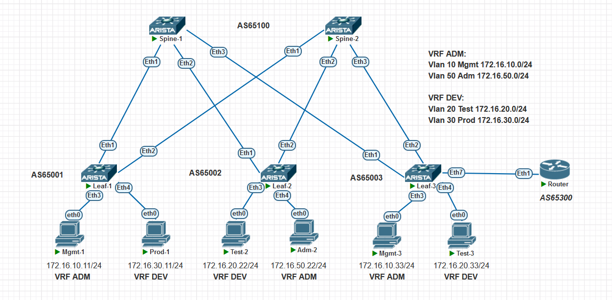

### Overlay. VxLAN EVPN Route-Type 5

### Цели:
- Настроить EVPN для передачи маршрутной информации через type-5 анонсы


### Описание выполнения лабораторной работы:
- Настроить анонс префиксов type-5. 
- Настроить маршрутизацию между подсетями в разных VRF через отдельнвый маршрутизатор.
- Проверить доступность между клиентами

### Физическая схема сети:


#### <u>Таблица Loopback0/Router-ID и ASn, настроенных на устройствах:</u>

|Device|IP Lo/Router-ID |ASn||
|:-:|:-:|:-:|:-:|
|Spine1|10.1.254.101|65100|
|Spine2|10.1.254.102|65100|
|Leaf1|10.1.254.1|65001|
|Leaf2|10.1.254.2|65002|
|Leaf3|10.1.254.3|65003|
|Router|172.16.0.0|65300|

#### <u>Таблица VTEP IP/AS устройствах:</u>

|Device|VTEP IP|ASn||
|:-:|:-:|:-:|:-:|
|Leaf1|10.1.254.1|65001|ESI|
|Leaf1|10.1.254.2|65002|ESI|
|Leaf3/4|10.1.254.203|65003|MLAG|
|Leaf5/6|10.1.254.204|65004|VLT|                                                              

#### <u>Таблица VLAN/VRF/Network:</u>

|Name|VLAN|Network|VRF|
|:-:|:-:|:-:|:-:|
|Mgmt|10|172.16.10.0/24|ADM|
|Test|20|172.16.20.0/24|DEV|
|Prod|30|172.16.30.0/24|DEV|
|Adm|50|172.16.50.0/24|ADM|


### Настройка:


```
#### <u>Настройка LEAF1:</u>
```
vlan 10,30

vrf instance ADM
vrf instance DEV

interface Vlan10
   no autostate
   vrf ADM
   ip address 172.16.10.1/24
!
interface Vlan30
   no autostate
   vrf DEV
   ip address 172.16.30.1/24

ip routing
ip routing vrf ADM
ip routing vrf DEV
 	
router bgp 65001

router bgp 65001
   router-id 10.1.254.1
   no bgp default ipv4-unicast
   timers bgp 1 3
   maximum-paths 4 ecmp 4
   neighbor EVPN peer group
   neighbor EVPN remote-as 65100
   neighbor EVPN update-source Loopback0
   neighbor EVPN bfd
   neighbor EVPN ebgp-multihop 3
   neighbor EVPN send-community extended
   neighbor SPINE peer group
   neighbor SPINE remote-as 65100
   neighbor SPINE bfd
   neighbor 10.1.1.0 peer group SPINE
   neighbor 10.1.2.0 peer group SPINE
   neighbor 10.1.254.101 peer group EVPN
   neighbor 10.1.254.102 peer group EVPN
   !
   vlan 10
      rd 65001:10
      route-target both 10:100010
      redistribute learned
   !
   vlan 30
      rd 65001:30
      route-target both 30:100030
      redistribute learned
   !
   address-family evpn
      neighbor EVPN activate
   !
   address-family ipv4
      neighbor SPINE activate
      network 10.1.254.1/32
   !
   vrf ADM
      rd 65001:888
      route-target import evpn 888:888
      route-target export evpn 888:888
      redistribute connected
   !
   vrf DEV
      rd 65001:999
      route-target import evpn 999:999
      route-target export evpn 999:999
      redistribute connected


```
#### <u>Настройка LEAF2:</u>
```
vlan 20,50

vrf instance ADM
vrf instance DEV

interface Vlan20
   no autostate
   vrf DEV
   ip address 172.16.20.1/24
!
interface Vlan50
   no autostate
   vrf ADM
   ip address 172.16.50.1/24


ip routing
ip routing vrf ADM
ip routing vrf DEV
!
router bgp 65002
   router-id 10.1.254.2
   no bgp default ipv4-unicast
   timers bgp 1 3
   maximum-paths 4 ecmp 4
   neighbor EVPN peer group
   neighbor EVPN remote-as 65100
   neighbor EVPN update-source Loopback0
   neighbor EVPN bfd
   neighbor EVPN ebgp-multihop 3
   neighbor EVPN send-community extended
   neighbor SPINE peer group
   neighbor SPINE remote-as 65100
   neighbor SPINE bfd
   neighbor 10.1.1.2 peer group SPINE
   neighbor 10.1.2.2 peer group SPINE
   neighbor 10.1.254.101 peer group EVPN
   neighbor 10.1.254.102 peer group EVPN
   !
   vlan 20
      rd 65002:20
      route-target both 20:100020
      redistribute learned
   !
   vlan 50
      rd 65002:50
      route-target both 50:100050
      redistribute learned
   !
   address-family evpn
      neighbor EVPN activate
   !
   address-family ipv4
      neighbor SPINE activate
      network 10.1.254.2/32
   !
   vrf ADM
      rd 65002:888
      route-target import evpn 888:888
      route-target export evpn 888:888
      redistribute connected
   !
   vrf DEV
      rd 65002:999
      route-target import evpn 999:999
      route-target export evpn 999:999
      redistribute connected

```
#### <u>Настройка LEAF3:</u>

```
vlan 10,20,100,200

vrf instance ADM
vrf instance DEV

interface Vlan10
   no autostate
   vrf ADM
   ip address 172.16.10.1/24
!
interface Vlan20
   no autostate
   vrf DEV
   ip address 172.16.20.1/24
!
interface Vlan100
   no autostate
   vrf ADM
   ip address 172.16.100.1/30
!
interface Vlan200
   no autostate
   vrf DEV
   ip address 172.16.200.1/30

ip routing
ip routing vrf ADM
ip routing vrf DEV


router bgp 65003
   router-id 10.1.254.3
   no bgp default ipv4-unicast
   timers bgp 1 3
   maximum-paths 4 ecmp 4
   neighbor EVPN peer group
   neighbor EVPN remote-as 65100
   neighbor EVPN update-source Loopback0
   neighbor EVPN bfd
   neighbor EVPN ebgp-multihop 3
   neighbor EVPN send-community extended
   neighbor SPINE peer group
   neighbor SPINE remote-as 65100
   neighbor SPINE bfd
   neighbor 10.1.1.4 peer group SPINE
   neighbor 10.1.2.4 peer group SPINE
   neighbor 10.1.254.101 peer group EVPN
   neighbor 10.1.254.102 peer group EVPN
   !
   vlan 10
      rd 65003:10
      route-target both 10:100010
      redistribute learned
   !
   vlan 20
      rd 65003:20
      route-target both 20:100020
      redistribute learned
   !
   address-family evpn
      neighbor EVPN activate
   !
   address-family ipv4
      neighbor SPINE activate
      network 10.1.254.3/32
   !
   vrf ADM
      rd 65003:888
      route-target import evpn 888:888
      route-target export evpn 888:888
      neighbor 172.16.100.2 remote-as 65300
      neighbor 172.16.100.2 bfd
      redistribute connected
      !
      address-family ipv4
         neighbor 172.16.100.2 activate
   !
   vrf DEV
      rd 65003:999
      route-target import evpn 999:999
      route-target export evpn 999:999
      neighbor 172.16.200.2 remote-as 65300
      neighbor 172.16.200.2 bfd
      redistribute connected
      !
      address-family ipv4
         neighbor 172.16.200.2 activate


```
#### <u>Router:</u>

```

vlan 100,200
!
interface Ethernet1
   description Leaf-3
   switchport mode trunk

interface Loopback0
   ip address 8.8.8.8/32

interface Vlan100
   ip address 172.16.100.2/30
!
interface Vlan200
   ip address 172.16.200.2/30
!
ip routing
!
route-map DEL-AS-PATH permit 10
   set as-path match all replacement none
!
router bgp 65300
   router-id 172.16.0.0
   timers bgp 1 3
   neighbor Leaf-3 peer group
   neighbor Leaf-3 remote-as 65003
   neighbor Leaf-3 bfd
   neighbor Leaf-3 route-map DEL-AS-PATH out
   neighbor 172.16.100.1 peer group Leaf-3
   neighbor 172.16.200.1 peer group Leaf-3
   network 8.8.8.8/32


```


### Проверка:

<details>
<summary>Проверка на Spine-1</summary>

```
Spine-1#show bgp evpn
BGP routing table information for VRF default
Router identifier 10.1.254.101, local AS number 65100
Route status codes: s - suppressed, * - valid, > - active, E - ECMP head, e - ECMP
                    S - Stale, c - Contributing to ECMP, b - backup
                    % - Pending BGP convergence
Origin codes: i - IGP, e - EGP, ? - incomplete
AS Path Attributes: Or-ID - Originator ID, C-LST - Cluster List, LL Nexthop - Link Local Nexthop

          Network                Next Hop              Metric  LocPref Weight  Path
 * >     RD: 65001:30 mac-ip 0050.7966.68aa
                                 10.1.254.1            -       100     0       65001 i
 * >     RD: 65001:30 mac-ip 0050.7966.68aa 172.16.30.11
                                 10.1.254.1            -       100     0       65001 i
 * >     RD: 65002:20 mac-ip 0050.7966.68ab
                                 10.1.254.2            -       100     0       65002 i
 * >     RD: 65002:20 mac-ip 0050.7966.68ab 172.16.20.22
                                 10.1.254.2            -       100     0       65002 i
 * >     RD: 65002:50 mac-ip 0050.7966.68ac
                                 10.1.254.2            -       100     0       65002 i
 * >     RD: 65002:50 mac-ip 0050.7966.68ac 172.16.50.22
                                 10.1.254.2            -       100     0       65002 i
 * >     RD: 65003:10 mac-ip 0050.7966.68ad
                                 10.1.254.3            -       100     0       65003 i
 * >     RD: 65003:10 mac-ip 0050.7966.68ad 172.16.10.33
                                 10.1.254.3            -       100     0       65003 i
 * >     RD: 65001:10 imet 10.1.254.1
                                 10.1.254.1            -       100     0       65001 i
 * >     RD: 65001:30 imet 10.1.254.1
                                 10.1.254.1            -       100     0       65001 i
 * >     RD: 65002:20 imet 10.1.254.2
                                 10.1.254.2            -       100     0       65002 i
 * >     RD: 65002:50 imet 10.1.254.2
                                 10.1.254.2            -       100     0       65002 i
 * >     RD: 65003:10 imet 10.1.254.3
                                 10.1.254.3            -       100     0       65003 i
 * >     RD: 65003:20 imet 10.1.254.3
                                 10.1.254.3            -       100     0       65003 i
 * >     RD: 65003:888 ip-prefix 8.8.8.8/32
                                 10.1.254.3            -       100     0       65003 65300 i
 * >     RD: 65003:999 ip-prefix 8.8.8.8/32
                                 10.1.254.3            -       100     0       65003 65300 i
 * >     RD: 65001:888 ip-prefix 172.16.10.0/24
                                 10.1.254.1            -       100     0       65001 i
 * >     RD: 65003:888 ip-prefix 172.16.10.0/24
                                 10.1.254.3            -       100     0       65003 i
 * >     RD: 65003:999 ip-prefix 172.16.10.0/24
                                 10.1.254.3            -       100     0       65003 65300 i
 * >     RD: 65002:999 ip-prefix 172.16.20.0/24
                                 10.1.254.2            -       100     0       65002 i
 * >     RD: 65003:888 ip-prefix 172.16.20.0/24
                                 10.1.254.3            -       100     0       65003 65300 i
 * >     RD: 65003:999 ip-prefix 172.16.20.0/24
                                 10.1.254.3            -       100     0       65003 i
 * >     RD: 65003:888 ip-prefix 172.16.20.22/32
                                 10.1.254.3            -       100     0       65003 65300 i
 * >     RD: 65001:999 ip-prefix 172.16.30.0/24
                                 10.1.254.1            -       100     0       65001 i
 * >     RD: 65003:888 ip-prefix 172.16.30.0/24
                                 10.1.254.3            -       100     0       65003 65300 i
 * >     RD: 65003:888 ip-prefix 172.16.30.11/32
                                 10.1.254.3            -       100     0       65003 65300 i
 * >     RD: 65002:888 ip-prefix 172.16.50.0/24
                                 10.1.254.2            -       100     0       65002 i
 * >     RD: 65003:999 ip-prefix 172.16.50.0/24
                                 10.1.254.3            -       100     0       65003 65300 i
 * >     RD: 65003:999 ip-prefix 172.16.50.22/32
                                 10.1.254.3            -       100     0       65003 65300 i
 * >     RD: 65003:888 ip-prefix 172.16.100.0/30
                                 10.1.254.3            -       100     0       65003 i
 * >     RD: 65003:999 ip-prefix 172.16.200.0/30
                                 10.1.254.3            -       100     0       65003 i
Spine-1#

```
</details>
<details>
<summary>Проверка на Spine-2</summary>

```

Spine-2#show bgp evpn
BGP routing table information for VRF default
Router identifier 10.1.254.102, local AS number 65100
Route status codes: s - suppressed, * - valid, > - active, E - ECMP head, e - ECMP
                    S - Stale, c - Contributing to ECMP, b - backup
                    % - Pending BGP convergence
Origin codes: i - IGP, e - EGP, ? - incomplete
AS Path Attributes: Or-ID - Originator ID, C-LST - Cluster List, LL Nexthop - Link Local Nexthop

          Network                Next Hop              Metric  LocPref Weight  Path
 * >     RD: 65001:10 imet 10.1.254.1
                                 10.1.254.1            -       100     0       65001 i
 * >     RD: 65001:30 imet 10.1.254.1
                                 10.1.254.1            -       100     0       65001 i
 * >     RD: 65002:20 imet 10.1.254.2
                                 10.1.254.2            -       100     0       65002 i
 * >     RD: 65002:50 imet 10.1.254.2
                                 10.1.254.2            -       100     0       65002 i
 * >     RD: 65003:10 imet 10.1.254.3
                                 10.1.254.3            -       100     0       65003 i
 * >     RD: 65003:20 imet 10.1.254.3
                                 10.1.254.3            -       100     0       65003 i
 * >     RD: 65003:888 ip-prefix 8.8.8.8/32
                                 10.1.254.3            -       100     0       65003 65300 i
 * >     RD: 65003:999 ip-prefix 8.8.8.8/32
                                 10.1.254.3            -       100     0       65003 65300 i
 * >     RD: 65001:888 ip-prefix 172.16.10.0/24
                                 10.1.254.1            -       100     0       65001 i
 * >     RD: 65003:888 ip-prefix 172.16.10.0/24
                                 10.1.254.3            -       100     0       65003 i
 * >     RD: 65003:999 ip-prefix 172.16.10.0/24
                                 10.1.254.3            -       100     0       65003 65300 i
 * >     RD: 65002:999 ip-prefix 172.16.20.0/24
                                 10.1.254.2            -       100     0       65002 i
 * >     RD: 65003:888 ip-prefix 172.16.20.0/24
                                 10.1.254.3            -       100     0       65003 65300 i
 * >     RD: 65003:999 ip-prefix 172.16.20.0/24
                                 10.1.254.3            -       100     0       65003 i
 * >     RD: 65001:999 ip-prefix 172.16.30.0/24
                                 10.1.254.1            -       100     0       65001 i
 * >     RD: 65003:888 ip-prefix 172.16.30.0/24
                                 10.1.254.3            -       100     0       65003 65300 i
 * >     RD: 65002:888 ip-prefix 172.16.50.0/24
                                 10.1.254.2            -       100     0       65002 i
 * >     RD: 65003:999 ip-prefix 172.16.50.0/24
                                 10.1.254.3            -       100     0       65003 65300 i
 * >     RD: 65003:888 ip-prefix 172.16.100.0/30
                                 10.1.254.3            -       100     0       65003 i
 * >     RD: 65003:999 ip-prefix 172.16.200.0/30
                                 10.1.254.3            -       100     0       65003 i
Spine-2#

```
</details>
<details>
<summary>Проверка на LEAF1</summary>

```
Leaf-1#show bgp evpn
BGP routing table information for VRF default
Router identifier 10.1.254.1, local AS number 65001
Route status codes: s - suppressed, * - valid, > - active, E - ECMP head, e - ECMP
                    S - Stale, c - Contributing to ECMP, b - backup
                    % - Pending BGP convergence
Origin codes: i - IGP, e - EGP, ? - incomplete
AS Path Attributes: Or-ID - Originator ID, C-LST - Cluster List, LL Nexthop - Link Local Nexthop

          Network                Next Hop              Metric  LocPref Weight  Path
 * >     RD: 65001:10 mac-ip 0050.7966.68a9
                                 -                     -       -       0       i
 * >     RD: 65001:10 mac-ip 0050.7966.68a9 172.16.10.11
                                 -                     -       -       0       i
 * >     RD: 65001:30 mac-ip 0050.7966.68aa
                                 -                     -       -       0       i
 * >     RD: 65001:30 mac-ip 0050.7966.68aa 172.16.30.11
                                 -                     -       -       0       i
 * >Ec   RD: 65002:20 mac-ip 0050.7966.68ab
                                 10.1.254.2            -       100     0       65100 65002 i
 *  ec   RD: 65002:20 mac-ip 0050.7966.68ab
                                 10.1.254.2            -       100     0       65100 65002 i
 * >Ec   RD: 65002:20 mac-ip 0050.7966.68ab 172.16.20.22
                                 10.1.254.2            -       100     0       65100 65002 i
 *  ec   RD: 65002:20 mac-ip 0050.7966.68ab 172.16.20.22
                                 10.1.254.2            -       100     0       65100 65002 i
 * >Ec   RD: 65002:50 mac-ip 0050.7966.68ac
                                 10.1.254.2            -       100     0       65100 65002 i
 *  ec   RD: 65002:50 mac-ip 0050.7966.68ac
                                 10.1.254.2            -       100     0       65100 65002 i
 * >Ec   RD: 65002:50 mac-ip 0050.7966.68ac 172.16.50.22
                                 10.1.254.2            -       100     0       65100 65002 i
 *  ec   RD: 65002:50 mac-ip 0050.7966.68ac 172.16.50.22
                                 10.1.254.2            -       100     0       65100 65002 i
 * >Ec   RD: 65003:10 mac-ip 0050.7966.68ad
                                 10.1.254.3            -       100     0       65100 65003 i
 *  ec   RD: 65003:10 mac-ip 0050.7966.68ad
                                 10.1.254.3            -       100     0       65100 65003 i
 * >Ec   RD: 65003:10 mac-ip 0050.7966.68ad 172.16.10.33
                                 10.1.254.3            -       100     0       65100 65003 i
 *  ec   RD: 65003:10 mac-ip 0050.7966.68ad 172.16.10.33
                                 10.1.254.3            -       100     0       65100 65003 i
 * >Ec   RD: 65003:20 mac-ip 0050.7966.68ae
                                 10.1.254.3            -       100     0       65100 65003 i
 *  ec   RD: 65003:20 mac-ip 0050.7966.68ae
                                 10.1.254.3            -       100     0       65100 65003 i
 * >Ec   RD: 65003:20 mac-ip 0050.7966.68ae 172.16.20.33
                                 10.1.254.3            -       100     0       65100 65003 i
 *  ec   RD: 65003:20 mac-ip 0050.7966.68ae 172.16.20.33
                                 10.1.254.3            -       100     0       65100 65003 i
 * >     RD: 65001:10 imet 10.1.254.1
                                 -                     -       -       0       i
 * >     RD: 65001:30 imet 10.1.254.1
                                 -                     -       -       0       i
 * >Ec   RD: 65002:20 imet 10.1.254.2
                                 10.1.254.2            -       100     0       65100 65002 i
 *  ec   RD: 65002:20 imet 10.1.254.2
                                 10.1.254.2            -       100     0       65100 65002 i
 * >Ec   RD: 65002:50 imet 10.1.254.2
                                 10.1.254.2            -       100     0       65100 65002 i
 *  ec   RD: 65002:50 imet 10.1.254.2
                                 10.1.254.2            -       100     0       65100 65002 i
 * >Ec   RD: 65003:10 imet 10.1.254.3
                                 10.1.254.3            -       100     0       65100 65003 i
 *  ec   RD: 65003:10 imet 10.1.254.3
                                 10.1.254.3            -       100     0       65100 65003 i
 * >Ec   RD: 65003:20 imet 10.1.254.3
                                 10.1.254.3            -       100     0       65100 65003 i
 *  ec   RD: 65003:20 imet 10.1.254.3
                                 10.1.254.3            -       100     0       65100 65003 i
 * >Ec   RD: 65003:888 ip-prefix 8.8.8.8/32
                                 10.1.254.3            -       100     0       65100 65003 65300 i
 *  ec   RD: 65003:888 ip-prefix 8.8.8.8/32
                                 10.1.254.3            -       100     0       65100 65003 65300 i
 * >Ec   RD: 65003:999 ip-prefix 8.8.8.8/32
                                 10.1.254.3            -       100     0       65100 65003 65300 i
 *  ec   RD: 65003:999 ip-prefix 8.8.8.8/32
                                 10.1.254.3            -       100     0       65100 65003 65300 i
 * >     RD: 65001:888 ip-prefix 172.16.10.0/24
                                 -                     -       -       0       i
 * >Ec   RD: 65003:888 ip-prefix 172.16.10.0/24
                                 10.1.254.3            -       100     0       65100 65003 i
 *  ec   RD: 65003:888 ip-prefix 172.16.10.0/24
                                 10.1.254.3            -       100     0       65100 65003 i
 * >Ec   RD: 65003:999 ip-prefix 172.16.10.0/24
                                 10.1.254.3            -       100     0       65100 65003 65300 i
 *  ec   RD: 65003:999 ip-prefix 172.16.10.0/24
                                 10.1.254.3            -       100     0       65100 65003 65300 i
 * >Ec   RD: 65003:999 ip-prefix 172.16.10.11/32
                                 10.1.254.3            -       100     0       65100 65003 65300 i
 *  ec   RD: 65003:999 ip-prefix 172.16.10.11/32
                                 10.1.254.3            -       100     0       65100 65003 65300 i
 * >Ec   RD: 65002:999 ip-prefix 172.16.20.0/24
                                 10.1.254.2            -       100     0       65100 65002 i
 *  ec   RD: 65002:999 ip-prefix 172.16.20.0/24
                                 10.1.254.2            -       100     0       65100 65002 i
 * >Ec   RD: 65003:888 ip-prefix 172.16.20.0/24
                                 10.1.254.3            -       100     0       65100 65003 65300 i
 *  ec   RD: 65003:888 ip-prefix 172.16.20.0/24
                                 10.1.254.3            -       100     0       65100 65003 65300 i
 * >Ec   RD: 65003:999 ip-prefix 172.16.20.0/24
                                 10.1.254.3            -       100     0       65100 65003 i
 *  ec   RD: 65003:999 ip-prefix 172.16.20.0/24
                                 10.1.254.3            -       100     0       65100 65003 i
 * >Ec   RD: 65003:888 ip-prefix 172.16.20.22/32
                                 10.1.254.3            -       100     0       65100 65003 65300 i
 *  ec   RD: 65003:888 ip-prefix 172.16.20.22/32
                                 10.1.254.3            -       100     0       65100 65003 65300 i
 * >     RD: 65001:999 ip-prefix 172.16.30.0/24
                                 -                     -       -       0       i
 * >Ec   RD: 65003:888 ip-prefix 172.16.30.0/24
                                 10.1.254.3            -       100     0       65100 65003 65300 i
 *  ec   RD: 65003:888 ip-prefix 172.16.30.0/24
                                 10.1.254.3            -       100     0       65100 65003 65300 i
 * >Ec   RD: 65003:888 ip-prefix 172.16.30.11/32
                                 10.1.254.3            -       100     0       65100 65003 65300 i
 *  ec   RD: 65003:888 ip-prefix 172.16.30.11/32
                                 10.1.254.3            -       100     0       65100 65003 65300 i
 * >Ec   RD: 65002:888 ip-prefix 172.16.50.0/24
                                 10.1.254.2            -       100     0       65100 65002 i
 *  ec   RD: 65002:888 ip-prefix 172.16.50.0/24
                                 10.1.254.2            -       100     0       65100 65002 i
 * >Ec   RD: 65003:999 ip-prefix 172.16.50.0/24
                                 10.1.254.3            -       100     0       65100 65003 65300 i
 *  ec   RD: 65003:999 ip-prefix 172.16.50.0/24
                                 10.1.254.3            -       100     0       65100 65003 65300 i
 * >Ec   RD: 65003:999 ip-prefix 172.16.50.22/32
                                 10.1.254.3            -       100     0       65100 65003 65300 i
 *  ec   RD: 65003:999 ip-prefix 172.16.50.22/32
                                 10.1.254.3            -       100     0       65100 65003 65300 i
 * >Ec   RD: 65003:888 ip-prefix 172.16.100.0/30
                                 10.1.254.3            -       100     0       65100 65003 i
 *  ec   RD: 65003:888 ip-prefix 172.16.100.0/30
                                 10.1.254.3            -       100     0       65100 65003 i
 * >Ec   RD: 65003:999 ip-prefix 172.16.200.0/30
                                 10.1.254.3            -       100     0       65100 65003 i
 *  ec   RD: 65003:999 ip-prefix 172.16.200.0/30
                                 10.1.254.3            -       100     0       65100 65003 i
Leaf-1#

Leaf-1#show ip route vrf all

VRF: default
Codes: C - connected, S - static, K - kernel,
       O - OSPF, IA - OSPF inter area, E1 - OSPF external type 1,
       E2 - OSPF external type 2, N1 - OSPF NSSA external type 1,
       N2 - OSPF NSSA external type2, B - BGP, B I - iBGP, B E - eBGP,
       R - RIP, I L1 - IS-IS level 1, I L2 - IS-IS level 2,
       O3 - OSPFv3, A B - BGP Aggregate, A O - OSPF Summary,
       NG - Nexthop Group Static Route, V - VXLAN Control Service,
       DH - DHCP client installed default route, M - Martian,
       DP - Dynamic Policy Route, L - VRF Leaked,
       G  - gRIBI, RC - Route Cache Route

Gateway of last resort is not set

 C        10.1.1.0/31 is directly connected, Ethernet1
 C        10.1.2.0/31 is directly connected, Ethernet2
 C        10.1.254.1/32 is directly connected, Loopback0
 B E      10.1.254.2/32 [200/0] via 10.1.1.0, Ethernet1
                                via 10.1.2.0, Ethernet2
 B E      10.1.254.3/32 [200/0] via 10.1.1.0, Ethernet1
                                via 10.1.2.0, Ethernet2
 B E      10.1.254.101/32 [200/0] via 10.1.1.0, Ethernet1
 B E      10.1.254.102/32 [200/0] via 10.1.2.0, Ethernet2


VRF: ADM
Codes: C - connected, S - static, K - kernel,
       O - OSPF, IA - OSPF inter area, E1 - OSPF external type 1,
       E2 - OSPF external type 2, N1 - OSPF NSSA external type 1,
       N2 - OSPF NSSA external type2, B - BGP, B I - iBGP, B E - eBGP,
       R - RIP, I L1 - IS-IS level 1, I L2 - IS-IS level 2,
       O3 - OSPFv3, A B - BGP Aggregate, A O - OSPF Summary,
       NG - Nexthop Group Static Route, V - VXLAN Control Service,
       DH - DHCP client installed default route, M - Martian,
       DP - Dynamic Policy Route, L - VRF Leaked,
       G  - gRIBI, RC - Route Cache Route

Gateway of last resort is not set

 B E      8.8.8.8/32 [200/0] via VTEP 10.1.254.3 VNI 888 router-mac 50:5b:d8:15:48:a3 local-interface Vxlan1
 B E      172.16.10.33/32 [200/0] via VTEP 10.1.254.3 VNI 888 router-mac 50:5b:d8:15:48:a3 local-interface Vxlan1
 C        172.16.10.0/24 is directly connected, Vlan10
 B E      172.16.20.22/32 [200/0] via VTEP 10.1.254.3 VNI 888 router-mac 50:5b:d8:15:48:a3 local-interface Vxlan1
 B E      172.16.20.0/24 [200/0] via VTEP 10.1.254.3 VNI 888 router-mac 50:5b:d8:15:48:a3 local-interface Vxlan1
 B E      172.16.30.11/32 [200/0] via VTEP 10.1.254.3 VNI 888 router-mac 50:5b:d8:15:48:a3 local-interface Vxlan1
 B E      172.16.30.0/24 [200/0] via VTEP 10.1.254.3 VNI 888 router-mac 50:5b:d8:15:48:a3 local-interface Vxlan1
 B E      172.16.50.22/32 [200/0] via VTEP 10.1.254.2 VNI 888 router-mac 50:aa:28:c1:1f:a0 local-interface Vxlan1
 B E      172.16.50.0/24 [200/0] via VTEP 10.1.254.2 VNI 888 router-mac 50:aa:28:c1:1f:a0 local-interface Vxlan1
 B E      172.16.100.0/30 [200/0] via VTEP 10.1.254.3 VNI 888 router-mac 50:5b:d8:15:48:a3 local-interface Vxlan1


VRF: DEV
Codes: C - connected, S - static, K - kernel,
       O - OSPF, IA - OSPF inter area, E1 - OSPF external type 1,
       E2 - OSPF external type 2, N1 - OSPF NSSA external type 1,
       N2 - OSPF NSSA external type2, B - BGP, B I - iBGP, B E - eBGP,
       R - RIP, I L1 - IS-IS level 1, I L2 - IS-IS level 2,
       O3 - OSPFv3, A B - BGP Aggregate, A O - OSPF Summary,
       NG - Nexthop Group Static Route, V - VXLAN Control Service,
       DH - DHCP client installed default route, M - Martian,
       DP - Dynamic Policy Route, L - VRF Leaked,
       G  - gRIBI, RC - Route Cache Route

Gateway of last resort is not set

 B E      8.8.8.8/32 [200/0] via VTEP 10.1.254.3 VNI 999 router-mac 50:5b:d8:15:48:a3 local-interface Vxlan1
 B E      172.16.10.11/32 [200/0] via VTEP 10.1.254.3 VNI 999 router-mac 50:5b:d8:15:48:a3 local-interface Vxlan1
 B E      172.16.10.0/24 [200/0] via VTEP 10.1.254.3 VNI 999 router-mac 50:5b:d8:15:48:a3 local-interface Vxlan1
 B E      172.16.20.22/32 [200/0] via VTEP 10.1.254.2 VNI 999 router-mac 50:aa:28:c1:1f:a0 local-interface Vxlan1
 B E      172.16.20.33/32 [200/0] via VTEP 10.1.254.3 VNI 999 router-mac 50:5b:d8:15:48:a3 local-interface Vxlan1
 B E      172.16.20.0/24 [200/0] via VTEP 10.1.254.3 VNI 999 router-mac 50:5b:d8:15:48:a3 local-interface Vxlan1
                                 via VTEP 10.1.254.2 VNI 999 router-mac 50:aa:28:c1:1f:a0 local-interface Vxlan1
 C        172.16.30.0/24 is directly connected, Vlan30
 B E      172.16.50.22/32 [200/0] via VTEP 10.1.254.3 VNI 999 router-mac 50:5b:d8:15:48:a3 local-interface Vxlan1
 B E      172.16.50.0/24 [200/0] via VTEP 10.1.254.3 VNI 999 router-mac 50:5b:d8:15:48:a3 local-interface Vxlan1
 B E      172.16.200.0/30 [200/0] via VTEP 10.1.254.3 VNI 999 router-mac 50:5b:d8:15:48:a3 local-interface Vxlan1

Leaf-1#
Leaf-1#show ip bgp vrf ADM
BGP routing table information for VRF ADM
Router identifier 172.16.10.1, local AS number 65001
Route status codes: s - suppressed, * - valid, > - active, E - ECMP head, e - ECMP
                    S - Stale, c - Contributing to ECMP, b - backup, L - labeled-unicast
                    % - Pending BGP convergence
Origin codes: i - IGP, e - EGP, ? - incomplete
RPKI Origin Validation codes: V - valid, I - invalid, U - unknown
AS Path Attributes: Or-ID - Originator ID, C-LST - Cluster List, LL Nexthop - Link Local Nexthop

          Network                Next Hop              Metric  AIGP       LocPref Weight  Path
 * >Ec    8.8.8.8/32             10.1.254.3            0       -          100     0       65100 65003 65300 i
 *  ec    8.8.8.8/32             10.1.254.3            0       -          100     0       65100 65003 65300 i
 * >      172.16.10.0/24         -                     -       -          -       0       i
 *  Ec    172.16.10.0/24         10.1.254.3            0       -          100     0       65100 65003 i
 *  ec    172.16.10.0/24         10.1.254.3            0       -          100     0       65100 65003 i
 * >Ec    172.16.10.33/32        10.1.254.3            0       -          100     0       65100 65003 i
 *  ec    172.16.10.33/32        10.1.254.3            0       -          100     0       65100 65003 i
 * >Ec    172.16.20.0/24         10.1.254.3            0       -          100     0       65100 65003 65300 i
 *  ec    172.16.20.0/24         10.1.254.3            0       -          100     0       65100 65003 65300 i
 * >Ec    172.16.20.22/32        10.1.254.3            0       -          100     0       65100 65003 65300 i
 *  ec    172.16.20.22/32        10.1.254.3            0       -          100     0       65100 65003 65300 i
 * >Ec    172.16.30.0/24         10.1.254.3            0       -          100     0       65100 65003 65300 i
 *  ec    172.16.30.0/24         10.1.254.3            0       -          100     0       65100 65003 65300 i
 * >Ec    172.16.30.11/32        10.1.254.3            0       -          100     0       65100 65003 65300 i
 *  ec    172.16.30.11/32        10.1.254.3            0       -          100     0       65100 65003 65300 i
 * >Ec    172.16.50.0/24         10.1.254.2            0       -          100     0       65100 65002 i
 *  ec    172.16.50.0/24         10.1.254.2            0       -          100     0       65100 65002 i
 * >Ec    172.16.50.22/32        10.1.254.2            0       -          100     0       65100 65002 i
 *  ec    172.16.50.22/32        10.1.254.2            0       -          100     0       65100 65002 i
 * >Ec    172.16.100.0/30        10.1.254.3            0       -          100     0       65100 65003 i
 *  ec    172.16.100.0/30        10.1.254.3            0       -          100     0       65100 65003 i
Leaf-1#show ip bgp vrf DEV
BGP routing table information for VRF DEV
Router identifier 172.16.30.1, local AS number 65001
Route status codes: s - suppressed, * - valid, > - active, E - ECMP head, e - ECMP
                    S - Stale, c - Contributing to ECMP, b - backup, L - labeled-unicast
                    % - Pending BGP convergence
Origin codes: i - IGP, e - EGP, ? - incomplete
RPKI Origin Validation codes: V - valid, I - invalid, U - unknown
AS Path Attributes: Or-ID - Originator ID, C-LST - Cluster List, LL Nexthop - Link Local Nexthop

          Network                Next Hop              Metric  AIGP       LocPref Weight  Path
 * >Ec    8.8.8.8/32             10.1.254.3            0       -          100     0       65100 65003 65300 i
 *  ec    8.8.8.8/32             10.1.254.3            0       -          100     0       65100 65003 65300 i
 * >Ec    172.16.10.0/24         10.1.254.3            0       -          100     0       65100 65003 65300 i
 *  ec    172.16.10.0/24         10.1.254.3            0       -          100     0       65100 65003 65300 i
 * >Ec    172.16.10.11/32        10.1.254.3            0       -          100     0       65100 65003 65300 i
 *  ec    172.16.10.11/32        10.1.254.3            0       -          100     0       65100 65003 65300 i
 * >Ec    172.16.20.0/24         10.1.254.3            0       -          100     0       65100 65003 i
 *  ec    172.16.20.0/24         10.1.254.3            0       -          100     0       65100 65003 i
 *  ec    172.16.20.0/24         10.1.254.2            0       -          100     0       65100 65002 i
 *  ec    172.16.20.0/24         10.1.254.2            0       -          100     0       65100 65002 i
 * >Ec    172.16.20.22/32        10.1.254.2            0       -          100     0       65100 65002 i
 *  ec    172.16.20.22/32        10.1.254.2            0       -          100     0       65100 65002 i
 * >Ec    172.16.20.33/32        10.1.254.3            0       -          100     0       65100 65003 i
 *  ec    172.16.20.33/32        10.1.254.3            0       -          100     0       65100 65003 i
 * >      172.16.30.0/24         -                     -       -          -       0       i
 * >Ec    172.16.50.0/24         10.1.254.3            0       -          100     0       65100 65003 65300 i
 *  ec    172.16.50.0/24         10.1.254.3            0       -          100     0       65100 65003 65300 i
 * >Ec    172.16.50.22/32        10.1.254.3            0       -          100     0       65100 65003 65300 i
 *  ec    172.16.50.22/32        10.1.254.3            0       -          100     0       65100 65003 65300 i
 * >Ec    172.16.200.0/30        10.1.254.3            0       -          100     0       65100 65003 i
 *  ec    172.16.200.0/30        10.1.254.3            0       -          100     0       65100 65003 i


```
</details>
<details>
<summary>Проверка на LEAF2</summary>

```

Leaf-2#show bgp evpn
BGP routing table information for VRF default
Router identifier 10.1.254.2, local AS number 65002
Route status codes: s - suppressed, * - valid, > - active, E - ECMP head, e - ECMP
                    S - Stale, c - Contributing to ECMP, b - backup
                    % - Pending BGP convergence
Origin codes: i - IGP, e - EGP, ? - incomplete
AS Path Attributes: Or-ID - Originator ID, C-LST - Cluster List, LL Nexthop - Link Local Nexthop

          Network                Next Hop              Metric  LocPref Weight  Path
 * >Ec   RD: 65001:30 mac-ip 0050.7966.68aa
                                 10.1.254.1            -       100     0       65100 65001 i
 *  ec   RD: 65001:30 mac-ip 0050.7966.68aa
                                 10.1.254.1            -       100     0       65100 65001 i
 * >Ec   RD: 65001:30 mac-ip 0050.7966.68aa 172.16.30.11
                                 10.1.254.1            -       100     0       65100 65001 i
 *  ec   RD: 65001:30 mac-ip 0050.7966.68aa 172.16.30.11
                                 10.1.254.1            -       100     0       65100 65001 i
 * >     RD: 65002:20 mac-ip 0050.7966.68ab
                                 -                     -       -       0       i
 * >     RD: 65002:20 mac-ip 0050.7966.68ab 172.16.20.22
                                 -                     -       -       0       i
 * >     RD: 65002:50 mac-ip 0050.7966.68ac
                                 -                     -       -       0       i
 * >     RD: 65002:50 mac-ip 0050.7966.68ac 172.16.50.22
                                 -                     -       -       0       i
 * >Ec   RD: 65003:10 mac-ip 0050.7966.68ad
                                 10.1.254.3            -       100     0       65100 65003 i
 *  ec   RD: 65003:10 mac-ip 0050.7966.68ad
                                 10.1.254.3            -       100     0       65100 65003 i
 * >Ec   RD: 65003:10 mac-ip 0050.7966.68ad 172.16.10.33
                                 10.1.254.3            -       100     0       65100 65003 i
 *  ec   RD: 65003:10 mac-ip 0050.7966.68ad 172.16.10.33
                                 10.1.254.3            -       100     0       65100 65003 i
 * >Ec   RD: 65003:20 mac-ip 0050.7966.68ae
                                 10.1.254.3            -       100     0       65100 65003 i
 *  ec   RD: 65003:20 mac-ip 0050.7966.68ae
                                 10.1.254.3            -       100     0       65100 65003 i
 * >Ec   RD: 65003:20 mac-ip 0050.7966.68ae 172.16.20.33
                                 10.1.254.3            -       100     0       65100 65003 i
 *  ec   RD: 65003:20 mac-ip 0050.7966.68ae 172.16.20.33
                                 10.1.254.3            -       100     0       65100 65003 i
 * >Ec   RD: 65001:10 imet 10.1.254.1
                                 10.1.254.1            -       100     0       65100 65001 i
 *  ec   RD: 65001:10 imet 10.1.254.1
                                 10.1.254.1            -       100     0       65100 65001 i
 * >Ec   RD: 65001:30 imet 10.1.254.1
                                 10.1.254.1            -       100     0       65100 65001 i
 *  ec   RD: 65001:30 imet 10.1.254.1
                                 10.1.254.1            -       100     0       65100 65001 i
 * >     RD: 65002:20 imet 10.1.254.2
                                 -                     -       -       0       i
 * >     RD: 65002:50 imet 10.1.254.2
                                 -                     -       -       0       i
 * >Ec   RD: 65003:10 imet 10.1.254.3
                                 10.1.254.3            -       100     0       65100 65003 i
 *  ec   RD: 65003:10 imet 10.1.254.3
                                 10.1.254.3            -       100     0       65100 65003 i
 * >Ec   RD: 65003:20 imet 10.1.254.3
                                 10.1.254.3            -       100     0       65100 65003 i
 *  ec   RD: 65003:20 imet 10.1.254.3
                                 10.1.254.3            -       100     0       65100 65003 i
 * >Ec   RD: 65003:888 ip-prefix 8.8.8.8/32
                                 10.1.254.3            -       100     0       65100 65003 65300 i
 *  ec   RD: 65003:888 ip-prefix 8.8.8.8/32
                                 10.1.254.3            -       100     0       65100 65003 65300 i
 * >Ec   RD: 65003:999 ip-prefix 8.8.8.8/32
                                 10.1.254.3            -       100     0       65100 65003 65300 i
 *  ec   RD: 65003:999 ip-prefix 8.8.8.8/32
                                 10.1.254.3            -       100     0       65100 65003 65300 i
 * >Ec   RD: 65001:888 ip-prefix 172.16.10.0/24
                                 10.1.254.1            -       100     0       65100 65001 i
 *  ec   RD: 65001:888 ip-prefix 172.16.10.0/24
                                 10.1.254.1            -       100     0       65100 65001 i
 * >Ec   RD: 65003:888 ip-prefix 172.16.10.0/24
                                 10.1.254.3            -       100     0       65100 65003 i
 *  ec   RD: 65003:888 ip-prefix 172.16.10.0/24
                                 10.1.254.3            -       100     0       65100 65003 i
 * >Ec   RD: 65003:999 ip-prefix 172.16.10.0/24
                                 10.1.254.3            -       100     0       65100 65003 65300 i
 *  ec   RD: 65003:999 ip-prefix 172.16.10.0/24
                                 10.1.254.3            -       100     0       65100 65003 65300 i
 * >     RD: 65002:999 ip-prefix 172.16.20.0/24
                                 -                     -       -       0       i
 * >Ec   RD: 65003:888 ip-prefix 172.16.20.0/24
                                 10.1.254.3            -       100     0       65100 65003 65300 i
 *  ec   RD: 65003:888 ip-prefix 172.16.20.0/24
                                 10.1.254.3            -       100     0       65100 65003 65300 i
 * >Ec   RD: 65003:999 ip-prefix 172.16.20.0/24
                                 10.1.254.3            -       100     0       65100 65003 i
 *  ec   RD: 65003:999 ip-prefix 172.16.20.0/24
                                 10.1.254.3            -       100     0       65100 65003 i
 * >Ec   RD: 65003:888 ip-prefix 172.16.20.22/32
                                 10.1.254.3            -       100     0       65100 65003 65300 i
 *  ec   RD: 65003:888 ip-prefix 172.16.20.22/32
                                 10.1.254.3            -       100     0       65100 65003 65300 i
 * >Ec   RD: 65001:999 ip-prefix 172.16.30.0/24
                                 10.1.254.1            -       100     0       65100 65001 i
 *  ec   RD: 65001:999 ip-prefix 172.16.30.0/24
                                 10.1.254.1            -       100     0       65100 65001 i
 * >Ec   RD: 65003:888 ip-prefix 172.16.30.0/24
                                 10.1.254.3            -       100     0       65100 65003 65300 i
 *  ec   RD: 65003:888 ip-prefix 172.16.30.0/24
                                 10.1.254.3            -       100     0       65100 65003 65300 i
 * >Ec   RD: 65003:888 ip-prefix 172.16.30.11/32
                                 10.1.254.3            -       100     0       65100 65003 65300 i
 *  ec   RD: 65003:888 ip-prefix 172.16.30.11/32
                                 10.1.254.3            -       100     0       65100 65003 65300 i
 * >     RD: 65002:888 ip-prefix 172.16.50.0/24
                                 -                     -       -       0       i
 * >Ec   RD: 65003:999 ip-prefix 172.16.50.0/24
                                 10.1.254.3            -       100     0       65100 65003 65300 i
 *  ec   RD: 65003:999 ip-prefix 172.16.50.0/24
                                 10.1.254.3            -       100     0       65100 65003 65300 i
 * >Ec   RD: 65003:999 ip-prefix 172.16.50.22/32
                                 10.1.254.3            -       100     0       65100 65003 65300 i
 *  ec   RD: 65003:999 ip-prefix 172.16.50.22/32
                                 10.1.254.3            -       100     0       65100 65003 65300 i
 * >Ec   RD: 65003:888 ip-prefix 172.16.100.0/30
                                 10.1.254.3            -       100     0       65100 65003 i
 *  ec   RD: 65003:888 ip-prefix 172.16.100.0/30
                                 10.1.254.3            -       100     0       65100 65003 i
 * >Ec   RD: 65003:999 ip-prefix 172.16.200.0/30
                                 10.1.254.3            -       100     0       65100 65003 i
 *  ec   RD: 65003:999 ip-prefix 172.16.200.0/30
                                 10.1.254.3            -       100     0       65100 65003 i
Leaf-2#

Leaf-2#show ip route vrf all

VRF: default
Codes: C - connected, S - static, K - kernel,
       O - OSPF, IA - OSPF inter area, E1 - OSPF external type 1,
       E2 - OSPF external type 2, N1 - OSPF NSSA external type 1,
       N2 - OSPF NSSA external type2, B - BGP, B I - iBGP, B E - eBGP,
       R - RIP, I L1 - IS-IS level 1, I L2 - IS-IS level 2,
       O3 - OSPFv3, A B - BGP Aggregate, A O - OSPF Summary,
       NG - Nexthop Group Static Route, V - VXLAN Control Service,
       DH - DHCP client installed default route, M - Martian,
       DP - Dynamic Policy Route, L - VRF Leaked,
       G  - gRIBI, RC - Route Cache Route

Gateway of last resort is not set

 C        10.1.1.2/31 is directly connected, Ethernet1
 C        10.1.2.2/31 is directly connected, Ethernet2
 B E      10.1.254.1/32 [200/0] via 10.1.1.2, Ethernet1
                                via 10.1.2.2, Ethernet2
 B E      10.1.254.3/32 [200/0] via 10.1.1.2, Ethernet1
                                via 10.1.2.2, Ethernet2
 C        10.1.254.2/31 is directly connected, Loopback0
 B E      10.1.254.101/32 [200/0] via 10.1.1.2, Ethernet1
 B E      10.1.254.102/32 [200/0] via 10.1.2.2, Ethernet2


VRF: ADM
Codes: C - connected, S - static, K - kernel,
       O - OSPF, IA - OSPF inter area, E1 - OSPF external type 1,
       E2 - OSPF external type 2, N1 - OSPF NSSA external type 1,
       N2 - OSPF NSSA external type2, B - BGP, B I - iBGP, B E - eBGP,
       R - RIP, I L1 - IS-IS level 1, I L2 - IS-IS level 2,
       O3 - OSPFv3, A B - BGP Aggregate, A O - OSPF Summary,
       NG - Nexthop Group Static Route, V - VXLAN Control Service,
       DH - DHCP client installed default route, M - Martian,
       DP - Dynamic Policy Route, L - VRF Leaked,
       G  - gRIBI, RC - Route Cache Route

Gateway of last resort is not set

 B E      8.8.8.8/32 [200/0] via VTEP 10.1.254.3 VNI 888 router-mac 50:5b:d8:15:48:a3 local-interface Vxlan1
 B E      172.16.10.33/32 [200/0] via VTEP 10.1.254.3 VNI 888 router-mac 50:5b:d8:15:48:a3 local-interface Vxlan1
 B E      172.16.10.0/24 [200/0] via VTEP 10.1.254.1 VNI 888 router-mac 50:0b:c4:64:e6:2a local-interface Vxlan1
                                 via VTEP 10.1.254.3 VNI 888 router-mac 50:5b:d8:15:48:a3 local-interface Vxlan1
 B E      172.16.20.22/32 [200/0] via VTEP 10.1.254.3 VNI 888 router-mac 50:5b:d8:15:48:a3 local-interface Vxlan1
 B E      172.16.20.0/24 [200/0] via VTEP 10.1.254.3 VNI 888 router-mac 50:5b:d8:15:48:a3 local-interface Vxlan1
 B E      172.16.30.11/32 [200/0] via VTEP 10.1.254.3 VNI 888 router-mac 50:5b:d8:15:48:a3 local-interface Vxlan1
 B E      172.16.30.0/24 [200/0] via VTEP 10.1.254.3 VNI 888 router-mac 50:5b:d8:15:48:a3 local-interface Vxlan1
 C        172.16.50.0/24 is directly connected, Vlan50
 B E      172.16.100.0/30 [200/0] via VTEP 10.1.254.3 VNI 888 router-mac 50:5b:d8:15:48:a3 local-interface Vxlan1


VRF: DEV
Codes: C - connected, S - static, K - kernel,
       O - OSPF, IA - OSPF inter area, E1 - OSPF external type 1,
       E2 - OSPF external type 2, N1 - OSPF NSSA external type 1,
       N2 - OSPF NSSA external type2, B - BGP, B I - iBGP, B E - eBGP,
       R - RIP, I L1 - IS-IS level 1, I L2 - IS-IS level 2,
       O3 - OSPFv3, A B - BGP Aggregate, A O - OSPF Summary,
       NG - Nexthop Group Static Route, V - VXLAN Control Service,
       DH - DHCP client installed default route, M - Martian,
       DP - Dynamic Policy Route, L - VRF Leaked,
       G  - gRIBI, RC - Route Cache Route

Gateway of last resort is not set

 B E      8.8.8.8/32 [200/0] via VTEP 10.1.254.3 VNI 999 router-mac 50:5b:d8:15:48:a3 local-interface Vxlan1
 B E      172.16.10.0/24 [200/0] via VTEP 10.1.254.3 VNI 999 router-mac 50:5b:d8:15:48:a3 local-interface Vxlan1
 B E      172.16.20.33/32 [200/0] via VTEP 10.1.254.3 VNI 999 router-mac 50:5b:d8:15:48:a3 local-interface Vxlan1
 C        172.16.20.0/24 is directly connected, Vlan20
 B E      172.16.30.11/32 [200/0] via VTEP 10.1.254.1 VNI 999 router-mac 50:0b:c4:64:e6:2a local-interface Vxlan1
 B E      172.16.30.0/24 [200/0] via VTEP 10.1.254.1 VNI 999 router-mac 50:0b:c4:64:e6:2a local-interface Vxlan1
 B E      172.16.50.22/32 [200/0] via VTEP 10.1.254.3 VNI 999 router-mac 50:5b:d8:15:48:a3 local-interface Vxlan1
 B E      172.16.50.0/24 [200/0] via VTEP 10.1.254.3 VNI 999 router-mac 50:5b:d8:15:48:a3 local-interface Vxlan1
 B E      172.16.200.0/30 [200/0] via VTEP 10.1.254.3 VNI 999 router-mac 50:5b:d8:15:48:a3 local-interface Vxlan1

Leaf-2#
Leaf-2#show ip bgp vrf ADM
BGP routing table information for VRF ADM
Router identifier 172.16.50.252, local AS number 65002
Route status codes: s - suppressed, * - valid, > - active, E - ECMP head, e - ECMP
                    S - Stale, c - Contributing to ECMP, b - backup, L - labeled-unicast
                    % - Pending BGP convergence
Origin codes: i - IGP, e - EGP, ? - incomplete
RPKI Origin Validation codes: V - valid, I - invalid, U - unknown
AS Path Attributes: Or-ID - Originator ID, C-LST - Cluster List, LL Nexthop - Link Local Nexthop

          Network                Next Hop              Metric  AIGP       LocPref Weight  Path
 * >Ec    8.8.8.8/32             10.1.254.3            0       -          100     0       65100 65003 65300 i
 *  ec    8.8.8.8/32             10.1.254.3            0       -          100     0       65100 65003 65300 i
 * >Ec    172.16.10.0/24         10.1.254.1            0       -          100     0       65100 65001 i
 *  ec    172.16.10.0/24         10.1.254.3            0       -          100     0       65100 65003 i
 *  ec    172.16.10.0/24         10.1.254.1            0       -          100     0       65100 65001 i
 *  ec    172.16.10.0/24         10.1.254.3            0       -          100     0       65100 65003 i
 * >Ec    172.16.10.33/32        10.1.254.3            0       -          100     0       65100 65003 i
 *  ec    172.16.10.33/32        10.1.254.3            0       -          100     0       65100 65003 i
 * >Ec    172.16.20.0/24         10.1.254.3            0       -          100     0       65100 65003 65300 i
 *  ec    172.16.20.0/24         10.1.254.3            0       -          100     0       65100 65003 65300 i
 * >Ec    172.16.20.22/32        10.1.254.3            0       -          100     0       65100 65003 65300 i
 *  ec    172.16.20.22/32        10.1.254.3            0       -          100     0       65100 65003 65300 i
 * >Ec    172.16.30.0/24         10.1.254.3            0       -          100     0       65100 65003 65300 i
 *  ec    172.16.30.0/24         10.1.254.3            0       -          100     0       65100 65003 65300 i
 * >Ec    172.16.30.11/32        10.1.254.3            0       -          100     0       65100 65003 65300 i
 *  ec    172.16.30.11/32        10.1.254.3            0       -          100     0       65100 65003 65300 i
 * >      172.16.50.0/24         -                     -       -          -       0       i
 * >Ec    172.16.100.0/30        10.1.254.3            0       -          100     0       65100 65003 i
 *  ec    172.16.100.0/30        10.1.254.3            0       -          100     0       65100 65003 i
Leaf-2#show ip bgp vrf DEV
BGP routing table information for VRF DEV
Router identifier 172.16.20.252, local AS number 65002
Route status codes: s - suppressed, * - valid, > - active, E - ECMP head, e - ECMP
                    S - Stale, c - Contributing to ECMP, b - backup, L - labeled-unicast
                    % - Pending BGP convergence
Origin codes: i - IGP, e - EGP, ? - incomplete
RPKI Origin Validation codes: V - valid, I - invalid, U - unknown
AS Path Attributes: Or-ID - Originator ID, C-LST - Cluster List, LL Nexthop - Link Local Nexthop

          Network                Next Hop              Metric  AIGP       LocPref Weight  Path
 * >Ec    8.8.8.8/32             10.1.254.3            0       -          100     0       65100 65003 65300 i
 *  ec    8.8.8.8/32             10.1.254.3            0       -          100     0       65100 65003 65300 i
 * >Ec    172.16.10.0/24         10.1.254.3            0       -          100     0       65100 65003 65300 i
 *  ec    172.16.10.0/24         10.1.254.3            0       -          100     0       65100 65003 65300 i
 * >      172.16.20.0/24         -                     -       -          -       0       i
 *  Ec    172.16.20.0/24         10.1.254.3            0       -          100     0       65100 65003 i
 *  ec    172.16.20.0/24         10.1.254.3            0       -          100     0       65100 65003 i
 * >Ec    172.16.20.33/32        10.1.254.3            0       -          100     0       65100 65003 i
 *  ec    172.16.20.33/32        10.1.254.3            0       -          100     0       65100 65003 i
 * >Ec    172.16.30.0/24         10.1.254.1            0       -          100     0       65100 65001 i
 *  ec    172.16.30.0/24         10.1.254.1            0       -          100     0       65100 65001 i
 * >Ec    172.16.30.11/32        10.1.254.1            0       -          100     0       65100 65001 i
 *  ec    172.16.30.11/32        10.1.254.1            0       -          100     0       65100 65001 i
 * >Ec    172.16.50.0/24         10.1.254.3            0       -          100     0       65100 65003 65300 i
 *  ec    172.16.50.0/24         10.1.254.3            0       -          100     0       65100 65003 65300 i
 * >Ec    172.16.50.22/32        10.1.254.3            0       -          100     0       65100 65003 65300 i
 *  ec    172.16.50.22/32        10.1.254.3            0       -          100     0       65100 65003 65300 i
 * >Ec    172.16.200.0/30        10.1.254.3            0       -          100     0       65100 65003 i
 *  ec    172.16.200.0/30        10.1.254.3            0       -          100     0       65100 65003 i
Leaf-2#


```
</details>
<details>
<summary>Проверка на LEAF3</summary>

```

Leaf-3#show bgp evpn
BGP routing table information for VRF default
Router identifier 10.1.254.3, local AS number 65003
Route status codes: s - suppressed, * - valid, > - active, E - ECMP head, e - ECMP
                    S - Stale, c - Contributing to ECMP, b - backup
                    % - Pending BGP convergence
Origin codes: i - IGP, e - EGP, ? - incomplete
AS Path Attributes: Or-ID - Originator ID, C-LST - Cluster List, LL Nexthop - Link Local Nexthop

          Network                Next Hop              Metric  LocPref Weight  Path
 * >Ec   RD: 65001:30 mac-ip 0050.7966.68aa
                                 10.1.254.1            -       100     0       65100 65001 i
 *  ec   RD: 65001:30 mac-ip 0050.7966.68aa
                                 10.1.254.1            -       100     0       65100 65001 i
 * >Ec   RD: 65001:30 mac-ip 0050.7966.68aa 172.16.30.11
                                 10.1.254.1            -       100     0       65100 65001 i
 *  ec   RD: 65001:30 mac-ip 0050.7966.68aa 172.16.30.11
                                 10.1.254.1            -       100     0       65100 65001 i
 * >Ec   RD: 65002:20 mac-ip 0050.7966.68ab
                                 10.1.254.2            -       100     0       65100 65002 i
 *  ec   RD: 65002:20 mac-ip 0050.7966.68ab
                                 10.1.254.2            -       100     0       65100 65002 i
 * >Ec   RD: 65002:20 mac-ip 0050.7966.68ab 172.16.20.22
                                 10.1.254.2            -       100     0       65100 65002 i
 *  ec   RD: 65002:20 mac-ip 0050.7966.68ab 172.16.20.22
                                 10.1.254.2            -       100     0       65100 65002 i
 * >Ec   RD: 65002:50 mac-ip 0050.7966.68ac
                                 10.1.254.2            -       100     0       65100 65002 i
 *  ec   RD: 65002:50 mac-ip 0050.7966.68ac
                                 10.1.254.2            -       100     0       65100 65002 i
 * >Ec   RD: 65002:50 mac-ip 0050.7966.68ac 172.16.50.22
                                 10.1.254.2            -       100     0       65100 65002 i
 *  ec   RD: 65002:50 mac-ip 0050.7966.68ac 172.16.50.22
                                 10.1.254.2            -       100     0       65100 65002 i
 * >     RD: 65003:10 mac-ip 0050.7966.68ad
                                 -                     -       -       0       i
 * >     RD: 65003:10 mac-ip 0050.7966.68ad 172.16.10.33
                                 -                     -       -       0       i
 * >Ec   RD: 65001:10 imet 10.1.254.1
                                 10.1.254.1            -       100     0       65100 65001 i
 *  ec   RD: 65001:10 imet 10.1.254.1
                                 10.1.254.1            -       100     0       65100 65001 i
 * >Ec   RD: 65001:30 imet 10.1.254.1
                                 10.1.254.1            -       100     0       65100 65001 i
 *  ec   RD: 65001:30 imet 10.1.254.1
                                 10.1.254.1            -       100     0       65100 65001 i
 * >Ec   RD: 65002:20 imet 10.1.254.2
                                 10.1.254.2            -       100     0       65100 65002 i
 *  ec   RD: 65002:20 imet 10.1.254.2
                                 10.1.254.2            -       100     0       65100 65002 i
 * >Ec   RD: 65002:50 imet 10.1.254.2
                                 10.1.254.2            -       100     0       65100 65002 i
 *  ec   RD: 65002:50 imet 10.1.254.2
                                 10.1.254.2            -       100     0       65100 65002 i
 * >     RD: 65003:10 imet 10.1.254.3
                                 -                     -       -       0       i
 * >     RD: 65003:20 imet 10.1.254.3
                                 -                     -       -       0       i
 * >     RD: 65003:888 ip-prefix 8.8.8.8/32
                                 -                     -       100     0       65300 i
 * >     RD: 65003:999 ip-prefix 8.8.8.8/32
                                 -                     -       100     0       65300 i
 * >Ec   RD: 65001:888 ip-prefix 172.16.10.0/24
                                 10.1.254.1            -       100     0       65100 65001 i
 *  ec   RD: 65001:888 ip-prefix 172.16.10.0/24
                                 10.1.254.1            -       100     0       65100 65001 i
 * >     RD: 65003:888 ip-prefix 172.16.10.0/24
                                 -                     -       -       0       i
 * >     RD: 65003:999 ip-prefix 172.16.10.0/24
                                 -                     -       100     0       65300 i
 * >Ec   RD: 65002:999 ip-prefix 172.16.20.0/24
                                 10.1.254.2            -       100     0       65100 65002 i
 *  ec   RD: 65002:999 ip-prefix 172.16.20.0/24
                                 10.1.254.2            -       100     0       65100 65002 i
 * >     RD: 65003:888 ip-prefix 172.16.20.0/24
                                 -                     -       100     0       65300 i
 * >     RD: 65003:999 ip-prefix 172.16.20.0/24
                                 -                     -       -       0       i
 * >     RD: 65003:888 ip-prefix 172.16.20.22/32
                                 -                     -       100     0       65300 i
 * >Ec   RD: 65001:999 ip-prefix 172.16.30.0/24
                                 10.1.254.1            -       100     0       65100 65001 i
 *  ec   RD: 65001:999 ip-prefix 172.16.30.0/24
                                 10.1.254.1            -       100     0       65100 65001 i
 * >     RD: 65003:888 ip-prefix 172.16.30.0/24
                                 -                     -       100     0       65300 i
 * >     RD: 65003:888 ip-prefix 172.16.30.11/32
                                 -                     -       100     0       65300 i
 * >Ec   RD: 65002:888 ip-prefix 172.16.50.0/24
                                 10.1.254.2            -       100     0       65100 65002 i
 *  ec   RD: 65002:888 ip-prefix 172.16.50.0/24
                                 10.1.254.2            -       100     0       65100 65002 i
 * >     RD: 65003:999 ip-prefix 172.16.50.0/24
                                 -                     -       100     0       65300 i
 * >     RD: 65003:999 ip-prefix 172.16.50.22/32
                                 -                     -       100     0       65300 i
 * >     RD: 65003:888 ip-prefix 172.16.100.0/30
                                 -                     -       -       0       i
 * >     RD: 65003:999 ip-prefix 172.16.200.0/30
                                 -                     -       -       0       i
Leaf-3#

Leaf-3#show ip route vrf all

VRF: default
Codes: C - connected, S - static, K - kernel,
       O - OSPF, IA - OSPF inter area, E1 - OSPF external type 1,
       E2 - OSPF external type 2, N1 - OSPF NSSA external type 1,
       N2 - OSPF NSSA external type2, B - BGP, B I - iBGP, B E - eBGP,
       R - RIP, I L1 - IS-IS level 1, I L2 - IS-IS level 2,
       O3 - OSPFv3, A B - BGP Aggregate, A O - OSPF Summary,
       NG - Nexthop Group Static Route, V - VXLAN Control Service,
       DH - DHCP client installed default route, M - Martian,
       DP - Dynamic Policy Route, L - VRF Leaked,
       G  - gRIBI, RC - Route Cache Route

Gateway of last resort is not set

 C        10.1.1.4/31 is directly connected, Ethernet1
 C        10.1.2.4/31 is directly connected, Ethernet2
 B E      10.1.254.1/32 [200/0] via 10.1.1.4, Ethernet1
                                via 10.1.2.4, Ethernet2
 B E      10.1.254.2/32 [200/0] via 10.1.1.4, Ethernet1
                                via 10.1.2.4, Ethernet2
 C        10.1.254.3/32 is directly connected, Loopback0
 B E      10.1.254.101/32 [200/0] via 10.1.1.4, Ethernet1
 B E      10.1.254.102/32 [200/0] via 10.1.2.4, Ethernet2


VRF: ADM
Codes: C - connected, S - static, K - kernel,
       O - OSPF, IA - OSPF inter area, E1 - OSPF external type 1,
       E2 - OSPF external type 2, N1 - OSPF NSSA external type 1,
       N2 - OSPF NSSA external type2, B - BGP, B I - iBGP, B E - eBGP,
       R - RIP, I L1 - IS-IS level 1, I L2 - IS-IS level 2,
       O3 - OSPFv3, A B - BGP Aggregate, A O - OSPF Summary,
       NG - Nexthop Group Static Route, V - VXLAN Control Service,
       DH - DHCP client installed default route, M - Martian,
       DP - Dynamic Policy Route, L - VRF Leaked,
       G  - gRIBI, RC - Route Cache Route

Gateway of last resort is not set

 B E      8.8.8.8/32 [200/0] via 172.16.100.2, Vlan100
 C        172.16.10.0/24 is directly connected, Vlan10
 B E      172.16.20.22/32 [200/0] via 172.16.100.2, Vlan100
 B E      172.16.20.0/24 [200/0] via 172.16.100.2, Vlan100
 B E      172.16.30.11/32 [200/0] via 172.16.100.2, Vlan100
 B E      172.16.30.0/24 [200/0] via 172.16.100.2, Vlan100
 B E      172.16.50.22/32 [200/0] via VTEP 10.1.254.2 VNI 888 router-mac 50:aa:28:c1:1f:a0 local-interface Vxlan1
 B E      172.16.50.0/24 [200/0] via VTEP 10.1.254.2 VNI 888 router-mac 50:aa:28:c1:1f:a0 local-interface Vxlan1
 C        172.16.100.0/30 is directly connected, Vlan100


VRF: DEV
Codes: C - connected, S - static, K - kernel,
       O - OSPF, IA - OSPF inter area, E1 - OSPF external type 1,
       E2 - OSPF external type 2, N1 - OSPF NSSA external type 1,
       N2 - OSPF NSSA external type2, B - BGP, B I - iBGP, B E - eBGP,
       R - RIP, I L1 - IS-IS level 1, I L2 - IS-IS level 2,
       O3 - OSPFv3, A B - BGP Aggregate, A O - OSPF Summary,
       NG - Nexthop Group Static Route, V - VXLAN Control Service,
       DH - DHCP client installed default route, M - Martian,
       DP - Dynamic Policy Route, L - VRF Leaked,
       G  - gRIBI, RC - Route Cache Route

Gateway of last resort is not set

 B E      8.8.8.8/32 [200/0] via 172.16.200.2, Vlan200
 B E      172.16.10.0/24 [200/0] via 172.16.200.2, Vlan200
 B E      172.16.20.22/32 [200/0] via VTEP 10.1.254.2 VNI 999 router-mac 50:aa:28:c1:1f:a0 local-interface Vxlan1
 C        172.16.20.0/24 is directly connected, Vlan20
 B E      172.16.30.11/32 [200/0] via VTEP 10.1.254.1 VNI 999 router-mac 50:0b:c4:64:e6:2a local-interface Vxlan1
 B E      172.16.30.0/24 [200/0] via VTEP 10.1.254.1 VNI 999 router-mac 50:0b:c4:64:e6:2a local-interface Vxlan1
 B E      172.16.50.22/32 [200/0] via 172.16.200.2, Vlan200
 B E      172.16.50.0/24 [200/0] via 172.16.200.2, Vlan200
 C        172.16.200.0/30 is directly connected, Vlan200

Leaf-3#
Leaf-3#show ip bgp vrf ADM
BGP routing table information for VRF ADM
Router identifier 172.16.100.1, local AS number 65003
Route status codes: s - suppressed, * - valid, > - active, E - ECMP head, e - ECMP
                    S - Stale, c - Contributing to ECMP, b - backup, L - labeled-unicast
                    % - Pending BGP convergence
Origin codes: i - IGP, e - EGP, ? - incomplete
RPKI Origin Validation codes: V - valid, I - invalid, U - unknown
AS Path Attributes: Or-ID - Originator ID, C-LST - Cluster List, LL Nexthop - Link Local Nexthop

          Network                Next Hop              Metric  AIGP       LocPref Weight  Path
 * >      8.8.8.8/32             172.16.100.2          0       -          100     0       65300 i
 * >      172.16.10.0/24         -                     -       -          -       0       i
 *  Ec    172.16.10.0/24         10.1.254.1            0       -          100     0       65100 65001 i
 *  ec    172.16.10.0/24         10.1.254.1            0       -          100     0       65100 65001 i
 * >      172.16.20.0/24         172.16.100.2          0       -          100     0       65300 i
 * >      172.16.20.22/32        172.16.100.2          0       -          100     0       65300 i
 * >      172.16.30.0/24         172.16.100.2          0       -          100     0       65300 i
 * >      172.16.30.11/32        172.16.100.2          0       -          100     0       65300 i
 * >Ec    172.16.50.0/24         10.1.254.2            0       -          100     0       65100 65002 i
 *  ec    172.16.50.0/24         10.1.254.2            0       -          100     0       65100 65002 i
 * >Ec    172.16.50.22/32        10.1.254.2            0       -          100     0       65100 65002 i
 *  ec    172.16.50.22/32        10.1.254.2            0       -          100     0       65100 65002 i
 * >      172.16.100.0/30        -                     -       -          -       0       i
Leaf-3#show ip bgp vrf DEV
BGP routing table information for VRF DEV
Router identifier 172.16.200.1, local AS number 65003
Route status codes: s - suppressed, * - valid, > - active, E - ECMP head, e - ECMP
                    S - Stale, c - Contributing to ECMP, b - backup, L - labeled-unicast
                    % - Pending BGP convergence
Origin codes: i - IGP, e - EGP, ? - incomplete
RPKI Origin Validation codes: V - valid, I - invalid, U - unknown
AS Path Attributes: Or-ID - Originator ID, C-LST - Cluster List, LL Nexthop - Link Local Nexthop

          Network                Next Hop              Metric  AIGP       LocPref Weight  Path
 * >      8.8.8.8/32             172.16.200.2          0       -          100     0       65300 i
 * >      172.16.10.0/24         172.16.200.2          0       -          100     0       65300 i
 * >      172.16.20.0/24         -                     -       -          -       0       i
 *  Ec    172.16.20.0/24         10.1.254.2            0       -          100     0       65100 65002 i
 *  ec    172.16.20.0/24         10.1.254.2            0       -          100     0       65100 65002 i
 * >Ec    172.16.20.22/32        10.1.254.2            0       -          100     0       65100 65002 i
 *  ec    172.16.20.22/32        10.1.254.2            0       -          100     0       65100 65002 i
 * >Ec    172.16.30.0/24         10.1.254.1            0       -          100     0       65100 65001 i
 *  ec    172.16.30.0/24         10.1.254.1            0       -          100     0       65100 65001 i
 * >Ec    172.16.30.11/32        10.1.254.1            0       -          100     0       65100 65001 i
 *  ec    172.16.30.11/32        10.1.254.1            0       -          100     0       65100 65001 i
 * >      172.16.50.0/24         172.16.200.2          0       -          100     0       65300 i
 * >      172.16.50.22/32        172.16.200.2          0       -          100     0       65300 i
 * >      172.16.200.0/30        -                     -       -          -       0       i


```
</details>
<details>
<summary>Проверка на Router</summary>

```

Router#show ip bgp summary
BGP summary information for VRF default
Router identifier 172.16.0.0, local AS number 65300
Neighbor Status Codes: m - Under maintenance
  Neighbor         V  AS           MsgRcvd   MsgSent  InQ OutQ  Up/Down State                                                  PfxRcd PfxAcc
  172.16.100.1     4  65003           1313      1127    0    0 00:18:36 Estab                                                  3      3
  172.16.200.1     4  65003           1315      1123    0    0 00:18:33 Estab                                                  3      3
Router#show ip bgp summary
BGP summary information for VRF default
Router identifier 172.16.0.0, local AS number 65300
Neighbor Status Codes: m - Under maintenance
  Neighbor         V  AS           MsgRcvd   MsgSent  InQ OutQ  Up/Down State   PfxRcd PfxAcc
  172.16.100.1     4  65003           1319      1132    0    0 00:18:41 Estab   3      3
  172.16.200.1     4  65003           1321      1128    0    0 00:18:38 Estab   3      3
Router#
Router#show ip bgp
BGP routing table information for VRF default
Router identifier 172.16.0.0, local AS number 65300
Route status codes: s - suppressed, * - valid, > - active, # - not installed, E - ECMP head, e - ECMP
                    S - Stale, c - Contributing to ECMP, b - backup, L - labeled-unicast
Origin codes: i - IGP, e - EGP, ? - incomplete
AS Path Attributes: Or-ID - Originator ID, C-LST - Cluster List, LL Nexthop - Link Local Nexthop

         Network                Next Hop            Metric  LocPref Weight  Path
 * >     8.8.8.8/32             -                     0       0       -       i
 * >     172.16.10.0/24         172.16.100.1          0       100     0       65003 i
 * >     172.16.20.0/24         172.16.200.1          0       100     0       65003 i
 * >     172.16.30.0/24         172.16.200.1          0       100     0       65003 65100 65001 i
 * >     172.16.50.0/24         172.16.100.1          0       100     0       65003 65100 65002 i
 * #     172.16.100.0/30        172.16.100.1          0       100     0       65003 i
 * #     172.16.200.0/30        172.16.200.1          0       100     0       65003 i
Router#
Router#
Router#
Router#ping 172.16.30.11 source 8.8.8.8
PING 172.16.30.11 (172.16.30.11) from 8.8.8.8 : 72(100) bytes of data.
80 bytes from 172.16.30.11: icmp_seq=1 ttl=62 time=50.6 ms
80 bytes from 172.16.30.11: icmp_seq=2 ttl=62 time=42.9 ms
80 bytes from 172.16.30.11: icmp_seq=3 ttl=62 time=33.9 ms
80 bytes from 172.16.30.11: icmp_seq=4 ttl=62 time=29.3 ms
80 bytes from 172.16.30.11: icmp_seq=5 ttl=62 time=22.0 ms

--- 172.16.30.11 ping statistics ---
5 packets transmitted, 5 received, 0% packet loss, time 43ms
rtt min/avg/max/mdev = 22.081/35.801/50.687/10.064 ms, pipe 5, ipg/ewma 10.753/42.526 ms
Router#ping 172.16.50.22 source 8.8.8.8
PING 172.16.50.22 (172.16.50.22) from 8.8.8.8 : 72(100) bytes of data.
80 bytes from 172.16.50.22: icmp_seq=1 ttl=62 time=40.9 ms
80 bytes from 172.16.50.22: icmp_seq=2 ttl=62 time=33.3 ms
80 bytes from 172.16.50.22: icmp_seq=3 ttl=62 time=24.1 ms
80 bytes from 172.16.50.22: icmp_seq=4 ttl=62 time=18.5 ms
80 bytes from 172.16.50.22: icmp_seq=5 ttl=62 time=10.6 ms

--- 172.16.50.22 ping statistics ---
5 packets transmitted, 5 received, 0% packet loss, time 70ms
rtt min/avg/max/mdev = 10.691/25.543/40.988/10.691 ms, pipe 4, ipg/ewma 17.612/32.494 ms


```
</details>
<details>
<summary>Проверка на клиентах</summary>

```
Mgmt-1:
===========

Mgmt-1> ping 172.16.30.11
84 bytes from 172.16.30.11 icmp_seq=1 ttl=59 time=23.766 ms
84 bytes from 172.16.30.11 icmp_seq=2 ttl=59 time=21.855 ms

Mgmt-1> ping 172.16.50.22
84 bytes from 172.16.50.22 icmp_seq=1 ttl=62 time=10.309 ms
84 bytes from 172.16.50.22 icmp_seq=2 ttl=62 time=9.507 ms

Mgmt-1> ping 172.16.20.33
84 bytes from 172.16.20.33 icmp_seq=1 ttl=60 time=25.309 ms
84 bytes from 172.16.20.33 icmp_seq=2 ttl=60 time=17.049 ms

Mgmt-1> ping 8.8.8.8
84 bytes from 8.8.8.8 icmp_seq=1 ttl=62 time=12.646 ms
84 bytes from 8.8.8.8 icmp_seq=2 ttl=62 time=13.552 ms


Test-2:
=========

Test-2> ping 172.16.20.33
84 bytes from 172.16.20.33 icmp_seq=1 ttl=64 time=9.204 ms
84 bytes from 172.16.20.33 icmp_seq=2 ttl=64 time=8.828 ms

Test-2> ping 172.16.50.22
84 bytes from 172.16.50.22 icmp_seq=1 ttl=59 time=23.744 ms
84 bytes from 172.16.50.22 icmp_seq=2 ttl=59 time=22.232 ms

Test-2> ping 172.16.30.11
84 bytes from 172.16.30.11 icmp_seq=1 ttl=62 time=17.898 ms
84 bytes from 172.16.30.11 icmp_seq=2 ttl=62 time=10.330 ms

Test-2> ping 8.8.8.8
84 bytes from 8.8.8.8 icmp_seq=1 ttl=62 time=12.758 ms
84 bytes from 8.8.8.8 icmp_seq=2 ttl=62 time=13.238 ms


Adm-2:
=========

Adm-2> ping 172.16.10.33
84 bytes from 172.16.10.33 icmp_seq=1 ttl=62 time=17.985 ms
84 bytes from 172.16.10.33 icmp_seq=2 ttl=62 time=9.813 ms

Adm-2> ping 172.16.20.22
84 bytes from 172.16.20.22 icmp_seq=1 ttl=59 time=24.365 ms
84 bytes from 172.16.20.22 icmp_seq=2 ttl=59 time=29.148 ms

Adm-2> ping 172.16.30.11
84 bytes from 172.16.30.11 icmp_seq=1 ttl=59 time=25.046 ms
84 bytes from 172.16.30.11 icmp_seq=2 ttl=59 time=21.254 ms

Adm-2> ping 8.8.8.8
84 bytes from 8.8.8.8 icmp_seq=1 ttl=62 time=22.399 ms
84 bytes from 8.8.8.8 icmp_seq=2 ttl=62 time=13.658 ms
 	

```
</details>

Также прилагаются полные конфигурационные файлы всего оборудования сети.
