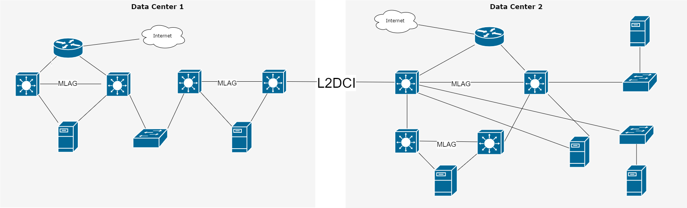
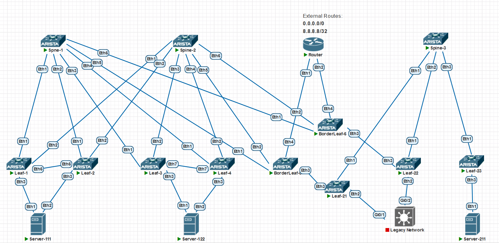

### Модернизация геораспределённой сети датацентров с использованием EVPN\VXLAN

### Цели:
- Модернизация текущей сетевой инфраструктуры с поддержкой возможностей использования VXLAN/EVPN
- Отказ от кривой legacy сети в центре обработки данных


### Запланированные задачи в рамках реализации проекта:
- Построение новой фабрики
- Настройка Multi-Pod и DCI
- Настройка маршрутизации между VRF через отдельный маршрутизатор
- Настройка Anycast Gateway на всех Leaf
- Проверка работоспосбности фабрики


### Старая схема сети:


Изначально был только ДЦ2, позже сеть появилась в ДЦ1, все строилось постепенно, появился DCI между ДЦ, но настрал момент расширятся в ДЦ. 
И тут поняли, что надо построить правильную сеть в ДЦ1, потом уже в ДЦ2. 

### Новая схема сети:


#### <u>Планирование адресации:</u>

10.0.0.0/24 - p2p/31 для DCI
10.n.0.0/24 - Резерв
10.n.1.0/24 - p2p/31 для подключения к Spine1
10.n.2.0/24 - p2p/31 для подключения к Spine2
10.n.3-250.0 - Резерв
10.n.251.0/24 - p2p/31 для iBGP между Leaf парой
10.n.254.0/24 - Loopback/32 для EVPN
10.n.255.0/24 - p2p/31 для MLAG между Leaf парой


#### <u>Таблица Loopback0/Router-ID и ASn, настроенных на устройствах:</u>

Pod-1:

|Device|IP Loopback / Router-ID |ASn|
|:-:|:-:|:-:|
|Spine1|10.1.254.101|65100|
|Spine2|10.1.254.102|65100|
|Leaf1|10.1.254.1|65001|
|Leaf2|10.1.254.2|65001|
|Leaf3|10.1.254.3|65002|
|Leaf4|10.1.254.4|65002|
|Border-Leaf5|10.1.254.5|65003|
|Border-Leaf6|10.1.254.6|65004|

Pod-2:

|Device|IP Loopback EVPN / Router-ID |ASn|
|:-:|:-:|:-:|
|Spine-3|10.2.254.103|65200|
|Leaf-21|10.2.254.6|652001|
|Leaf-22|10.2.254.2|652002|
|Leaf-23|10.2.254.3|652003|


#### <u>Таблица VTEP IP/AS устройствах:</u>

|Device|VTEP IP|
|:-:|:-:|
|Leaf1/2|10.1.254.201|
|Leaf3/4|10.1.254.202|
|Leaf5|10.1.254.5| 
|Leaf6|10.1.254.6|
|Leaf21|10.2.254.1|                                                                  
|Leaf22|10.2.254.2|
|Leaf23|10.2.254.3|


#### <u>Таблицы Network/VLAN/VRF/VNI/RT на устройствах:</u>


|Anycast GW|Network|VLAN|VNI|RT|VRF|
|:-:|:-:|:-:|:-:|:-:|:-:|
|172.16.10.1|172.16.10.0/24|10|100010|10:100010|ADM|
|172.16.20.1|172.16.20.0/24|20|100020|20:100020|ADM|
|172.16.30.2|172.16.30.0/24|30|100030|30:100030|DEV|
|172.16.40.1|172.16.40.0/24|40|100040|40:100040|DEV|
|172.16.50.1|172.16.50.0/24|50|100050|50:100050|Stor|
|100.0.0.1|100.0.0.0/24|100|100100|100:100100|EXT|
|200.0.0.1|200.0.0.0/24|200|100200|200:100200|EXT|

|VRF|VNI|RT|Description|
|:-:|:-:|:-:|:-:|
|ADM|1111|111:111| Для Админов |
|DEV|222|222:222| Для разботчиков и тестиролвщиков |
|Stor|333|333:333| Для систем хранения - изолированный влан |
|EXT|444|444:444| Для внешних подсетей, имеет доступ в инет |

#### <u>p2p пиринг с Router из VRF:</u>

|Device|Network|VLAN|VRF|
|:-:|:-:|:-:|:-:|:-:|:-:|
|Border-Leaf-5|172.16.101.0/31|1010|ADM|
|Border-Leaf-5|172.16.103.0/31|1030|DEV|
|Border-Leaf-5|172.16.110.0/31|1100|EXT|
|Border-Leaf-6|172.16.101.2/31|2010|ADM|
|Border-Leaf-6|172.16.103.2/31|2030|DEV|
|Border-Leaf-6|172.16.110.2/31|2100|EXT|

### Настройка:

#### <u>Настройка SPINE1-3:</u>

```

interface Loopback0
   ip address 10.1.254.101/32
!
ip routing
!
router bgp 65100
   router-id 10.1.254.101
   no bgp default ipv4-unicast
   timers bgp 1 3
   bgp allowas-in
   maximum-paths 4 ecmp 4
   neighbor EVPN peer group
   neighbor EVPN next-hop-unchanged
   neighbor EVPN update-source Loopback0
   neighbor EVPN bfd
   neighbor EVPN ebgp-multihop 3
   neighbor EVPN send-community extended
   neighbor LEAF peer group
   neighbor LEAF bfd
   neighbor 10.1.1.1 peer group LEAF
   neighbor 10.1.1.1 remote-as 65001
   neighbor 10.1.1.3 peer group LEAF
   neighbor 10.1.1.3 remote-as 65001
   neighbor 10.1.1.5 peer group LEAF
   neighbor 10.1.1.5 remote-as 65002
   neighbor 10.1.1.7 peer group LEAF
   neighbor 10.1.1.7 remote-as 65002
   neighbor 10.1.1.9 peer group LEAF
   neighbor 10.1.1.9 remote-as 65003
   neighbor 10.1.1.11 peer group LEAF
   neighbor 10.1.1.11 remote-as 65004
   neighbor 10.1.254.1 peer group EVPN
   neighbor 10.1.254.1 remote-as 65001
   neighbor 10.1.254.2 peer group EVPN
   neighbor 10.1.254.2 remote-as 65001
   neighbor 10.1.254.3 peer group EVPN
   neighbor 10.1.254.3 remote-as 65002
   neighbor 10.1.254.4 peer group EVPN
   neighbor 10.1.254.4 remote-as 65002
   neighbor 10.1.254.5 peer group EVPN
   neighbor 10.1.254.5 remote-as 65003
   neighbor 10.1.254.6 peer group EVPN
   neighbor 10.1.254.6 remote-as 65004
   !
   address-family evpn
      neighbor EVPN activate
   !
   address-family ipv4
      neighbor LEAF activate
      network 10.1.254.101/32

```
#### <u>Настройка SPINE2:</u>
```
interface Loopback0
   ip address 10.1.254.102/32
!
!
ip routing
!
router bgp 65100
   router-id 10.1.254.102
   no bgp default ipv4-unicast
   timers bgp 1 3
   bgp allowas-in
   maximum-paths 4 ecmp 4
   neighbor EVPN peer group
   neighbor EVPN next-hop-unchanged
   neighbor EVPN update-source Loopback0
   neighbor EVPN bfd
   neighbor EVPN ebgp-multihop 10
   neighbor EVPN send-community extended
   neighbor LEAF peer group
   neighbor LEAF bfd
   neighbor 10.1.2.1 peer group LEAF
   neighbor 10.1.2.1 remote-as 65001
   neighbor 10.1.2.3 peer group LEAF
   neighbor 10.1.2.3 remote-as 65001
   neighbor 10.1.2.5 peer group LEAF
   neighbor 10.1.2.5 remote-as 65002
   neighbor 10.1.2.7 peer group LEAF
   neighbor 10.1.2.7 remote-as 65002
   neighbor 10.1.2.9 peer group LEAF
   neighbor 10.1.2.9 remote-as 65003
   neighbor 10.1.2.11 peer group LEAF
   neighbor 10.1.2.11 remote-as 65004
   neighbor 10.1.254.1 peer group EVPN
   neighbor 10.1.254.1 remote-as 65001
   neighbor 10.1.254.2 peer group EVPN
   neighbor 10.1.254.2 remote-as 65001
   neighbor 10.1.254.3 peer group EVPN
   neighbor 10.1.254.3 remote-as 65002
   neighbor 10.1.254.4 peer group EVPN
   neighbor 10.1.254.4 remote-as 65002
   neighbor 10.1.254.5 peer group EVPN
   neighbor 10.1.254.5 remote-as 65003
   neighbor 10.1.254.6 peer group EVPN
   neighbor 10.1.254.6 remote-as 65004
   !
   address-family evpn
      neighbor EVPN activate
   !
   address-family ipv4
      neighbor LEAF activate
      network 10.1.254.102/32


```
#### <u>Примерная настройка MLAG/Anycast GW/VxLAN/BGP на LEAF1-4:</u>
```

mlag configuration
   domain-id 100
   local-interface Vlan4090
   peer-address 10.1.255.1
   peer-link Port-Channel100

ip virtual-router mac-address 00:00:00:00:11:11

vrf instance ADM
ip routing vrf ADM

interface Vlan10
   no autostate
   vrf ADM
   ip address 192.1.10.11/24
   ip virtual-router address 172.16.10.1

ip route vrf ADM 172.16.10.0/24 Vlan10

interface Vxlan1
   vxlan source-interface Loopback1
   vxlan udp-port 4789
   vxlan vlan 10 vni 100010
   vxlan vrf ADM vni 111


router bgp 65001
   router-id 10.1.254.1
   no bgp default ipv4-unicast
   timers bgp 1 3
   maximum-paths 4 ecmp 4
   neighbor EVPN peer group
   neighbor EVPN remote-as 65100
   neighbor EVPN update-source Loopback0
   neighbor EVPN bfd
   neighbor EVPN ebgp-multihop 3
   neighbor EVPN send-community extended
   neighbor SPINE peer group
   neighbor SPINE remote-as 65100
   neighbor SPINE bfd
   neighbor iBGP peer group
   neighbor iBGP remote-as 65001
   neighbor iBGP next-hop-self
   neighbor iBGP bfd
   neighbor 10.1.1.0 peer group SPINE
   neighbor 10.1.2.0 peer group SPINE
   neighbor 10.1.251.1 peer group iBGP
   neighbor 10.1.254.101 peer group EVPN
   neighbor 10.1.254.102 peer group EVPN
   !
   vlan 10
      rd 65001:10
      route-target both 10:100010
      redistribute learned
   !
   address-family evpn
      neighbor EVPN activate
   !
   address-family ipv4
      neighbor SPINE activate
      neighbor iBGP activate
      network 10.1.254.1/32
      network 10.1.254.201/32
   !
   vrf ADM
      rd 65001:111
      route-target import evpn 111:111
      route-target export evpn 111:111
      redistribute static
   !


```
#### <u>Примерная настройка Border-LEAF5/6:</u>
```

interface Vxlan1
   vxlan source-interface Loopback0
   vxlan udp-port 4789
   vxlan vrf ADM vni 111
   vxlan vrf DEV vni 222
   vxlan vrf EXT vni 444
   vxlan vrf STOR vni 333

router bgp 65003
   router-id 10.1.254.5
   no bgp default ipv4-unicast
   timers bgp 1 3
   bgp allowas-in
   maximum-paths 4 ecmp 4
   neighbor DCI peer group
   neighbor DCI remote-as 65201
   neighbor DCI bfd
   neighbor DCI-EVPN peer group
   neighbor DCI-EVPN remote-as 65201
   neighbor DCI-EVPN next-hop-unchanged
   neighbor DCI-EVPN update-source Loopback0
   neighbor DCI-EVPN bfd
   neighbor DCI-EVPN ebgp-multihop 3
   neighbor DCI-EVPN send-community extended
   neighbor EVPN peer group
   neighbor EVPN remote-as 65100
   neighbor EVPN next-hop-unchanged
   neighbor EVPN update-source Loopback0
   neighbor EVPN bfd
   neighbor EVPN ebgp-multihop 3
   neighbor EVPN send-community extended
   neighbor SPINE peer group
   neighbor SPINE remote-as 65100
   neighbor SPINE bfd
   neighbor 10.0.0.1 peer group DCI
   neighbor 10.1.1.8 peer group SPINE
   neighbor 10.1.2.8 peer group SPINE
   neighbor 10.1.254.101 peer group EVPN
   neighbor 10.1.254.102 peer group EVPN
   neighbor 10.2.254.1 peer group DCI-EVPN
   !
   address-family evpn
      neighbor DCI-EVPN activate
      neighbor EVPN activate
   !
   address-family ipv4
      neighbor DCI activate
      neighbor SPINE activate
      network 10.1.254.5/32
   !
   vrf ADM
      rd 65003:111
      route-target import evpn 111:111
      route-target export evpn 111:111
      bgp allowas-in
      neighbor 172.16.101.1 remote-as 65099
      neighbor 172.16.101.1 bfd
      redistribute connected
      !
      address-family ipv4
         neighbor 172.16.101.1 activate
   !
   vrf DEV
      rd 65003:222
      route-target import evpn 222:222
      route-target export evpn 222:222
      bgp allowas-in
      neighbor 172.16.103.1 remote-as 65099
      neighbor 172.16.103.1 bfd
      redistribute connected
      !
      address-family ipv4
         neighbor 172.16.103.1 activate
   !
   vrf EXT
      rd 65003:444
      route-target import evpn 444:444
      route-target export evpn 444:444
      neighbor 172.16.110.1 remote-as 65099
      neighbor 172.16.110.1 bfd
      redistribute connected
      !
      address-family ipv4
         neighbor 172.16.110.1 activate


```
#### <u>Настройка ROUTER:</u>

```

interface Ethernet1
   description Leaf-5
   switchport trunk allowed vlan 1010,1030,1100
   switchport mode trunk
!
interface Ethernet2
   description Leaf-6
   switchport trunk allowed vlan 2010,2030,2100
   switchport mode trunk

interface Vlan1010
   ip address 172.16.101.1/31
!
interface Vlan1030
   ip address 172.16.103.1/31
!
interface Vlan1100
   ip address 172.16.110.1/31
!
interface Vlan2010
   ip address 172.16.101.3/31
!
interface Vlan2030
   ip address 172.16.103.3/31
!
interface Vlan2100
   ip address 172.16.110.3/31

interface Loopback8
   ip address 8.8.8.8/32


p prefix-list All seq 10 permit 0.0.0.0/0 le 32
ip prefix-list External seq 10 permit 0.0.0.0/0
ip prefix-list External seq 20 permit 8.8.8.8/32
!
ip route 0.0.0.0/0 Null0
!
route-map DEL-AS-PATH permit 10
   set as-path match all replacement none
!
route-map External-deny deny 10
   match ip address prefix-list External
!
route-map External-deny permit 20
   match ip address prefix-list All
!
router bgp 65099
   router-id 172.16.0.0
   timers bgp 1 3
   bgp allowas-in
   maximum-paths 8 ecmp 8
   neighbor Leaf-5 peer group
   neighbor Leaf-5 remote-as 65003
   neighbor Leaf-5 bfd
   neighbor Leaf-6 peer group
   neighbor Leaf-6 remote-as 65004
   neighbor Leaf-6 bfd
   neighbor 172.16.101.0 peer group Leaf-5
   neighbor 172.16.101.0 route-map External-deny in
   neighbor 172.16.101.0 route-map External-deny out
   neighbor 172.16.101.2 peer group Leaf-6
   neighbor 172.16.101.2 route-map External-deny in
   neighbor 172.16.101.2 route-map External-deny out
   neighbor 172.16.103.0 peer group Leaf-5
   neighbor 172.16.103.0 route-map External-deny in
   neighbor 172.16.103.0 route-map External-deny out
   neighbor 172.16.103.2 peer group Leaf-6
   neighbor 172.16.103.2 route-map External-deny in
   neighbor 172.16.103.2 route-map External-deny out
   neighbor 172.16.110.0 peer group Leaf-5
   neighbor 172.16.110.2 peer group Leaf-6
   network 8.8.8.8/32
   network 0.0.0.0/0


```
#### <u>Leaf-21/22:</u>

```

router bgp 65201
   router-id 10.2.254.1
   no bgp default ipv4-unicast
   timers bgp 1 3
   maximum-paths 4 ecmp 4
   neighbor DCI peer group
   neighbor DCI remote-as 65003
   neighbor DCI bfd
   neighbor DCI-EVPN peer group
   neighbor DCI-EVPN remote-as 65003
   neighbor DCI-EVPN next-hop-unchanged
   neighbor DCI-EVPN update-source Loopback0
   neighbor DCI-EVPN bfd
   neighbor DCI-EVPN ebgp-multihop 3
   neighbor DCI-EVPN send-community extended
   neighbor EVPN peer group
   neighbor EVPN remote-as 65200
   neighbor EVPN update-source Loopback0
   neighbor EVPN bfd
   neighbor EVPN ebgp-multihop 3
   neighbor EVPN send-community extended
   neighbor SPINE peer group
   neighbor SPINE remote-as 65200
   neighbor SPINE bfd
   neighbor 10.0.0.0 peer group DCI
   neighbor 10.1.254.5 peer group DCI-EVPN
   neighbor 10.2.1.0 peer group SPINE
   neighbor 10.2.254.101 peer group EVPN
   !
   address-family evpn
      neighbor DCI-EVPN activate
      neighbor EVPN activate
   !
   address-family ipv4
      neighbor DCI activate
      neighbor SPINE activate
      network 10.2.254.1/32
!


```
### Проверка связанности между серверами:


#### <u>Server-111:</u>

```
Server-111#ping vrf V10 172.16.40.111
PING 172.16.40.111 (172.16.40.111) 72(100) bytes of data.
80 bytes from 172.16.40.111: icmp_seq=1 ttl=59 time=102 ms
80 bytes from 172.16.40.111: icmp_seq=2 ttl=59 time=116 ms

Server-111#ping vrf V10 172.16.30.211
PING 172.16.30.211 (172.16.30.211) 72(100) bytes of data.
80 bytes from 172.16.30.211: icmp_seq=1 ttl=59 time=146 ms
80 bytes from 172.16.30.211: icmp_seq=2 ttl=59 time=136 ms

Server-111#ping vrf V20 100.0.0.111
PING 100.0.0.111 (100.0.0.111) 72(100) bytes of data.
80 bytes from 100.0.0.111: icmp_seq=1 ttl=59 time=96.6 ms
80 bytes from 100.0.0.111: icmp_seq=2 ttl=59 time=94.7 ms

Server-111#ping vrf V40 172.16.10.122
PING 172.16.10.122 (172.16.10.122) 72(100) bytes of data.
80 bytes from 172.16.10.122: icmp_seq=1 ttl=59 time=66.1 ms
80 bytes from 172.16.10.122: icmp_seq=2 ttl=59 time=60.3 ms

Server-111#ping vrf V50 172.16.50.122
PING 172.16.50.122 (172.16.50.122) 72(100) bytes of data.
80 bytes from 172.16.50.122: icmp_seq=1 ttl=64 time=75.7 ms
80 bytes from 172.16.50.122: icmp_seq=2 ttl=64 time=66.2 m


Server-111#ping vrf V50 172.16.40.122
PING 172.16.40.122 (172.16.40.122) 72(100) bytes of data.
From 192.1.50.12 icmp_seq=1 Destination Net Unreachable


Server-111#traceroute vrf V40 172.16.10.122
traceroute to 172.16.10.122 (172.16.10.122), 30 hops max, 60 byte packets
 1  192.1.40.12 (192.1.40.12)  19.896 ms  15.912 ms  18.556 ms
 2  172.16.103.0 (172.16.103.0)  29.775 ms  31.920 ms  36.029 ms
 3  172.16.103.1 (172.16.103.1)  51.563 ms  53.744 ms  56.850 ms
 4  172.16.101.0 (172.16.101.0)  96.080 ms  98.023 ms  100.907 ms
 5  192.1.20.13 (192.1.20.13)  145.731 ms  147.922 ms  154.595 ms
 6  172.16.10.122 (172.16.10.122)  168.572 ms  156.238 ms  162.155 ms

Server-111#traceroute vrf V10 172.16.30.211
traceroute to 172.16.30.211 (172.16.30.211), 30 hops max, 60 byte packets
 1  192.1.10.12 (192.1.10.12)  23.228 ms  20.633 ms  23.856 ms
 2  172.16.101.2 (172.16.101.2)  55.263 ms  57.360 ms  75.676 ms
 3  172.16.101.3 (172.16.101.3)  77.045 ms  81.027 ms  92.254 ms
 4  172.16.103.0 (172.16.103.0)  93.689 ms  98.688 ms  104.310 ms
 5  192.1.30.12 (192.1.30.12)  140.853 ms  145.762 ms  154.757 ms
 6  172.16.30.211 (172.16.30.211)  235.870 ms  220.430 ms  222.682 ms


Доступ в инет только с VRF EXTernal (Vlan 100)

Server-111#ping vrf V100 8.8.8.8
PING 8.8.8.8 (8.8.8.8) 72(100) bytes of data.
80 bytes from 8.8.8.8: icmp_seq=1 ttl=62 time=19.8 ms
80 bytes from 8.8.8.8: icmp_seq=2 ttl=62 time=13.2 ms

--- 8.8.8.8 ping statistics ---
5 packets transmitted, 5 received, 0% packet loss, time 67ms
rtt min/avg/max/mdev = 13.202/15.591/19.831/2.356 ms, pipe 2, ipg/ewma 16.919/17.664 ms
Server-111#ping vrf V30 8.8.8.8
PING 8.8.8.8 (8.8.8.8) 72(100) bytes of data.
From 192.1.30.12 icmp_seq=1 Destination Net Unreachable


```

#### <u>Server-122:</u>

```

Server-122#ping vrf V40 100.0.0.111
PING 100.0.0.111 (100.0.0.111) 72(100) bytes of data.
80 bytes from 100.0.0.111: icmp_seq=1 ttl=59 time=38.4 ms
80 bytes from 100.0.0.111: icmp_seq=2 ttl=59 time=55.2 ms

Server-122#ping vrf V40 100.0.0.111
PING 100.0.0.111 (100.0.0.111) 72(100) bytes of data.
80 bytes from 100.0.0.111: icmp_seq=1 ttl=59 time=38.4 ms
80 bytes from 100.0.0.111: icmp_seq=2 ttl=59 time=55.2 ms


Server-122#ping vrf V100 8.8.8.8
PING 8.8.8.8 (8.8.8.8) 72(100) bytes of data.
80 bytes from 8.8.8.8: icmp_seq=1 ttl=62 time=18.6 ms
80 bytes from 8.8.8.8: icmp_seq=2 ttl=62 time=17.1 ms

PING 100.0.0.111 (100.0.0.111) 72(100) bytes of data.
80 bytes from 100.0.0.111: icmp_seq=1 ttl=64 time=35.2 ms
80 bytes from 100.0.0.111: icmp_seq=2 ttl=64 time=26.4 ms


PING 172.16.10.111 (172.16.10.111) 72(100) bytes of data.
80 bytes from 172.16.10.111: icmp_seq=1 ttl=59 time=147 ms
80 bytes from 172.16.10.111: icmp_seq=2 ttl=59 time=136 ms


erver-122#traceroute vrf V100 172.16.40.111
traceroute to 172.16.40.111 (172.16.40.111), 30 hops max, 60 byte packets
 1  192.1.100.13 (192.1.100.13)  15.459 ms  17.064 ms  19.180 ms
 2  172.16.110.2 (172.16.110.2)  25.625 ms  27.387 ms  32.508 ms
 3  172.16.110.3 (172.16.110.3)  43.424 ms  46.229 ms  50.498 ms
 4  172.16.103.0 (172.16.103.0)  61.637 ms  65.687 ms  67.639 ms
 5  192.1.30.11 (192.1.30.11)  90.533 ms  93.557 ms  97.981 ms
 6  172.16.40.111 (172.16.40.111)  116.523 ms  110.873 ms  111.428 ms


Server-122#traceroute vrf V100 172.16.30.211
traceroute to 172.16.30.211 (172.16.30.211), 30 hops max, 60 byte packets
 1  192.1.100.13 (192.1.100.13)  17.195 ms  17.046 ms  19.181 ms
 2  172.16.110.0 (172.16.110.0)  29.456 ms  31.469 ms  36.381 ms
 3  172.16.110.2 (172.16.110.2)  37.794 ms  43.064 ms  44.640 ms
 4  172.16.110.3 (172.16.110.3)  54.942 ms  56.771 ms  59.573 ms
 5  172.16.103.0 (172.16.103.0)  79.186 ms  82.187 ms  86.372 ms
 6  192.1.30.12 (192.1.30.12)  116.841 ms  104.148 ms  105.500 ms
 7  172.16.30.211 (172.16.30.211)  194.598 ms  188.211 ms  205.339 ms


```


#### <u>Server-211:</u>

```

Sercer-211#ping vrf V10 172.16.10.111
PING 172.16.10.111 (172.16.10.111) 72(100) bytes of data.
80 bytes from 172.16.10.111: icmp_seq=1 ttl=64 time=38.8 ms
80 bytes from 172.16.10.111: icmp_seq=2 ttl=64 time=29.3 ms

Sercer-211#ping vrf V10 172.16.30.111
PING 172.16.30.111 (172.16.30.111) 72(100) bytes of data.
80 bytes from 172.16.30.111: icmp_seq=1 ttl=59 time=101 ms
80 bytes from 172.16.30.111: icmp_seq=2 ttl=59 time=100 ms


Sercer-211#ping vrf V30 172.16.20.122
PING 172.16.20.122 (172.16.20.122) 72(100) bytes of data.
80 bytes from 172.16.20.122: icmp_seq=1 ttl=59 time=39.4 ms
80 bytes from 172.16.20.122: icmp_seq=2 ttl=59 time=37.2 ms


```

<details>
<summary>Диагностика на Leaf-1</summary>

```

Leaf-1#show bgp summary
BGP summary information for VRF default
Router identifier 10.1.254.1, local AS number 65001
Neighbor                 AS Session State AFI/SAFI                AFI/SAFI State   NLRI Rcd   NLRI Acc
--------------- ----------- ------------- ----------------------- -------------- ---------- ----------
10.1.1.0              65100 Established   IPv4 Unicast            Negotiated             11         11
10.1.2.0              65100 Established   IPv4 Unicast            Negotiated             11         11
10.1.251.1            65001 Established   IPv4 Unicast            Negotiated             13         13
10.1.254.101          65100 Established   L2VPN EVPN              Negotiated             54         54
10.1.254.102          65100 Established   L2VPN EVPN              Negotiated             54         54
Leaf-1#show bgp evpn
BGP routing table information for VRF default
Router identifier 10.1.254.1, local AS number 65001
Route status codes: s - suppressed, * - valid, > - active, E - ECMP head, e - ECMP
                    S - Stale, c - Contributing to ECMP, b - backup
                    % - Pending BGP convergence
Origin codes: i - IGP, e - EGP, ? - incomplete
AS Path Attributes: Or-ID - Originator ID, C-LST - Cluster List, LL Nexthop - Link Local Nexthop

          Network                Next Hop              Metric  LocPref Weight  Path
 * >Ec   RD: 65203:30 mac-ip 504c.8961.0a0f
                                 10.2.254.3            -       100     0       65100 65004 65202 65200 65203 i
 *  ec   RD: 65203:30 mac-ip 504c.8961.0a0f
                                 10.2.254.3            -       100     0       65100 65004 65202 65200 65203 i
 * >Ec   RD: 65203:30 mac-ip 504c.8961.0a0f 172.16.30.211
                                 10.2.254.3            -       100     0       65100 65004 65202 65200 65203 i
 *  ec   RD: 65203:30 mac-ip 504c.8961.0a0f 172.16.30.211
                                 10.2.254.3            -       100     0       65100 65004 65202 65200 65203 i
 * >     RD: 65001:10 imet 10.1.254.201
                                 -                     -       -       0       i
 * >     RD: 65001:20 imet 10.1.254.201
                                 -                     -       -       0       i
 * >     RD: 65001:30 imet 10.1.254.201
                                 -                     -       -       0       i
 * >     RD: 65001:40 imet 10.1.254.201
                                 -                     -       -       0       i
 * >     RD: 65001:50 imet 10.1.254.201
                                 -                     -       -       0       i
 * >     RD: 65001:100 imet 10.1.254.201
                                 -                     -       -       0       i
 * >Ec   RD: 65002:10 imet 10.1.254.202
                                 10.1.254.202          -       100     0       65100 65002 i
 *  ec   RD: 65002:10 imet 10.1.254.202
                                 10.1.254.202          -       100     0       65100 65002 i
 * >Ec   RD: 65002:20 imet 10.1.254.202
                                 10.1.254.202          -       100     0       65100 65002 i
 *  ec   RD: 65002:20 imet 10.1.254.202
                                 10.1.254.202          -       100     0       65100 65002 i
 * >Ec   RD: 65002:30 imet 10.1.254.202
                                 10.1.254.202          -       100     0       65100 65002 i
 *  ec   RD: 65002:30 imet 10.1.254.202
                                 10.1.254.202          -       100     0       65100 65002 i
 * >Ec   RD: 65002:40 imet 10.1.254.202
                                 10.1.254.202          -       100     0       65100 65002 i
 *  ec   RD: 65002:40 imet 10.1.254.202
                                 10.1.254.202          -       100     0       65100 65002 i
 * >Ec   RD: 65002:50 imet 10.1.254.202
                                 10.1.254.202          -       100     0       65100 65002 i
 *  ec   RD: 65002:50 imet 10.1.254.202
                                 10.1.254.202          -       100     0       65100 65002 i
 * >Ec   RD: 65002:100 imet 10.1.254.202
                                 10.1.254.202          -       100     0       65100 65002 i
 *  ec   RD: 65002:100 imet 10.1.254.202
                                 10.1.254.202          -       100     0       65100 65002 i
 * >Ec   RD: 65203:10 imet 10.2.254.3
                                 10.2.254.3            -       100     0       65100 65004 65202 65200 65203 i
 *  ec   RD: 65203:10 imet 10.2.254.3
                                 10.2.254.3            -       100     0       65100 65004 65202 65200 65203 i
 * >Ec   RD: 65203:30 imet 10.2.254.3
                                 10.2.254.3            -       100     0       65100 65004 65202 65200 65203 i
 *  ec   RD: 65203:30 imet 10.2.254.3
                                 10.2.254.3            -       100     0       65100 65004 65202 65200 65203 i
 * >Ec   RD: 65203:50 imet 10.2.254.3
                                 10.2.254.3            -       100     0       65100 65004 65202 65200 65203 i
 *  ec   RD: 65203:50 imet 10.2.254.3
                                 10.2.254.3            -       100     0       65100 65004 65202 65200 65203 i
 * >Ec   RD: 65203:200 imet 10.2.254.3
                                 10.2.254.3            -       100     0       65100 65004 65202 65200 65203 i
 *  ec   RD: 65203:200 imet 10.2.254.3
                                 10.2.254.3            -       100     0       65100 65004 65202 65200 65203 i
 * >Ec   RD: 65003:444 ip-prefix 0.0.0.0/0
                                 10.1.254.5            -       100     0       65100 65003 65099 ?
 *  ec   RD: 65003:444 ip-prefix 0.0.0.0/0
                                 10.1.254.5            -       100     0       65100 65003 65099 ?
 * >Ec   RD: 65004:444 ip-prefix 0.0.0.0/0
                                 10.1.254.6            -       100     0       65100 65004 65099 ?
 *  ec   RD: 65004:444 ip-prefix 0.0.0.0/0
                                 10.1.254.6            -       100     0       65100 65004 65099 ?
 * >Ec   RD: 65003:444 ip-prefix 8.8.8.8/32
                                 10.1.254.5            -       100     0       65100 65003 65099 i
 *  ec   RD: 65003:444 ip-prefix 8.8.8.8/32
                                 10.1.254.5            -       100     0       65100 65003 65099 i
 * >Ec   RD: 65004:444 ip-prefix 8.8.8.8/32
                                 10.1.254.6            -       100     0       65100 65004 65099 i
 *  ec   RD: 65004:444 ip-prefix 8.8.8.8/32
                                 10.1.254.6            -       100     0       65100 65004 65099 i
 * >     RD: 65001:444 ip-prefix 100.0.0.0/24
                                 -                     -       -       0       ?
 * >Ec   RD: 65002:444 ip-prefix 100.0.0.0/24
                                 10.1.254.202          -       100     0       65100 65002 ?
 *  ec   RD: 65002:444 ip-prefix 100.0.0.0/24
                                 10.1.254.202          -       100     0       65100 65002 ?
 * >     RD: 65001:111 ip-prefix 172.16.10.0/24
                                 -                     -       -       0       ?
 * >Ec   RD: 65002:111 ip-prefix 172.16.10.0/24
                                 10.1.254.202          -       100     0       65100 65002 ?
 *  ec   RD: 65002:111 ip-prefix 172.16.10.0/24
                                 10.1.254.202          -       100     0       65100 65002 ?
 * >Ec   RD: 65003:222 ip-prefix 172.16.10.0/24
                                 10.1.254.5            -       100     0       65100 65003 65099 65003 65100 65002 ?
 *  ec   RD: 65003:222 ip-prefix 172.16.10.0/24
                                 10.1.254.5            -       100     0       65100 65003 65099 65003 65100 65002 ?
 * >Ec   RD: 65004:111 ip-prefix 172.16.10.0/24
                                 10.1.254.6            -       100     0       65100 65004 65099 65003 65100 65002 ?
 *  ec   RD: 65004:111 ip-prefix 172.16.10.0/24
                                 10.1.254.6            -       100     0       65100 65004 65099 65003 65100 65002 ?
 * >Ec   RD: 65004:222 ip-prefix 172.16.10.0/24
                                 10.1.254.6            -       100     0       65100 65004 65099 65003 65100 65002 ?
 *  ec   RD: 65004:222 ip-prefix 172.16.10.0/24
                                 10.1.254.6            -       100     0       65100 65004 65099 65003 65100 65002 ?
 * >Ec   RD: 65004:444 ip-prefix 172.16.10.0/24
                                 10.1.254.6            -       100     0       65100 65004 65099 65003 65100 65002 ?
 *  ec   RD: 65004:444 ip-prefix 172.16.10.0/24
                                 10.1.254.6            -       100     0       65100 65004 65099 65003 65100 65002 ?
 * >Ec   RD: 65203:111 ip-prefix 172.16.10.0/24
                                 10.2.254.3            -       100     0       65100 65004 65202 65200 65203 ?
 *  ec   RD: 65203:111 ip-prefix 172.16.10.0/24
                                 10.2.254.3            -       100     0       65100 65004 65202 65200 65203 ?
 * >     RD: 65001:111 ip-prefix 172.16.20.0/24
                                 -                     -       -       0       ?
 * >Ec   RD: 65002:111 ip-prefix 172.16.20.0/24
                                 10.1.254.202          -       100     0       65100 65002 ?
 *  ec   RD: 65002:111 ip-prefix 172.16.20.0/24
                                 10.1.254.202          -       100     0       65100 65002 ?
 * >     RD: 65001:222 ip-prefix 172.16.30.0/24
                                 -                     -       -       0       ?
 * >Ec   RD: 65002:222 ip-prefix 172.16.30.0/24
                                 10.1.254.202          -       100     0       65100 65002 ?
 *  ec   RD: 65002:222 ip-prefix 172.16.30.0/24
                                 10.1.254.202          -       100     0       65100 65002 ?
 * >Ec   RD: 65003:111 ip-prefix 172.16.30.0/24
                                 10.1.254.5            -       100     0       65100 65003 65099 65003 65100 65002 ?
 *  ec   RD: 65003:111 ip-prefix 172.16.30.0/24
                                 10.1.254.5            -       100     0       65100 65003 65099 65003 65100 65002 ?
 * >Ec   RD: 65004:111 ip-prefix 172.16.30.0/24
                                 10.1.254.6            -       100     0       65100 65004 65099 65003 65100 65002 ?
 *  ec   RD: 65004:111 ip-prefix 172.16.30.0/24
                                 10.1.254.6            -       100     0       65100 65004 65099 65003 65100 65002 ?
 * >Ec   RD: 65004:222 ip-prefix 172.16.30.0/24
                                 10.1.254.6            -       100     0       65100 65004 65099 65003 65100 65002 ?
 *  ec   RD: 65004:222 ip-prefix 172.16.30.0/24
                                 10.1.254.6            -       100     0       65100 65004 65099 65003 65100 65002 ?
 * >Ec   RD: 65004:444 ip-prefix 172.16.30.0/24
                                 10.1.254.6            -       100     0       65100 65004 65099 65003 65100 65002 ?
 *  ec   RD: 65004:444 ip-prefix 172.16.30.0/24
                                 10.1.254.6            -       100     0       65100 65004 65099 65003 65100 65002 ?
 * >Ec   RD: 65203:222 ip-prefix 172.16.30.0/24
                                 10.2.254.3            -       100     0       65100 65004 65202 65200 65203 ?
 *  ec   RD: 65203:222 ip-prefix 172.16.30.0/24
                                 10.2.254.3            -       100     0       65100 65004 65202 65200 65203 ?
 * >Ec   RD: 65003:111 ip-prefix 172.16.30.211/32
                                 10.1.254.5            -       100     0       65100 65003 65099 65004 65202 65200 65203 i
 *  ec   RD: 65003:111 ip-prefix 172.16.30.211/32
                                 10.1.254.5            -       100     0       65100 65003 65099 65004 65202 65200 65203 i
 * >Ec   RD: 65003:222 ip-prefix 172.16.30.211/32
                                 10.1.254.5            -       100     0       65100 65003 65099 65004 65202 65200 65203 i
 *  ec   RD: 65003:222 ip-prefix 172.16.30.211/32
                                 10.1.254.5            -       100     0       65100 65003 65099 65004 65202 65200 65203 i
 * >Ec   RD: 65003:444 ip-prefix 172.16.30.211/32
                                 10.1.254.5            -       100     0       65100 65003 65099 65004 65202 65200 65203 i
 *  ec   RD: 65003:444 ip-prefix 172.16.30.211/32
                                 10.1.254.5            -       100     0       65100 65003 65099 65004 65202 65200 65203 i
 * >Ec   RD: 65004:111 ip-prefix 172.16.30.211/32
                                 10.1.254.6            -       100     0       65100 65004 65099 65004 65202 65200 65203 i
 *  ec   RD: 65004:111 ip-prefix 172.16.30.211/32
                                 10.1.254.6            -       100     0       65100 65004 65099 65004 65202 65200 65203 i
 * >Ec   RD: 65004:444 ip-prefix 172.16.30.211/32
                                 10.1.254.6            -       100     0       65100 65004 65099 65004 65202 65200 65203 i
 *  ec   RD: 65004:444 ip-prefix 172.16.30.211/32
                                 10.1.254.6            -       100     0       65100 65004 65099 65004 65202 65200 65203 i
 * >     RD: 65001:222 ip-prefix 172.16.40.0/24
                                 -                     -       -       0       ?
 * >Ec   RD: 65002:222 ip-prefix 172.16.40.0/24
                                 10.1.254.202          -       100     0       65100 65002 ?
 *  ec   RD: 65002:222 ip-prefix 172.16.40.0/24
                                 10.1.254.202          -       100     0       65100 65002 ?
 * >Ec   RD: 65003:111 ip-prefix 172.16.40.0/24
                                 10.1.254.5            -       100     0       65100 65003 65099 65003 65100 65002 ?
 *  ec   RD: 65003:111 ip-prefix 172.16.40.0/24
                                 10.1.254.5            -       100     0       65100 65003 65099 65003 65100 65002 ?
 * >Ec   RD: 65004:111 ip-prefix 172.16.40.0/24
                                 10.1.254.6            -       100     0       65100 65004 65099 65003 65100 65002 ?
 *  ec   RD: 65004:111 ip-prefix 172.16.40.0/24
                                 10.1.254.6            -       100     0       65100 65004 65099 65003 65100 65002 ?
 * >Ec   RD: 65004:222 ip-prefix 172.16.40.0/24
                                 10.1.254.6            -       100     0       65100 65004 65099 65003 65100 65002 ?
 *  ec   RD: 65004:222 ip-prefix 172.16.40.0/24
                                 10.1.254.6            -       100     0       65100 65004 65099 65003 65100 65002 ?
 * >Ec   RD: 65004:444 ip-prefix 172.16.40.0/24
                                 10.1.254.6            -       100     0       65100 65004 65099 65003 65100 65002 ?
 *  ec   RD: 65004:444 ip-prefix 172.16.40.0/24
                                 10.1.254.6            -       100     0       65100 65004 65099 65003 65100 65002 ?
 * >     RD: 65001:333 ip-prefix 172.16.50.0/24
                                 -                     -       -       0       ?
 * >Ec   RD: 65002:333 ip-prefix 172.16.50.0/24
                                 10.1.254.202          -       100     0       65100 65002 ?
 *  ec   RD: 65002:333 ip-prefix 172.16.50.0/24
                                 10.1.254.202          -       100     0       65100 65002 ?
 * >Ec   RD: 65203:333 ip-prefix 172.16.50.0/24
                                 10.2.254.3            -       100     0       65100 65004 65202 65200 65203 ?
 *  ec   RD: 65203:333 ip-prefix 172.16.50.0/24
                                 10.2.254.3            -       100     0       65100 65004 65202 65200 65203 ?
 * >Ec   RD: 65003:111 ip-prefix 172.16.101.0/31
                                 10.1.254.5            -       100     0       65100 65003 i
 *  ec   RD: 65003:111 ip-prefix 172.16.101.0/31
                                 10.1.254.5            -       100     0       65100 65003 i
 * >Ec   RD: 65004:111 ip-prefix 172.16.101.2/31
                                 10.1.254.6            -       100     0       65100 65004 i
 *  ec   RD: 65004:111 ip-prefix 172.16.101.2/31
                                 10.1.254.6            -       100     0       65100 65004 i
 * >Ec   RD: 65003:222 ip-prefix 172.16.103.0/31
                                 10.1.254.5            -       100     0       65100 65003 i
 *  ec   RD: 65003:222 ip-prefix 172.16.103.0/31
                                 10.1.254.5            -       100     0       65100 65003 i
 * >Ec   RD: 65004:222 ip-prefix 172.16.103.2/31
                                 10.1.254.6            -       100     0       65100 65004 i
 *  ec   RD: 65004:222 ip-prefix 172.16.103.2/31
                                 10.1.254.6            -       100     0       65100 65004 i
 * >Ec   RD: 65003:444 ip-prefix 172.16.110.0/31
                                 10.1.254.5            -       100     0       65100 65003 i
 *  ec   RD: 65003:444 ip-prefix 172.16.110.0/31
                                 10.1.254.5            -       100     0       65100 65003 i
 * >Ec   RD: 65004:444 ip-prefix 172.16.110.2/31
                                 10.1.254.6            -       100     0       65100 65004 i
 *  ec   RD: 65004:444 ip-prefix 172.16.110.2/31
                                 10.1.254.6            -       100     0       65100 65004 i
 * >Ec   RD: 65003:111 ip-prefix 200.0.0.0/24
                                 10.1.254.5            -       100     0       65100 65003 65099 65003 65201 65200 65203 ?
 *  ec   RD: 65003:111 ip-prefix 200.0.0.0/24
                                 10.1.254.5            -       100     0       65100 65003 65099 65003 65201 65200 65203 ?
 * >Ec   RD: 65003:222 ip-prefix 200.0.0.0/24
                                 10.1.254.5            -       100     0       65100 65003 65099 65003 65201 65200 65203 ?
 *  ec   RD: 65003:222 ip-prefix 200.0.0.0/24
                                 10.1.254.5            -       100     0       65100 65003 65099 65003 65201 65200 65203 ?
 * >Ec   RD: 65004:111 ip-prefix 200.0.0.0/24
                                 10.1.254.6            -       100     0       65100 65004 65099 65003 65201 65200 65203 ?
 *  ec   RD: 65004:111 ip-prefix 200.0.0.0/24
                                 10.1.254.6            -       100     0       65100 65004 65099 65003 65201 65200 65203 ?
 * >Ec   RD: 65004:222 ip-prefix 200.0.0.0/24
                                 10.1.254.6            -       100     0       65100 65004 65099 65003 65201 65200 65203 ?
 *  ec   RD: 65004:222 ip-prefix 200.0.0.0/24
                                 10.1.254.6            -       100     0       65100 65004 65099 65003 65201 65200 65203 ?
 * >Ec   RD: 65004:444 ip-prefix 200.0.0.0/24
                                 10.1.254.6            -       100     0       65100 65004 65099 65003 65201 65200 65203 ?
 *  ec   RD: 65004:444 ip-prefix 200.0.0.0/24
                                 10.1.254.6            -       100     0       65100 65004 65099 65003 65201 65200 65203 ?
 * >Ec   RD: 65203:444 ip-prefix 200.0.0.0/24
                                 10.2.254.3            -       100     0       65100 65004 65202 65200 65203 ?
 *  ec   RD: 65203:444 ip-prefix 200.0.0.0/24
                                 10.2.254.3            -       100     0       65100 65004 65202 65200 65203 ?
Leaf-1#show ip route

VRF: default
Codes: C - connected, S - static, K - kernel,
       O - OSPF, IA - OSPF inter area, E1 - OSPF external type 1,
       E2 - OSPF external type 2, N1 - OSPF NSSA external type 1,
       N2 - OSPF NSSA external type2, B - BGP, B I - iBGP, B E - eBGP,
       R - RIP, I L1 - IS-IS level 1, I L2 - IS-IS level 2,
       O3 - OSPFv3, A B - BGP Aggregate, A O - OSPF Summary,
       NG - Nexthop Group Static Route, V - VXLAN Control Service,
       DH - DHCP client installed default route, M - Martian,
       DP - Dynamic Policy Route, L - VRF Leaked,
       G  - gRIBI, RC - Route Cache Route

Gateway of last resort is not set

 C        10.1.1.0/31 is directly connected, Ethernet1
 C        10.1.2.0/31 is directly connected, Ethernet2
 C        10.1.251.0/31 is directly connected, Vlan4091
 C        10.1.254.1/32 is directly connected, Loopback0
 B I      10.1.254.2/32 [200/0] via 10.1.251.1, Vlan4091
 B E      10.1.254.3/32 [200/0] via 10.1.1.0, Ethernet1
                                via 10.1.2.0, Ethernet2
 B E      10.1.254.4/32 [200/0] via 10.1.1.0, Ethernet1
                                via 10.1.2.0, Ethernet2
 B E      10.1.254.5/32 [200/0] via 10.1.1.0, Ethernet1
                                via 10.1.2.0, Ethernet2
 B E      10.1.254.6/32 [200/0] via 10.1.1.0, Ethernet1
                                via 10.1.2.0, Ethernet2
 B E      10.1.254.101/32 [200/0] via 10.1.1.0, Ethernet1
 B E      10.1.254.102/32 [200/0] via 10.1.2.0, Ethernet2
 C        10.1.254.201/32 is directly connected, Loopback1
 B E      10.1.254.202/32 [200/0] via 10.1.1.0, Ethernet1
                                  via 10.1.2.0, Ethernet2
 C        10.1.255.0/31 is directly connected, Vlan4090
 B E      10.2.254.1/32 [200/0] via 10.1.1.0, Ethernet1
                                via 10.1.2.0, Ethernet2
 B E      10.2.254.2/32 [200/0] via 10.1.1.0, Ethernet1
                                via 10.1.2.0, Ethernet2
 B E      10.2.254.3/32 [200/0] via 10.1.1.0, Ethernet1
                                via 10.1.2.0, Ethernet2
 B E      10.2.254.101/32 [200/0] via 10.1.1.0, Ethernet1
                                  via 10.1.2.0, Ethernet2

Leaf-1#
Leaf-1#show vxlan vtep
Remote VTEPS for Vxlan1:

VTEP               Tunnel Type(s)
------------------ --------------
10.1.254.5         unicast
10.1.254.6         unicast
10.1.254.202       unicast, flood
10.2.254.3         unicast, flood

Total number of remote VTEPS:  4
Leaf-1#show vxlan vni
VNI to VLAN Mapping for Vxlan1
VNI          VLAN       Source       Interface            802.1Q Tag
------------ ---------- ------------ -------------------- ----------
100010       10         static       Port-Channel10       10
                                     Vxlan1               10
100020       20         static       Port-Channel10       20
                                     Vxlan1               20
100030       30         static       Port-Channel10       30
                                     Vxlan1               30
100040       40         static       Port-Channel10       40
                                     Vxlan1               40
100050       50         static       Port-Channel10       50
                                     Vxlan1               50
100100       100        static       Port-Channel10       100
                                     Vxlan1               100

VNI to dynamic VLAN Mapping for Vxlan1
VNI       VLAN       VRF        Source
--------- ---------- ---------- ------------
111       4085       ADM        evpn
222       4088       DEV        evpn
333       4086       STOR       evpn
444       4087       EXT        evpn

Leaf-1#show vxlan address-table
          Vxlan Mac Address Table
----------------------------------------------------------------------

VLAN  Mac Address     Type      Prt  VTEP             Moves   Last Move
----  -----------     ----      ---  ----             -----   ---------
  30  504c.8961.0a0f  EVPN      Vx1  10.2.254.3       1       0:04:18 ago
4085  504b.d202.caff  EVPN      Vx1  10.2.254.3       1       12:36:15 ago
4085  5053.c96a.80ff  EVPN      Vx1  10.1.254.6       1       9:18:59 ago
4085  5057.ebb5.cd8b  EVPN      Vx1  10.1.254.202     1       12:37:34 ago
4085  50b6.a924.91d7  EVPN      Vx1  10.1.254.5       1       12:36:11 ago
4085  50d7.8378.a060  EVPN      Vx1  10.1.254.202     1       12:37:34 ago
4086  504b.d202.caff  EVPN      Vx1  10.2.254.3       1       12:36:15 ago
4086  5057.ebb5.cd8b  EVPN      Vx1  10.1.254.202     1       12:37:34 ago
4086  50d7.8378.a060  EVPN      Vx1  10.1.254.202     1       12:37:34 ago
4087  504b.d202.caff  EVPN      Vx1  10.2.254.3       1       12:36:15 ago
4087  5053.c96a.80ff  EVPN      Vx1  10.1.254.6       1       9:18:58 ago
4087  5057.ebb5.cd8b  EVPN      Vx1  10.1.254.202     1       12:37:34 ago
4087  50b6.a924.91d7  EVPN      Vx1  10.1.254.5       1       12:36:11 ago
4087  50d7.8378.a060  EVPN      Vx1  10.1.254.202     1       12:37:34 ago
4088  504b.d202.caff  EVPN      Vx1  10.2.254.3       1       12:36:15 ago
4088  5053.c96a.80ff  EVPN      Vx1  10.1.254.6       1       9:18:59 ago
4088  5057.ebb5.cd8b  EVPN      Vx1  10.1.254.202     1       12:37:34 ago
4088  50b6.a924.91d7  EVPN      Vx1  10.1.254.5       1       12:36:10 ago
4088  50d7.8378.a060  EVPN      Vx1  10.1.254.202     1       12:37:34 ago
Total Remote Mac Addresses for this criterion: 19
Leaf-1#show mac address-table
          Mac Address Table
------------------------------------------------------------------

Vlan    Mac Address       Type        Ports      Moves   Last Move
----    -----------       ----        -----      -----   ---------
  10    5069.a447.888f    STATIC      Po100
  20    5069.a447.888f    STATIC      Po100
  30    504c.8961.0a0f    DYNAMIC     Vx1        1       0:04:18 ago
  30    5069.a447.888f    STATIC      Po100
  40    5069.a447.888f    STATIC      Po100
  50    5069.a447.888f    STATIC      Po100
 100    5069.a447.888f    STATIC      Po100
4085    504b.d202.caff    DYNAMIC     Vx1        1       12:36:15 ago
4085    5053.c96a.80ff    DYNAMIC     Vx1        1       9:18:59 ago
4085    5057.ebb5.cd8b    DYNAMIC     Vx1        1       12:37:34 ago
4085    5069.a447.888f    STATIC      Po100
4085    50b6.a924.91d7    DYNAMIC     Vx1        1       12:36:11 ago
4085    50d7.8378.a060    DYNAMIC     Vx1        1       12:37:34 ago
4086    504b.d202.caff    DYNAMIC     Vx1        1       12:36:15 ago
4086    5057.ebb5.cd8b    DYNAMIC     Vx1        1       12:37:34 ago
4086    5069.a447.888f    STATIC      Po100
4086    50d7.8378.a060    DYNAMIC     Vx1        1       12:37:34 ago
4087    504b.d202.caff    DYNAMIC     Vx1        1       12:36:15 ago
4087    5053.c96a.80ff    DYNAMIC     Vx1        1       9:18:58 ago
4087    5057.ebb5.cd8b    DYNAMIC     Vx1        1       12:37:34 ago
4087    5069.a447.888f    STATIC      Po100
4087    50b6.a924.91d7    DYNAMIC     Vx1        1       12:36:11 ago
4087    50d7.8378.a060    DYNAMIC     Vx1        1       12:37:34 ago
4088    504b.d202.caff    DYNAMIC     Vx1        1       12:36:15 ago
4088    5053.c96a.80ff    DYNAMIC     Vx1        1       9:18:59 ago
4088    5057.ebb5.cd8b    DYNAMIC     Vx1        1       12:37:34 ago
4088    5069.a447.888f    STATIC      Po100
4088    50b6.a924.91d7    DYNAMIC     Vx1        1       12:36:10 ago
4088    50d7.8378.a060    DYNAMIC     Vx1        1       12:37:34 ago
4090    5069.a447.888f    STATIC      Po100
4091    5069.a447.888f    STATIC      Po100
Total Mac Addresses for this criterion: 31

          Multicast Mac Address Table
------------------------------------------------------------------

Vlan    Mac Address       Type        Ports
----    -----------       ----        -----
Total Mac Addresses for this criterion: 0
Leaf-1#
Leaf-1#show mlag
MLAG Configuration:
domain-id                          :                 100
local-interface                    :            Vlan4090
peer-address                       :          10.1.255.1
peer-link                          :     Port-Channel100
peer-config                        :          consistent

MLAG Status:
state                              :              Active
negotiation status                 :           Connected
peer-link status                   :                  Up
local-int status                   :                  Up
system-id                          :   52:2f:9e:5a:b0:e7
dual-primary detection             :            Disabled
dual-primary interface errdisabled :               False

MLAG Ports:
Disabled                           :                   0
Configured                         :                   0
Inactive                           :                   0
Active-partial                     :                   0
Active-full                        :                   1

Leaf-1#
Leaf-1#show ip route vrf all

VRF: default
Codes: C - connected, S - static, K - kernel,
       O - OSPF, IA - OSPF inter area, E1 - OSPF external type 1,
       E2 - OSPF external type 2, N1 - OSPF NSSA external type 1,
       N2 - OSPF NSSA external type2, B - BGP, B I - iBGP, B E - eBGP,
       R - RIP, I L1 - IS-IS level 1, I L2 - IS-IS level 2,
       O3 - OSPFv3, A B - BGP Aggregate, A O - OSPF Summary,
       NG - Nexthop Group Static Route, V - VXLAN Control Service,
       DH - DHCP client installed default route, M - Martian,
       DP - Dynamic Policy Route, L - VRF Leaked,
       G  - gRIBI, RC - Route Cache Route

Gateway of last resort is not set

 C        10.1.1.0/31 is directly connected, Ethernet1
 C        10.1.2.0/31 is directly connected, Ethernet2
 C        10.1.251.0/31 is directly connected, Vlan4091
 C        10.1.254.1/32 is directly connected, Loopback0
 B I      10.1.254.2/32 [200/0] via 10.1.251.1, Vlan4091
 B E      10.1.254.3/32 [200/0] via 10.1.1.0, Ethernet1
                                via 10.1.2.0, Ethernet2
 B E      10.1.254.4/32 [200/0] via 10.1.1.0, Ethernet1
                                via 10.1.2.0, Ethernet2
 B E      10.1.254.5/32 [200/0] via 10.1.1.0, Ethernet1
                                via 10.1.2.0, Ethernet2
 B E      10.1.254.6/32 [200/0] via 10.1.1.0, Ethernet1
                                via 10.1.2.0, Ethernet2
 B E      10.1.254.101/32 [200/0] via 10.1.1.0, Ethernet1
 B E      10.1.254.102/32 [200/0] via 10.1.2.0, Ethernet2
 C        10.1.254.201/32 is directly connected, Loopback1
 B E      10.1.254.202/32 [200/0] via 10.1.1.0, Ethernet1
                                  via 10.1.2.0, Ethernet2
 C        10.1.255.0/31 is directly connected, Vlan4090
 B E      10.2.254.1/32 [200/0] via 10.1.1.0, Ethernet1
                                via 10.1.2.0, Ethernet2
 B E      10.2.254.2/32 [200/0] via 10.1.1.0, Ethernet1
                                via 10.1.2.0, Ethernet2
 B E      10.2.254.3/32 [200/0] via 10.1.1.0, Ethernet1
                                via 10.1.2.0, Ethernet2
 B E      10.2.254.101/32 [200/0] via 10.1.1.0, Ethernet1
                                  via 10.1.2.0, Ethernet2


VRF: ADM
Codes: C - connected, S - static, K - kernel,
       O - OSPF, IA - OSPF inter area, E1 - OSPF external type 1,
       E2 - OSPF external type 2, N1 - OSPF NSSA external type 1,
       N2 - OSPF NSSA external type2, B - BGP, B I - iBGP, B E - eBGP,
       R - RIP, I L1 - IS-IS level 1, I L2 - IS-IS level 2,
       O3 - OSPFv3, A B - BGP Aggregate, A O - OSPF Summary,
       NG - Nexthop Group Static Route, V - VXLAN Control Service,
       DH - DHCP client installed default route, M - Martian,
       DP - Dynamic Policy Route, L - VRF Leaked,
       G  - gRIBI, RC - Route Cache Route

Gateway of last resort is not set

 S        172.16.10.0/24 is directly connected, Vlan10
 S        172.16.20.0/24 is directly connected, Vlan20
 B E      172.16.30.211/32 [200/0] via VTEP 10.1.254.5 VNI 111 router-mac 50:b6:a9:24:91:d7 local-interface Vxlan1
                                   via VTEP 10.1.254.6 VNI 111 router-mac 50:53:c9:6a:80:ff local-interface Vxlan1
 B E      172.16.30.0/24 [200/0] via VTEP 10.1.254.5 VNI 111 router-mac 50:b6:a9:24:91:d7 local-interface Vxlan1
                                 via VTEP 10.1.254.6 VNI 111 router-mac 50:53:c9:6a:80:ff local-interface Vxlan1
 B E      172.16.40.0/24 [200/0] via VTEP 10.1.254.5 VNI 111 router-mac 50:b6:a9:24:91:d7 local-interface Vxlan1
                                 via VTEP 10.1.254.6 VNI 111 router-mac 50:53:c9:6a:80:ff local-interface Vxlan1
 B E      172.16.101.0/31 [200/0] via VTEP 10.1.254.5 VNI 111 router-mac 50:b6:a9:24:91:d7 local-interface Vxlan1
 B E      172.16.101.2/31 [200/0] via VTEP 10.1.254.6 VNI 111 router-mac 50:53:c9:6a:80:ff local-interface Vxlan1
 C        192.1.10.0/24 is directly connected, Vlan10
 C        192.1.20.0/24 is directly connected, Vlan20
 B E      200.0.0.0/24 [200/0] via VTEP 10.1.254.5 VNI 111 router-mac 50:b6:a9:24:91:d7 local-interface Vxlan1
                               via VTEP 10.1.254.6 VNI 111 router-mac 50:53:c9:6a:80:ff local-interface Vxlan1


VRF: DEV
Codes: C - connected, S - static, K - kernel,
       O - OSPF, IA - OSPF inter area, E1 - OSPF external type 1,
       E2 - OSPF external type 2, N1 - OSPF NSSA external type 1,
       N2 - OSPF NSSA external type2, B - BGP, B I - iBGP, B E - eBGP,
       R - RIP, I L1 - IS-IS level 1, I L2 - IS-IS level 2,
       O3 - OSPFv3, A B - BGP Aggregate, A O - OSPF Summary,
       NG - Nexthop Group Static Route, V - VXLAN Control Service,
       DH - DHCP client installed default route, M - Martian,
       DP - Dynamic Policy Route, L - VRF Leaked,
       G  - gRIBI, RC - Route Cache Route

Gateway of last resort is not set

 B E      172.16.10.0/24 [200/0] via VTEP 10.1.254.5 VNI 222 router-mac 50:b6:a9:24:91:d7 local-interface Vxlan1
                                 via VTEP 10.1.254.6 VNI 222 router-mac 50:53:c9:6a:80:ff local-interface Vxlan1
 B E      172.16.30.211/32 [200/0] via VTEP 10.2.254.3 VNI 222 router-mac 50:4b:d2:02:ca:ff local-interface Vxlan1
 S        172.16.30.0/24 is directly connected, Vlan30
 S        172.16.40.0/24 is directly connected, Vlan40
 B E      172.16.103.0/31 [200/0] via VTEP 10.1.254.5 VNI 222 router-mac 50:b6:a9:24:91:d7 local-interface Vxlan1
 B E      172.16.103.2/31 [200/0] via VTEP 10.1.254.6 VNI 222 router-mac 50:53:c9:6a:80:ff local-interface Vxlan1
 C        192.1.30.0/24 is directly connected, Vlan30
 C        192.1.40.0/24 is directly connected, Vlan40
 B E      200.0.0.0/24 [200/0] via VTEP 10.1.254.5 VNI 222 router-mac 50:b6:a9:24:91:d7 local-interface Vxlan1
                               via VTEP 10.1.254.6 VNI 222 router-mac 50:53:c9:6a:80:ff local-interface Vxlan1


VRF: EXT
Codes: C - connected, S - static, K - kernel,
       O - OSPF, IA - OSPF inter area, E1 - OSPF external type 1,
       E2 - OSPF external type 2, N1 - OSPF NSSA external type 1,
       N2 - OSPF NSSA external type2, B - BGP, B I - iBGP, B E - eBGP,
       R - RIP, I L1 - IS-IS level 1, I L2 - IS-IS level 2,
       O3 - OSPFv3, A B - BGP Aggregate, A O - OSPF Summary,
       NG - Nexthop Group Static Route, V - VXLAN Control Service,
       DH - DHCP client installed default route, M - Martian,
       DP - Dynamic Policy Route, L - VRF Leaked,
       G  - gRIBI, RC - Route Cache Route

Gateway of last resort:
 B E      0.0.0.0/0 [200/0] via VTEP 10.1.254.5 VNI 444 router-mac 50:b6:a9:24:91:d7 local-interface Vxlan1
                            via VTEP 10.1.254.6 VNI 444 router-mac 50:53:c9:6a:80:ff local-interface Vxlan1

 B E      8.8.8.8/32 [200/0] via VTEP 10.1.254.5 VNI 444 router-mac 50:b6:a9:24:91:d7 local-interface Vxlan1
                             via VTEP 10.1.254.6 VNI 444 router-mac 50:53:c9:6a:80:ff local-interface Vxlan1
 S        100.0.0.0/24 is directly connected, Vlan100
 B E      172.16.10.0/24 [200/0] via VTEP 10.1.254.6 VNI 444 router-mac 50:53:c9:6a:80:ff local-interface Vxlan1
 B E      172.16.30.211/32 [200/0] via VTEP 10.1.254.5 VNI 444 router-mac 50:b6:a9:24:91:d7 local-interface Vxlan1
                                   via VTEP 10.1.254.6 VNI 444 router-mac 50:53:c9:6a:80:ff local-interface Vxlan1
 B E      172.16.30.0/24 [200/0] via VTEP 10.1.254.6 VNI 444 router-mac 50:53:c9:6a:80:ff local-interface Vxlan1
 B E      172.16.40.0/24 [200/0] via VTEP 10.1.254.6 VNI 444 router-mac 50:53:c9:6a:80:ff local-interface Vxlan1
 B E      172.16.110.0/31 [200/0] via VTEP 10.1.254.5 VNI 444 router-mac 50:b6:a9:24:91:d7 local-interface Vxlan1
 B E      172.16.110.2/31 [200/0] via VTEP 10.1.254.6 VNI 444 router-mac 50:53:c9:6a:80:ff local-interface Vxlan1
 C        192.1.100.0/24 is directly connected, Vlan100
 B E      200.0.0.0/24 [200/0] via VTEP 10.2.254.3 VNI 444 router-mac 50:4b:d2:02:ca:ff local-interface Vxlan1


VRF: STOR
Codes: C - connected, S - static, K - kernel,
       O - OSPF, IA - OSPF inter area, E1 - OSPF external type 1,
       E2 - OSPF external type 2, N1 - OSPF NSSA external type 1,
       N2 - OSPF NSSA external type2, B - BGP, B I - iBGP, B E - eBGP,
       R - RIP, I L1 - IS-IS level 1, I L2 - IS-IS level 2,
       O3 - OSPFv3, A B - BGP Aggregate, A O - OSPF Summary,
       NG - Nexthop Group Static Route, V - VXLAN Control Service,
       DH - DHCP client installed default route, M - Martian,
       DP - Dynamic Policy Route, L - VRF Leaked,
       G  - gRIBI, RC - Route Cache Route

Gateway of last resort is not set

 S        172.16.50.0/24 is directly connected, Vlan50
 C        192.1.50.0/24 is directly connected, Vlan50

Leaf-1#show ip arp vrf all

VRF: ADM
Address         Age (sec)  Hardware Addr   Interface
172.16.10.111     1:46:02  509c.edd9.92a1  Vlan10, not learned
172.16.20.111     1:53:10  509c.edd9.92a1  Vlan20, not learned

VRF: DEV
Address         Age (sec)  Hardware Addr   Interface
172.16.30.111     2:12:06  509c.edd9.92a1  Vlan30, not learned
172.16.30.211           -  504c.8961.0a0f  Vlan30, Vxlan1
172.16.40.111     1:43:34  509c.edd9.92a1  Vlan40, not learned

VRF: EXT
Address         Age (sec)  Hardware Addr   Interface
100.0.0.111       2:12:19  509c.edd9.92a1  Vlan100, not learned

VRF: STOR
Address         Age (sec)  Hardware Addr   Interface
172.16.50.111     1:57:47  509c.edd9.92a1  Vlan50, not learned

VRF: default
Address         Age (sec)  Hardware Addr   Interface
10.1.1.0          0:00:00  50ef.19d8.dff9  Ethernet1
10.1.2.0          0:00:00  50a5.3448.d4f7  Ethernet2
10.1.255.1        0:00:02  5069.a447.888f  Vlan4090, Port-Channel100
10.1.251.1        0:00:00  5069.a447.888f  Vlan4091, Port-Channel100


```
</details>
<details>
<summary>Диагностика на Leaf-2</summary>

```

Leaf-2#show bgp summary
BGP summary information for VRF default
Router identifier 10.1.254.2, local AS number 65001
Neighbor                 AS Session State AFI/SAFI                AFI/SAFI State   NLRI Rcd   NLRI Acc
--------------- ----------- ------------- ----------------------- -------------- ---------- ----------
10.1.1.2              65100 Established   IPv4 Unicast            Negotiated             11         11
10.1.2.2              65100 Established   IPv4 Unicast            Negotiated             11         11
10.1.251.0            65001 Established   IPv4 Unicast            Negotiated             13         13
10.1.254.101          65100 Established   L2VPN EVPN              Negotiated             51         51
10.1.254.102          65100 Established   L2VPN EVPN              Negotiated             51         51
Leaf-2#show bgp evpn
BGP routing table information for VRF default
Router identifier 10.1.254.2, local AS number 65001
Route status codes: s - suppressed, * - valid, > - active, E - ECMP head, e - ECMP
                    S - Stale, c - Contributing to ECMP, b - backup
                    % - Pending BGP convergence
Origin codes: i - IGP, e - EGP, ? - incomplete
AS Path Attributes: Or-ID - Originator ID, C-LST - Cluster List, LL Nexthop - Link Local Nexthop

          Network                Next Hop              Metric  LocPref Weight  Path
 * >Ec   RD: 65203:50 mac-ip 504c.8961.0a0f
                                 10.2.254.3            -       100     0       65100 65003 65201 65200 65203 i
 *  ec   RD: 65203:50 mac-ip 504c.8961.0a0f
                                 10.2.254.3            -       100     0       65100 65004 65202 65200 65203 i
 * >Ec   RD: 65203:50 mac-ip 504c.8961.0a0f 172.16.50.211
                                 10.2.254.3            -       100     0       65100 65003 65201 65200 65203 i
 *  ec   RD: 65203:50 mac-ip 504c.8961.0a0f 172.16.50.211
                                 10.2.254.3            -       100     0       65100 65003 65201 65200 65203 i
 * >Ec   RD: 65002:50 mac-ip 50f5.6711.ea60
                                 10.1.254.202          -       100     0       65100 65002 i
 *  ec   RD: 65002:50 mac-ip 50f5.6711.ea60
                                 10.1.254.202          -       100     0       65100 65002 i
 * >Ec   RD: 65002:50 mac-ip 50f5.6711.ea60 172.16.50.122
                                 10.1.254.202          -       100     0       65100 65002 i
 *  ec   RD: 65002:50 mac-ip 50f5.6711.ea60 172.16.50.122
                                 10.1.254.202          -       100     0       65100 65002 i
 * >     RD: 65001:10 imet 10.1.254.201
                                 -                     -       -       0       i
 * >     RD: 65001:20 imet 10.1.254.201
                                 -                     -       -       0       i
 * >     RD: 65001:30 imet 10.1.254.201
                                 -                     -       -       0       i
 * >     RD: 65001:40 imet 10.1.254.201
                                 -                     -       -       0       i
 * >     RD: 65001:50 imet 10.1.254.201
                                 -                     -       -       0       i
 * >     RD: 65001:100 imet 10.1.254.201
                                 -                     -       -       0       i
 * >Ec   RD: 65002:10 imet 10.1.254.202
                                 10.1.254.202          -       100     0       65100 65002 i
 *  ec   RD: 65002:10 imet 10.1.254.202
                                 10.1.254.202          -       100     0       65100 65002 i
 * >Ec   RD: 65002:20 imet 10.1.254.202
                                 10.1.254.202          -       100     0       65100 65002 i
 *  ec   RD: 65002:20 imet 10.1.254.202
                                 10.1.254.202          -       100     0       65100 65002 i
 * >Ec   RD: 65002:30 imet 10.1.254.202
                                 10.1.254.202          -       100     0       65100 65002 i
 *  ec   RD: 65002:30 imet 10.1.254.202
                                 10.1.254.202          -       100     0       65100 65002 i
 * >Ec   RD: 65002:40 imet 10.1.254.202
                                 10.1.254.202          -       100     0       65100 65002 i
 *  ec   RD: 65002:40 imet 10.1.254.202
                                 10.1.254.202          -       100     0       65100 65002 i
 * >Ec   RD: 65002:50 imet 10.1.254.202
                                 10.1.254.202          -       100     0       65100 65002 i
 *  ec   RD: 65002:50 imet 10.1.254.202
                                 10.1.254.202          -       100     0       65100 65002 i
 * >Ec   RD: 65002:100 imet 10.1.254.202
                                 10.1.254.202          -       100     0       65100 65002 i
 *  ec   RD: 65002:100 imet 10.1.254.202
                                 10.1.254.202          -       100     0       65100 65002 i
 * >Ec   RD: 65203:10 imet 10.2.254.3
                                 10.2.254.3            -       100     0       65100 65004 65202 65200 65203 i
 *  ec   RD: 65203:10 imet 10.2.254.3
                                 10.2.254.3            -       100     0       65100 65004 65202 65200 65203 i
 * >Ec   RD: 65203:30 imet 10.2.254.3
                                 10.2.254.3            -       100     0       65100 65004 65202 65200 65203 i
 *  ec   RD: 65203:30 imet 10.2.254.3
                                 10.2.254.3            -       100     0       65100 65004 65202 65200 65203 i
 * >Ec   RD: 65203:50 imet 10.2.254.3
                                 10.2.254.3            -       100     0       65100 65004 65202 65200 65203 i
 *  ec   RD: 65203:50 imet 10.2.254.3
                                 10.2.254.3            -       100     0       65100 65004 65202 65200 65203 i
 * >Ec   RD: 65203:200 imet 10.2.254.3
                                 10.2.254.3            -       100     0       65100 65004 65202 65200 65203 i
 *  ec   RD: 65203:200 imet 10.2.254.3
                                 10.2.254.3            -       100     0       65100 65004 65202 65200 65203 i
 * >Ec   RD: 65003:444 ip-prefix 0.0.0.0/0
                                 10.1.254.5            -       100     0       65100 65003 65099 ?
 *  ec   RD: 65003:444 ip-prefix 0.0.0.0/0
                                 10.1.254.5            -       100     0       65100 65003 65099 ?
 * >Ec   RD: 65004:444 ip-prefix 0.0.0.0/0
                                 10.1.254.6            -       100     0       65100 65004 65099 ?
 *  ec   RD: 65004:444 ip-prefix 0.0.0.0/0
                                 10.1.254.6            -       100     0       65100 65004 65099 ?
 * >Ec   RD: 65003:444 ip-prefix 8.8.8.8/32
                                 10.1.254.5            -       100     0       65100 65003 65099 i
 *  ec   RD: 65003:444 ip-prefix 8.8.8.8/32
                                 10.1.254.5            -       100     0       65100 65003 65099 i
 * >Ec   RD: 65004:444 ip-prefix 8.8.8.8/32
                                 10.1.254.6            -       100     0       65100 65004 65099 i
 *  ec   RD: 65004:444 ip-prefix 8.8.8.8/32
                                 10.1.254.6            -       100     0       65100 65004 65099 i
 * >     RD: 65001:444 ip-prefix 100.0.0.0/24
                                 -                     -       -       0       ?
 * >Ec   RD: 65002:444 ip-prefix 100.0.0.0/24
                                 10.1.254.202          -       100     0       65100 65002 ?
 *  ec   RD: 65002:444 ip-prefix 100.0.0.0/24
                                 10.1.254.202          -       100     0       65100 65002 ?
 * >     RD: 65001:111 ip-prefix 172.16.10.0/24
                                 -                     -       -       0       ?
 * >Ec   RD: 65002:111 ip-prefix 172.16.10.0/24
                                 10.1.254.202          -       100     0       65100 65002 ?
 *  ec   RD: 65002:111 ip-prefix 172.16.10.0/24
                                 10.1.254.202          -       100     0       65100 65002 ?
 * >Ec   RD: 65003:222 ip-prefix 172.16.10.0/24
                                 10.1.254.5            -       100     0       65100 65003 65099 65003 65100 65002 ?
 *  ec   RD: 65003:222 ip-prefix 172.16.10.0/24
                                 10.1.254.5            -       100     0       65100 65003 65099 65003 65100 65002 ?
 * >Ec   RD: 65004:111 ip-prefix 172.16.10.0/24
                                 10.1.254.6            -       100     0       65100 65004 65099 65003 65100 65002 ?
 *  ec   RD: 65004:111 ip-prefix 172.16.10.0/24
                                 10.1.254.6            -       100     0       65100 65004 65099 65003 65100 65002 ?
 * >Ec   RD: 65004:222 ip-prefix 172.16.10.0/24
                                 10.1.254.6            -       100     0       65100 65004 65099 65003 65100 65002 ?
 *  ec   RD: 65004:222 ip-prefix 172.16.10.0/24
                                 10.1.254.6            -       100     0       65100 65004 65099 65003 65100 65002 ?
 * >Ec   RD: 65004:444 ip-prefix 172.16.10.0/24
                                 10.1.254.6            -       100     0       65100 65004 65099 65003 65100 65002 ?
 *  ec   RD: 65004:444 ip-prefix 172.16.10.0/24
                                 10.1.254.6            -       100     0       65100 65004 65099 65003 65100 65002 ?
 * >Ec   RD: 65203:111 ip-prefix 172.16.10.0/24
                                 10.2.254.3            -       100     0       65100 65004 65202 65200 65203 ?
 *  ec   RD: 65203:111 ip-prefix 172.16.10.0/24
                                 10.2.254.3            -       100     0       65100 65004 65202 65200 65203 ?
 * >     RD: 65001:111 ip-prefix 172.16.20.0/24
                                 -                     -       -       0       ?
 * >Ec   RD: 65002:111 ip-prefix 172.16.20.0/24
                                 10.1.254.202          -       100     0       65100 65002 ?
 *  ec   RD: 65002:111 ip-prefix 172.16.20.0/24
                                 10.1.254.202          -       100     0       65100 65002 ?
 * >     RD: 65001:222 ip-prefix 172.16.30.0/24
                                 -                     -       -       0       ?
 * >Ec   RD: 65002:222 ip-prefix 172.16.30.0/24
                                 10.1.254.202          -       100     0       65100 65002 ?
 *  ec   RD: 65002:222 ip-prefix 172.16.30.0/24
                                 10.1.254.202          -       100     0       65100 65002 ?
 * >Ec   RD: 65003:111 ip-prefix 172.16.30.0/24
                                 10.1.254.5            -       100     0       65100 65003 65099 65003 65100 65002 ?
 *  ec   RD: 65003:111 ip-prefix 172.16.30.0/24
                                 10.1.254.5            -       100     0       65100 65003 65099 65003 65100 65002 ?
 * >Ec   RD: 65004:111 ip-prefix 172.16.30.0/24
                                 10.1.254.6            -       100     0       65100 65004 65099 65003 65100 65002 ?
 *  ec   RD: 65004:111 ip-prefix 172.16.30.0/24
                                 10.1.254.6            -       100     0       65100 65004 65099 65003 65100 65002 ?
 * >Ec   RD: 65004:222 ip-prefix 172.16.30.0/24
                                 10.1.254.6            -       100     0       65100 65004 65099 65003 65100 65002 ?
 *  ec   RD: 65004:222 ip-prefix 172.16.30.0/24
                                 10.1.254.6            -       100     0       65100 65004 65099 65003 65100 65002 ?
 * >Ec   RD: 65004:444 ip-prefix 172.16.30.0/24
                                 10.1.254.6            -       100     0       65100 65004 65099 65003 65100 65002 ?
 *  ec   RD: 65004:444 ip-prefix 172.16.30.0/24
                                 10.1.254.6            -       100     0       65100 65004 65099 65003 65100 65002 ?
 * >Ec   RD: 65203:222 ip-prefix 172.16.30.0/24
                                 10.2.254.3            -       100     0       65100 65004 65202 65200 65203 ?
 *  ec   RD: 65203:222 ip-prefix 172.16.30.0/24
                                 10.2.254.3            -       100     0       65100 65004 65202 65200 65203 ?
 * >     RD: 65001:222 ip-prefix 172.16.40.0/24
                                 -                     -       -       0       ?
 * >Ec   RD: 65002:222 ip-prefix 172.16.40.0/24
                                 10.1.254.202          -       100     0       65100 65002 ?
 *  ec   RD: 65002:222 ip-prefix 172.16.40.0/24
                                 10.1.254.202          -       100     0       65100 65002 ?
 * >Ec   RD: 65003:111 ip-prefix 172.16.40.0/24
                                 10.1.254.5            -       100     0       65100 65003 65099 65003 65100 65002 ?
 *  ec   RD: 65003:111 ip-prefix 172.16.40.0/24
                                 10.1.254.5            -       100     0       65100 65003 65099 65003 65100 65002 ?
 * >Ec   RD: 65004:111 ip-prefix 172.16.40.0/24
                                 10.1.254.6            -       100     0       65100 65004 65099 65003 65100 65002 ?
 *  ec   RD: 65004:111 ip-prefix 172.16.40.0/24
                                 10.1.254.6            -       100     0       65100 65004 65099 65003 65100 65002 ?
 * >Ec   RD: 65004:222 ip-prefix 172.16.40.0/24
                                 10.1.254.6            -       100     0       65100 65004 65099 65003 65100 65002 ?
 *  ec   RD: 65004:222 ip-prefix 172.16.40.0/24
                                 10.1.254.6            -       100     0       65100 65004 65099 65003 65100 65002 ?
 * >Ec   RD: 65004:444 ip-prefix 172.16.40.0/24
                                 10.1.254.6            -       100     0       65100 65004 65099 65003 65100 65002 ?
 *  ec   RD: 65004:444 ip-prefix 172.16.40.0/24
                                 10.1.254.6            -       100     0       65100 65004 65099 65003 65100 65002 ?
 * >     RD: 65001:333 ip-prefix 172.16.50.0/24
                                 -                     -       -       0       ?
 * >Ec   RD: 65002:333 ip-prefix 172.16.50.0/24
                                 10.1.254.202          -       100     0       65100 65002 ?
 *  ec   RD: 65002:333 ip-prefix 172.16.50.0/24
                                 10.1.254.202          -       100     0       65100 65002 ?
 * >Ec   RD: 65203:333 ip-prefix 172.16.50.0/24
                                 10.2.254.3            -       100     0       65100 65004 65202 65200 65203 ?
 *  ec   RD: 65203:333 ip-prefix 172.16.50.0/24
                                 10.2.254.3            -       100     0       65100 65004 65202 65200 65203 ?
 * >Ec   RD: 65003:111 ip-prefix 172.16.101.0/31
                                 10.1.254.5            -       100     0       65100 65003 i
 *  ec   RD: 65003:111 ip-prefix 172.16.101.0/31
                                 10.1.254.5            -       100     0       65100 65003 i
 * >Ec   RD: 65004:111 ip-prefix 172.16.101.2/31
                                 10.1.254.6            -       100     0       65100 65004 i
 *  ec   RD: 65004:111 ip-prefix 172.16.101.2/31
                                 10.1.254.6            -       100     0       65100 65004 i
 * >Ec   RD: 65003:222 ip-prefix 172.16.103.0/31
                                 10.1.254.5            -       100     0       65100 65003 i
 *  ec   RD: 65003:222 ip-prefix 172.16.103.0/31
                                 10.1.254.5            -       100     0       65100 65003 i
 * >Ec   RD: 65004:222 ip-prefix 172.16.103.2/31
                                 10.1.254.6            -       100     0       65100 65004 i
 *  ec   RD: 65004:222 ip-prefix 172.16.103.2/31
                                 10.1.254.6            -       100     0       65100 65004 i
 * >Ec   RD: 65003:444 ip-prefix 172.16.110.0/31
                                 10.1.254.5            -       100     0       65100 65003 i
 *  ec   RD: 65003:444 ip-prefix 172.16.110.0/31
                                 10.1.254.5            -       100     0       65100 65003 i
 * >Ec   RD: 65004:444 ip-prefix 172.16.110.2/31
                                 10.1.254.6            -       100     0       65100 65004 i
 *  ec   RD: 65004:444 ip-prefix 172.16.110.2/31
                                 10.1.254.6            -       100     0       65100 65004 i
 * >Ec   RD: 65003:111 ip-prefix 200.0.0.0/24
                                 10.1.254.5            -       100     0       65100 65003 65099 65003 65201 65200 65203 ?
 *  ec   RD: 65003:111 ip-prefix 200.0.0.0/24
                                 10.1.254.5            -       100     0       65100 65003 65099 65003 65201 65200 65203 ?
 * >Ec   RD: 65003:222 ip-prefix 200.0.0.0/24
                                 10.1.254.5            -       100     0       65100 65003 65099 65003 65201 65200 65203 ?
 *  ec   RD: 65003:222 ip-prefix 200.0.0.0/24
                                 10.1.254.5            -       100     0       65100 65003 65099 65003 65201 65200 65203 ?
 * >Ec   RD: 65004:111 ip-prefix 200.0.0.0/24
                                 10.1.254.6            -       100     0       65100 65004 65099 65003 65201 65200 65203 ?
 *  ec   RD: 65004:111 ip-prefix 200.0.0.0/24
                                 10.1.254.6            -       100     0       65100 65004 65099 65003 65201 65200 65203 ?
 * >Ec   RD: 65004:222 ip-prefix 200.0.0.0/24
                                 10.1.254.6            -       100     0       65100 65004 65099 65003 65201 65200 65203 ?
 *  ec   RD: 65004:222 ip-prefix 200.0.0.0/24
                                 10.1.254.6            -       100     0       65100 65004 65099 65003 65201 65200 65203 ?
 * >Ec   RD: 65004:444 ip-prefix 200.0.0.0/24
                                 10.1.254.6            -       100     0       65100 65004 65099 65003 65201 65200 65203 ?
 *  ec   RD: 65004:444 ip-prefix 200.0.0.0/24
                                 10.1.254.6            -       100     0       65100 65004 65099 65003 65201 65200 65203 ?
 * >Ec   RD: 65203:444 ip-prefix 200.0.0.0/24
                                 10.2.254.3            -       100     0       65100 65004 65202 65200 65203 ?
 *  ec   RD: 65203:444 ip-prefix 200.0.0.0/24
                                 10.2.254.3            -       100     0       65100 65004 65202 65200 65203 ?
Leaf-2#show ip route

VRF: default
Codes: C - connected, S - static, K - kernel,
       O - OSPF, IA - OSPF inter area, E1 - OSPF external type 1,
       E2 - OSPF external type 2, N1 - OSPF NSSA external type 1,
       N2 - OSPF NSSA external type2, B - BGP, B I - iBGP, B E - eBGP,
       R - RIP, I L1 - IS-IS level 1, I L2 - IS-IS level 2,
       O3 - OSPFv3, A B - BGP Aggregate, A O - OSPF Summary,
       NG - Nexthop Group Static Route, V - VXLAN Control Service,
       DH - DHCP client installed default route, M - Martian,
       DP - Dynamic Policy Route, L - VRF Leaked,
       G  - gRIBI, RC - Route Cache Route

Gateway of last resort is not set

 C        10.1.1.2/31 is directly connected, Ethernet1
 C        10.1.2.2/31 is directly connected, Ethernet2
 C        10.1.251.0/31 is directly connected, Vlan4091
 B I      10.1.254.1/32 [200/0] via 10.1.251.0, Vlan4091
 B E      10.1.254.3/32 [200/0] via 10.1.1.2, Ethernet1
                                via 10.1.2.2, Ethernet2
 C        10.1.254.2/31 is directly connected, Loopback0
 B E      10.1.254.4/32 [200/0] via 10.1.1.2, Ethernet1
                                via 10.1.2.2, Ethernet2
 B E      10.1.254.5/32 [200/0] via 10.1.1.2, Ethernet1
                                via 10.1.2.2, Ethernet2
 B E      10.1.254.6/32 [200/0] via 10.1.1.2, Ethernet1
                                via 10.1.2.2, Ethernet2
 B E      10.1.254.101/32 [200/0] via 10.1.1.2, Ethernet1
 B E      10.1.254.102/32 [200/0] via 10.1.2.2, Ethernet2
 C        10.1.254.200/31 is directly connected, Loopback1
 B E      10.1.254.202/32 [200/0] via 10.1.1.2, Ethernet1
                                  via 10.1.2.2, Ethernet2
 C        10.1.255.0/31 is directly connected, Vlan4090
 B E      10.2.254.1/32 [200/0] via 10.1.1.2, Ethernet1
                                via 10.1.2.2, Ethernet2
 B E      10.2.254.2/32 [200/0] via 10.1.1.2, Ethernet1
                                via 10.1.2.2, Ethernet2
 B E      10.2.254.3/32 [200/0] via 10.1.1.2, Ethernet1
                                via 10.1.2.2, Ethernet2
 B E      10.2.254.101/32 [200/0] via 10.1.1.2, Ethernet1
                                  via 10.1.2.2, Ethernet2

Leaf-2#
Leaf-2#show vxlan vtep
Remote VTEPS for Vxlan1:

VTEP               Tunnel Type(s)
------------------ --------------
10.1.254.5         unicast
10.1.254.6         unicast
10.1.254.202       unicast, flood
10.2.254.3         unicast, flood

Total number of remote VTEPS:  4
Leaf-2#show vxlan vni
VNI to VLAN Mapping for Vxlan1
VNI          VLAN       Source       Interface            802.1Q Tag
------------ ---------- ------------ -------------------- ----------
100010       10         static       Port-Channel10       10
                                     Vxlan1               10
100020       20         static       Port-Channel10       20
                                     Vxlan1               20
100030       30         static       Port-Channel10       30
                                     Vxlan1               30
100040       40         static       Port-Channel10       40
                                     Vxlan1               40
100050       50         static       Port-Channel10       50
                                     Vxlan1               50
100100       100        static       Port-Channel10       100
                                     Vxlan1               100

VNI to dynamic VLAN Mapping for Vxlan1
VNI       VLAN       VRF        Source
--------- ---------- ---------- ------------
111       4085       ADM        evpn
222       4088       DEV        evpn
333       4086       STOR       evpn
444       4087       EXT        evpn

Leaf-2#show vxlan address-table
          Vxlan Mac Address Table
----------------------------------------------------------------------

VLAN  Mac Address     Type      Prt  VTEP             Moves   Last Move
----  -----------     ----      ---  ----             -----   ---------
  50  504c.8961.0a0f  EVPN      Vx1  10.2.254.3       1       0:02:42 ago
  50  50f5.6711.ea60  EVPN      Vx1  10.1.254.202     1       0:02:42 ago
4085  504b.d202.caff  EVPN      Vx1  10.2.254.3       1       12:53:52 ago
4085  5053.c96a.80ff  EVPN      Vx1  10.1.254.6       1       9:36:36 ago
4085  5057.ebb5.cd8b  EVPN      Vx1  10.1.254.202     1       12:55:11 ago
4085  50b6.a924.91d7  EVPN      Vx1  10.1.254.5       1       12:53:48 ago
4085  50d7.8378.a060  EVPN      Vx1  10.1.254.202     1       12:55:11 ago
4086  504b.d202.caff  EVPN      Vx1  10.2.254.3       1       12:53:52 ago
4086  5057.ebb5.cd8b  EVPN      Vx1  10.1.254.202     1       12:55:11 ago
4086  50d7.8378.a060  EVPN      Vx1  10.1.254.202     1       12:55:11 ago
4087  504b.d202.caff  EVPN      Vx1  10.2.254.3       1       12:53:52 ago
4087  5053.c96a.80ff  EVPN      Vx1  10.1.254.6       1       9:36:35 ago
4087  5057.ebb5.cd8b  EVPN      Vx1  10.1.254.202     1       12:55:11 ago
4087  50b6.a924.91d7  EVPN      Vx1  10.1.254.5       1       12:53:48 ago
4087  50d7.8378.a060  EVPN      Vx1  10.1.254.202     1       12:55:11 ago
4088  504b.d202.caff  EVPN      Vx1  10.2.254.3       1       12:53:52 ago
4088  5053.c96a.80ff  EVPN      Vx1  10.1.254.6       1       9:36:36 ago
4088  5057.ebb5.cd8b  EVPN      Vx1  10.1.254.202     1       12:55:11 ago
4088  50b6.a924.91d7  EVPN      Vx1  10.1.254.5       1       12:53:48 ago
4088  50d7.8378.a060  EVPN      Vx1  10.1.254.202     1       12:55:11 ago
Total Remote Mac Addresses for this criterion: 20
Leaf-2#show mac address-table
          Mac Address Table
------------------------------------------------------------------

Vlan    Mac Address       Type        Ports      Moves   Last Move
----    -----------       ----        -----      -----   ---------
  10    502f.9e5a.b0e7    STATIC      Po100
  20    502f.9e5a.b0e7    STATIC      Po100
  30    502f.9e5a.b0e7    STATIC      Po100
  40    502f.9e5a.b0e7    STATIC      Po100
  50    502f.9e5a.b0e7    STATIC      Po100
  50    504c.8961.0a0f    DYNAMIC     Vx1        1       0:02:42 ago
  50    50f5.6711.ea60    DYNAMIC     Vx1        1       0:02:42 ago
 100    502f.9e5a.b0e7    STATIC      Po100
4085    502f.9e5a.b0e7    STATIC      Po100
4085    504b.d202.caff    DYNAMIC     Vx1        1       12:53:52 ago
4085    5053.c96a.80ff    DYNAMIC     Vx1        1       9:36:36 ago
4085    5057.ebb5.cd8b    DYNAMIC     Vx1        1       12:55:11 ago
4085    50b6.a924.91d7    DYNAMIC     Vx1        1       12:53:48 ago
4085    50d7.8378.a060    DYNAMIC     Vx1        1       12:55:11 ago
4086    502f.9e5a.b0e7    STATIC      Po100
4086    504b.d202.caff    DYNAMIC     Vx1        1       12:53:52 ago
4086    5057.ebb5.cd8b    DYNAMIC     Vx1        1       12:55:11 ago
4086    50d7.8378.a060    DYNAMIC     Vx1        1       12:55:11 ago
4087    502f.9e5a.b0e7    STATIC      Po100
4087    504b.d202.caff    DYNAMIC     Vx1        1       12:53:52 ago
4087    5053.c96a.80ff    DYNAMIC     Vx1        1       9:36:35 ago
4087    5057.ebb5.cd8b    DYNAMIC     Vx1        1       12:55:11 ago
4087    50b6.a924.91d7    DYNAMIC     Vx1        1       12:53:48 ago
4087    50d7.8378.a060    DYNAMIC     Vx1        1       12:55:11 ago
4088    502f.9e5a.b0e7    STATIC      Po100
4088    504b.d202.caff    DYNAMIC     Vx1        1       12:53:52 ago
4088    5053.c96a.80ff    DYNAMIC     Vx1        1       9:36:36 ago
4088    5057.ebb5.cd8b    DYNAMIC     Vx1        1       12:55:11 ago
4088    50b6.a924.91d7    DYNAMIC     Vx1        1       12:53:48 ago
4088    50d7.8378.a060    DYNAMIC     Vx1        1       12:55:11 ago
4090    502f.9e5a.b0e7    STATIC      Po100
4091    502f.9e5a.b0e7    STATIC      Po100
Total Mac Addresses for this criterion: 32

          Multicast Mac Address Table
------------------------------------------------------------------

Vlan    Mac Address       Type        Ports
----    -----------       ----        -----
Total Mac Addresses for this criterion: 0
Leaf-2#
Leaf-2#show mlag
MLAG Configuration:
domain-id                          :                 100
local-interface                    :            Vlan4090
peer-address                       :          10.1.255.0
peer-link                          :     Port-Channel100
peer-config                        :          consistent

MLAG Status:
state                              :              Active
negotiation status                 :           Connected
peer-link status                   :                  Up
local-int status                   :                  Up
system-id                          :   52:2f:9e:5a:b0:e7
dual-primary detection             :            Disabled
dual-primary interface errdisabled :               False

MLAG Ports:
Disabled                           :                   0
Configured                         :                   0
Inactive                           :                   0
Active-partial                     :                   0
Active-full                        :                   1

Leaf-2#
Leaf-2#show ip route vrf all

VRF: default
Codes: C - connected, S - static, K - kernel,
       O - OSPF, IA - OSPF inter area, E1 - OSPF external type 1,
       E2 - OSPF external type 2, N1 - OSPF NSSA external type 1,
       N2 - OSPF NSSA external type2, B - BGP, B I - iBGP, B E - eBGP,
       R - RIP, I L1 - IS-IS level 1, I L2 - IS-IS level 2,
       O3 - OSPFv3, A B - BGP Aggregate, A O - OSPF Summary,
       NG - Nexthop Group Static Route, V - VXLAN Control Service,
       DH - DHCP client installed default route, M - Martian,
       DP - Dynamic Policy Route, L - VRF Leaked,
       G  - gRIBI, RC - Route Cache Route

Gateway of last resort is not set

 C        10.1.1.2/31 is directly connected, Ethernet1
 C        10.1.2.2/31 is directly connected, Ethernet2
 C        10.1.251.0/31 is directly connected, Vlan4091
 B I      10.1.254.1/32 [200/0] via 10.1.251.0, Vlan4091
 B E      10.1.254.3/32 [200/0] via 10.1.1.2, Ethernet1
                                via 10.1.2.2, Ethernet2
 C        10.1.254.2/31 is directly connected, Loopback0
 B E      10.1.254.4/32 [200/0] via 10.1.1.2, Ethernet1
                                via 10.1.2.2, Ethernet2
 B E      10.1.254.5/32 [200/0] via 10.1.1.2, Ethernet1
                                via 10.1.2.2, Ethernet2
 B E      10.1.254.6/32 [200/0] via 10.1.1.2, Ethernet1
                                via 10.1.2.2, Ethernet2
 B E      10.1.254.101/32 [200/0] via 10.1.1.2, Ethernet1
 B E      10.1.254.102/32 [200/0] via 10.1.2.2, Ethernet2
 C        10.1.254.200/31 is directly connected, Loopback1
 B E      10.1.254.202/32 [200/0] via 10.1.1.2, Ethernet1
                                  via 10.1.2.2, Ethernet2
 C        10.1.255.0/31 is directly connected, Vlan4090
 B E      10.2.254.1/32 [200/0] via 10.1.1.2, Ethernet1
                                via 10.1.2.2, Ethernet2
 B E      10.2.254.2/32 [200/0] via 10.1.1.2, Ethernet1
                                via 10.1.2.2, Ethernet2
 B E      10.2.254.3/32 [200/0] via 10.1.1.2, Ethernet1
                                via 10.1.2.2, Ethernet2
 B E      10.2.254.101/32 [200/0] via 10.1.1.2, Ethernet1
                                  via 10.1.2.2, Ethernet2


VRF: ADM
Codes: C - connected, S - static, K - kernel,
       O - OSPF, IA - OSPF inter area, E1 - OSPF external type 1,
       E2 - OSPF external type 2, N1 - OSPF NSSA external type 1,
       N2 - OSPF NSSA external type2, B - BGP, B I - iBGP, B E - eBGP,
       R - RIP, I L1 - IS-IS level 1, I L2 - IS-IS level 2,
       O3 - OSPFv3, A B - BGP Aggregate, A O - OSPF Summary,
       NG - Nexthop Group Static Route, V - VXLAN Control Service,
       DH - DHCP client installed default route, M - Martian,
       DP - Dynamic Policy Route, L - VRF Leaked,
       G  - gRIBI, RC - Route Cache Route

Gateway of last resort is not set

 S        172.16.10.0/24 is directly connected, Vlan10
 S        172.16.20.0/24 is directly connected, Vlan20
 B E      172.16.30.0/24 [200/0] via VTEP 10.1.254.5 VNI 111 router-mac 50:b6:a9:24:91:d7 local-interface Vxlan1
                                 via VTEP 10.1.254.6 VNI 111 router-mac 50:53:c9:6a:80:ff local-interface Vxlan1
 B E      172.16.40.0/24 [200/0] via VTEP 10.1.254.5 VNI 111 router-mac 50:b6:a9:24:91:d7 local-interface Vxlan1
                                 via VTEP 10.1.254.6 VNI 111 router-mac 50:53:c9:6a:80:ff local-interface Vxlan1
 B E      172.16.101.0/31 [200/0] via VTEP 10.1.254.5 VNI 111 router-mac 50:b6:a9:24:91:d7 local-interface Vxlan1
 B E      172.16.101.2/31 [200/0] via VTEP 10.1.254.6 VNI 111 router-mac 50:53:c9:6a:80:ff local-interface Vxlan1
 C        192.1.10.0/24 is directly connected, Vlan10
 C        192.1.20.0/24 is directly connected, Vlan20
 B E      200.0.0.0/24 [200/0] via VTEP 10.1.254.5 VNI 111 router-mac 50:b6:a9:24:91:d7 local-interface Vxlan1
                               via VTEP 10.1.254.6 VNI 111 router-mac 50:53:c9:6a:80:ff local-interface Vxlan1


VRF: DEV
Codes: C - connected, S - static, K - kernel,
       O - OSPF, IA - OSPF inter area, E1 - OSPF external type 1,
       E2 - OSPF external type 2, N1 - OSPF NSSA external type 1,
       N2 - OSPF NSSA external type2, B - BGP, B I - iBGP, B E - eBGP,
       R - RIP, I L1 - IS-IS level 1, I L2 - IS-IS level 2,
       O3 - OSPFv3, A B - BGP Aggregate, A O - OSPF Summary,
       NG - Nexthop Group Static Route, V - VXLAN Control Service,
       DH - DHCP client installed default route, M - Martian,
       DP - Dynamic Policy Route, L - VRF Leaked,
       G  - gRIBI, RC - Route Cache Route

Gateway of last resort is not set

 B E      172.16.10.0/24 [200/0] via VTEP 10.1.254.5 VNI 222 router-mac 50:b6:a9:24:91:d7 local-interface Vxlan1
                                 via VTEP 10.1.254.6 VNI 222 router-mac 50:53:c9:6a:80:ff local-interface Vxlan1
 S        172.16.30.0/24 is directly connected, Vlan30
 S        172.16.40.0/24 is directly connected, Vlan40
 B E      172.16.103.0/31 [200/0] via VTEP 10.1.254.5 VNI 222 router-mac 50:b6:a9:24:91:d7 local-interface Vxlan1
 B E      172.16.103.2/31 [200/0] via VTEP 10.1.254.6 VNI 222 router-mac 50:53:c9:6a:80:ff local-interface Vxlan1
 C        192.1.30.0/24 is directly connected, Vlan30
 C        192.1.40.0/24 is directly connected, Vlan40
 B E      200.0.0.0/24 [200/0] via VTEP 10.1.254.5 VNI 222 router-mac 50:b6:a9:24:91:d7 local-interface Vxlan1
                               via VTEP 10.1.254.6 VNI 222 router-mac 50:53:c9:6a:80:ff local-interface Vxlan1


VRF: EXT
Codes: C - connected, S - static, K - kernel,
       O - OSPF, IA - OSPF inter area, E1 - OSPF external type 1,
       E2 - OSPF external type 2, N1 - OSPF NSSA external type 1,
       N2 - OSPF NSSA external type2, B - BGP, B I - iBGP, B E - eBGP,
       R - RIP, I L1 - IS-IS level 1, I L2 - IS-IS level 2,
       O3 - OSPFv3, A B - BGP Aggregate, A O - OSPF Summary,
       NG - Nexthop Group Static Route, V - VXLAN Control Service,
       DH - DHCP client installed default route, M - Martian,
       DP - Dynamic Policy Route, L - VRF Leaked,
       G  - gRIBI, RC - Route Cache Route

Gateway of last resort:
 B E      0.0.0.0/0 [200/0] via VTEP 10.1.254.5 VNI 444 router-mac 50:b6:a9:24:91:d7 local-interface Vxlan1
                            via VTEP 10.1.254.6 VNI 444 router-mac 50:53:c9:6a:80:ff local-interface Vxlan1

 B E      8.8.8.8/32 [200/0] via VTEP 10.1.254.5 VNI 444 router-mac 50:b6:a9:24:91:d7 local-interface Vxlan1
                             via VTEP 10.1.254.6 VNI 444 router-mac 50:53:c9:6a:80:ff local-interface Vxlan1
 S        100.0.0.0/24 is directly connected, Vlan100
 B E      172.16.10.0/24 [200/0] via VTEP 10.1.254.6 VNI 444 router-mac 50:53:c9:6a:80:ff local-interface Vxlan1
 B E      172.16.30.0/24 [200/0] via VTEP 10.1.254.6 VNI 444 router-mac 50:53:c9:6a:80:ff local-interface Vxlan1
 B E      172.16.40.0/24 [200/0] via VTEP 10.1.254.6 VNI 444 router-mac 50:53:c9:6a:80:ff local-interface Vxlan1
 B E      172.16.110.0/31 [200/0] via VTEP 10.1.254.5 VNI 444 router-mac 50:b6:a9:24:91:d7 local-interface Vxlan1
 B E      172.16.110.2/31 [200/0] via VTEP 10.1.254.6 VNI 444 router-mac 50:53:c9:6a:80:ff local-interface Vxlan1
 C        192.1.100.0/24 is directly connected, Vlan100
 B E      200.0.0.0/24 [200/0] via VTEP 10.2.254.3 VNI 444 router-mac 50:4b:d2:02:ca:ff local-interface Vxlan1


VRF: STOR
Codes: C - connected, S - static, K - kernel,
       O - OSPF, IA - OSPF inter area, E1 - OSPF external type 1,
       E2 - OSPF external type 2, N1 - OSPF NSSA external type 1,
       N2 - OSPF NSSA external type2, B - BGP, B I - iBGP, B E - eBGP,
       R - RIP, I L1 - IS-IS level 1, I L2 - IS-IS level 2,
       O3 - OSPFv3, A B - BGP Aggregate, A O - OSPF Summary,
       NG - Nexthop Group Static Route, V - VXLAN Control Service,
       DH - DHCP client installed default route, M - Martian,
       DP - Dynamic Policy Route, L - VRF Leaked,
       G  - gRIBI, RC - Route Cache Route

Gateway of last resort is not set

 B E      172.16.50.122/32 [200/0] via VTEP 10.1.254.202 VNI 333 router-mac 50:57:eb:b5:cd:8b local-interface Vxlan1
 B E      172.16.50.211/32 [200/0] via VTEP 10.2.254.3 VNI 333 router-mac 50:4b:d2:02:ca:ff local-interface Vxlan1
 S        172.16.50.0/24 is directly connected, Vlan50
 C        192.1.50.0/24 is directly connected, Vlan50

Leaf-2#show ip arp vrf all

VRF: ADM
Address         Age (sec)  Hardware Addr   Interface
172.16.10.111     2:03:39  509c.edd9.92a1  Vlan10, not learned
172.16.20.111     2:10:47  509c.edd9.92a1  Vlan20, not learned

VRF: DEV
Address         Age (sec)  Hardware Addr   Interface
172.16.30.111     2:29:42  509c.edd9.92a1  Vlan30, not learned
172.16.40.111     2:01:10  509c.edd9.92a1  Vlan40, not learned

VRF: EXT
Address         Age (sec)  Hardware Addr   Interface
100.0.0.111       2:29:56  509c.edd9.92a1  Vlan100, not learned

VRF: STOR
Address         Age (sec)  Hardware Addr   Interface
172.16.50.111     2:15:24  509c.edd9.92a1  Vlan50, not learned
172.16.50.122           -  50f5.6711.ea60  Vlan50, Vxlan1
172.16.50.211           -  504c.8961.0a0f  Vlan50, Vxlan1

VRF: default
Address         Age (sec)  Hardware Addr   Interface
10.1.1.2          0:00:00  50ef.19d8.dff9  Ethernet1
10.1.2.2          0:00:00  50a5.3448.d4f7  Ethernet2
10.1.255.0        0:00:01  502f.9e5a.b0e7  Vlan4090, Port-Channel100
10.1.251.0        0:00:00  502f.9e5a.b0e7  Vlan4091, Port-Channel100
Leaf-2#


```
</details>
<details>
<summary>Диагностика на Leaf-3</summary>

```


Leaf-3#show bgp summary
BGP summary information for VRF default
Router identifier 10.1.254.3, local AS number 65002
Neighbor                 AS Session State AFI/SAFI                AFI/SAFI State   NLRI Rcd   NLRI Acc
--------------- ----------- ------------- ----------------------- -------------- ---------- ----------
10.1.1.4              65100 Established   IPv4 Unicast            Negotiated             10         10
10.1.2.4              65100 Established   IPv4 Unicast            Negotiated             10         10
10.1.251.3            65002 Established   IPv4 Unicast            Negotiated             13         13
10.1.254.101          65100 Established   L2VPN EVPN              Negotiated             46         46
10.1.254.102          65100 Established   L2VPN EVPN              Negotiated             46         46
Leaf-3#show bgp evpn
BGP routing table information for VRF default
Router identifier 10.1.254.3, local AS number 65002
Route status codes: s - suppressed, * - valid, > - active, E - ECMP head, e - ECMP
                    S - Stale, c - Contributing to ECMP, b - backup
                    % - Pending BGP convergence
Origin codes: i - IGP, e - EGP, ? - incomplete
AS Path Attributes: Or-ID - Originator ID, C-LST - Cluster List, LL Nexthop - Link Local Nexthop

          Network                Next Hop              Metric  LocPref Weight  Path
 * >Ec   RD: 65203:50 mac-ip 504c.8961.0a0f
                                 10.2.254.3            -       100     0       65100 65003 65201 65200 65203 i
 *  ec   RD: 65203:50 mac-ip 504c.8961.0a0f
                                 10.2.254.3            -       100     0       65100 65004 65202 65200 65203 i
 * >Ec   RD: 65203:50 mac-ip 504c.8961.0a0f 172.16.50.211
                                 10.2.254.3            -       100     0       65100 65003 65201 65200 65203 i
 *  ec   RD: 65203:50 mac-ip 504c.8961.0a0f 172.16.50.211
                                 10.2.254.3            -       100     0       65100 65003 65201 65200 65203 i
 * >Ec   RD: 65001:10 imet 10.1.254.201
                                 10.1.254.201          -       100     0       65100 65001 i
 *  ec   RD: 65001:10 imet 10.1.254.201
                                 10.1.254.201          -       100     0       65100 65001 i
 * >Ec   RD: 65001:20 imet 10.1.254.201
                                 10.1.254.201          -       100     0       65100 65001 i
 *  ec   RD: 65001:20 imet 10.1.254.201
                                 10.1.254.201          -       100     0       65100 65001 i
 * >Ec   RD: 65001:30 imet 10.1.254.201
                                 10.1.254.201          -       100     0       65100 65001 i
 *  ec   RD: 65001:30 imet 10.1.254.201
                                 10.1.254.201          -       100     0       65100 65001 i
 * >Ec   RD: 65001:40 imet 10.1.254.201
                                 10.1.254.201          -       100     0       65100 65001 i
 *  ec   RD: 65001:40 imet 10.1.254.201
                                 10.1.254.201          -       100     0       65100 65001 i
 * >Ec   RD: 65001:50 imet 10.1.254.201
                                 10.1.254.201          -       100     0       65100 65001 i
 *  ec   RD: 65001:50 imet 10.1.254.201
                                 10.1.254.201          -       100     0       65100 65001 i
 * >Ec   RD: 65001:100 imet 10.1.254.201
                                 10.1.254.201          -       100     0       65100 65001 i
 *  ec   RD: 65001:100 imet 10.1.254.201
                                 10.1.254.201          -       100     0       65100 65001 i
 * >     RD: 65002:10 imet 10.1.254.202
                                 -                     -       -       0       i
 * >     RD: 65002:20 imet 10.1.254.202
                                 -                     -       -       0       i
 * >     RD: 65002:30 imet 10.1.254.202
                                 -                     -       -       0       i
 * >     RD: 65002:40 imet 10.1.254.202
                                 -                     -       -       0       i
 * >     RD: 65002:50 imet 10.1.254.202
                                 -                     -       -       0       i
 * >     RD: 65002:100 imet 10.1.254.202
                                 -                     -       -       0       i
 * >Ec   RD: 65203:10 imet 10.2.254.3
                                 10.2.254.3            -       100     0       65100 65004 65202 65200 65203 i
 *  ec   RD: 65203:10 imet 10.2.254.3
                                 10.2.254.3            -       100     0       65100 65004 65202 65200 65203 i
 * >Ec   RD: 65203:30 imet 10.2.254.3
                                 10.2.254.3            -       100     0       65100 65004 65202 65200 65203 i
 *  ec   RD: 65203:30 imet 10.2.254.3
                                 10.2.254.3            -       100     0       65100 65004 65202 65200 65203 i
 * >Ec   RD: 65203:50 imet 10.2.254.3
                                 10.2.254.3            -       100     0       65100 65004 65202 65200 65203 i
 *  ec   RD: 65203:50 imet 10.2.254.3
                                 10.2.254.3            -       100     0       65100 65004 65202 65200 65203 i
 * >Ec   RD: 65203:200 imet 10.2.254.3
                                 10.2.254.3            -       100     0       65100 65004 65202 65200 65203 i
 *  ec   RD: 65203:200 imet 10.2.254.3
                                 10.2.254.3            -       100     0       65100 65004 65202 65200 65203 i
 * >Ec   RD: 65003:444 ip-prefix 0.0.0.0/0
                                 10.1.254.5            -       100     0       65100 65003 65099 ?
 *  ec   RD: 65003:444 ip-prefix 0.0.0.0/0
                                 10.1.254.5            -       100     0       65100 65003 65099 ?
 * >Ec   RD: 65004:444 ip-prefix 0.0.0.0/0
                                 10.1.254.6            -       100     0       65100 65004 65099 ?
 *  ec   RD: 65004:444 ip-prefix 0.0.0.0/0
                                 10.1.254.6            -       100     0       65100 65004 65099 ?
 * >Ec   RD: 65003:444 ip-prefix 8.8.8.8/32
                                 10.1.254.5            -       100     0       65100 65003 65099 i
 *  ec   RD: 65003:444 ip-prefix 8.8.8.8/32
                                 10.1.254.5            -       100     0       65100 65003 65099 i
 * >Ec   RD: 65004:444 ip-prefix 8.8.8.8/32
                                 10.1.254.6            -       100     0       65100 65004 65099 i
 *  ec   RD: 65004:444 ip-prefix 8.8.8.8/32
                                 10.1.254.6            -       100     0       65100 65004 65099 i
 * >Ec   RD: 65001:444 ip-prefix 100.0.0.0/24
                                 10.1.254.201          -       100     0       65100 65001 ?
 *  ec   RD: 65001:444 ip-prefix 100.0.0.0/24
                                 10.1.254.201          -       100     0       65100 65001 ?
 * >     RD: 65002:444 ip-prefix 100.0.0.0/24
                                 -                     -       -       0       ?
 * >Ec   RD: 65003:111 ip-prefix 100.0.0.0/24
                                 10.1.254.5            -       100     0       65100 65003 65099 65003 65100 65001 ?
 *  ec   RD: 65003:111 ip-prefix 100.0.0.0/24
                                 10.1.254.5            -       100     0       65100 65003 65099 65003 65100 65001 ?
 * >Ec   RD: 65003:222 ip-prefix 100.0.0.0/24
                                 10.1.254.5            -       100     0       65100 65003 65099 65003 65100 65001 ?
 *  ec   RD: 65003:222 ip-prefix 100.0.0.0/24
                                 10.1.254.5            -       100     0       65100 65003 65099 65003 65100 65001 ?
 * >Ec   RD: 65004:111 ip-prefix 100.0.0.0/24
                                 10.1.254.6            -       100     0       65100 65004 65099 65003 65100 65001 ?
 *  ec   RD: 65004:111 ip-prefix 100.0.0.0/24
                                 10.1.254.6            -       100     0       65100 65004 65099 65003 65100 65001 ?
 * >Ec   RD: 65004:222 ip-prefix 100.0.0.0/24
                                 10.1.254.6            -       100     0       65100 65004 65099 65003 65100 65001 ?
 *  ec   RD: 65004:222 ip-prefix 100.0.0.0/24
                                 10.1.254.6            -       100     0       65100 65004 65099 65003 65100 65001 ?
 * >Ec   RD: 65004:444 ip-prefix 100.0.0.0/24
                                 10.1.254.6            -       100     0       65100 65004 65099 65003 65100 65001 ?
 *  ec   RD: 65004:444 ip-prefix 100.0.0.0/24
                                 10.1.254.6            -       100     0       65100 65004 65099 65003 65100 65001 ?
 * >Ec   RD: 65001:111 ip-prefix 172.16.10.0/24
                                 10.1.254.201          -       100     0       65100 65001 ?
 *  ec   RD: 65001:111 ip-prefix 172.16.10.0/24
                                 10.1.254.201          -       100     0       65100 65001 ?
 * >     RD: 65002:111 ip-prefix 172.16.10.0/24
                                 -                     -       -       0       ?
 * >Ec   RD: 65203:111 ip-prefix 172.16.10.0/24
                                 10.2.254.3            -       100     0       65100 65004 65202 65200 65203 ?
 *  ec   RD: 65203:111 ip-prefix 172.16.10.0/24
                                 10.2.254.3            -       100     0       65100 65004 65202 65200 65203 ?
 * >Ec   RD: 65001:111 ip-prefix 172.16.20.0/24
                                 10.1.254.201          -       100     0       65100 65001 ?
 *  ec   RD: 65001:111 ip-prefix 172.16.20.0/24
                                 10.1.254.201          -       100     0       65100 65001 ?
 * >     RD: 65002:111 ip-prefix 172.16.20.0/24
                                 -                     -       -       0       ?
 * >Ec   RD: 65003:222 ip-prefix 172.16.20.0/24
                                 10.1.254.5            -       100     0       65100 65003 65099 65003 65100 65001 ?
 *  ec   RD: 65003:222 ip-prefix 172.16.20.0/24
                                 10.1.254.5            -       100     0       65100 65003 65099 65003 65100 65001 ?
 * >Ec   RD: 65004:111 ip-prefix 172.16.20.0/24
                                 10.1.254.6            -       100     0       65100 65004 65099 65003 65100 65001 ?
 *  ec   RD: 65004:111 ip-prefix 172.16.20.0/24
                                 10.1.254.6            -       100     0       65100 65004 65099 65003 65100 65001 ?
 * >Ec   RD: 65004:222 ip-prefix 172.16.20.0/24
                                 10.1.254.6            -       100     0       65100 65004 65099 65003 65100 65001 ?
 *  ec   RD: 65004:222 ip-prefix 172.16.20.0/24
                                 10.1.254.6            -       100     0       65100 65004 65099 65003 65100 65001 ?
 * >Ec   RD: 65004:444 ip-prefix 172.16.20.0/24
                                 10.1.254.6            -       100     0       65100 65004 65099 65003 65100 65001 ?
 *  ec   RD: 65004:444 ip-prefix 172.16.20.0/24
                                 10.1.254.6            -       100     0       65100 65004 65099 65003 65100 65001 ?
 * >Ec   RD: 65001:222 ip-prefix 172.16.30.0/24
                                 10.1.254.201          -       100     0       65100 65001 ?
 *  ec   RD: 65001:222 ip-prefix 172.16.30.0/24
                                 10.1.254.201          -       100     0       65100 65001 ?
 * >     RD: 65002:222 ip-prefix 172.16.30.0/24
                                 -                     -       -       0       ?
 * >Ec   RD: 65203:222 ip-prefix 172.16.30.0/24
                                 10.2.254.3            -       100     0       65100 65004 65202 65200 65203 ?
 *  ec   RD: 65203:222 ip-prefix 172.16.30.0/24
                                 10.2.254.3            -       100     0       65100 65004 65202 65200 65203 ?
 * >Ec   RD: 65001:222 ip-prefix 172.16.40.0/24
                                 10.1.254.201          -       100     0       65100 65001 ?
 *  ec   RD: 65001:222 ip-prefix 172.16.40.0/24
                                 10.1.254.201          -       100     0       65100 65001 ?
 * >     RD: 65002:222 ip-prefix 172.16.40.0/24
                                 -                     -       -       0       ?
 * >Ec   RD: 65001:333 ip-prefix 172.16.50.0/24
                                 10.1.254.201          -       100     0       65100 65001 ?
 *  ec   RD: 65001:333 ip-prefix 172.16.50.0/24
                                 10.1.254.201          -       100     0       65100 65001 ?
 * >     RD: 65002:333 ip-prefix 172.16.50.0/24
                                 -                     -       -       0       ?
 * >Ec   RD: 65203:333 ip-prefix 172.16.50.0/24
                                 10.2.254.3            -       100     0       65100 65004 65202 65200 65203 ?
 *  ec   RD: 65203:333 ip-prefix 172.16.50.0/24
                                 10.2.254.3            -       100     0       65100 65004 65202 65200 65203 ?
 * >Ec   RD: 65003:111 ip-prefix 172.16.101.0/31
                                 10.1.254.5            -       100     0       65100 65003 i
 *  ec   RD: 65003:111 ip-prefix 172.16.101.0/31
                                 10.1.254.5            -       100     0       65100 65003 i
 * >Ec   RD: 65004:111 ip-prefix 172.16.101.2/31
                                 10.1.254.6            -       100     0       65100 65004 i
 *  ec   RD: 65004:111 ip-prefix 172.16.101.2/31
                                 10.1.254.6            -       100     0       65100 65004 i
 * >Ec   RD: 65003:222 ip-prefix 172.16.103.0/31
                                 10.1.254.5            -       100     0       65100 65003 i
 *  ec   RD: 65003:222 ip-prefix 172.16.103.0/31
                                 10.1.254.5            -       100     0       65100 65003 i
 * >Ec   RD: 65004:222 ip-prefix 172.16.103.2/31
                                 10.1.254.6            -       100     0       65100 65004 i
 *  ec   RD: 65004:222 ip-prefix 172.16.103.2/31
                                 10.1.254.6            -       100     0       65100 65004 i
 * >Ec   RD: 65003:444 ip-prefix 172.16.110.0/31
                                 10.1.254.5            -       100     0       65100 65003 i
 *  ec   RD: 65003:444 ip-prefix 172.16.110.0/31
                                 10.1.254.5            -       100     0       65100 65003 i
 * >Ec   RD: 65004:444 ip-prefix 172.16.110.2/31
                                 10.1.254.6            -       100     0       65100 65004 i
 *  ec   RD: 65004:444 ip-prefix 172.16.110.2/31
                                 10.1.254.6            -       100     0       65100 65004 i
 * >Ec   RD: 65003:111 ip-prefix 200.0.0.0/24
                                 10.1.254.5            -       100     0       65100 65003 65099 65003 65201 65200 65203 ?
 *  ec   RD: 65003:111 ip-prefix 200.0.0.0/24
                                 10.1.254.5            -       100     0       65100 65003 65099 65003 65201 65200 65203 ?
 * >Ec   RD: 65003:222 ip-prefix 200.0.0.0/24
                                 10.1.254.5            -       100     0       65100 65003 65099 65003 65201 65200 65203 ?
 *  ec   RD: 65003:222 ip-prefix 200.0.0.0/24
                                 10.1.254.5            -       100     0       65100 65003 65099 65003 65201 65200 65203 ?
 * >Ec   RD: 65004:111 ip-prefix 200.0.0.0/24
                                 10.1.254.6            -       100     0       65100 65004 65099 65003 65201 65200 65203 ?
 *  ec   RD: 65004:111 ip-prefix 200.0.0.0/24
                                 10.1.254.6            -       100     0       65100 65004 65099 65003 65201 65200 65203 ?
 * >Ec   RD: 65004:222 ip-prefix 200.0.0.0/24
                                 10.1.254.6            -       100     0       65100 65004 65099 65003 65201 65200 65203 ?
 *  ec   RD: 65004:222 ip-prefix 200.0.0.0/24
                                 10.1.254.6            -       100     0       65100 65004 65099 65003 65201 65200 65203 ?
 * >Ec   RD: 65004:444 ip-prefix 200.0.0.0/24
                                 10.1.254.6            -       100     0       65100 65004 65099 65003 65201 65200 65203 ?
 *  ec   RD: 65004:444 ip-prefix 200.0.0.0/24
                                 10.1.254.6            -       100     0       65100 65004 65099 65003 65201 65200 65203 ?
 * >Ec   RD: 65203:444 ip-prefix 200.0.0.0/24
                                 10.2.254.3            -       100     0       65100 65004 65202 65200 65203 ?
 *  ec   RD: 65203:444 ip-prefix 200.0.0.0/24
                                 10.2.254.3            -       100     0       65100 65004 65202 65200 65203 ?
Leaf-3#show ip route

VRF: default
Codes: C - connected, S - static, K - kernel,
       O - OSPF, IA - OSPF inter area, E1 - OSPF external type 1,
       E2 - OSPF external type 2, N1 - OSPF NSSA external type 1,
       N2 - OSPF NSSA external type2, B - BGP, B I - iBGP, B E - eBGP,
       R - RIP, I L1 - IS-IS level 1, I L2 - IS-IS level 2,
       O3 - OSPFv3, A B - BGP Aggregate, A O - OSPF Summary,
       NG - Nexthop Group Static Route, V - VXLAN Control Service,
       DH - DHCP client installed default route, M - Martian,
       DP - Dynamic Policy Route, L - VRF Leaked,
       G  - gRIBI, RC - Route Cache Route

Gateway of last resort is not set

 C        10.1.1.4/31 is directly connected, Ethernet1
 C        10.1.2.4/31 is directly connected, Ethernet2
 C        10.1.251.2/31 is directly connected, Vlan4091
 B E      10.1.254.1/32 [200/0] via 10.1.1.4, Ethernet1
                                via 10.1.2.4, Ethernet2
 B E      10.1.254.2/32 [200/0] via 10.1.1.4, Ethernet1
                                via 10.1.2.4, Ethernet2
 C        10.1.254.3/32 is directly connected, Loopback0
 B I      10.1.254.4/32 [200/0] via 10.1.251.3, Vlan4091
 B E      10.1.254.5/32 [200/0] via 10.1.1.4, Ethernet1
                                via 10.1.2.4, Ethernet2
 B E      10.1.254.6/32 [200/0] via 10.1.1.4, Ethernet1
                                via 10.1.2.4, Ethernet2
 B E      10.1.254.101/32 [200/0] via 10.1.1.4, Ethernet1
 B E      10.1.254.102/32 [200/0] via 10.1.2.4, Ethernet2
 B E      10.1.254.201/32 [200/0] via 10.1.1.4, Ethernet1
                                  via 10.1.2.4, Ethernet2
 C        10.1.254.202/32 is directly connected, Loopback1
 C        10.1.255.2/31 is directly connected, Vlan4090
 B E      10.2.254.1/32 [200/0] via 10.1.1.4, Ethernet1
                                via 10.1.2.4, Ethernet2
 B E      10.2.254.2/32 [200/0] via 10.1.1.4, Ethernet1
                                via 10.1.2.4, Ethernet2
 B E      10.2.254.3/32 [200/0] via 10.1.1.4, Ethernet1
                                via 10.1.2.4, Ethernet2
 B E      10.2.254.101/32 [200/0] via 10.1.1.4, Ethernet1
                                  via 10.1.2.4, Ethernet2

Leaf-3#
Leaf-3#show vxlan vtep
Remote VTEPS for Vxlan1:

VTEP               Tunnel Type(s)
------------------ --------------
10.1.254.5         unicast
10.1.254.6         unicast
10.1.254.201       unicast, flood
10.2.254.3         unicast, flood

Total number of remote VTEPS:  4
Leaf-3#show vxlan vni
VNI to VLAN Mapping for Vxlan1
VNI          VLAN       Source       Interface            802.1Q Tag
------------ ---------- ------------ -------------------- ----------
100010       10         static       Port-Channel10       10
                                     Vxlan1               10
100020       20         static       Port-Channel10       20
                                     Vxlan1               20
100030       30         static       Port-Channel10       30
                                     Vxlan1               30
100040       40         static       Port-Channel10       40
                                     Vxlan1               40
100050       50         static       Port-Channel10       50
                                     Vxlan1               50
100100       100        static       Port-Channel10       100
                                     Vxlan1               100

VNI to dynamic VLAN Mapping for Vxlan1
VNI       VLAN       VRF        Source
--------- ---------- ---------- ------------
111       4087       ADM        evpn
222       4088       DEV        evpn
333       4085       STOR       evpn
444       4086       EXT        evpn

Leaf-3#show vxlan address-table
          Vxlan Mac Address Table
----------------------------------------------------------------------

VLAN  Mac Address     Type      Prt  VTEP             Moves   Last Move
----  -----------     ----      ---  ----             -----   ---------
  50  504c.8961.0a0f  EVPN      Vx1  10.2.254.3       1       0:05:10 ago
4085  502f.9e5a.b0e7  EVPN      Vx1  10.1.254.201     1       12:57:39 ago
4085  504b.d202.caff  EVPN      Vx1  10.2.254.3       1       12:56:20 ago
4085  5069.a447.888f  EVPN      Vx1  10.1.254.201     1       12:57:40 ago
4086  504b.d202.caff  EVPN      Vx1  10.2.254.3       1       12:56:20 ago
4086  5053.c96a.80ff  EVPN      Vx1  10.1.254.6       1       9:39:02 ago
4086  5069.a447.888f  EVPN      Vx1  10.1.254.201     1       12:57:40 ago
4086  50b6.a924.91d7  EVPN      Vx1  10.1.254.5       1       12:56:15 ago
4087  504b.d202.caff  EVPN      Vx1  10.2.254.3       1       12:56:20 ago
4087  5053.c96a.80ff  EVPN      Vx1  10.1.254.6       1       9:39:04 ago
4087  5069.a447.888f  EVPN      Vx1  10.1.254.201     1       12:57:40 ago
4087  50b6.a924.91d7  EVPN      Vx1  10.1.254.5       1       12:56:15 ago
4088  504b.d202.caff  EVPN      Vx1  10.2.254.3       1       12:56:20 ago
4088  5053.c96a.80ff  EVPN      Vx1  10.1.254.6       1       9:39:04 ago
4088  5069.a447.888f  EVPN      Vx1  10.1.254.201     1       12:57:40 ago
4088  50b6.a924.91d7  EVPN      Vx1  10.1.254.5       1       12:56:15 ago
Total Remote Mac Addresses for this criterion: 16
Leaf-3#show mac address-table
          Mac Address Table
------------------------------------------------------------------

Vlan    Mac Address       Type        Ports      Moves   Last Move
----    -----------       ----        -----      -----   ---------
  10    5057.ebb5.cd8b    STATIC      Po100
  20    5057.ebb5.cd8b    STATIC      Po100
  30    5057.ebb5.cd8b    STATIC      Po100
  40    5057.ebb5.cd8b    STATIC      Po100
  50    504c.8961.0a0f    DYNAMIC     Vx1        1       0:05:10 ago
  50    5057.ebb5.cd8b    STATIC      Po100
 100    5057.ebb5.cd8b    STATIC      Po100
4085    502f.9e5a.b0e7    DYNAMIC     Vx1        1       12:57:39 ago
4085    504b.d202.caff    DYNAMIC     Vx1        1       12:56:20 ago
4085    5057.ebb5.cd8b    STATIC      Po100
4085    5069.a447.888f    DYNAMIC     Vx1        1       12:57:40 ago
4086    504b.d202.caff    DYNAMIC     Vx1        1       12:56:20 ago
4086    5053.c96a.80ff    DYNAMIC     Vx1        1       9:39:02 ago
4086    5057.ebb5.cd8b    STATIC      Po100
4086    5069.a447.888f    DYNAMIC     Vx1        1       12:57:40 ago
4086    50b6.a924.91d7    DYNAMIC     Vx1        1       12:56:15 ago
4087    504b.d202.caff    DYNAMIC     Vx1        1       12:56:20 ago
4087    5053.c96a.80ff    DYNAMIC     Vx1        1       9:39:04 ago
4087    5057.ebb5.cd8b    STATIC      Po100
4087    5069.a447.888f    DYNAMIC     Vx1        1       12:57:40 ago
4087    50b6.a924.91d7    DYNAMIC     Vx1        1       12:56:15 ago
4088    504b.d202.caff    DYNAMIC     Vx1        1       12:56:20 ago
4088    5053.c96a.80ff    DYNAMIC     Vx1        1       9:39:04 ago
4088    5057.ebb5.cd8b    STATIC      Po100
4088    5069.a447.888f    DYNAMIC     Vx1        1       12:57:40 ago
4088    50b6.a924.91d7    DYNAMIC     Vx1        1       12:56:15 ago
4090    5057.ebb5.cd8b    STATIC      Po100
4091    5057.ebb5.cd8b    STATIC      Po100
Total Mac Addresses for this criterion: 28

          Multicast Mac Address Table
------------------------------------------------------------------

Vlan    Mac Address       Type        Ports
----    -----------       ----        -----
Total Mac Addresses for this criterion: 0
Leaf-3#
Leaf-3#show mlag
MLAG Configuration:
domain-id                          :                 202
local-interface                    :            Vlan4090
peer-address                       :          10.1.255.3
peer-link                          :     Port-Channel100
peer-config                        :          consistent

MLAG Status:
state                              :              Active
negotiation status                 :           Connected
peer-link status                   :                  Up
local-int status                   :                  Up
system-id                          :   52:57:eb:b5:cd:8b
dual-primary detection             :            Disabled
dual-primary interface errdisabled :               False

MLAG Ports:
Disabled                           :                   0
Configured                         :                   0
Inactive                           :                   0
Active-partial                     :                   0
Active-full                        :                   1

Leaf-3#
Leaf-3#show ip route vrf all

VRF: default
Codes: C - connected, S - static, K - kernel,
       O - OSPF, IA - OSPF inter area, E1 - OSPF external type 1,
       E2 - OSPF external type 2, N1 - OSPF NSSA external type 1,
       N2 - OSPF NSSA external type2, B - BGP, B I - iBGP, B E - eBGP,
       R - RIP, I L1 - IS-IS level 1, I L2 - IS-IS level 2,
       O3 - OSPFv3, A B - BGP Aggregate, A O - OSPF Summary,
       NG - Nexthop Group Static Route, V - VXLAN Control Service,
       DH - DHCP client installed default route, M - Martian,
       DP - Dynamic Policy Route, L - VRF Leaked,
       G  - gRIBI, RC - Route Cache Route

Gateway of last resort is not set

 C        10.1.1.4/31 is directly connected, Ethernet1
 C        10.1.2.4/31 is directly connected, Ethernet2
 C        10.1.251.2/31 is directly connected, Vlan4091
 B E      10.1.254.1/32 [200/0] via 10.1.1.4, Ethernet1
                                via 10.1.2.4, Ethernet2
 B E      10.1.254.2/32 [200/0] via 10.1.1.4, Ethernet1
                                via 10.1.2.4, Ethernet2
 C        10.1.254.3/32 is directly connected, Loopback0
 B I      10.1.254.4/32 [200/0] via 10.1.251.3, Vlan4091
 B E      10.1.254.5/32 [200/0] via 10.1.1.4, Ethernet1
                                via 10.1.2.4, Ethernet2
 B E      10.1.254.6/32 [200/0] via 10.1.1.4, Ethernet1
                                via 10.1.2.4, Ethernet2
 B E      10.1.254.101/32 [200/0] via 10.1.1.4, Ethernet1
 B E      10.1.254.102/32 [200/0] via 10.1.2.4, Ethernet2
 B E      10.1.254.201/32 [200/0] via 10.1.1.4, Ethernet1
                                  via 10.1.2.4, Ethernet2
 C        10.1.254.202/32 is directly connected, Loopback1
 C        10.1.255.2/31 is directly connected, Vlan4090
 B E      10.2.254.1/32 [200/0] via 10.1.1.4, Ethernet1
                                via 10.1.2.4, Ethernet2
 B E      10.2.254.2/32 [200/0] via 10.1.1.4, Ethernet1
                                via 10.1.2.4, Ethernet2
 B E      10.2.254.3/32 [200/0] via 10.1.1.4, Ethernet1
                                via 10.1.2.4, Ethernet2
 B E      10.2.254.101/32 [200/0] via 10.1.1.4, Ethernet1
                                  via 10.1.2.4, Ethernet2


VRF: ADM
Codes: C - connected, S - static, K - kernel,
       O - OSPF, IA - OSPF inter area, E1 - OSPF external type 1,
       E2 - OSPF external type 2, N1 - OSPF NSSA external type 1,
       N2 - OSPF NSSA external type2, B - BGP, B I - iBGP, B E - eBGP,
       R - RIP, I L1 - IS-IS level 1, I L2 - IS-IS level 2,
       O3 - OSPFv3, A B - BGP Aggregate, A O - OSPF Summary,
       NG - Nexthop Group Static Route, V - VXLAN Control Service,
       DH - DHCP client installed default route, M - Martian,
       DP - Dynamic Policy Route, L - VRF Leaked,
       G  - gRIBI, RC - Route Cache Route

Gateway of last resort is not set

 B E      100.0.0.0/24 [200/0] via VTEP 10.1.254.5 VNI 111 router-mac 50:b6:a9:24:91:d7 local-interface Vxlan1
                               via VTEP 10.1.254.6 VNI 111 router-mac 50:53:c9:6a:80:ff local-interface Vxlan1
 S        172.16.10.0/24 is directly connected, Vlan10
 S        172.16.20.0/24 is directly connected, Vlan20
 B E      172.16.101.0/31 [200/0] via VTEP 10.1.254.5 VNI 111 router-mac 50:b6:a9:24:91:d7 local-interface Vxlan1
 B E      172.16.101.2/31 [200/0] via VTEP 10.1.254.6 VNI 111 router-mac 50:53:c9:6a:80:ff local-interface Vxlan1
 C        192.1.10.0/24 is directly connected, Vlan10
 C        192.1.20.0/24 is directly connected, Vlan20
 B E      200.0.0.0/24 [200/0] via VTEP 10.1.254.5 VNI 111 router-mac 50:b6:a9:24:91:d7 local-interface Vxlan1
                               via VTEP 10.1.254.6 VNI 111 router-mac 50:53:c9:6a:80:ff local-interface Vxlan1


VRF: DEV
Codes: C - connected, S - static, K - kernel,
       O - OSPF, IA - OSPF inter area, E1 - OSPF external type 1,
       E2 - OSPF external type 2, N1 - OSPF NSSA external type 1,
       N2 - OSPF NSSA external type2, B - BGP, B I - iBGP, B E - eBGP,
       R - RIP, I L1 - IS-IS level 1, I L2 - IS-IS level 2,
       O3 - OSPFv3, A B - BGP Aggregate, A O - OSPF Summary,
       NG - Nexthop Group Static Route, V - VXLAN Control Service,
       DH - DHCP client installed default route, M - Martian,
       DP - Dynamic Policy Route, L - VRF Leaked,
       G  - gRIBI, RC - Route Cache Route

Gateway of last resort is not set

 B E      100.0.0.0/24 [200/0] via VTEP 10.1.254.5 VNI 222 router-mac 50:b6:a9:24:91:d7 local-interface Vxlan1
                               via VTEP 10.1.254.6 VNI 222 router-mac 50:53:c9:6a:80:ff local-interface Vxlan1
 B E      172.16.20.0/24 [200/0] via VTEP 10.1.254.5 VNI 222 router-mac 50:b6:a9:24:91:d7 local-interface Vxlan1
                                 via VTEP 10.1.254.6 VNI 222 router-mac 50:53:c9:6a:80:ff local-interface Vxlan1
 S        172.16.30.0/24 is directly connected, Vlan30
 S        172.16.40.0/24 is directly connected, Vlan40
 B E      172.16.103.0/31 [200/0] via VTEP 10.1.254.5 VNI 222 router-mac 50:b6:a9:24:91:d7 local-interface Vxlan1
 B E      172.16.103.2/31 [200/0] via VTEP 10.1.254.6 VNI 222 router-mac 50:53:c9:6a:80:ff local-interface Vxlan1
 C        192.1.30.0/24 is directly connected, Vlan30
 C        192.1.40.0/24 is directly connected, Vlan40
 B E      200.0.0.0/24 [200/0] via VTEP 10.1.254.5 VNI 222 router-mac 50:b6:a9:24:91:d7 local-interface Vxlan1
                               via VTEP 10.1.254.6 VNI 222 router-mac 50:53:c9:6a:80:ff local-interface Vxlan1


VRF: EXT
Codes: C - connected, S - static, K - kernel,
       O - OSPF, IA - OSPF inter area, E1 - OSPF external type 1,
       E2 - OSPF external type 2, N1 - OSPF NSSA external type 1,
       N2 - OSPF NSSA external type2, B - BGP, B I - iBGP, B E - eBGP,
       R - RIP, I L1 - IS-IS level 1, I L2 - IS-IS level 2,
       O3 - OSPFv3, A B - BGP Aggregate, A O - OSPF Summary,
       NG - Nexthop Group Static Route, V - VXLAN Control Service,
       DH - DHCP client installed default route, M - Martian,
       DP - Dynamic Policy Route, L - VRF Leaked,
       G  - gRIBI, RC - Route Cache Route

Gateway of last resort:
 B E      0.0.0.0/0 [200/0] via VTEP 10.1.254.5 VNI 444 router-mac 50:b6:a9:24:91:d7 local-interface Vxlan1
                            via VTEP 10.1.254.6 VNI 444 router-mac 50:53:c9:6a:80:ff local-interface Vxlan1

 B E      8.8.8.8/32 [200/0] via VTEP 10.1.254.5 VNI 444 router-mac 50:b6:a9:24:91:d7 local-interface Vxlan1
                             via VTEP 10.1.254.6 VNI 444 router-mac 50:53:c9:6a:80:ff local-interface Vxlan1
 S        100.0.0.0/24 is directly connected, Vlan100
 B E      172.16.20.0/24 [200/0] via VTEP 10.1.254.6 VNI 444 router-mac 50:53:c9:6a:80:ff local-interface Vxlan1
 B E      172.16.110.0/31 [200/0] via VTEP 10.1.254.5 VNI 444 router-mac 50:b6:a9:24:91:d7 local-interface Vxlan1
 B E      172.16.110.2/31 [200/0] via VTEP 10.1.254.6 VNI 444 router-mac 50:53:c9:6a:80:ff local-interface Vxlan1
 C        192.1.100.0/24 is directly connected, Vlan100
 B E      200.0.0.0/24 [200/0] via VTEP 10.2.254.3 VNI 444 router-mac 50:4b:d2:02:ca:ff local-interface Vxlan1


VRF: STOR
Codes: C - connected, S - static, K - kernel,
       O - OSPF, IA - OSPF inter area, E1 - OSPF external type 1,
       E2 - OSPF external type 2, N1 - OSPF NSSA external type 1,
       N2 - OSPF NSSA external type2, B - BGP, B I - iBGP, B E - eBGP,
       R - RIP, I L1 - IS-IS level 1, I L2 - IS-IS level 2,
       O3 - OSPFv3, A B - BGP Aggregate, A O - OSPF Summary,
       NG - Nexthop Group Static Route, V - VXLAN Control Service,
       DH - DHCP client installed default route, M - Martian,
       DP - Dynamic Policy Route, L - VRF Leaked,
       G  - gRIBI, RC - Route Cache Route

Gateway of last resort is not set

 B E      172.16.50.211/32 [200/0] via VTEP 10.2.254.3 VNI 333 router-mac 50:4b:d2:02:ca:ff local-interface Vxlan1
 S        172.16.50.0/24 is directly connected, Vlan50
 C        192.1.50.0/24 is directly connected, Vlan50

Leaf-3#show ip arp vrf all

VRF: ADM
Address         Age (sec)  Hardware Addr   Interface
172.16.10.122     3:01:44  50f5.6711.ea60  Vlan10, not learned
172.16.20.122     2:47:06  50f5.6711.ea60  Vlan20, not learned

VRF: DEV
Address         Age (sec)  Hardware Addr   Interface
172.16.30.122     1:20:51  50f5.6711.ea60  Vlan30, not learned
172.16.40.122     2:28:08  50f5.6711.ea60  Vlan40, not learned

VRF: EXT
Address         Age (sec)  Hardware Addr   Interface
100.0.0.122       2:18:28  50f5.6711.ea60  Vlan100, not learned

VRF: STOR
Address         Age (sec)  Hardware Addr   Interface
172.16.50.122     2:13:33  50f5.6711.ea60  Vlan50, not learned
172.16.50.211           -  504c.8961.0a0f  Vlan50, Vxlan1

VRF: default
Address         Age (sec)  Hardware Addr   Interface
10.1.1.4          0:00:00  50ef.19d8.dff9  Ethernet1
10.1.2.4          0:00:00  50a5.3448.d4f7  Ethernet2
10.1.255.3        0:00:00  5057.ebb5.cd8b  Vlan4090, Port-Channel100
10.1.251.3        0:00:00  5057.ebb5.cd8b  Vlan4091, Port-Channel100


```
</details>
<details>
<summary>Диагностика на Leaf-4</summary>

```


Leaf-4#show bgp summary
BGP summary information for VRF default
Router identifier 10.1.254.4, local AS number 65002
Neighbor                 AS Session State AFI/SAFI                AFI/SAFI State   NLRI Rcd   NLRI Acc
--------------- ----------- ------------- ----------------------- -------------- ---------- ----------
10.1.1.6              65100 Established   IPv4 Unicast            Negotiated             12         12
10.1.2.6              65100 Established   IPv4 Unicast            Negotiated             14         14
10.1.251.2            65002 Established   IPv4 Unicast            Negotiated             13         13
10.1.254.101          65100 Established   L2VPN EVPN              Negotiated             63         63
10.1.254.102          65100 Established   L2VPN EVPN              Negotiated             75         75
Leaf-4#show bgp evpn
BGP routing table information for VRF default
Router identifier 10.1.254.4, local AS number 65002
Route status codes: s - suppressed, * - valid, > - active, E - ECMP head, e - ECMP
                    S - Stale, c - Contributing to ECMP, b - backup
                    % - Pending BGP convergence
Origin codes: i - IGP, e - EGP, ? - incomplete
AS Path Attributes: Or-ID - Originator ID, C-LST - Cluster List, LL Nexthop - Link Local Nexthop

          Network                Next Hop              Metric  LocPref Weight  Path
 * >Ec   RD: 65203:30 mac-ip 504c.8961.0a0f
                                 10.2.254.3            -       100     0       65100 65004 65202 65200 65203 i
 *  ec   RD: 65203:30 mac-ip 504c.8961.0a0f
                                 10.2.254.3            -       100     0       65100 65004 65202 65200 65203 i
 * >Ec   RD: 65203:30 mac-ip 504c.8961.0a0f 172.16.30.211
                                 10.2.254.3            -       100     0       65100 65004 65202 65200 65203 i
 *  ec   RD: 65203:30 mac-ip 504c.8961.0a0f 172.16.30.211
                                 10.2.254.3            -       100     0       65100 65004 65202 65200 65203 i
 * >Ec   RD: 65001:10 imet 10.1.254.201
                                 10.1.254.201          -       100     0       65100 65001 i
 *  ec   RD: 65001:10 imet 10.1.254.201
                                 10.1.254.201          -       100     0       65100 65001 i
 * >Ec   RD: 65001:20 imet 10.1.254.201
                                 10.1.254.201          -       100     0       65100 65001 i
 *  ec   RD: 65001:20 imet 10.1.254.201
                                 10.1.254.201          -       100     0       65100 65001 i
 * >Ec   RD: 65001:30 imet 10.1.254.201
                                 10.1.254.201          -       100     0       65100 65001 i
 *  ec   RD: 65001:30 imet 10.1.254.201
                                 10.1.254.201          -       100     0       65100 65001 i
 * >Ec   RD: 65001:40 imet 10.1.254.201
                                 10.1.254.201          -       100     0       65100 65001 i
 *  ec   RD: 65001:40 imet 10.1.254.201
                                 10.1.254.201          -       100     0       65100 65001 i
 * >Ec   RD: 65001:50 imet 10.1.254.201
                                 10.1.254.201          -       100     0       65100 65001 i
 *  ec   RD: 65001:50 imet 10.1.254.201
                                 10.1.254.201          -       100     0       65100 65001 i
 * >Ec   RD: 65001:100 imet 10.1.254.201
                                 10.1.254.201          -       100     0       65100 65001 i
 *  ec   RD: 65001:100 imet 10.1.254.201
                                 10.1.254.201          -       100     0       65100 65001 i
 * >     RD: 65002:10 imet 10.1.254.202
                                 -                     -       -       0       i
         RD: 65002:10 imet 10.1.254.202
                                 10.1.254.202          -       100     0       65100 65002 i
 * >     RD: 65002:20 imet 10.1.254.202
                                 -                     -       -       0       i
         RD: 65002:20 imet 10.1.254.202
                                 10.1.254.202          -       100     0       65100 65002 i
 * >     RD: 65002:30 imet 10.1.254.202
                                 -                     -       -       0       i
         RD: 65002:30 imet 10.1.254.202
                                 10.1.254.202          -       100     0       65100 65002 i
 * >     RD: 65002:40 imet 10.1.254.202
                                 -                     -       -       0       i
         RD: 65002:40 imet 10.1.254.202
                                 10.1.254.202          -       100     0       65100 65002 i
 * >     RD: 65002:50 imet 10.1.254.202
                                 -                     -       -       0       i
         RD: 65002:50 imet 10.1.254.202
                                 10.1.254.202          -       100     0       65100 65002 i
 * >     RD: 65002:100 imet 10.1.254.202
                                 -                     -       -       0       i
         RD: 65002:100 imet 10.1.254.202
                                 10.1.254.202          -       100     0       65100 65002 i
 * >Ec   RD: 65203:10 imet 10.2.254.3
                                 10.2.254.3            -       100     0       65100 65004 65202 65200 65203 i
 *  ec   RD: 65203:10 imet 10.2.254.3
                                 10.2.254.3            -       100     0       65100 65004 65202 65200 65203 i
 * >Ec   RD: 65203:30 imet 10.2.254.3
                                 10.2.254.3            -       100     0       65100 65004 65202 65200 65203 i
 *  ec   RD: 65203:30 imet 10.2.254.3
                                 10.2.254.3            -       100     0       65100 65004 65202 65200 65203 i
 * >Ec   RD: 65203:50 imet 10.2.254.3
                                 10.2.254.3            -       100     0       65100 65004 65202 65200 65203 i
 *  ec   RD: 65203:50 imet 10.2.254.3
                                 10.2.254.3            -       100     0       65100 65004 65202 65200 65203 i
 * >Ec   RD: 65203:200 imet 10.2.254.3
                                 10.2.254.3            -       100     0       65100 65004 65202 65200 65203 i
 *  ec   RD: 65203:200 imet 10.2.254.3
                                 10.2.254.3            -       100     0       65100 65004 65202 65200 65203 i
 * >Ec   RD: 65003:444 ip-prefix 0.0.0.0/0
                                 10.1.254.5            -       100     0       65100 65003 65099 ?
 *  ec   RD: 65003:444 ip-prefix 0.0.0.0/0
                                 10.1.254.5            -       100     0       65100 65003 65099 ?
 * >Ec   RD: 65004:444 ip-prefix 0.0.0.0/0
                                 10.1.254.6            -       100     0       65100 65004 65099 ?
 *  ec   RD: 65004:444 ip-prefix 0.0.0.0/0
                                 10.1.254.6            -       100     0       65100 65004 65099 ?
 * >Ec   RD: 65003:444 ip-prefix 8.8.8.8/32
                                 10.1.254.5            -       100     0       65100 65003 65099 i
 *  ec   RD: 65003:444 ip-prefix 8.8.8.8/32
                                 10.1.254.5            -       100     0       65100 65003 65099 i
 * >Ec   RD: 65004:444 ip-prefix 8.8.8.8/32
                                 10.1.254.6            -       100     0       65100 65004 65099 i
 *  ec   RD: 65004:444 ip-prefix 8.8.8.8/32
                                 10.1.254.6            -       100     0       65100 65004 65099 i
 * >Ec   RD: 65001:444 ip-prefix 100.0.0.0/24
                                 10.1.254.201          -       100     0       65100 65001 ?
 *  ec   RD: 65001:444 ip-prefix 100.0.0.0/24
                                 10.1.254.201          -       100     0       65100 65001 ?
 * >     RD: 65002:444 ip-prefix 100.0.0.0/24
                                 -                     -       -       0       ?
         RD: 65002:444 ip-prefix 100.0.0.0/24
                                 10.1.254.202          -       100     0       65100 65002 ?
 * >Ec   RD: 65003:111 ip-prefix 100.0.0.0/24
                                 10.1.254.5            -       100     0       65100 65003 65099 65003 65100 65001 ?
 *  ec   RD: 65003:111 ip-prefix 100.0.0.0/24
                                 10.1.254.5            -       100     0       65100 65003 65099 65003 65100 65001 ?
 * >Ec   RD: 65003:222 ip-prefix 100.0.0.0/24
                                 10.1.254.5            -       100     0       65100 65003 65099 65003 65100 65001 ?
 *  ec   RD: 65003:222 ip-prefix 100.0.0.0/24
                                 10.1.254.5            -       100     0       65100 65003 65099 65003 65100 65001 ?
 * >Ec   RD: 65004:111 ip-prefix 100.0.0.0/24
                                 10.1.254.6            -       100     0       65100 65004 65099 65003 65100 65001 ?
 *  ec   RD: 65004:111 ip-prefix 100.0.0.0/24
                                 10.1.254.6            -       100     0       65100 65004 65099 65003 65100 65001 ?
 * >Ec   RD: 65004:222 ip-prefix 100.0.0.0/24
                                 10.1.254.6            -       100     0       65100 65004 65099 65003 65100 65001 ?
 *  ec   RD: 65004:222 ip-prefix 100.0.0.0/24
                                 10.1.254.6            -       100     0       65100 65004 65099 65003 65100 65001 ?
 * >Ec   RD: 65004:444 ip-prefix 100.0.0.0/24
                                 10.1.254.6            -       100     0       65100 65004 65099 65003 65100 65001 ?
 *  ec   RD: 65004:444 ip-prefix 100.0.0.0/24
                                 10.1.254.6            -       100     0       65100 65004 65099 65003 65100 65001 ?
 * >Ec   RD: 65001:111 ip-prefix 172.16.10.0/24
                                 10.1.254.201          -       100     0       65100 65001 ?
 *  ec   RD: 65001:111 ip-prefix 172.16.10.0/24
                                 10.1.254.201          -       100     0       65100 65001 ?
 * >     RD: 65002:111 ip-prefix 172.16.10.0/24
                                 -                     -       -       0       ?
         RD: 65002:111 ip-prefix 172.16.10.0/24
                                 10.1.254.202          -       100     0       65100 65002 ?
 * >Ec   RD: 65003:222 ip-prefix 172.16.10.0/24
                                 10.1.254.5            -       100     0       65100 65003 65099 65003 65100 65002 ?
 *  ec   RD: 65003:222 ip-prefix 172.16.10.0/24
                                 10.1.254.5            -       100     0       65100 65003 65099 65003 65100 65002 ?
 * >Ec   RD: 65004:111 ip-prefix 172.16.10.0/24
                                 10.1.254.6            -       100     0       65100 65004 65099 65003 65100 65002 ?
 *  ec   RD: 65004:111 ip-prefix 172.16.10.0/24
                                 10.1.254.6            -       100     0       65100 65004 65099 65003 65100 65002 ?
 * >Ec   RD: 65004:222 ip-prefix 172.16.10.0/24
                                 10.1.254.6            -       100     0       65100 65004 65099 65003 65100 65002 ?
 *  ec   RD: 65004:222 ip-prefix 172.16.10.0/24
                                 10.1.254.6            -       100     0       65100 65004 65099 65003 65100 65002 ?
 * >Ec   RD: 65004:444 ip-prefix 172.16.10.0/24
                                 10.1.254.6            -       100     0       65100 65004 65099 65003 65100 65002 ?
 *  ec   RD: 65004:444 ip-prefix 172.16.10.0/24
                                 10.1.254.6            -       100     0       65100 65004 65099 65003 65100 65002 ?
 * >Ec   RD: 65203:111 ip-prefix 172.16.10.0/24
                                 10.2.254.3            -       100     0       65100 65004 65202 65200 65203 ?
 *  ec   RD: 65203:111 ip-prefix 172.16.10.0/24
                                 10.2.254.3            -       100     0       65100 65004 65202 65200 65203 ?
 * >Ec   RD: 65001:111 ip-prefix 172.16.20.0/24
                                 10.1.254.201          -       100     0       65100 65001 ?
 *  ec   RD: 65001:111 ip-prefix 172.16.20.0/24
                                 10.1.254.201          -       100     0       65100 65001 ?
 * >     RD: 65002:111 ip-prefix 172.16.20.0/24
                                 -                     -       -       0       ?
         RD: 65002:111 ip-prefix 172.16.20.0/24
                                 10.1.254.202          -       100     0       65100 65002 ?
 * >Ec   RD: 65003:222 ip-prefix 172.16.20.0/24
                                 10.1.254.5            -       100     0       65100 65003 65099 65003 65100 65001 ?
 *  ec   RD: 65003:222 ip-prefix 172.16.20.0/24
                                 10.1.254.5            -       100     0       65100 65003 65099 65003 65100 65001 ?
 * >Ec   RD: 65004:111 ip-prefix 172.16.20.0/24
                                 10.1.254.6            -       100     0       65100 65004 65099 65003 65100 65001 ?
 *  ec   RD: 65004:111 ip-prefix 172.16.20.0/24
                                 10.1.254.6            -       100     0       65100 65004 65099 65003 65100 65001 ?
 * >Ec   RD: 65004:222 ip-prefix 172.16.20.0/24
                                 10.1.254.6            -       100     0       65100 65004 65099 65003 65100 65001 ?
 *  ec   RD: 65004:222 ip-prefix 172.16.20.0/24
                                 10.1.254.6            -       100     0       65100 65004 65099 65003 65100 65001 ?
 * >Ec   RD: 65004:444 ip-prefix 172.16.20.0/24
                                 10.1.254.6            -       100     0       65100 65004 65099 65003 65100 65001 ?
 *  ec   RD: 65004:444 ip-prefix 172.16.20.0/24
                                 10.1.254.6            -       100     0       65100 65004 65099 65003 65100 65001 ?
 * >Ec   RD: 65001:222 ip-prefix 172.16.30.0/24
                                 10.1.254.201          -       100     0       65100 65001 ?
 *  ec   RD: 65001:222 ip-prefix 172.16.30.0/24
                                 10.1.254.201          -       100     0       65100 65001 ?
 * >     RD: 65002:222 ip-prefix 172.16.30.0/24
                                 -                     -       -       0       ?
         RD: 65002:222 ip-prefix 172.16.30.0/24
                                 10.1.254.202          -       100     0       65100 65002 ?
 * >Ec   RD: 65003:111 ip-prefix 172.16.30.0/24
                                 10.1.254.5            -       100     0       65100 65003 65099 65003 65100 65002 ?
 *  ec   RD: 65003:111 ip-prefix 172.16.30.0/24
                                 10.1.254.5            -       100     0       65100 65003 65099 65003 65100 65002 ?
 * >Ec   RD: 65004:111 ip-prefix 172.16.30.0/24
                                 10.1.254.6            -       100     0       65100 65004 65099 65003 65100 65002 ?
 *  ec   RD: 65004:111 ip-prefix 172.16.30.0/24
                                 10.1.254.6            -       100     0       65100 65004 65099 65003 65100 65002 ?
 * >Ec   RD: 65004:222 ip-prefix 172.16.30.0/24
                                 10.1.254.6            -       100     0       65100 65004 65099 65003 65100 65002 ?
 *  ec   RD: 65004:222 ip-prefix 172.16.30.0/24
                                 10.1.254.6            -       100     0       65100 65004 65099 65003 65100 65002 ?
 * >Ec   RD: 65004:444 ip-prefix 172.16.30.0/24
                                 10.1.254.6            -       100     0       65100 65004 65099 65003 65100 65002 ?
 *  ec   RD: 65004:444 ip-prefix 172.16.30.0/24
                                 10.1.254.6            -       100     0       65100 65004 65099 65003 65100 65002 ?
 * >Ec   RD: 65203:222 ip-prefix 172.16.30.0/24
                                 10.2.254.3            -       100     0       65100 65004 65202 65200 65203 ?
 *  ec   RD: 65203:222 ip-prefix 172.16.30.0/24
                                 10.2.254.3            -       100     0       65100 65004 65202 65200 65203 ?
 * >Ec   RD: 65003:111 ip-prefix 172.16.30.211/32
                                 10.1.254.5            -       100     0       65100 65003 65099 65004 65202 65200 65203 i
 *  ec   RD: 65003:111 ip-prefix 172.16.30.211/32
                                 10.1.254.5            -       100     0       65100 65003 65099 65004 65202 65200 65203 i
 * >Ec   RD: 65003:222 ip-prefix 172.16.30.211/32
                                 10.1.254.5            -       100     0       65100 65003 65099 65004 65202 65200 65203 i
 *  ec   RD: 65003:222 ip-prefix 172.16.30.211/32
                                 10.1.254.5            -       100     0       65100 65003 65099 65004 65202 65200 65203 i
 * >Ec   RD: 65003:444 ip-prefix 172.16.30.211/32
                                 10.1.254.5            -       100     0       65100 65003 65099 65004 65202 65200 65203 i
 *  ec   RD: 65003:444 ip-prefix 172.16.30.211/32
                                 10.1.254.5            -       100     0       65100 65003 65099 65004 65202 65200 65203 i
 * >Ec   RD: 65004:111 ip-prefix 172.16.30.211/32
                                 10.1.254.6            -       100     0       65100 65004 65099 65004 65202 65200 65203 i
 *  ec   RD: 65004:111 ip-prefix 172.16.30.211/32
                                 10.1.254.6            -       100     0       65100 65004 65099 65004 65202 65200 65203 i
 * >Ec   RD: 65004:444 ip-prefix 172.16.30.211/32
                                 10.1.254.6            -       100     0       65100 65004 65099 65004 65202 65200 65203 i
 *  ec   RD: 65004:444 ip-prefix 172.16.30.211/32
                                 10.1.254.6            -       100     0       65100 65004 65099 65004 65202 65200 65203 i
 * >Ec   RD: 65001:222 ip-prefix 172.16.40.0/24
                                 10.1.254.201          -       100     0       65100 65001 ?
 *  ec   RD: 65001:222 ip-prefix 172.16.40.0/24
                                 10.1.254.201          -       100     0       65100 65001 ?
 * >     RD: 65002:222 ip-prefix 172.16.40.0/24
                                 -                     -       -       0       ?
         RD: 65002:222 ip-prefix 172.16.40.0/24
                                 10.1.254.202          -       100     0       65100 65002 ?
 * >Ec   RD: 65003:111 ip-prefix 172.16.40.0/24
                                 10.1.254.5            -       100     0       65100 65003 65099 65003 65100 65002 ?
 *  ec   RD: 65003:111 ip-prefix 172.16.40.0/24
                                 10.1.254.5            -       100     0       65100 65003 65099 65003 65100 65002 ?
 * >Ec   RD: 65004:111 ip-prefix 172.16.40.0/24
                                 10.1.254.6            -       100     0       65100 65004 65099 65003 65100 65002 ?
 *  ec   RD: 65004:111 ip-prefix 172.16.40.0/24
                                 10.1.254.6            -       100     0       65100 65004 65099 65003 65100 65002 ?
 * >Ec   RD: 65004:222 ip-prefix 172.16.40.0/24
                                 10.1.254.6            -       100     0       65100 65004 65099 65003 65100 65002 ?
 *  ec   RD: 65004:222 ip-prefix 172.16.40.0/24
                                 10.1.254.6            -       100     0       65100 65004 65099 65003 65100 65002 ?
 * >Ec   RD: 65004:444 ip-prefix 172.16.40.0/24
                                 10.1.254.6            -       100     0       65100 65004 65099 65003 65100 65002 ?
 *  ec   RD: 65004:444 ip-prefix 172.16.40.0/24
                                 10.1.254.6            -       100     0       65100 65004 65099 65003 65100 65002 ?
 * >Ec   RD: 65001:333 ip-prefix 172.16.50.0/24
                                 10.1.254.201          -       100     0       65100 65001 ?
 *  ec   RD: 65001:333 ip-prefix 172.16.50.0/24
                                 10.1.254.201          -       100     0       65100 65001 ?
 * >     RD: 65002:333 ip-prefix 172.16.50.0/24
                                 -                     -       -       0       ?
         RD: 65002:333 ip-prefix 172.16.50.0/24
                                 10.1.254.202          -       100     0       65100 65002 ?
 * >Ec   RD: 65203:333 ip-prefix 172.16.50.0/24
                                 10.2.254.3            -       100     0       65100 65004 65202 65200 65203 ?
 *  ec   RD: 65203:333 ip-prefix 172.16.50.0/24
                                 10.2.254.3            -       100     0       65100 65004 65202 65200 65203 ?
 * >Ec   RD: 65003:111 ip-prefix 172.16.101.0/31
                                 10.1.254.5            -       100     0       65100 65003 i
 *  ec   RD: 65003:111 ip-prefix 172.16.101.0/31
                                 10.1.254.5            -       100     0       65100 65003 i
 * >Ec   RD: 65004:111 ip-prefix 172.16.101.2/31
                                 10.1.254.6            -       100     0       65100 65004 i
 *  ec   RD: 65004:111 ip-prefix 172.16.101.2/31
                                 10.1.254.6            -       100     0       65100 65004 i
 * >Ec   RD: 65003:222 ip-prefix 172.16.103.0/31
                                 10.1.254.5            -       100     0       65100 65003 i
 *  ec   RD: 65003:222 ip-prefix 172.16.103.0/31
                                 10.1.254.5            -       100     0       65100 65003 i
 * >Ec   RD: 65004:222 ip-prefix 172.16.103.2/31
                                 10.1.254.6            -       100     0       65100 65004 i
 *  ec   RD: 65004:222 ip-prefix 172.16.103.2/31
                                 10.1.254.6            -       100     0       65100 65004 i
 * >Ec   RD: 65003:444 ip-prefix 172.16.110.0/31
                                 10.1.254.5            -       100     0       65100 65003 i
 *  ec   RD: 65003:444 ip-prefix 172.16.110.0/31
                                 10.1.254.5            -       100     0       65100 65003 i
 * >Ec   RD: 65004:444 ip-prefix 172.16.110.2/31
                                 10.1.254.6            -       100     0       65100 65004 i
 *  ec   RD: 65004:444 ip-prefix 172.16.110.2/31
                                 10.1.254.6            -       100     0       65100 65004 i
 * >Ec   RD: 65003:111 ip-prefix 200.0.0.0/24
                                 10.1.254.5            -       100     0       65100 65003 65099 65003 65201 65200 65203 ?
 *  ec   RD: 65003:111 ip-prefix 200.0.0.0/24
                                 10.1.254.5            -       100     0       65100 65003 65099 65003 65201 65200 65203 ?
 * >Ec   RD: 65003:222 ip-prefix 200.0.0.0/24
                                 10.1.254.5            -       100     0       65100 65003 65099 65003 65201 65200 65203 ?
 *  ec   RD: 65003:222 ip-prefix 200.0.0.0/24
                                 10.1.254.5            -       100     0       65100 65003 65099 65003 65201 65200 65203 ?
 * >Ec   RD: 65004:111 ip-prefix 200.0.0.0/24
                                 10.1.254.6            -       100     0       65100 65004 65099 65003 65201 65200 65203 ?
 *  ec   RD: 65004:111 ip-prefix 200.0.0.0/24
                                 10.1.254.6            -       100     0       65100 65004 65099 65003 65201 65200 65203 ?
 * >Ec   RD: 65004:222 ip-prefix 200.0.0.0/24
                                 10.1.254.6            -       100     0       65100 65004 65099 65003 65201 65200 65203 ?
 *  ec   RD: 65004:222 ip-prefix 200.0.0.0/24
                                 10.1.254.6            -       100     0       65100 65004 65099 65003 65201 65200 65203 ?
 * >Ec   RD: 65004:444 ip-prefix 200.0.0.0/24
                                 10.1.254.6            -       100     0       65100 65004 65099 65003 65201 65200 65203 ?
 *  ec   RD: 65004:444 ip-prefix 200.0.0.0/24
                                 10.1.254.6            -       100     0       65100 65004 65099 65003 65201 65200 65203 ?
 * >Ec   RD: 65203:444 ip-prefix 200.0.0.0/24
                                 10.2.254.3            -       100     0       65100 65004 65202 65200 65203 ?
 *  ec   RD: 65203:444 ip-prefix 200.0.0.0/24
                                 10.2.254.3            -       100     0       65100 65004 65202 65200 65203 ?
Leaf-4#show ip route

VRF: default
Codes: C - connected, S - static, K - kernel,
       O - OSPF, IA - OSPF inter area, E1 - OSPF external type 1,
       E2 - OSPF external type 2, N1 - OSPF NSSA external type 1,
       N2 - OSPF NSSA external type2, B - BGP, B I - iBGP, B E - eBGP,
       R - RIP, I L1 - IS-IS level 1, I L2 - IS-IS level 2,
       O3 - OSPFv3, A B - BGP Aggregate, A O - OSPF Summary,
       NG - Nexthop Group Static Route, V - VXLAN Control Service,
       DH - DHCP client installed default route, M - Martian,
       DP - Dynamic Policy Route, L - VRF Leaked,
       G  - gRIBI, RC - Route Cache Route

Gateway of last resort is not set

 C        10.1.1.6/31 is directly connected, Ethernet1
 C        10.1.2.6/31 is directly connected, Ethernet2
 C        10.1.251.2/31 is directly connected, Vlan4091
 B E      10.1.254.1/32 [200/0] via 10.1.1.6, Ethernet1
                                via 10.1.2.6, Ethernet2
 B E      10.1.254.2/32 [200/0] via 10.1.1.6, Ethernet1
                                via 10.1.2.6, Ethernet2
 B I      10.1.254.3/32 [200/0] via 10.1.251.2, Vlan4091
 B E      10.1.254.5/32 [200/0] via 10.1.1.6, Ethernet1
                                via 10.1.2.6, Ethernet2
 C        10.1.254.4/31 is directly connected, Loopback0
 B E      10.1.254.6/32 [200/0] via 10.1.1.6, Ethernet1
                                via 10.1.2.6, Ethernet2
 B E      10.1.254.101/32 [200/0] via 10.1.1.6, Ethernet1
 B E      10.1.254.102/32 [200/0] via 10.1.2.6, Ethernet2
 B E      10.1.254.201/32 [200/0] via 10.1.1.6, Ethernet1
                                  via 10.1.2.6, Ethernet2
 C        10.1.254.202/32 is directly connected, Loopback1
 C        10.1.255.2/31 is directly connected, Vlan4090
 B E      10.2.254.1/32 [200/0] via 10.1.1.6, Ethernet1
                                via 10.1.2.6, Ethernet2
 B E      10.2.254.2/32 [200/0] via 10.1.1.6, Ethernet1
                                via 10.1.2.6, Ethernet2
 B E      10.2.254.3/32 [200/0] via 10.1.1.6, Ethernet1
                                via 10.1.2.6, Ethernet2
 B E      10.2.254.101/32 [200/0] via 10.1.1.6, Ethernet1
                                  via 10.1.2.6, Ethernet2

Leaf-4#
Leaf-4#show vxlan vtep
Remote VTEPS for Vxlan1:

VTEP               Tunnel Type(s)
------------------ --------------
10.1.254.5         unicast
10.1.254.6         unicast
10.1.254.201       flood, unicast
10.2.254.3         flood, unicast

Total number of remote VTEPS:  4
Leaf-4#show vxlan vni
VNI to VLAN Mapping for Vxlan1
VNI          VLAN       Source       Interface            802.1Q Tag
------------ ---------- ------------ -------------------- ----------
100010       10         static       Port-Channel10       10
                                     Vxlan1               10
100020       20         static       Port-Channel10       20
                                     Vxlan1               20
100030       30         static       Port-Channel10       30
                                     Vxlan1               30
100040       40         static       Port-Channel10       40
                                     Vxlan1               40
100050       50         static       Port-Channel10       50
                                     Vxlan1               50
100100       100        static       Port-Channel10       100
                                     Vxlan1               100

VNI to dynamic VLAN Mapping for Vxlan1
VNI       VLAN       VRF        Source
--------- ---------- ---------- ------------
111       4087       ADM        evpn
222       4088       DEV        evpn
333       4085       STOR       evpn
444       4086       EXT        evpn

Leaf-4#show vxlan address-table
          Vxlan Mac Address Table
----------------------------------------------------------------------

VLAN  Mac Address     Type      Prt  VTEP             Moves   Last Move
----  -----------     ----      ---  ----             -----   ---------
  30  504c.8961.0a0f  EVPN      Vx1  10.2.254.3       1       0:03:40 ago
4085  502f.9e5a.b0e7  EVPN      Vx1  10.1.254.201     1       13:13:50 ago
4085  504b.d202.caff  EVPN      Vx1  10.2.254.3       1       13:12:32 ago
4085  5069.a447.888f  EVPN      Vx1  10.1.254.201     1       13:13:51 ago
4086  504b.d202.caff  EVPN      Vx1  10.2.254.3       1       13:12:32 ago
4086  5053.c96a.80ff  EVPN      Vx1  10.1.254.6       1       9:55:14 ago
4086  5069.a447.888f  EVPN      Vx1  10.1.254.201     1       13:13:51 ago
4086  50b6.a924.91d7  EVPN      Vx1  10.1.254.5       1       13:12:27 ago
4087  504b.d202.caff  EVPN      Vx1  10.2.254.3       1       13:12:32 ago
4087  5053.c96a.80ff  EVPN      Vx1  10.1.254.6       1       9:55:16 ago
4087  5069.a447.888f  EVPN      Vx1  10.1.254.201     1       13:13:51 ago
4087  50b6.a924.91d7  EVPN      Vx1  10.1.254.5       1       13:12:27 ago
4088  504b.d202.caff  EVPN      Vx1  10.2.254.3       1       13:12:32 ago
4088  5053.c96a.80ff  EVPN      Vx1  10.1.254.6       1       9:55:15 ago
4088  5069.a447.888f  EVPN      Vx1  10.1.254.201     1       13:13:51 ago
4088  50b6.a924.91d7  EVPN      Vx1  10.1.254.5       1       13:12:27 ago
Total Remote Mac Addresses for this criterion: 16
Leaf-4#show mac address-table
          Mac Address Table
------------------------------------------------------------------

Vlan    Mac Address       Type        Ports      Moves   Last Move
----    -----------       ----        -----      -----   ---------
  10    50d7.8378.a060    STATIC      Po100
  20    50d7.8378.a060    STATIC      Po100
  30    504c.8961.0a0f    DYNAMIC     Vx1        1       0:03:40 ago
  30    50d7.8378.a060    STATIC      Po100
  40    50d7.8378.a060    STATIC      Po100
  50    50d7.8378.a060    STATIC      Po100
 100    50d7.8378.a060    STATIC      Po100
4085    502f.9e5a.b0e7    DYNAMIC     Vx1        1       13:13:50 ago
4085    504b.d202.caff    DYNAMIC     Vx1        1       13:12:32 ago
4085    5069.a447.888f    DYNAMIC     Vx1        1       13:13:51 ago
4085    50d7.8378.a060    STATIC      Po100
4086    504b.d202.caff    DYNAMIC     Vx1        1       13:12:32 ago
4086    5053.c96a.80ff    DYNAMIC     Vx1        1       9:55:14 ago
4086    5069.a447.888f    DYNAMIC     Vx1        1       13:13:51 ago
4086    50b6.a924.91d7    DYNAMIC     Vx1        1       13:12:27 ago
4086    50d7.8378.a060    STATIC      Po100
4087    504b.d202.caff    DYNAMIC     Vx1        1       13:12:32 ago
4087    5053.c96a.80ff    DYNAMIC     Vx1        1       9:55:16 ago
4087    5069.a447.888f    DYNAMIC     Vx1        1       13:13:51 ago
4087    50b6.a924.91d7    DYNAMIC     Vx1        1       13:12:27 ago
4087    50d7.8378.a060    STATIC      Po100
4088    504b.d202.caff    DYNAMIC     Vx1        1       13:12:32 ago
4088    5053.c96a.80ff    DYNAMIC     Vx1        1       9:55:16 ago
4088    5069.a447.888f    DYNAMIC     Vx1        1       13:13:51 ago
4088    50b6.a924.91d7    DYNAMIC     Vx1        1       13:12:27 ago
4088    50d7.8378.a060    STATIC      Po100
4090    50d7.8378.a060    STATIC      Po100
4091    50d7.8378.a060    STATIC      Po100
Total Mac Addresses for this criterion: 28

          Multicast Mac Address Table
------------------------------------------------------------------

Vlan    Mac Address       Type        Ports
----    -----------       ----        -----
Total Mac Addresses for this criterion: 0
Leaf-4#
Leaf-4#show mlag
MLAG Configuration:
domain-id                          :                 202
local-interface                    :            Vlan4090
peer-address                       :          10.1.255.2
peer-link                          :     Port-Channel100
peer-config                        :          consistent

MLAG Status:
state                              :              Active
negotiation status                 :           Connected
peer-link status                   :                  Up
local-int status                   :                  Up
system-id                          :   52:57:eb:b5:cd:8b
dual-primary detection             :            Disabled
dual-primary interface errdisabled :               False

MLAG Ports:
Disabled                           :                   0
Configured                         :                   0
Inactive                           :                   0
Active-partial                     :                   0
Active-full                        :                   1

Leaf-4#
Leaf-4#show ip route vrf all

VRF: default
Codes: C - connected, S - static, K - kernel,
       O - OSPF, IA - OSPF inter area, E1 - OSPF external type 1,
       E2 - OSPF external type 2, N1 - OSPF NSSA external type 1,
       N2 - OSPF NSSA external type2, B - BGP, B I - iBGP, B E - eBGP,
       R - RIP, I L1 - IS-IS level 1, I L2 - IS-IS level 2,
       O3 - OSPFv3, A B - BGP Aggregate, A O - OSPF Summary,
       NG - Nexthop Group Static Route, V - VXLAN Control Service,
       DH - DHCP client installed default route, M - Martian,
       DP - Dynamic Policy Route, L - VRF Leaked,
       G  - gRIBI, RC - Route Cache Route

Gateway of last resort is not set

 C        10.1.1.6/31 is directly connected, Ethernet1
 C        10.1.2.6/31 is directly connected, Ethernet2
 C        10.1.251.2/31 is directly connected, Vlan4091
 B E      10.1.254.1/32 [200/0] via 10.1.1.6, Ethernet1
                                via 10.1.2.6, Ethernet2
 B E      10.1.254.2/32 [200/0] via 10.1.1.6, Ethernet1
                                via 10.1.2.6, Ethernet2
 B I      10.1.254.3/32 [200/0] via 10.1.251.2, Vlan4091
 B E      10.1.254.5/32 [200/0] via 10.1.1.6, Ethernet1
                                via 10.1.2.6, Ethernet2
 C        10.1.254.4/31 is directly connected, Loopback0
 B E      10.1.254.6/32 [200/0] via 10.1.1.6, Ethernet1
                                via 10.1.2.6, Ethernet2
 B E      10.1.254.101/32 [200/0] via 10.1.1.6, Ethernet1
 B E      10.1.254.102/32 [200/0] via 10.1.2.6, Ethernet2
 B E      10.1.254.201/32 [200/0] via 10.1.1.6, Ethernet1
                                  via 10.1.2.6, Ethernet2
 C        10.1.254.202/32 is directly connected, Loopback1
 C        10.1.255.2/31 is directly connected, Vlan4090
 B E      10.2.254.1/32 [200/0] via 10.1.1.6, Ethernet1
                                via 10.1.2.6, Ethernet2
 B E      10.2.254.2/32 [200/0] via 10.1.1.6, Ethernet1
                                via 10.1.2.6, Ethernet2
 B E      10.2.254.3/32 [200/0] via 10.1.1.6, Ethernet1
                                via 10.1.2.6, Ethernet2
 B E      10.2.254.101/32 [200/0] via 10.1.1.6, Ethernet1
                                  via 10.1.2.6, Ethernet2


VRF: ADM
Codes: C - connected, S - static, K - kernel,
       O - OSPF, IA - OSPF inter area, E1 - OSPF external type 1,
       E2 - OSPF external type 2, N1 - OSPF NSSA external type 1,
       N2 - OSPF NSSA external type2, B - BGP, B I - iBGP, B E - eBGP,
       R - RIP, I L1 - IS-IS level 1, I L2 - IS-IS level 2,
       O3 - OSPFv3, A B - BGP Aggregate, A O - OSPF Summary,
       NG - Nexthop Group Static Route, V - VXLAN Control Service,
       DH - DHCP client installed default route, M - Martian,
       DP - Dynamic Policy Route, L - VRF Leaked,
       G  - gRIBI, RC - Route Cache Route

Gateway of last resort is not set

 B E      100.0.0.0/24 [200/0] via VTEP 10.1.254.5 VNI 111 router-mac 50:b6:a9:24:91:d7 local-interface Vxlan1
                               via VTEP 10.1.254.6 VNI 111 router-mac 50:53:c9:6a:80:ff local-interface Vxlan1
 S        172.16.10.0/24 is directly connected, Vlan10
 S        172.16.20.0/24 is directly connected, Vlan20
 B E      172.16.30.211/32 [200/0] via VTEP 10.1.254.5 VNI 111 router-mac 50:b6:a9:24:91:d7 local-interface Vxlan1
                                   via VTEP 10.1.254.6 VNI 111 router-mac 50:53:c9:6a:80:ff local-interface Vxlan1
 B E      172.16.30.0/24 [200/0] via VTEP 10.1.254.5 VNI 111 router-mac 50:b6:a9:24:91:d7 local-interface Vxlan1
                                 via VTEP 10.1.254.6 VNI 111 router-mac 50:53:c9:6a:80:ff local-interface Vxlan1
 B E      172.16.40.0/24 [200/0] via VTEP 10.1.254.5 VNI 111 router-mac 50:b6:a9:24:91:d7 local-interface Vxlan1
                                 via VTEP 10.1.254.6 VNI 111 router-mac 50:53:c9:6a:80:ff local-interface Vxlan1
 B E      172.16.101.0/31 [200/0] via VTEP 10.1.254.5 VNI 111 router-mac 50:b6:a9:24:91:d7 local-interface Vxlan1
 B E      172.16.101.2/31 [200/0] via VTEP 10.1.254.6 VNI 111 router-mac 50:53:c9:6a:80:ff local-interface Vxlan1
 C        192.1.10.0/24 is directly connected, Vlan10
 C        192.1.20.0/24 is directly connected, Vlan20
 B E      200.0.0.0/24 [200/0] via VTEP 10.1.254.5 VNI 111 router-mac 50:b6:a9:24:91:d7 local-interface Vxlan1
                               via VTEP 10.1.254.6 VNI 111 router-mac 50:53:c9:6a:80:ff local-interface Vxlan1


VRF: DEV
Codes: C - connected, S - static, K - kernel,
       O - OSPF, IA - OSPF inter area, E1 - OSPF external type 1,
       E2 - OSPF external type 2, N1 - OSPF NSSA external type 1,
       N2 - OSPF NSSA external type2, B - BGP, B I - iBGP, B E - eBGP,
       R - RIP, I L1 - IS-IS level 1, I L2 - IS-IS level 2,
       O3 - OSPFv3, A B - BGP Aggregate, A O - OSPF Summary,
       NG - Nexthop Group Static Route, V - VXLAN Control Service,
       DH - DHCP client installed default route, M - Martian,
       DP - Dynamic Policy Route, L - VRF Leaked,
       G  - gRIBI, RC - Route Cache Route

Gateway of last resort is not set

 B E      100.0.0.0/24 [200/0] via VTEP 10.1.254.5 VNI 222 router-mac 50:b6:a9:24:91:d7 local-interface Vxlan1
                               via VTEP 10.1.254.6 VNI 222 router-mac 50:53:c9:6a:80:ff local-interface Vxlan1
 B E      172.16.10.0/24 [200/0] via VTEP 10.1.254.5 VNI 222 router-mac 50:b6:a9:24:91:d7 local-interface Vxlan1
                                 via VTEP 10.1.254.6 VNI 222 router-mac 50:53:c9:6a:80:ff local-interface Vxlan1
 B E      172.16.20.0/24 [200/0] via VTEP 10.1.254.5 VNI 222 router-mac 50:b6:a9:24:91:d7 local-interface Vxlan1
                                 via VTEP 10.1.254.6 VNI 222 router-mac 50:53:c9:6a:80:ff local-interface Vxlan1
 B E      172.16.30.211/32 [200/0] via VTEP 10.2.254.3 VNI 222 router-mac 50:4b:d2:02:ca:ff local-interface Vxlan1
 S        172.16.30.0/24 is directly connected, Vlan30
 S        172.16.40.0/24 is directly connected, Vlan40
 B E      172.16.103.0/31 [200/0] via VTEP 10.1.254.5 VNI 222 router-mac 50:b6:a9:24:91:d7 local-interface Vxlan1
 B E      172.16.103.2/31 [200/0] via VTEP 10.1.254.6 VNI 222 router-mac 50:53:c9:6a:80:ff local-interface Vxlan1
 C        192.1.30.0/24 is directly connected, Vlan30
 C        192.1.40.0/24 is directly connected, Vlan40
 B E      200.0.0.0/24 [200/0] via VTEP 10.1.254.5 VNI 222 router-mac 50:b6:a9:24:91:d7 local-interface Vxlan1
                               via VTEP 10.1.254.6 VNI 222 router-mac 50:53:c9:6a:80:ff local-interface Vxlan1


VRF: EXT
Codes: C - connected, S - static, K - kernel,
       O - OSPF, IA - OSPF inter area, E1 - OSPF external type 1,
       E2 - OSPF external type 2, N1 - OSPF NSSA external type 1,
       N2 - OSPF NSSA external type2, B - BGP, B I - iBGP, B E - eBGP,
       R - RIP, I L1 - IS-IS level 1, I L2 - IS-IS level 2,
       O3 - OSPFv3, A B - BGP Aggregate, A O - OSPF Summary,
       NG - Nexthop Group Static Route, V - VXLAN Control Service,
       DH - DHCP client installed default route, M - Martian,
       DP - Dynamic Policy Route, L - VRF Leaked,
       G  - gRIBI, RC - Route Cache Route

Gateway of last resort:
 B E      0.0.0.0/0 [200/0] via VTEP 10.1.254.5 VNI 444 router-mac 50:b6:a9:24:91:d7 local-interface Vxlan1
                            via VTEP 10.1.254.6 VNI 444 router-mac 50:53:c9:6a:80:ff local-interface Vxlan1

 B E      8.8.8.8/32 [200/0] via VTEP 10.1.254.5 VNI 444 router-mac 50:b6:a9:24:91:d7 local-interface Vxlan1
                             via VTEP 10.1.254.6 VNI 444 router-mac 50:53:c9:6a:80:ff local-interface Vxlan1
 S        100.0.0.0/24 is directly connected, Vlan100
 B E      172.16.10.0/24 [200/0] via VTEP 10.1.254.6 VNI 444 router-mac 50:53:c9:6a:80:ff local-interface Vxlan1
 B E      172.16.20.0/24 [200/0] via VTEP 10.1.254.6 VNI 444 router-mac 50:53:c9:6a:80:ff local-interface Vxlan1
 B E      172.16.30.211/32 [200/0] via VTEP 10.1.254.5 VNI 444 router-mac 50:b6:a9:24:91:d7 local-interface Vxlan1
                                   via VTEP 10.1.254.6 VNI 444 router-mac 50:53:c9:6a:80:ff local-interface Vxlan1
 B E      172.16.30.0/24 [200/0] via VTEP 10.1.254.6 VNI 444 router-mac 50:53:c9:6a:80:ff local-interface Vxlan1
 B E      172.16.40.0/24 [200/0] via VTEP 10.1.254.6 VNI 444 router-mac 50:53:c9:6a:80:ff local-interface Vxlan1
 B E      172.16.110.0/31 [200/0] via VTEP 10.1.254.5 VNI 444 router-mac 50:b6:a9:24:91:d7 local-interface Vxlan1
 B E      172.16.110.2/31 [200/0] via VTEP 10.1.254.6 VNI 444 router-mac 50:53:c9:6a:80:ff local-interface Vxlan1
 C        192.1.100.0/24 is directly connected, Vlan100
 B E      200.0.0.0/24 [200/0] via VTEP 10.2.254.3 VNI 444 router-mac 50:4b:d2:02:ca:ff local-interface Vxlan1


VRF: STOR
Codes: C - connected, S - static, K - kernel,
       O - OSPF, IA - OSPF inter area, E1 - OSPF external type 1,
       E2 - OSPF external type 2, N1 - OSPF NSSA external type 1,
       N2 - OSPF NSSA external type2, B - BGP, B I - iBGP, B E - eBGP,
       R - RIP, I L1 - IS-IS level 1, I L2 - IS-IS level 2,
       O3 - OSPFv3, A B - BGP Aggregate, A O - OSPF Summary,
       NG - Nexthop Group Static Route, V - VXLAN Control Service,
       DH - DHCP client installed default route, M - Martian,
       DP - Dynamic Policy Route, L - VRF Leaked,
       G  - gRIBI, RC - Route Cache Route

Gateway of last resort is not set

 S        172.16.50.0/24 is directly connected, Vlan50
 C        192.1.50.0/24 is directly connected, Vlan50


```
</details>
<details>
<summary>Диагностика на Border-Leaf-5</summary>

```

BorderLeaf-5#show bgp summary
BGP summary information for VRF default
Router identifier 10.1.254.5, local AS number 65003
Neighbor                 AS Session State AFI/SAFI                AFI/SAFI State   NLRI Rcd   NLRI Acc
--------------- ----------- ------------- ----------------------- -------------- ---------- ----------
10.0.0.1              65201 Established   IPv4 Unicast            Negotiated              5          5
10.1.1.8              65100 Established   IPv4 Unicast            Negotiated             12         12
10.1.2.8              65100 Established   IPv4 Unicast            Negotiated             12         12
10.1.254.101          65100 Established   L2VPN EVPN              Negotiated             55         55
10.1.254.102          65100 Established   L2VPN EVPN              Negotiated             55         55
10.2.254.1            65201 Established   L2VPN EVPN              Negotiated             19         19
BorderLeaf-5#show bgp evpn
BGP routing table information for VRF default
Router identifier 10.1.254.5, local AS number 65003
Route status codes: s - suppressed, * - valid, > - active, E - ECMP head, e - ECMP
                    S - Stale, c - Contributing to ECMP, b - backup
                    % - Pending BGP convergence
Origin codes: i - IGP, e - EGP, ? - incomplete
AS Path Attributes: Or-ID - Originator ID, C-LST - Cluster List, LL Nexthop - Link Local Nexthop

          Network                Next Hop              Metric  LocPref Weight  Path
 * >Ec   RD: 65001:10 imet 10.1.254.201
                                 10.1.254.201          -       100     0       65100 65001 i
 *  ec   RD: 65001:10 imet 10.1.254.201
                                 10.1.254.201          -       100     0       65100 65001 i
 * >Ec   RD: 65001:20 imet 10.1.254.201
                                 10.1.254.201          -       100     0       65100 65001 i
 *  ec   RD: 65001:20 imet 10.1.254.201
                                 10.1.254.201          -       100     0       65100 65001 i
 * >Ec   RD: 65001:30 imet 10.1.254.201
                                 10.1.254.201          -       100     0       65100 65001 i
 *  ec   RD: 65001:30 imet 10.1.254.201
                                 10.1.254.201          -       100     0       65100 65001 i
 * >Ec   RD: 65001:40 imet 10.1.254.201
                                 10.1.254.201          -       100     0       65100 65001 i
 *  ec   RD: 65001:40 imet 10.1.254.201
                                 10.1.254.201          -       100     0       65100 65001 i
 * >Ec   RD: 65001:50 imet 10.1.254.201
                                 10.1.254.201          -       100     0       65100 65001 i
 *  ec   RD: 65001:50 imet 10.1.254.201
                                 10.1.254.201          -       100     0       65100 65001 i
 * >Ec   RD: 65001:100 imet 10.1.254.201
                                 10.1.254.201          -       100     0       65100 65001 i
 *  ec   RD: 65001:100 imet 10.1.254.201
                                 10.1.254.201          -       100     0       65100 65001 i
 * >Ec   RD: 65002:10 imet 10.1.254.202
                                 10.1.254.202          -       100     0       65100 65002 i
 *  ec   RD: 65002:10 imet 10.1.254.202
                                 10.1.254.202          -       100     0       65100 65002 i
 * >Ec   RD: 65002:20 imet 10.1.254.202
                                 10.1.254.202          -       100     0       65100 65002 i
 *  ec   RD: 65002:20 imet 10.1.254.202
                                 10.1.254.202          -       100     0       65100 65002 i
 * >Ec   RD: 65002:30 imet 10.1.254.202
                                 10.1.254.202          -       100     0       65100 65002 i
 *  ec   RD: 65002:30 imet 10.1.254.202
                                 10.1.254.202          -       100     0       65100 65002 i
 * >Ec   RD: 65002:40 imet 10.1.254.202
                                 10.1.254.202          -       100     0       65100 65002 i
 *  ec   RD: 65002:40 imet 10.1.254.202
                                 10.1.254.202          -       100     0       65100 65002 i
 * >Ec   RD: 65002:50 imet 10.1.254.202
                                 10.1.254.202          -       100     0       65100 65002 i
 *  ec   RD: 65002:50 imet 10.1.254.202
                                 10.1.254.202          -       100     0       65100 65002 i
 * >Ec   RD: 65002:100 imet 10.1.254.202
                                 10.1.254.202          -       100     0       65100 65002 i
 *  ec   RD: 65002:100 imet 10.1.254.202
                                 10.1.254.202          -       100     0       65100 65002 i
 * >     RD: 65203:10 imet 10.2.254.3
                                 10.2.254.3            -       100     0       65201 65200 65203 i
 *  Ec   RD: 65203:10 imet 10.2.254.3
                                 10.2.254.3            -       100     0       65100 65004 65202 65200 65203 i
 *  ec   RD: 65203:10 imet 10.2.254.3
                                 10.2.254.3            -       100     0       65100 65004 65202 65200 65203 i
 * >     RD: 65203:30 imet 10.2.254.3
                                 10.2.254.3            -       100     0       65201 65200 65203 i
 *  Ec   RD: 65203:30 imet 10.2.254.3
                                 10.2.254.3            -       100     0       65100 65004 65202 65200 65203 i
 *  ec   RD: 65203:30 imet 10.2.254.3
                                 10.2.254.3            -       100     0       65100 65004 65202 65200 65203 i
 * >     RD: 65203:50 imet 10.2.254.3
                                 10.2.254.3            -       100     0       65201 65200 65203 i
 *  Ec   RD: 65203:50 imet 10.2.254.3
                                 10.2.254.3            -       100     0       65100 65004 65202 65200 65203 i
 *  ec   RD: 65203:50 imet 10.2.254.3
                                 10.2.254.3            -       100     0       65100 65004 65202 65200 65203 i
 * >     RD: 65203:200 imet 10.2.254.3
                                 10.2.254.3            -       100     0       65201 65200 65203 i
 *  Ec   RD: 65203:200 imet 10.2.254.3
                                 10.2.254.3            -       100     0       65100 65004 65202 65200 65203 i
 *  ec   RD: 65203:200 imet 10.2.254.3
                                 10.2.254.3            -       100     0       65100 65004 65202 65200 65203 i
 * >     RD: 65003:444 ip-prefix 0.0.0.0/0
                                 -                     -       100     0       65099 ?
 * >Ec   RD: 65004:444 ip-prefix 0.0.0.0/0
                                 10.1.254.6            -       100     0       65100 65004 65099 ?
 *  ec   RD: 65004:444 ip-prefix 0.0.0.0/0
                                 10.1.254.6            -       100     0       65100 65004 65099 ?
 *       RD: 65004:444 ip-prefix 0.0.0.0/0
                                 10.1.254.6            -       100     0       65201 65200 65202 65004 65099 ?
 * >     RD: 65003:444 ip-prefix 8.8.8.8/32
                                 -                     -       100     0       65099 i
 * >Ec   RD: 65004:444 ip-prefix 8.8.8.8/32
                                 10.1.254.6            -       100     0       65100 65004 65099 i
 *  ec   RD: 65004:444 ip-prefix 8.8.8.8/32
                                 10.1.254.6            -       100     0       65100 65004 65099 i
 *       RD: 65004:444 ip-prefix 8.8.8.8/32
                                 10.1.254.6            -       100     0       65201 65200 65202 65004 65099 i
 * >Ec   RD: 65001:444 ip-prefix 100.0.0.0/24
                                 10.1.254.201          -       100     0       65100 65001 ?
 *  ec   RD: 65001:444 ip-prefix 100.0.0.0/24
                                 10.1.254.201          -       100     0       65100 65001 ?
 * >Ec   RD: 65002:444 ip-prefix 100.0.0.0/24
                                 10.1.254.202          -       100     0       65100 65002 ?
 *  ec   RD: 65002:444 ip-prefix 100.0.0.0/24
                                 10.1.254.202          -       100     0       65100 65002 ?
 * >     RD: 65003:111 ip-prefix 100.0.0.0/24
                                 -                     -       100     0       65099 65003 65100 65001 ?
 * >     RD: 65003:222 ip-prefix 100.0.0.0/24
                                 -                     -       100     0       65099 65003 65100 65001 ?
 * >Ec   RD: 65004:111 ip-prefix 100.0.0.0/24
                                 10.1.254.6            -       100     0       65100 65004 65099 65003 65100 65001 ?
 *  ec   RD: 65004:111 ip-prefix 100.0.0.0/24
                                 10.1.254.6            -       100     0       65100 65004 65099 65003 65100 65001 ?
 * >Ec   RD: 65004:222 ip-prefix 100.0.0.0/24
                                 10.1.254.6            -       100     0       65100 65004 65099 65003 65100 65001 ?
 *  ec   RD: 65004:222 ip-prefix 100.0.0.0/24
                                 10.1.254.6            -       100     0       65100 65004 65099 65003 65100 65001 ?
 * >Ec   RD: 65004:444 ip-prefix 100.0.0.0/24
                                 10.1.254.6            -       100     0       65100 65004 65099 65003 65100 65001 ?
 *  ec   RD: 65004:444 ip-prefix 100.0.0.0/24
                                 10.1.254.6            -       100     0       65100 65004 65099 65003 65100 65001 ?
 * >Ec   RD: 65001:111 ip-prefix 172.16.10.0/24
                                 10.1.254.201          -       100     0       65100 65001 ?
 *  ec   RD: 65001:111 ip-prefix 172.16.10.0/24
                                 10.1.254.201          -       100     0       65100 65001 ?
 * >Ec   RD: 65002:111 ip-prefix 172.16.10.0/24
                                 10.1.254.202          -       100     0       65100 65002 ?
 *  ec   RD: 65002:111 ip-prefix 172.16.10.0/24
                                 10.1.254.202          -       100     0       65100 65002 ?
 * >     RD: 65003:222 ip-prefix 172.16.10.0/24
                                 -                     -       100     0       65099 65003 65100 65002 ?
 * >Ec   RD: 65004:111 ip-prefix 172.16.10.0/24
                                 10.1.254.6            -       100     0       65100 65004 65099 65003 65100 65002 ?
 *  ec   RD: 65004:111 ip-prefix 172.16.10.0/24
                                 10.1.254.6            -       100     0       65100 65004 65099 65003 65100 65002 ?
 * >Ec   RD: 65004:222 ip-prefix 172.16.10.0/24
                                 10.1.254.6            -       100     0       65100 65004 65099 65003 65100 65002 ?
 *  ec   RD: 65004:222 ip-prefix 172.16.10.0/24
                                 10.1.254.6            -       100     0       65100 65004 65099 65003 65100 65002 ?
 * >Ec   RD: 65004:444 ip-prefix 172.16.10.0/24
                                 10.1.254.6            -       100     0       65100 65004 65099 65003 65100 65002 ?
 *  ec   RD: 65004:444 ip-prefix 172.16.10.0/24
                                 10.1.254.6            -       100     0       65100 65004 65099 65003 65100 65002 ?
 * >     RD: 65203:111 ip-prefix 172.16.10.0/24
                                 10.2.254.3            -       100     0       65201 65200 65203 ?
 *  Ec   RD: 65203:111 ip-prefix 172.16.10.0/24
                                 10.2.254.3            -       100     0       65100 65004 65202 65200 65203 ?
 *  ec   RD: 65203:111 ip-prefix 172.16.10.0/24
                                 10.2.254.3            -       100     0       65100 65004 65202 65200 65203 ?
 * >Ec   RD: 65001:111 ip-prefix 172.16.20.0/24
                                 10.1.254.201          -       100     0       65100 65001 ?
 *  ec   RD: 65001:111 ip-prefix 172.16.20.0/24
                                 10.1.254.201          -       100     0       65100 65001 ?
 * >Ec   RD: 65002:111 ip-prefix 172.16.20.0/24
                                 10.1.254.202          -       100     0       65100 65002 ?
 *  ec   RD: 65002:111 ip-prefix 172.16.20.0/24
                                 10.1.254.202          -       100     0       65100 65002 ?
 * >     RD: 65003:222 ip-prefix 172.16.20.0/24
                                 -                     -       100     0       65099 65003 65100 65001 ?
 * >Ec   RD: 65004:111 ip-prefix 172.16.20.0/24
                                 10.1.254.6            -       100     0       65100 65004 65099 65003 65100 65001 ?
 *  ec   RD: 65004:111 ip-prefix 172.16.20.0/24
                                 10.1.254.6            -       100     0       65100 65004 65099 65003 65100 65001 ?
 * >Ec   RD: 65004:222 ip-prefix 172.16.20.0/24
                                 10.1.254.6            -       100     0       65100 65004 65099 65003 65100 65001 ?
 *  ec   RD: 65004:222 ip-prefix 172.16.20.0/24
                                 10.1.254.6            -       100     0       65100 65004 65099 65003 65100 65001 ?
 * >Ec   RD: 65004:444 ip-prefix 172.16.20.0/24
                                 10.1.254.6            -       100     0       65100 65004 65099 65003 65100 65001 ?
 *  ec   RD: 65004:444 ip-prefix 172.16.20.0/24
                                 10.1.254.6            -       100     0       65100 65004 65099 65003 65100 65001 ?
 * >Ec   RD: 65001:222 ip-prefix 172.16.30.0/24
                                 10.1.254.201          -       100     0       65100 65001 ?
 *  ec   RD: 65001:222 ip-prefix 172.16.30.0/24
                                 10.1.254.201          -       100     0       65100 65001 ?
 * >Ec   RD: 65002:222 ip-prefix 172.16.30.0/24
                                 10.1.254.202          -       100     0       65100 65002 ?
 *  ec   RD: 65002:222 ip-prefix 172.16.30.0/24
                                 10.1.254.202          -       100     0       65100 65002 ?
 * >     RD: 65003:111 ip-prefix 172.16.30.0/24
                                 -                     -       100     0       65099 65003 65100 65002 ?
 * >Ec   RD: 65004:111 ip-prefix 172.16.30.0/24
                                 10.1.254.6            -       100     0       65100 65004 65099 65003 65100 65002 ?
 *  ec   RD: 65004:111 ip-prefix 172.16.30.0/24
                                 10.1.254.6            -       100     0       65100 65004 65099 65003 65100 65002 ?
 *       RD: 65004:111 ip-prefix 172.16.30.0/24
                                 10.1.254.6            -       100     0       65201 65200 65202 65004 65099 65003 65100 65002 ?
 * >Ec   RD: 65004:222 ip-prefix 172.16.30.0/24
                                 10.1.254.6            -       100     0       65100 65004 65099 65003 65100 65002 ?
 *  ec   RD: 65004:222 ip-prefix 172.16.30.0/24
                                 10.1.254.6            -       100     0       65100 65004 65099 65003 65100 65002 ?
 *       RD: 65004:222 ip-prefix 172.16.30.0/24
                                 10.1.254.6            -       100     0       65201 65200 65202 65004 65099 65003 65100 65002 ?
 * >Ec   RD: 65004:444 ip-prefix 172.16.30.0/24
                                 10.1.254.6            -       100     0       65100 65004 65099 65003 65100 65002 ?
 *  ec   RD: 65004:444 ip-prefix 172.16.30.0/24
                                 10.1.254.6            -       100     0       65100 65004 65099 65003 65100 65002 ?
 *       RD: 65004:444 ip-prefix 172.16.30.0/24
                                 10.1.254.6            -       100     0       65201 65200 65202 65004 65099 65003 65100 65002 ?
 * >     RD: 65203:222 ip-prefix 172.16.30.0/24
                                 10.2.254.3            -       100     0       65201 65200 65203 ?
 *  Ec   RD: 65203:222 ip-prefix 172.16.30.0/24
                                 10.2.254.3            -       100     0       65100 65004 65202 65200 65203 ?
 *  ec   RD: 65203:222 ip-prefix 172.16.30.0/24
                                 10.2.254.3            -       100     0       65100 65004 65202 65200 65203 ?
 * >Ec   RD: 65001:222 ip-prefix 172.16.40.0/24
                                 10.1.254.201          -       100     0       65100 65001 ?
 *  ec   RD: 65001:222 ip-prefix 172.16.40.0/24
                                 10.1.254.201          -       100     0       65100 65001 ?
 * >Ec   RD: 65002:222 ip-prefix 172.16.40.0/24
                                 10.1.254.202          -       100     0       65100 65002 ?
 *  ec   RD: 65002:222 ip-prefix 172.16.40.0/24
                                 10.1.254.202          -       100     0       65100 65002 ?
 * >     RD: 65003:111 ip-prefix 172.16.40.0/24
                                 -                     -       100     0       65099 65003 65100 65002 ?
 * >Ec   RD: 65004:111 ip-prefix 172.16.40.0/24
                                 10.1.254.6            -       100     0       65100 65004 65099 65003 65100 65002 ?
 *  ec   RD: 65004:111 ip-prefix 172.16.40.0/24
                                 10.1.254.6            -       100     0       65100 65004 65099 65003 65100 65002 ?
 *       RD: 65004:111 ip-prefix 172.16.40.0/24
                                 10.1.254.6            -       100     0       65201 65200 65202 65004 65099 65003 65100 65002 ?
 * >Ec   RD: 65004:222 ip-prefix 172.16.40.0/24
                                 10.1.254.6            -       100     0       65100 65004 65099 65003 65100 65002 ?
 *  ec   RD: 65004:222 ip-prefix 172.16.40.0/24
                                 10.1.254.6            -       100     0       65100 65004 65099 65003 65100 65002 ?
 *       RD: 65004:222 ip-prefix 172.16.40.0/24
                                 10.1.254.6            -       100     0       65201 65200 65202 65004 65099 65003 65100 65002 ?
 * >Ec   RD: 65004:444 ip-prefix 172.16.40.0/24
                                 10.1.254.6            -       100     0       65100 65004 65099 65003 65100 65002 ?
 *  ec   RD: 65004:444 ip-prefix 172.16.40.0/24
                                 10.1.254.6            -       100     0       65100 65004 65099 65003 65100 65002 ?
 *       RD: 65004:444 ip-prefix 172.16.40.0/24
                                 10.1.254.6            -       100     0       65201 65200 65202 65004 65099 65003 65100 65002 ?
 * >Ec   RD: 65001:333 ip-prefix 172.16.50.0/24
                                 10.1.254.201          -       100     0       65100 65001 ?
 *  ec   RD: 65001:333 ip-prefix 172.16.50.0/24
                                 10.1.254.201          -       100     0       65100 65001 ?
 * >Ec   RD: 65002:333 ip-prefix 172.16.50.0/24
                                 10.1.254.202          -       100     0       65100 65002 ?
 *  ec   RD: 65002:333 ip-prefix 172.16.50.0/24
                                 10.1.254.202          -       100     0       65100 65002 ?
 * >     RD: 65203:333 ip-prefix 172.16.50.0/24
                                 10.2.254.3            -       100     0       65201 65200 65203 ?
 *  Ec   RD: 65203:333 ip-prefix 172.16.50.0/24
                                 10.2.254.3            -       100     0       65100 65004 65202 65200 65203 ?
 *  ec   RD: 65203:333 ip-prefix 172.16.50.0/24
                                 10.2.254.3            -       100     0       65100 65004 65202 65200 65203 ?
 * >     RD: 65003:111 ip-prefix 172.16.101.0/31
                                 -                     -       -       0       i
 * >Ec   RD: 65004:111 ip-prefix 172.16.101.2/31
                                 10.1.254.6            -       100     0       65100 65004 i
 *  ec   RD: 65004:111 ip-prefix 172.16.101.2/31
                                 10.1.254.6            -       100     0       65100 65004 i
 *       RD: 65004:111 ip-prefix 172.16.101.2/31
                                 10.1.254.6            -       100     0       65201 65200 65202 65004 i
 * >     RD: 65003:222 ip-prefix 172.16.103.0/31
                                 -                     -       -       0       i
 * >Ec   RD: 65004:222 ip-prefix 172.16.103.2/31
                                 10.1.254.6            -       100     0       65100 65004 i
 *  ec   RD: 65004:222 ip-prefix 172.16.103.2/31
                                 10.1.254.6            -       100     0       65100 65004 i
 *       RD: 65004:222 ip-prefix 172.16.103.2/31
                                 10.1.254.6            -       100     0       65201 65200 65202 65004 i
 * >     RD: 65003:444 ip-prefix 172.16.110.0/31
                                 -                     -       -       0       i
 * >Ec   RD: 65004:444 ip-prefix 172.16.110.2/31
                                 10.1.254.6            -       100     0       65100 65004 i
 *  ec   RD: 65004:444 ip-prefix 172.16.110.2/31
                                 10.1.254.6            -       100     0       65100 65004 i
 *       RD: 65004:444 ip-prefix 172.16.110.2/31
                                 10.1.254.6            -       100     0       65201 65200 65202 65004 i
 * >     RD: 65003:111 ip-prefix 200.0.0.0/24
                                 -                     -       100     0       65099 65003 65201 65200 65203 ?
 * >     RD: 65003:222 ip-prefix 200.0.0.0/24
                                 -                     -       100     0       65099 65003 65201 65200 65203 ?
 * >Ec   RD: 65004:111 ip-prefix 200.0.0.0/24
                                 10.1.254.6            -       100     0       65100 65004 65099 65003 65201 65200 65203 ?
 *  ec   RD: 65004:111 ip-prefix 200.0.0.0/24
                                 10.1.254.6            -       100     0       65100 65004 65099 65003 65201 65200 65203 ?
 * >Ec   RD: 65004:222 ip-prefix 200.0.0.0/24
                                 10.1.254.6            -       100     0       65100 65004 65099 65003 65201 65200 65203 ?
 *  ec   RD: 65004:222 ip-prefix 200.0.0.0/24
                                 10.1.254.6            -       100     0       65100 65004 65099 65003 65201 65200 65203 ?
 * >Ec   RD: 65004:444 ip-prefix 200.0.0.0/24
                                 10.1.254.6            -       100     0       65100 65004 65099 65003 65201 65200 65203 ?
 *  ec   RD: 65004:444 ip-prefix 200.0.0.0/24
                                 10.1.254.6            -       100     0       65100 65004 65099 65003 65201 65200 65203 ?
 * >     RD: 65203:444 ip-prefix 200.0.0.0/24
                                 10.2.254.3            -       100     0       65201 65200 65203 ?
 *  Ec   RD: 65203:444 ip-prefix 200.0.0.0/24
                                 10.2.254.3            -       100     0       65100 65004 65202 65200 65203 ?
 *  ec   RD: 65203:444 ip-prefix 200.0.0.0/24
                                 10.2.254.3            -       100     0       65100 65004 65202 65200 65203 ?
BorderLeaf-5#show ip route

VRF: default
Codes: C - connected, S - static, K - kernel,
       O - OSPF, IA - OSPF inter area, E1 - OSPF external type 1,
       E2 - OSPF external type 2, N1 - OSPF NSSA external type 1,
       N2 - OSPF NSSA external type2, B - BGP, B I - iBGP, B E - eBGP,
       R - RIP, I L1 - IS-IS level 1, I L2 - IS-IS level 2,
       O3 - OSPFv3, A B - BGP Aggregate, A O - OSPF Summary,
       NG - Nexthop Group Static Route, V - VXLAN Control Service,
       DH - DHCP client installed default route, M - Martian,
       DP - Dynamic Policy Route, L - VRF Leaked,
       G  - gRIBI, RC - Route Cache Route

Gateway of last resort is not set

 C        10.0.0.0/31 is directly connected, Ethernet3
 C        10.1.1.8/31 is directly connected, Ethernet1
 C        10.1.2.8/31 is directly connected, Ethernet2
 B E      10.1.254.1/32 [200/0] via 10.1.1.8, Ethernet1
                                via 10.1.2.8, Ethernet2
 B E      10.1.254.2/32 [200/0] via 10.1.1.8, Ethernet1
                                via 10.1.2.8, Ethernet2
 B E      10.1.254.3/32 [200/0] via 10.1.1.8, Ethernet1
                                via 10.1.2.8, Ethernet2
 B E      10.1.254.4/32 [200/0] via 10.1.1.8, Ethernet1
                                via 10.1.2.8, Ethernet2
 C        10.1.254.5/32 is directly connected, Loopback0
 B E      10.1.254.6/32 [200/0] via 10.1.1.8, Ethernet1
                                via 10.1.2.8, Ethernet2
 B E      10.1.254.101/32 [200/0] via 10.1.1.8, Ethernet1
 B E      10.1.254.102/32 [200/0] via 10.1.2.8, Ethernet2
 B E      10.1.254.201/32 [200/0] via 10.1.1.8, Ethernet1
                                  via 10.1.2.8, Ethernet2
 B E      10.1.254.202/32 [200/0] via 10.1.1.8, Ethernet1
                                  via 10.1.2.8, Ethernet2
 B E      10.2.254.1/32 [200/0] via 10.0.0.1, Ethernet3
 B E      10.2.254.2/32 [200/0] via 10.1.1.8, Ethernet1
                                via 10.1.2.8, Ethernet2
                                via 10.0.0.1, Ethernet3
 B E      10.2.254.3/32 [200/0] via 10.0.0.1, Ethernet3
 B E      10.2.254.101/32 [200/0] via 10.0.0.1, Ethernet3

BorderLeaf-5#
BorderLeaf-5#show vxlan vtep
Remote VTEPS for Vxlan1:

VTEP               Tunnel Type(s)
------------------ --------------
10.1.254.6         unicast
10.1.254.201       unicast
10.1.254.202       unicast
10.2.254.3         unicast

Total number of remote VTEPS:  4
BorderLeaf-5#show vxlan vni
VNI to VLAN Mapping for Vxlan1
VNI       VLAN       Source       Interface       802.1Q Tag
--------- ---------- ------------ --------------- ----------

VNI to dynamic VLAN Mapping for Vxlan1
VNI       VLAN       VRF        Source
--------- ---------- ---------- ------------
111       4093       ADM        evpn
222       4091       DEV        evpn
333       4094       STOR       evpn
444       4092       EXT        evpn

BorderLeaf-5#show vxlan address-table
          Vxlan Mac Address Table
----------------------------------------------------------------------

VLAN  Mac Address     Type      Prt  VTEP             Moves   Last Move
----  -----------     ----      ---  ----             -----   ---------
4091  504b.d202.caff  EVPN      Vx1  10.2.254.3       1       13:25:06 ago
4091  5053.c96a.80ff  EVPN      Vx1  10.1.254.6       1       10:07:55 ago
4091  5057.ebb5.cd8b  EVPN      Vx1  10.1.254.202     1       13:25:01 ago
4091  5069.a447.888f  EVPN      Vx1  10.1.254.201     1       13:25:06 ago
4091  50d7.8378.a060  EVPN      Vx1  10.1.254.202     1       10:11:01 ago
4092  504b.d202.caff  EVPN      Vx1  10.2.254.3       1       13:25:06 ago
4092  5053.c96a.80ff  EVPN      Vx1  10.1.254.6       1       10:07:54 ago
4092  5057.ebb5.cd8b  EVPN      Vx1  10.1.254.202     1       13:25:01 ago
4092  5069.a447.888f  EVPN      Vx1  10.1.254.201     1       13:25:06 ago
4092  50d7.8378.a060  EVPN      Vx1  10.1.254.202     1       10:11:01 ago
4093  504b.d202.caff  EVPN      Vx1  10.2.254.3       1       13:25:06 ago
4093  5053.c96a.80ff  EVPN      Vx1  10.1.254.6       1       10:07:55 ago
4093  5057.ebb5.cd8b  EVPN      Vx1  10.1.254.202     1       13:25:01 ago
4093  5069.a447.888f  EVPN      Vx1  10.1.254.201     1       13:25:06 ago
4093  50d7.8378.a060  EVPN      Vx1  10.1.254.202     1       13:25:06 ago
4094  502f.9e5a.b0e7  EVPN      Vx1  10.1.254.201     1       13:25:06 ago
4094  504b.d202.caff  EVPN      Vx1  10.2.254.3       1       13:25:06 ago
4094  5057.ebb5.cd8b  EVPN      Vx1  10.1.254.202     1       13:25:01 ago
4094  5069.a447.888f  EVPN      Vx1  10.1.254.201     1       10:11:01 ago
4094  50d7.8378.a060  EVPN      Vx1  10.1.254.202     1       10:11:01 ago
Total Remote Mac Addresses for this criterion: 20
BorderLeaf-5#show mac address-table
          Mac Address Table
------------------------------------------------------------------

Vlan    Mac Address       Type        Ports      Moves   Last Move
----    -----------       ----        -----      -----   ---------
   1    4a04.9a22.62ab    DYNAMIC     Et4        1       0:00:10 ago
1010    508f.a719.b6c9    DYNAMIC     Et4        1       10:10:57 ago
1030    508f.a719.b6c9    DYNAMIC     Et4        1       10:10:58 ago
1100    508f.a719.b6c9    DYNAMIC     Et4        1       10:10:57 ago
4091    504b.d202.caff    DYNAMIC     Vx1        1       13:25:06 ago
4091    5053.c96a.80ff    DYNAMIC     Vx1        1       10:07:55 ago
4091    5057.ebb5.cd8b    DYNAMIC     Vx1        1       13:25:01 ago
4091    5069.a447.888f    DYNAMIC     Vx1        1       13:25:06 ago
4091    50d7.8378.a060    DYNAMIC     Vx1        1       10:11:01 ago
4092    504b.d202.caff    DYNAMIC     Vx1        1       13:25:06 ago
4092    5053.c96a.80ff    DYNAMIC     Vx1        1       10:07:54 ago
4092    5057.ebb5.cd8b    DYNAMIC     Vx1        1       13:25:01 ago
4092    5069.a447.888f    DYNAMIC     Vx1        1       13:25:06 ago
4092    50d7.8378.a060    DYNAMIC     Vx1        1       10:11:01 ago
4093    504b.d202.caff    DYNAMIC     Vx1        1       13:25:06 ago
4093    5053.c96a.80ff    DYNAMIC     Vx1        1       10:07:55 ago
4093    5057.ebb5.cd8b    DYNAMIC     Vx1        1       13:25:01 ago
4093    5069.a447.888f    DYNAMIC     Vx1        1       13:25:06 ago
4093    50d7.8378.a060    DYNAMIC     Vx1        1       13:25:06 ago
4094    502f.9e5a.b0e7    DYNAMIC     Vx1        1       13:25:06 ago
4094    504b.d202.caff    DYNAMIC     Vx1        1       13:25:06 ago
4094    5057.ebb5.cd8b    DYNAMIC     Vx1        1       13:25:01 ago
4094    5069.a447.888f    DYNAMIC     Vx1        1       10:11:01 ago
4094    50d7.8378.a060    DYNAMIC     Vx1        1       10:11:01 ago
Total Mac Addresses for this criterion: 24

          Multicast Mac Address Table
------------------------------------------------------------------

Vlan    Mac Address       Type        Ports
----    -----------       ----        -----
Total Mac Addresses for this criterion: 0
BorderLeaf-5#
BorderLeaf-5#
BorderLeaf-5#show ip route vrf all

VRF: default
Codes: C - connected, S - static, K - kernel,
       O - OSPF, IA - OSPF inter area, E1 - OSPF external type 1,
       E2 - OSPF external type 2, N1 - OSPF NSSA external type 1,
       N2 - OSPF NSSA external type2, B - BGP, B I - iBGP, B E - eBGP,
       R - RIP, I L1 - IS-IS level 1, I L2 - IS-IS level 2,
       O3 - OSPFv3, A B - BGP Aggregate, A O - OSPF Summary,
       NG - Nexthop Group Static Route, V - VXLAN Control Service,
       DH - DHCP client installed default route, M - Martian,
       DP - Dynamic Policy Route, L - VRF Leaked,
       G  - gRIBI, RC - Route Cache Route

Gateway of last resort is not set

 C        10.0.0.0/31 is directly connected, Ethernet3
 C        10.1.1.8/31 is directly connected, Ethernet1
 C        10.1.2.8/31 is directly connected, Ethernet2
 B E      10.1.254.1/32 [200/0] via 10.1.1.8, Ethernet1
                                via 10.1.2.8, Ethernet2
 B E      10.1.254.2/32 [200/0] via 10.1.1.8, Ethernet1
                                via 10.1.2.8, Ethernet2
 B E      10.1.254.3/32 [200/0] via 10.1.1.8, Ethernet1
                                via 10.1.2.8, Ethernet2
 B E      10.1.254.4/32 [200/0] via 10.1.1.8, Ethernet1
                                via 10.1.2.8, Ethernet2
 C        10.1.254.5/32 is directly connected, Loopback0
 B E      10.1.254.6/32 [200/0] via 10.1.1.8, Ethernet1
                                via 10.1.2.8, Ethernet2
 B E      10.1.254.101/32 [200/0] via 10.1.1.8, Ethernet1
 B E      10.1.254.102/32 [200/0] via 10.1.2.8, Ethernet2
 B E      10.1.254.201/32 [200/0] via 10.1.1.8, Ethernet1
                                  via 10.1.2.8, Ethernet2
 B E      10.1.254.202/32 [200/0] via 10.1.1.8, Ethernet1
                                  via 10.1.2.8, Ethernet2
 B E      10.2.254.1/32 [200/0] via 10.0.0.1, Ethernet3
 B E      10.2.254.2/32 [200/0] via 10.1.1.8, Ethernet1
                                via 10.1.2.8, Ethernet2
                                via 10.0.0.1, Ethernet3
 B E      10.2.254.3/32 [200/0] via 10.0.0.1, Ethernet3
 B E      10.2.254.101/32 [200/0] via 10.0.0.1, Ethernet3


VRF: ADM
Codes: C - connected, S - static, K - kernel,
       O - OSPF, IA - OSPF inter area, E1 - OSPF external type 1,
       E2 - OSPF external type 2, N1 - OSPF NSSA external type 1,
       N2 - OSPF NSSA external type2, B - BGP, B I - iBGP, B E - eBGP,
       R - RIP, I L1 - IS-IS level 1, I L2 - IS-IS level 2,
       O3 - OSPFv3, A B - BGP Aggregate, A O - OSPF Summary,
       NG - Nexthop Group Static Route, V - VXLAN Control Service,
       DH - DHCP client installed default route, M - Martian,
       DP - Dynamic Policy Route, L - VRF Leaked,
       G  - gRIBI, RC - Route Cache Route

Gateway of last resort is not set

 B E      100.0.0.0/24 [200/0] via 172.16.101.1, Vlan1010
 B E      172.16.10.0/24 [200/0] via VTEP 10.1.254.201 VNI 111 router-mac 50:69:a4:47:88:8f local-interface Vxlan1
                                 via VTEP 10.1.254.202 VNI 111 router-mac 50:d7:83:78:a0:60 local-interface Vxlan1
                                 via VTEP 10.1.254.202 VNI 111 router-mac 50:57:eb:b5:cd:8b local-interface Vxlan1
 B E      172.16.20.0/24 [200/0] via VTEP 10.1.254.201 VNI 111 router-mac 50:69:a4:47:88:8f local-interface Vxlan1
                                 via VTEP 10.1.254.202 VNI 111 router-mac 50:d7:83:78:a0:60 local-interface Vxlan1
                                 via VTEP 10.1.254.202 VNI 111 router-mac 50:57:eb:b5:cd:8b local-interface Vxlan1
 B E      172.16.30.0/24 [200/0] via 172.16.101.1, Vlan1010
 B E      172.16.40.0/24 [200/0] via 172.16.101.1, Vlan1010
 C        172.16.101.0/31 is directly connected, Vlan1010
 B E      172.16.101.2/31 [200/0] via VTEP 10.1.254.6 VNI 111 router-mac 50:53:c9:6a:80:ff local-interface Vxlan1
 B E      200.0.0.0/24 [200/0] via 172.16.101.1, Vlan1010


VRF: DEV
Codes: C - connected, S - static, K - kernel,
       O - OSPF, IA - OSPF inter area, E1 - OSPF external type 1,
       E2 - OSPF external type 2, N1 - OSPF NSSA external type 1,
       N2 - OSPF NSSA external type2, B - BGP, B I - iBGP, B E - eBGP,
       R - RIP, I L1 - IS-IS level 1, I L2 - IS-IS level 2,
       O3 - OSPFv3, A B - BGP Aggregate, A O - OSPF Summary,
       NG - Nexthop Group Static Route, V - VXLAN Control Service,
       DH - DHCP client installed default route, M - Martian,
       DP - Dynamic Policy Route, L - VRF Leaked,
       G  - gRIBI, RC - Route Cache Route

Gateway of last resort is not set

 B E      100.0.0.0/24 [200/0] via 172.16.103.1, Vlan1030
 B E      172.16.10.0/24 [200/0] via 172.16.103.1, Vlan1030
 B E      172.16.20.0/24 [200/0] via 172.16.103.1, Vlan1030
 B E      172.16.30.0/24 [200/0] via VTEP 10.1.254.201 VNI 222 router-mac 50:69:a4:47:88:8f local-interface Vxlan1
                                 via VTEP 10.1.254.202 VNI 222 router-mac 50:57:eb:b5:cd:8b local-interface Vxlan1
                                 via VTEP 10.1.254.202 VNI 222 router-mac 50:d7:83:78:a0:60 local-interface Vxlan1
 B E      172.16.40.0/24 [200/0] via VTEP 10.1.254.201 VNI 222 router-mac 50:69:a4:47:88:8f local-interface Vxlan1
                                 via VTEP 10.1.254.202 VNI 222 router-mac 50:57:eb:b5:cd:8b local-interface Vxlan1
                                 via VTEP 10.1.254.202 VNI 222 router-mac 50:d7:83:78:a0:60 local-interface Vxlan1
 C        172.16.103.0/31 is directly connected, Vlan1030
 B E      172.16.103.2/31 [200/0] via VTEP 10.1.254.6 VNI 222 router-mac 50:53:c9:6a:80:ff local-interface Vxlan1
 B E      200.0.0.0/24 [200/0] via 172.16.103.1, Vlan1030


VRF: EXT
Codes: C - connected, S - static, K - kernel,
       O - OSPF, IA - OSPF inter area, E1 - OSPF external type 1,
       E2 - OSPF external type 2, N1 - OSPF NSSA external type 1,
       N2 - OSPF NSSA external type2, B - BGP, B I - iBGP, B E - eBGP,
       R - RIP, I L1 - IS-IS level 1, I L2 - IS-IS level 2,
       O3 - OSPFv3, A B - BGP Aggregate, A O - OSPF Summary,
       NG - Nexthop Group Static Route, V - VXLAN Control Service,
       DH - DHCP client installed default route, M - Martian,
       DP - Dynamic Policy Route, L - VRF Leaked,
       G  - gRIBI, RC - Route Cache Route

Gateway of last resort:
 B E      0.0.0.0/0 [200/0] via 172.16.110.1, Vlan1100

 B E      8.8.8.8/32 [200/0] via 172.16.110.1, Vlan1100
 B E      100.0.0.0/24 [200/0] via VTEP 10.1.254.201 VNI 444 router-mac 50:69:a4:47:88:8f local-interface Vxlan1
                               via VTEP 10.1.254.202 VNI 444 router-mac 50:57:eb:b5:cd:8b local-interface Vxlan1
                               via VTEP 10.1.254.202 VNI 444 router-mac 50:d7:83:78:a0:60 local-interface Vxlan1
 B E      172.16.10.0/24 [200/0] via VTEP 10.1.254.6 VNI 444 router-mac 50:53:c9:6a:80:ff local-interface Vxlan1
 B E      172.16.20.0/24 [200/0] via VTEP 10.1.254.6 VNI 444 router-mac 50:53:c9:6a:80:ff local-interface Vxlan1
 B E      172.16.30.0/24 [200/0] via VTEP 10.1.254.6 VNI 444 router-mac 50:53:c9:6a:80:ff local-interface Vxlan1
 B E      172.16.40.0/24 [200/0] via VTEP 10.1.254.6 VNI 444 router-mac 50:53:c9:6a:80:ff local-interface Vxlan1
 C        172.16.110.0/31 is directly connected, Vlan1100
 B E      172.16.110.2/31 [200/0] via VTEP 10.1.254.6 VNI 444 router-mac 50:53:c9:6a:80:ff local-interface Vxlan1
 B E      200.0.0.0/24 [200/0] via VTEP 10.2.254.3 VNI 444 router-mac 50:4b:d2:02:ca:ff local-interface Vxlan1

BorderLeaf-5#show ip arp vrf all

VRF: ADM
Address         Age (sec)  Hardware Addr   Interface
172.16.101.1      0:00:00  508f.a719.b6c9  Vlan1010, Ethernet4

VRF: DEV
Address         Age (sec)  Hardware Addr   Interface
172.16.103.1      0:00:00  508f.a719.b6c9  Vlan1030, Ethernet4

VRF: EXT
Address         Age (sec)  Hardware Addr   Interface
172.16.110.1      0:00:00  508f.a719.b6c9  Vlan1100, Ethernet4

VRF: default
Address         Age (sec)  Hardware Addr   Interface
10.1.1.8          0:00:00  50ef.19d8.dff9  Ethernet1
10.1.2.8          0:00:00  50a5.3448.d4f7  Ethernet2
10.0.0.1          0:00:00  0200.00be.5fdb  Ethernet3
BorderLeaf-5#
BorderLeaf-5#
BorderLeaf-5#show ip bgp vrf all
BGP routing table information for VRF default
Router identifier 10.1.254.5, local AS number 65003
Route status codes: s - suppressed, * - valid, > - active, E - ECMP head, e - ECMP
                    S - Stale, c - Contributing to ECMP, b - backup, L - labeled-unicast
                    % - Pending BGP convergence
Origin codes: i - IGP, e - EGP, ? - incomplete
RPKI Origin Validation codes: V - valid, I - invalid, U - unknown
AS Path Attributes: Or-ID - Originator ID, C-LST - Cluster List, LL Nexthop - Link Local Nexthop

          Network                Next Hop              Metric  AIGP       LocPref Weight  Path
 * >Ec    10.1.254.1/32          10.1.1.8              0       -          100     0       65100 65001 i
 *  ec    10.1.254.1/32          10.1.2.8              0       -          100     0       65100 65001 i
 * >Ec    10.1.254.2/32          10.1.1.8              0       -          100     0       65100 65001 i
 *  ec    10.1.254.2/32          10.1.2.8              0       -          100     0       65100 65001 i
 * >Ec    10.1.254.3/32          10.1.1.8              0       -          100     0       65100 65002 i
 *  ec    10.1.254.3/32          10.1.2.8              0       -          100     0       65100 65002 i
 * >Ec    10.1.254.4/32          10.1.1.8              0       -          100     0       65100 65002 i
 *  ec    10.1.254.4/32          10.1.2.8              0       -          100     0       65100 65002 i
 * >      10.1.254.5/32          -                     -       -          -       0       i
 * >Ec    10.1.254.6/32          10.1.1.8              0       -          100     0       65100 65004 i
 *  ec    10.1.254.6/32          10.1.2.8              0       -          100     0       65100 65004 i
 *        10.1.254.6/32          10.0.0.1              0       -          100     0       65201 65200 65202 65004 i
 * >      10.1.254.101/32        10.1.1.8              0       -          100     0       65100 i
 *        10.1.254.101/32        10.1.2.8              0       -          100     0       65100 65002 65100 i
 * >      10.1.254.102/32        10.1.2.8              0       -          100     0       65100 i
 *        10.1.254.102/32        10.1.1.8              0       -          100     0       65100 65002 65100 i
 * >Ec    10.1.254.201/32        10.1.1.8              0       -          100     0       65100 65001 i
 *  ec    10.1.254.201/32        10.1.2.8              0       -          100     0       65100 65001 i
 * >Ec    10.1.254.202/32        10.1.1.8              0       -          100     0       65100 65002 i
 *  ec    10.1.254.202/32        10.1.2.8              0       -          100     0       65100 65002 i
 * >      10.2.254.1/32          10.0.0.1              0       -          100     0       65201 i
 * >Ec    10.2.254.2/32          10.0.0.1              0       -          100     0       65201 65200 65202 i
 *  ec    10.2.254.2/32          10.1.1.8              0       -          100     0       65100 65004 65202 i
 *  ec    10.2.254.2/32          10.1.2.8              0       -          100     0       65100 65004 65202 i
 * >      10.2.254.3/32          10.0.0.1              0       -          100     0       65201 65200 65203 i
 *  E     10.2.254.3/32          10.1.1.8              0       -          100     0       65100 65004 65202 65200 65203 i
 *  e     10.2.254.3/32          10.1.2.8              0       -          100     0       65100 65004 65202 65200 65203 i
 * >      10.2.254.101/32        10.0.0.1              0       -          100     0       65201 65200 i
 *  E     10.2.254.101/32        10.1.1.8              0       -          100     0       65100 65004 65202 65200 i
 *  e     10.2.254.101/32        10.1.2.8              0       -          100     0       65100 65004 65202 65200 i
BGP routing table information for VRF ADM
Router identifier 172.16.101.0, local AS number 65003
Route status codes: s - suppressed, * - valid, > - active, E - ECMP head, e - ECMP
                    S - Stale, c - Contributing to ECMP, b - backup, L - labeled-unicast
                    % - Pending BGP convergence
Origin codes: i - IGP, e - EGP, ? - incomplete
RPKI Origin Validation codes: V - valid, I - invalid, U - unknown
AS Path Attributes: Or-ID - Originator ID, C-LST - Cluster List, LL Nexthop - Link Local Nexthop

          Network                Next Hop              Metric  AIGP       LocPref Weight  Path
 * >      100.0.0.0/24           172.16.101.1          0       -          100     0       65099 65003 65100 65001 ?
 *  Ec    100.0.0.0/24           10.1.254.6            0       -          100     0       65100 65004 65099 65003 65100 65001 ?
 *  ec    100.0.0.0/24           10.1.254.6            0       -          100     0       65100 65004 65099 65003 65100 65001 ?
 * >Ec    172.16.10.0/24         10.1.254.202          0       -          100     0       65100 65002 ?
 *  ec    172.16.10.0/24         10.1.254.201          0       -          100     0       65100 65001 ?
 *  ec    172.16.10.0/24         10.1.254.201          0       -          100     0       65100 65001 ?
 *  ec    172.16.10.0/24         10.1.254.202          0       -          100     0       65100 65002 ?
 *        172.16.10.0/24         10.2.254.3            0       -          100     0       65201 65200 65203 ?
 *        172.16.10.0/24         10.1.254.6            0       -          100     0       65100 65004 65099 65003 65100 65002 ?
 *        172.16.10.0/24         10.1.254.6            0       -          100     0       65100 65004 65099 65003 65100 65002 ?
 *        172.16.10.0/24         10.2.254.3            0       -          100     0       65100 65004 65202 65200 65203 ?
 *        172.16.10.0/24         10.2.254.3            0       -          100     0       65100 65004 65202 65200 65203 ?
 * >Ec    172.16.20.0/24         10.1.254.201          0       -          100     0       65100 65001 ?
 *  ec    172.16.20.0/24         10.1.254.202          0       -          100     0       65100 65002 ?
 *  ec    172.16.20.0/24         10.1.254.201          0       -          100     0       65100 65001 ?
 *  ec    172.16.20.0/24         10.1.254.202          0       -          100     0       65100 65002 ?
 *        172.16.20.0/24         10.1.254.6            0       -          100     0       65100 65004 65099 65003 65100 65001 ?
 *        172.16.20.0/24         10.1.254.6            0       -          100     0       65100 65004 65099 65003 65100 65001 ?
 * >      172.16.30.0/24         172.16.101.1          0       -          100     0       65099 65003 65100 65002 ?
 *  Ec    172.16.30.0/24         10.1.254.6            0       -          100     0       65100 65004 65099 65003 65100 65002 ?
 *  ec    172.16.30.0/24         10.1.254.6            0       -          100     0       65100 65004 65099 65003 65100 65002 ?
 *        172.16.30.0/24         10.1.254.6            0       -          100     0       65201 65200 65202 65004 65099 65003 65100 65002 ?
 * >      172.16.40.0/24         172.16.101.1          0       -          100     0       65099 65003 65100 65002 ?
 *  Ec    172.16.40.0/24         10.1.254.6            0       -          100     0       65100 65004 65099 65003 65100 65002 ?
 *  ec    172.16.40.0/24         10.1.254.6            0       -          100     0       65100 65004 65099 65003 65100 65002 ?
 *        172.16.40.0/24         10.1.254.6            0       -          100     0       65201 65200 65202 65004 65099 65003 65100 65002 ?
 * >      172.16.101.0/31        -                     -       -          -       0       i
 * >Ec    172.16.101.2/31        10.1.254.6            0       -          100     0       65100 65004 i
 *  ec    172.16.101.2/31        10.1.254.6            0       -          100     0       65100 65004 i
 *        172.16.101.2/31        10.1.254.6            0       -          100     0       65201 65200 65202 65004 i
 * >      200.0.0.0/24           172.16.101.1          0       -          100     0       65099 65003 65201 65200 65203 ?
 *  Ec    200.0.0.0/24           10.1.254.6            0       -          100     0       65100 65004 65099 65003 65201 65200 65203 ?
 *  ec    200.0.0.0/24           10.1.254.6            0       -          100     0       65100 65004 65099 65003 65201 65200 65203 ?
BGP routing table information for VRF DEV
Router identifier 172.16.103.0, local AS number 65003
Route status codes: s - suppressed, * - valid, > - active, E - ECMP head, e - ECMP
                    S - Stale, c - Contributing to ECMP, b - backup, L - labeled-unicast
                    % - Pending BGP convergence
Origin codes: i - IGP, e - EGP, ? - incomplete
RPKI Origin Validation codes: V - valid, I - invalid, U - unknown
AS Path Attributes: Or-ID - Originator ID, C-LST - Cluster List, LL Nexthop - Link Local Nexthop

          Network                Next Hop              Metric  AIGP       LocPref Weight  Path
 * >      100.0.0.0/24           172.16.103.1          0       -          100     0       65099 65003 65100 65001 ?
 *  Ec    100.0.0.0/24           10.1.254.6            0       -          100     0       65100 65004 65099 65003 65100 65001 ?
 *  ec    100.0.0.0/24           10.1.254.6            0       -          100     0       65100 65004 65099 65003 65100 65001 ?
 * >      172.16.10.0/24         172.16.103.1          0       -          100     0       65099 65003 65100 65002 ?
 *  Ec    172.16.10.0/24         10.1.254.6            0       -          100     0       65100 65004 65099 65003 65100 65002 ?
 *  ec    172.16.10.0/24         10.1.254.6            0       -          100     0       65100 65004 65099 65003 65100 65002 ?
 * >      172.16.20.0/24         172.16.103.1          0       -          100     0       65099 65003 65100 65001 ?
 *  Ec    172.16.20.0/24         10.1.254.6            0       -          100     0       65100 65004 65099 65003 65100 65001 ?
 *  ec    172.16.20.0/24         10.1.254.6            0       -          100     0       65100 65004 65099 65003 65100 65001 ?
 * >Ec    172.16.30.0/24         10.1.254.202          0       -          100     0       65100 65002 ?
 *  ec    172.16.30.0/24         10.1.254.201          0       -          100     0       65100 65001 ?
 *  ec    172.16.30.0/24         10.1.254.201          0       -          100     0       65100 65001 ?
 *  ec    172.16.30.0/24         10.1.254.202          0       -          100     0       65100 65002 ?
 *        172.16.30.0/24         10.2.254.3            0       -          100     0       65201 65200 65203 ?
 *        172.16.30.0/24         10.1.254.6            0       -          100     0       65201 65200 65202 65004 65099 65003 65100 65002 ?
 *        172.16.30.0/24         10.1.254.6            0       -          100     0       65100 65004 65099 65003 65100 65002 ?
 *        172.16.30.0/24         10.1.254.6            0       -          100     0       65100 65004 65099 65003 65100 65002 ?
 *        172.16.30.0/24         10.2.254.3            0       -          100     0       65100 65004 65202 65200 65203 ?
 *        172.16.30.0/24         10.2.254.3            0       -          100     0       65100 65004 65202 65200 65203 ?
 * >Ec    172.16.40.0/24         10.1.254.202          0       -          100     0       65100 65002 ?
 *  ec    172.16.40.0/24         10.1.254.201          0       -          100     0       65100 65001 ?
 *  ec    172.16.40.0/24         10.1.254.201          0       -          100     0       65100 65001 ?
 *  ec    172.16.40.0/24         10.1.254.202          0       -          100     0       65100 65002 ?
 *        172.16.40.0/24         10.1.254.6            0       -          100     0       65201 65200 65202 65004 65099 65003 65100 65002 ?
 *        172.16.40.0/24         10.1.254.6            0       -          100     0       65100 65004 65099 65003 65100 65002 ?
 *        172.16.40.0/24         10.1.254.6            0       -          100     0       65100 65004 65099 65003 65100 65002 ?
 * >      172.16.103.0/31        -                     -       -          -       0       i
 * >Ec    172.16.103.2/31        10.1.254.6            0       -          100     0       65100 65004 i
 *  ec    172.16.103.2/31        10.1.254.6            0       -          100     0       65100 65004 i
 *        172.16.103.2/31        10.1.254.6            0       -          100     0       65201 65200 65202 65004 i
 * >      200.0.0.0/24           172.16.103.1          0       -          100     0       65099 65003 65201 65200 65203 ?
 *  Ec    200.0.0.0/24           10.1.254.6            0       -          100     0       65100 65004 65099 65003 65201 65200 65203 ?
 *  ec    200.0.0.0/24           10.1.254.6            0       -          100     0       65100 65004 65099 65003 65201 65200 65203 ?
BGP routing table information for VRF EXT
Router identifier 172.16.110.0, local AS number 65003
Route status codes: s - suppressed, * - valid, > - active, E - ECMP head, e - ECMP
                    S - Stale, c - Contributing to ECMP, b - backup, L - labeled-unicast
                    % - Pending BGP convergence
Origin codes: i - IGP, e - EGP, ? - incomplete
RPKI Origin Validation codes: V - valid, I - invalid, U - unknown
AS Path Attributes: Or-ID - Originator ID, C-LST - Cluster List, LL Nexthop - Link Local Nexthop

          Network                Next Hop              Metric  AIGP       LocPref Weight  Path
 * >      0.0.0.0/0              172.16.110.1          0       -          100     0       65099 ?
 *  Ec    0.0.0.0/0              10.1.254.6            0       -          100     0       65100 65004 65099 ?
 *  ec    0.0.0.0/0              10.1.254.6            0       -          100     0       65100 65004 65099 ?
 *        0.0.0.0/0              10.1.254.6            0       -          100     0       65201 65200 65202 65004 65099 ?
 * >      8.8.8.8/32             172.16.110.1          0       -          100     0       65099 i
 *  Ec    8.8.8.8/32             10.1.254.6            0       -          100     0       65100 65004 65099 i
 *  ec    8.8.8.8/32             10.1.254.6            0       -          100     0       65100 65004 65099 i
 *        8.8.8.8/32             10.1.254.6            0       -          100     0       65201 65200 65202 65004 65099 i
 * >Ec    100.0.0.0/24           10.1.254.201          0       -          100     0       65100 65001 ?
 *  ec    100.0.0.0/24           10.1.254.202          0       -          100     0       65100 65002 ?
 *  ec    100.0.0.0/24           10.1.254.202          0       -          100     0       65100 65002 ?
 *  ec    100.0.0.0/24           10.1.254.201          0       -          100     0       65100 65001 ?
 *        100.0.0.0/24           10.1.254.6            0       -          100     0       65100 65004 65099 65003 65100 65001 ?
 *        100.0.0.0/24           10.1.254.6            0       -          100     0       65100 65004 65099 65003 65100 65001 ?
 * >Ec    172.16.10.0/24         10.1.254.6            0       -          100     0       65100 65004 65099 65003 65100 65002 ?
 *  ec    172.16.10.0/24         10.1.254.6            0       -          100     0       65100 65004 65099 65003 65100 65002 ?
 * >Ec    172.16.20.0/24         10.1.254.6            0       -          100     0       65100 65004 65099 65003 65100 65001 ?
 *  ec    172.16.20.0/24         10.1.254.6            0       -          100     0       65100 65004 65099 65003 65100 65001 ?
 * >Ec    172.16.30.0/24         10.1.254.6            0       -          100     0       65100 65004 65099 65003 65100 65002 ?
 *  ec    172.16.30.0/24         10.1.254.6            0       -          100     0       65100 65004 65099 65003 65100 65002 ?
 *        172.16.30.0/24         10.1.254.6            0       -          100     0       65201 65200 65202 65004 65099 65003 65100 65002 ?
 * >Ec    172.16.40.0/24         10.1.254.6            0       -          100     0       65100 65004 65099 65003 65100 65002 ?
 *  ec    172.16.40.0/24         10.1.254.6            0       -          100     0       65100 65004 65099 65003 65100 65002 ?
 *        172.16.40.0/24         10.1.254.6            0       -          100     0       65201 65200 65202 65004 65099 65003 65100 65002 ?
 * >      172.16.110.0/31        -                     -       -          -       0       i
 * >Ec    172.16.110.2/31        10.1.254.6            0       -          100     0       65100 65004 i
 *  ec    172.16.110.2/31        10.1.254.6            0       -          100     0       65100 65004 i
 *        172.16.110.2/31        10.1.254.6            0       -          100     0       65201 65200 65202 65004 i
 * >      200.0.0.0/24           10.2.254.3            0       -          100     0       65201 65200 65203 ?
 *  Ec    200.0.0.0/24           10.2.254.3            0       -          100     0       65100 65004 65202 65200 65203 ?
 *  ec    200.0.0.0/24           10.2.254.3            0       -          100     0       65100 65004 65202 65200 65203 ?
 *        200.0.0.0/24           10.1.254.6            0       -          100     0       65100 65004 65099 65003 65201 65200 65203 ?
 *        200.0.0.0/24           10.1.254.6            0       -          100     0       65100 65004 65099 65003 65201 65200 65203 ?


BorderLeaf-5#show ip bgp vrf all
BGP routing table information for VRF default
Router identifier 10.1.254.5, local AS number 65003
Route status codes: s - suppressed, * - valid, > - active, E - ECMP head, e - ECMP
                    S - Stale, c - Contributing to ECMP, b - backup, L - labeled-unicast
                    % - Pending BGP convergence
Origin codes: i - IGP, e - EGP, ? - incomplete
RPKI Origin Validation codes: V - valid, I - invalid, U - unknown
AS Path Attributes: Or-ID - Originator ID, C-LST - Cluster List, LL Nexthop - Link Local Nexthop

          Network                Next Hop              Metric  AIGP       LocPref Weight  Path
 * >Ec    10.1.254.1/32          10.1.1.8              0       -          100     0       65100 65001 i
 *  ec    10.1.254.1/32          10.1.2.8              0       -          100     0       65100 65001 i
 * >Ec    10.1.254.2/32          10.1.1.8              0       -          100     0       65100 65001 i
 *  ec    10.1.254.2/32          10.1.2.8              0       -          100     0       65100 65001 i
 * >Ec    10.1.254.3/32          10.1.1.8              0       -          100     0       65100 65002 i
 *  ec    10.1.254.3/32          10.1.2.8              0       -          100     0       65100 65002 i
 * >Ec    10.1.254.4/32          10.1.1.8              0       -          100     0       65100 65002 i
 *  ec    10.1.254.4/32          10.1.2.8              0       -          100     0       65100 65002 i
 * >      10.1.254.5/32          -                     -       -          -       0       i
 * >Ec    10.1.254.6/32          10.1.1.8              0       -          100     0       65100 65004 i
 *  ec    10.1.254.6/32          10.1.2.8              0       -          100     0       65100 65004 i
 *        10.1.254.6/32          10.0.0.1              0       -          100     0       65201 65200 65202 65004 i
 * >      10.1.254.101/32        10.1.1.8              0       -          100     0       65100 i
 *        10.1.254.101/32        10.1.2.8              0       -          100     0       65100 65002 65100 i
 * >      10.1.254.102/32        10.1.2.8              0       -          100     0       65100 i
 *        10.1.254.102/32        10.1.1.8              0       -          100     0       65100 65002 65100 i
 * >Ec    10.1.254.201/32        10.1.1.8              0       -          100     0       65100 65001 i
 *  ec    10.1.254.201/32        10.1.2.8              0       -          100     0       65100 65001 i
 * >Ec    10.1.254.202/32        10.1.1.8              0       -          100     0       65100 65002 i
 *  ec    10.1.254.202/32        10.1.2.8              0       -          100     0       65100 65002 i
 * >      10.2.254.1/32          10.0.0.1              0       -          100     0       65201 i
 * >Ec    10.2.254.2/32          10.0.0.1              0       -          100     0       65201 65200 65202 i
 *  ec    10.2.254.2/32          10.1.1.8              0       -          100     0       65100 65004 65202 i
 *  ec    10.2.254.2/32          10.1.2.8              0       -          100     0       65100 65004 65202 i
 * >      10.2.254.3/32          10.0.0.1              0       -          100     0       65201 65200 65203 i
 *  E     10.2.254.3/32          10.1.1.8              0       -          100     0       65100 65004 65202 65200 65203 i
 *  e     10.2.254.3/32          10.1.2.8              0       -          100     0       65100 65004 65202 65200 65203 i
 * >      10.2.254.101/32        10.0.0.1              0       -          100     0       65201 65200 i
 *  E     10.2.254.101/32        10.1.1.8              0       -          100     0       65100 65004 65202 65200 i
 *  e     10.2.254.101/32        10.1.2.8              0       -          100     0       65100 65004 65202 65200 i
BGP routing table information for VRF ADM
Router identifier 172.16.101.0, local AS number 65003
Route status codes: s - suppressed, * - valid, > - active, E - ECMP head, e - ECMP
                    S - Stale, c - Contributing to ECMP, b - backup, L - labeled-unicast
                    % - Pending BGP convergence
Origin codes: i - IGP, e - EGP, ? - incomplete
RPKI Origin Validation codes: V - valid, I - invalid, U - unknown
AS Path Attributes: Or-ID - Originator ID, C-LST - Cluster List, LL Nexthop - Link Local Nexthop

          Network                Next Hop              Metric  AIGP       LocPref Weight  Path
 * >      100.0.0.0/24           172.16.101.1          0       -          100     0       65099 65003 65100 65001 ?
 *  Ec    100.0.0.0/24           10.1.254.6            0       -          100     0       65100 65004 65099 65003 65100 65001 ?
 *  ec    100.0.0.0/24           10.1.254.6            0       -          100     0       65100 65004 65099 65003 65100 65001 ?
 * >Ec    172.16.10.0/24         10.1.254.202          0       -          100     0       65100 65002 ?
 *  ec    172.16.10.0/24         10.1.254.201          0       -          100     0       65100 65001 ?
 *  ec    172.16.10.0/24         10.1.254.201          0       -          100     0       65100 65001 ?
 *  ec    172.16.10.0/24         10.1.254.202          0       -          100     0       65100 65002 ?
 *        172.16.10.0/24         10.2.254.3            0       -          100     0       65201 65200 65203 ?
 *        172.16.10.0/24         10.1.254.6            0       -          100     0       65100 65004 65099 65003 65100 65002 ?
 *        172.16.10.0/24         10.1.254.6            0       -          100     0       65100 65004 65099 65003 65100 65002 ?
 *        172.16.10.0/24         10.2.254.3            0       -          100     0       65100 65004 65202 65200 65203 ?
 *        172.16.10.0/24         10.2.254.3            0       -          100     0       65100 65004 65202 65200 65203 ?
 * >      172.16.10.211/32       10.2.254.3            0       -          100     0       65201 65200 65203 i
 *        172.16.10.211/32       10.2.254.3            0       -          100     0       65100 65004 65202 65200 65203 i
 *        172.16.10.211/32       10.1.254.6            0       -          100     0       65100 65004 65099 65003 65201 65200 65203 i
 *        172.16.10.211/32       10.1.254.6            0       -          100     0       65100 65004 65099 65003 65201 65200 65203 i
 * >Ec    172.16.20.0/24         10.1.254.201          0       -          100     0       65100 65001 ?
 *  ec    172.16.20.0/24         10.1.254.202          0       -          100     0       65100 65002 ?
 *  ec    172.16.20.0/24         10.1.254.201          0       -          100     0       65100 65001 ?
 *  ec    172.16.20.0/24         10.1.254.202          0       -          100     0       65100 65002 ?
 *        172.16.20.0/24         10.1.254.6            0       -          100     0       65100 65004 65099 65003 65100 65001 ?
 *        172.16.20.0/24         10.1.254.6            0       -          100     0       65100 65004 65099 65003 65100 65001 ?
 * >      172.16.30.0/24         172.16.101.1          0       -          100     0       65099 65003 65100 65002 ?
 *  Ec    172.16.30.0/24         10.1.254.6            0       -          100     0       65100 65004 65099 65003 65100 65002 ?
 *  ec    172.16.30.0/24         10.1.254.6            0       -          100     0       65100 65004 65099 65003 65100 65002 ?
 *        172.16.30.0/24         10.1.254.6            0       -          100     0       65201 65200 65202 65004 65099 65003 65100 65002 ?
 * >      172.16.40.0/24         172.16.101.1          0       -          100     0       65099 65003 65100 65002 ?
 *  Ec    172.16.40.0/24         10.1.254.6            0       -          100     0       65100 65004 65099 65003 65100 65002 ?
 *  ec    172.16.40.0/24         10.1.254.6            0       -          100     0       65100 65004 65099 65003 65100 65002 ?
 *        172.16.40.0/24         10.1.254.6            0       -          100     0       65201 65200 65202 65004 65099 65003 65100 65002 ?
 * >      172.16.101.0/31        -                     -       -          -       0       i
 * >Ec    172.16.101.2/31        10.1.254.6            0       -          100     0       65100 65004 i
 *  ec    172.16.101.2/31        10.1.254.6            0       -          100     0       65100 65004 i
 *        172.16.101.2/31        10.1.254.6            0       -          100     0       65201 65200 65202 65004 i
 * >      200.0.0.0/24           172.16.101.1          0       -          100     0       65099 65003 65201 65200 65203 ?
 *  Ec    200.0.0.0/24           10.1.254.6            0       -          100     0       65100 65004 65099 65003 65201 65200 65203 ?
 *  ec    200.0.0.0/24           10.1.254.6            0       -          100     0       65100 65004 65099 65003 65201 65200 65203 ?
BGP routing table information for VRF DEV
Router identifier 172.16.103.0, local AS number 65003
Route status codes: s - suppressed, * - valid, > - active, E - ECMP head, e - ECMP
                    S - Stale, c - Contributing to ECMP, b - backup, L - labeled-unicast
                    % - Pending BGP convergence
Origin codes: i - IGP, e - EGP, ? - incomplete
RPKI Origin Validation codes: V - valid, I - invalid, U - unknown
AS Path Attributes: Or-ID - Originator ID, C-LST - Cluster List, LL Nexthop - Link Local Nexthop

          Network                Next Hop              Metric  AIGP       LocPref Weight  Path
 * >      100.0.0.0/24           172.16.103.1          0       -          100     0       65099 65003 65100 65001 ?
 *  Ec    100.0.0.0/24           10.1.254.6            0       -          100     0       65100 65004 65099 65003 65100 65001 ?
 *  ec    100.0.0.0/24           10.1.254.6            0       -          100     0       65100 65004 65099 65003 65100 65001 ?
 * >      172.16.10.0/24         172.16.103.1          0       -          100     0       65099 65003 65100 65002 ?
 *  Ec    172.16.10.0/24         10.1.254.6            0       -          100     0       65100 65004 65099 65003 65100 65002 ?
 *  ec    172.16.10.0/24         10.1.254.6            0       -          100     0       65100 65004 65099 65003 65100 65002 ?
 * >      172.16.10.211/32       172.16.103.1          0       -          100     0       65099 65003 65201 65200 65203 i
 *  Ec    172.16.10.211/32       10.1.254.6            0       -          100     0       65100 65004 65099 65003 65201 65200 65203 i
 *  ec    172.16.10.211/32       10.1.254.6            0       -          100     0       65100 65004 65099 65003 65201 65200 65203 i
 * >      172.16.20.0/24         172.16.103.1          0       -          100     0       65099 65003 65100 65001 ?
 *  Ec    172.16.20.0/24         10.1.254.6            0       -          100     0       65100 65004 65099 65003 65100 65001 ?
 *  ec    172.16.20.0/24         10.1.254.6            0       -          100     0       65100 65004 65099 65003 65100 65001 ?
 * >Ec    172.16.30.0/24         10.1.254.202          0       -          100     0       65100 65002 ?
 *  ec    172.16.30.0/24         10.1.254.201          0       -          100     0       65100 65001 ?
 *  ec    172.16.30.0/24         10.1.254.201          0       -          100     0       65100 65001 ?
 *  ec    172.16.30.0/24         10.1.254.202          0       -          100     0       65100 65002 ?
 *        172.16.30.0/24         10.2.254.3            0       -          100     0       65201 65200 65203 ?
 *        172.16.30.0/24         10.1.254.6            0       -          100     0       65201 65200 65202 65004 65099 65003 65100 65002 ?
 *        172.16.30.0/24         10.1.254.6            0       -          100     0       65100 65004 65099 65003 65100 65002 ?
 *        172.16.30.0/24         10.1.254.6            0       -          100     0       65100 65004 65099 65003 65100 65002 ?
 *        172.16.30.0/24         10.2.254.3            0       -          100     0       65100 65004 65202 65200 65203 ?
 *        172.16.30.0/24         10.2.254.3            0       -          100     0       65100 65004 65202 65200 65203 ?
 * >Ec    172.16.40.0/24         10.1.254.202          0       -          100     0       65100 65002 ?
 *  ec    172.16.40.0/24         10.1.254.201          0       -          100     0       65100 65001 ?
 *  ec    172.16.40.0/24         10.1.254.201          0       -          100     0       65100 65001 ?
 *  ec    172.16.40.0/24         10.1.254.202          0       -          100     0       65100 65002 ?
 *        172.16.40.0/24         10.1.254.6            0       -          100     0       65201 65200 65202 65004 65099 65003 65100 65002 ?
 *        172.16.40.0/24         10.1.254.6            0       -          100     0       65100 65004 65099 65003 65100 65002 ?
 *        172.16.40.0/24         10.1.254.6            0       -          100     0       65100 65004 65099 65003 65100 65002 ?
 * >      172.16.103.0/31        -                     -       -          -       0       i
 * >Ec    172.16.103.2/31        10.1.254.6            0       -          100     0       65100 65004 i
 *  ec    172.16.103.2/31        10.1.254.6            0       -          100     0       65100 65004 i
 *        172.16.103.2/31        10.1.254.6            0       -          100     0       65201 65200 65202 65004 i
 * >      200.0.0.0/24           172.16.103.1          0       -          100     0       65099 65003 65201 65200 65203 ?
 *  Ec    200.0.0.0/24           10.1.254.6            0       -          100     0       65100 65004 65099 65003 65201 65200 65203 ?
 *  ec    200.0.0.0/24           10.1.254.6            0       -          100     0       65100 65004 65099 65003 65201 65200 65203 ?
BGP routing table information for VRF EXT
Router identifier 172.16.110.0, local AS number 65003
Route status codes: s - suppressed, * - valid, > - active, E - ECMP head, e - ECMP
                    S - Stale, c - Contributing to ECMP, b - backup, L - labeled-unicast
                    % - Pending BGP convergence
Origin codes: i - IGP, e - EGP, ? - incomplete
RPKI Origin Validation codes: V - valid, I - invalid, U - unknown
AS Path Attributes: Or-ID - Originator ID, C-LST - Cluster List, LL Nexthop - Link Local Nexthop

          Network                Next Hop              Metric  AIGP       LocPref Weight  Path
 * >      0.0.0.0/0              172.16.110.1          0       -          100     0       65099 ?
 *  Ec    0.0.0.0/0              10.1.254.6            0       -          100     0       65100 65004 65099 ?
 *  ec    0.0.0.0/0              10.1.254.6            0       -          100     0       65100 65004 65099 ?
 *        0.0.0.0/0              10.1.254.6            0       -          100     0       65201 65200 65202 65004 65099 ?
 * >      8.8.8.8/32             172.16.110.1          0       -          100     0       65099 i
 *  Ec    8.8.8.8/32             10.1.254.6            0       -          100     0       65100 65004 65099 i
 *  ec    8.8.8.8/32             10.1.254.6            0       -          100     0       65100 65004 65099 i
 *        8.8.8.8/32             10.1.254.6            0       -          100     0       65201 65200 65202 65004 65099 i
 * >Ec    100.0.0.0/24           10.1.254.201          0       -          100     0       65100 65001 ?
 *  ec    100.0.0.0/24           10.1.254.202          0       -          100     0       65100 65002 ?
 *  ec    100.0.0.0/24           10.1.254.202          0       -          100     0       65100 65002 ?
 *  ec    100.0.0.0/24           10.1.254.201          0       -          100     0       65100 65001 ?
 *        100.0.0.0/24           10.1.254.6            0       -          100     0       65100 65004 65099 65003 65100 65001 ?
 *        100.0.0.0/24           10.1.254.6            0       -          100     0       65100 65004 65099 65003 65100 65001 ?
 * >Ec    172.16.10.0/24         10.1.254.6            0       -          100     0       65100 65004 65099 65003 65100 65002 ?
 *  ec    172.16.10.0/24         10.1.254.6            0       -          100     0       65100 65004 65099 65003 65100 65002 ?
 * >Ec    172.16.10.211/32       10.1.254.6            0       -          100     0       65100 65004 65099 65003 65201 65200 65203 i
 *  ec    172.16.10.211/32       10.1.254.6            0       -          100     0       65100 65004 65099 65003 65201 65200 65203 i
 * >Ec    172.16.20.0/24         10.1.254.6            0       -          100     0       65100 65004 65099 65003 65100 65001 ?
 *  ec    172.16.20.0/24         10.1.254.6            0       -          100     0       65100 65004 65099 65003 65100 65001 ?
 * >Ec    172.16.30.0/24         10.1.254.6            0       -          100     0       65100 65004 65099 65003 65100 65002 ?
 *  ec    172.16.30.0/24         10.1.254.6            0       -          100     0       65100 65004 65099 65003 65100 65002 ?
 *        172.16.30.0/24         10.1.254.6            0       -          100     0       65201 65200 65202 65004 65099 65003 65100 65002 ?
 * >Ec    172.16.40.0/24         10.1.254.6            0       -          100     0       65100 65004 65099 65003 65100 65002 ?
 *  ec    172.16.40.0/24         10.1.254.6            0       -          100     0       65100 65004 65099 65003 65100 65002 ?
 *        172.16.40.0/24         10.1.254.6            0       -          100     0       65201 65200 65202 65004 65099 65003 65100 65002 ?
 * >      172.16.110.0/31        -                     -       -          -       0       i
 * >Ec    172.16.110.2/31        10.1.254.6            0       -          100     0       65100 65004 i
 *  ec    172.16.110.2/31        10.1.254.6            0       -          100     0       65100 65004 i
 *        172.16.110.2/31        10.1.254.6            0       -          100     0       65201 65200 65202 65004 i
 * >      200.0.0.0/24           10.2.254.3            0       -          100     0       65201 65200 65203 ?
 *  Ec    200.0.0.0/24           10.2.254.3            0       -          100     0       65100 65004 65202 65200 65203 ?
 *  ec    200.0.0.0/24           10.2.254.3            0       -          100     0       65100 65004 65202 65200 65203 ?
 *        200.0.0.0/24           10.1.254.6            0       -          100     0       65100 65004 65099 65003 65201 65200 65203 ?
 *        200.0.0.0/24           10.1.254.6            0       -          100     0       65100 65004 65099 65003 65201 65200 65203 ?


```
</details>
<details>
<summary>Диагностика на Border-Leaf-6</summary>

```
BorderLeaf-6#show bgp summary
BGP summary information for VRF default
Router identifier 10.1.254.6, local AS number 65004
Neighbor                 AS Session State AFI/SAFI                AFI/SAFI State   NLRI Rcd   NLRI Acc
--------------- ----------- ------------- ----------------------- -------------- ---------- ----------
10.0.0.3              65202 Established   IPv4 Unicast            Negotiated              5          5
10.1.1.10             65100 Established   IPv4 Unicast            Negotiated             10         10
10.1.2.10             65100 Established   IPv4 Unicast            Negotiated             10         10
10.1.254.101          65100 Established   L2VPN EVPN              Negotiated             41         41
10.1.254.102          65100 Established   L2VPN EVPN              Negotiated             43         43
10.2.254.2            65202 Established   L2VPN EVPN              Negotiated             22         22
BorderLeaf-6#show bgp evpn
BGP routing table information for VRF default
Router identifier 10.1.254.6, local AS number 65004
Route status codes: s - suppressed, * - valid, > - active, E - ECMP head, e - ECMP
                    S - Stale, c - Contributing to ECMP, b - backup
                    % - Pending BGP convergence
Origin codes: i - IGP, e - EGP, ? - incomplete
AS Path Attributes: Or-ID - Originator ID, C-LST - Cluster List, LL Nexthop - Link Local Nexthop

          Network                Next Hop              Metric  LocPref Weight  Path
 * >     RD: 65203:10 mac-ip 504c.8961.0a0f
                                 10.2.254.3            -       100     0       65202 65200 65203 i
 *       RD: 65203:10 mac-ip 504c.8961.0a0f
                                 10.2.254.3            -       100     0       65100 65003 65201 65200 65203 i
 * >     RD: 65203:10 mac-ip 504c.8961.0a0f 172.16.10.211
                                 10.2.254.3            -       100     0       65202 65200 65203 i
 *       RD: 65203:10 mac-ip 504c.8961.0a0f 172.16.10.211
                                 10.2.254.3            -       100     0       65100 65003 65201 65200 65203 i
 * >Ec   RD: 65002:10 mac-ip 50f5.6711.ea60
                                 10.1.254.202          -       100     0       65100 65002 i
 *  ec   RD: 65002:10 mac-ip 50f5.6711.ea60
                                 10.1.254.202          -       100     0       65100 65002 i
 * >Ec   RD: 65002:10 mac-ip 50f5.6711.ea60 172.16.10.122
                                 10.1.254.202          -       100     0       65100 65002 i
 *  ec   RD: 65002:10 mac-ip 50f5.6711.ea60 172.16.10.122
                                 10.1.254.202          -       100     0       65100 65002 i
 * >Ec   RD: 65001:10 imet 10.1.254.201
                                 10.1.254.201          -       100     0       65100 65001 i
 *  ec   RD: 65001:10 imet 10.1.254.201
                                 10.1.254.201          -       100     0       65100 65001 i
 * >Ec   RD: 65001:20 imet 10.1.254.201
                                 10.1.254.201          -       100     0       65100 65001 i
 *  ec   RD: 65001:20 imet 10.1.254.201
                                 10.1.254.201          -       100     0       65100 65001 i
 * >Ec   RD: 65001:30 imet 10.1.254.201
                                 10.1.254.201          -       100     0       65100 65001 i
 *  ec   RD: 65001:30 imet 10.1.254.201
                                 10.1.254.201          -       100     0       65100 65001 i
 * >Ec   RD: 65001:40 imet 10.1.254.201
                                 10.1.254.201          -       100     0       65100 65001 i
 *  ec   RD: 65001:40 imet 10.1.254.201
                                 10.1.254.201          -       100     0       65100 65001 i
 * >Ec   RD: 65001:50 imet 10.1.254.201
                                 10.1.254.201          -       100     0       65100 65001 i
 *  ec   RD: 65001:50 imet 10.1.254.201
                                 10.1.254.201          -       100     0       65100 65001 i
 * >Ec   RD: 65001:100 imet 10.1.254.201
                                 10.1.254.201          -       100     0       65100 65001 i
 *  ec   RD: 65001:100 imet 10.1.254.201
                                 10.1.254.201          -       100     0       65100 65001 i
 * >Ec   RD: 65002:10 imet 10.1.254.202
                                 10.1.254.202          -       100     0       65100 65002 i
 *  ec   RD: 65002:10 imet 10.1.254.202
                                 10.1.254.202          -       100     0       65100 65002 i
 * >Ec   RD: 65002:20 imet 10.1.254.202
                                 10.1.254.202          -       100     0       65100 65002 i
 *  ec   RD: 65002:20 imet 10.1.254.202
                                 10.1.254.202          -       100     0       65100 65002 i
 * >Ec   RD: 65002:30 imet 10.1.254.202
                                 10.1.254.202          -       100     0       65100 65002 i
 *  ec   RD: 65002:30 imet 10.1.254.202
                                 10.1.254.202          -       100     0       65100 65002 i
 * >Ec   RD: 65002:40 imet 10.1.254.202
                                 10.1.254.202          -       100     0       65100 65002 i
 *  ec   RD: 65002:40 imet 10.1.254.202
                                 10.1.254.202          -       100     0       65100 65002 i
 * >Ec   RD: 65002:50 imet 10.1.254.202
                                 10.1.254.202          -       100     0       65100 65002 i
 *  ec   RD: 65002:50 imet 10.1.254.202
                                 10.1.254.202          -       100     0       65100 65002 i
 * >Ec   RD: 65002:100 imet 10.1.254.202
                                 10.1.254.202          -       100     0       65100 65002 i
 *  ec   RD: 65002:100 imet 10.1.254.202
                                 10.1.254.202          -       100     0       65100 65002 i
 * >     RD: 65203:10 imet 10.2.254.3
                                 10.2.254.3            -       100     0       65202 65200 65203 i
 * >     RD: 65203:30 imet 10.2.254.3
                                 10.2.254.3            -       100     0       65202 65200 65203 i
 * >     RD: 65203:50 imet 10.2.254.3
                                 10.2.254.3            -       100     0       65202 65200 65203 i
 * >     RD: 65203:200 imet 10.2.254.3
                                 10.2.254.3            -       100     0       65202 65200 65203 i
 * >Ec   RD: 65003:444 ip-prefix 0.0.0.0/0
                                 10.1.254.5            -       100     0       65100 65003 65099 ?
 *  ec   RD: 65003:444 ip-prefix 0.0.0.0/0
                                 10.1.254.5            -       100     0       65100 65003 65099 ?
 *       RD: 65003:444 ip-prefix 0.0.0.0/0
                                 10.1.254.5            -       100     0       65202 65200 65201 65003 65099 ?
 * >     RD: 65004:444 ip-prefix 0.0.0.0/0
                                 -                     -       100     0       65099 ?
 * >Ec   RD: 65003:444 ip-prefix 8.8.8.8/32
                                 10.1.254.5            -       100     0       65100 65003 65099 i
 *  ec   RD: 65003:444 ip-prefix 8.8.8.8/32
                                 10.1.254.5            -       100     0       65100 65003 65099 i
 *       RD: 65003:444 ip-prefix 8.8.8.8/32
                                 10.1.254.5            -       100     0       65202 65200 65201 65003 65099 i
 * >     RD: 65004:444 ip-prefix 8.8.8.8/32
                                 -                     -       100     0       65099 i
 * >Ec   RD: 65001:444 ip-prefix 100.0.0.0/24
                                 10.1.254.201          -       100     0       65100 65001 ?
 *  ec   RD: 65001:444 ip-prefix 100.0.0.0/24
                                 10.1.254.201          -       100     0       65100 65001 ?
 * >Ec   RD: 65002:444 ip-prefix 100.0.0.0/24
                                 10.1.254.202          -       100     0       65100 65002 ?
 *  ec   RD: 65002:444 ip-prefix 100.0.0.0/24
                                 10.1.254.202          -       100     0       65100 65002 ?
 * >Ec   RD: 65003:111 ip-prefix 100.0.0.0/24
                                 10.1.254.5            -       100     0       65100 65003 65099 65003 65100 65001 ?
 *  ec   RD: 65003:111 ip-prefix 100.0.0.0/24
                                 10.1.254.5            -       100     0       65100 65003 65099 65003 65100 65001 ?
 *       RD: 65003:111 ip-prefix 100.0.0.0/24
                                 10.1.254.5            -       100     0       65202 65200 65201 65003 65099 65003 65100 65001 ?
 * >Ec   RD: 65003:222 ip-prefix 100.0.0.0/24
                                 10.1.254.5            -       100     0       65100 65003 65099 65003 65100 65001 ?
 *  ec   RD: 65003:222 ip-prefix 100.0.0.0/24
                                 10.1.254.5            -       100     0       65100 65003 65099 65003 65100 65001 ?
 *       RD: 65003:222 ip-prefix 100.0.0.0/24
                                 10.1.254.5            -       100     0       65202 65200 65201 65003 65099 65003 65100 65001 ?
 * >     RD: 65004:111 ip-prefix 100.0.0.0/24
                                 -                     -       100     0       65099 65003 65100 65001 ?
 * >     RD: 65004:222 ip-prefix 100.0.0.0/24
                                 -                     -       100     0       65099 65003 65100 65001 ?
 * >     RD: 65004:444 ip-prefix 100.0.0.0/24
                                 -                     -       100     0       65099 65003 65100 65001 ?
 * >Ec   RD: 65001:111 ip-prefix 172.16.10.0/24
                                 10.1.254.201          -       100     0       65100 65001 ?
 *  ec   RD: 65001:111 ip-prefix 172.16.10.0/24
                                 10.1.254.201          -       100     0       65100 65001 ?
 * >Ec   RD: 65002:111 ip-prefix 172.16.10.0/24
                                 10.1.254.202          -       100     0       65100 65002 ?
 *  ec   RD: 65002:111 ip-prefix 172.16.10.0/24
                                 10.1.254.202          -       100     0       65100 65002 ?
 * >Ec   RD: 65003:222 ip-prefix 172.16.10.0/24
                                 10.1.254.5            -       100     0       65100 65003 65099 65003 65100 65002 ?
 *  ec   RD: 65003:222 ip-prefix 172.16.10.0/24
                                 10.1.254.5            -       100     0       65100 65003 65099 65003 65100 65002 ?
 *       RD: 65003:222 ip-prefix 172.16.10.0/24
                                 10.1.254.5            -       100     0       65202 65200 65201 65003 65099 65003 65100 65002 ?
 * >     RD: 65004:111 ip-prefix 172.16.10.0/24
                                 -                     -       100     0       65099 65003 65100 65002 ?
 * >     RD: 65004:222 ip-prefix 172.16.10.0/24
                                 -                     -       100     0       65099 65003 65100 65002 ?
 * >     RD: 65004:444 ip-prefix 172.16.10.0/24
                                 -                     -       100     0       65099 65003 65100 65002 ?
 * >     RD: 65203:111 ip-prefix 172.16.10.0/24
                                 10.2.254.3            -       100     0       65202 65200 65203 ?
 * >Ec   RD: 65003:222 ip-prefix 172.16.10.122/32
                                 10.1.254.5            -       100     0       65100 65003 65099 65003 65100 65002 i
 *  ec   RD: 65003:222 ip-prefix 172.16.10.122/32
                                 10.1.254.5            -       100     0       65100 65003 65099 65003 65100 65002 i
 *       RD: 65003:222 ip-prefix 172.16.10.122/32
                                 10.1.254.5            -       100     0       65202 65200 65201 65003 65099 65003 65100 65002 i
 * >     RD: 65004:111 ip-prefix 172.16.10.122/32
                                 -                     -       100     0       65099 65003 65100 65002 i
 * >     RD: 65004:222 ip-prefix 172.16.10.122/32
                                 -                     -       100     0       65099 65003 65100 65002 i
 * >     RD: 65004:444 ip-prefix 172.16.10.122/32
                                 -                     -       100     0       65099 65003 65100 65002 i
 * >Ec   RD: 65003:222 ip-prefix 172.16.10.211/32
                                 10.1.254.5            -       100     0       65100 65003 65099 65003 65201 65200 65203 i
 *  ec   RD: 65003:222 ip-prefix 172.16.10.211/32
                                 10.1.254.5            -       100     0       65100 65003 65099 65003 65201 65200 65203 i
 * >     RD: 65004:111 ip-prefix 172.16.10.211/32
                                 -                     -       100     0       65099 65003 65201 65200 65203 i
 * >     RD: 65004:222 ip-prefix 172.16.10.211/32
                                 -                     -       100     0       65099 65003 65201 65200 65203 i
 * >     RD: 65004:444 ip-prefix 172.16.10.211/32
                                 -                     -       100     0       65099 65003 65201 65200 65203 i
 * >Ec   RD: 65001:111 ip-prefix 172.16.20.0/24
                                 10.1.254.201          -       100     0       65100 65001 ?
 *  ec   RD: 65001:111 ip-prefix 172.16.20.0/24
                                 10.1.254.201          -       100     0       65100 65001 ?
 * >Ec   RD: 65002:111 ip-prefix 172.16.20.0/24
                                 10.1.254.202          -       100     0       65100 65002 ?
 *  ec   RD: 65002:111 ip-prefix 172.16.20.0/24
                                 10.1.254.202          -       100     0       65100 65002 ?
 * >Ec   RD: 65003:222 ip-prefix 172.16.20.0/24
                                 10.1.254.5            -       100     0       65100 65003 65099 65003 65100 65001 ?
 *  ec   RD: 65003:222 ip-prefix 172.16.20.0/24
                                 10.1.254.5            -       100     0       65100 65003 65099 65003 65100 65001 ?
 *       RD: 65003:222 ip-prefix 172.16.20.0/24
                                 10.1.254.5            -       100     0       65202 65200 65201 65003 65099 65003 65100 65001 ?
 * >     RD: 65004:111 ip-prefix 172.16.20.0/24
                                 -                     -       100     0       65099 65003 65100 65001 ?
 * >     RD: 65004:222 ip-prefix 172.16.20.0/24
                                 -                     -       100     0       65099 65003 65100 65001 ?
 * >     RD: 65004:444 ip-prefix 172.16.20.0/24
                                 -                     -       100     0       65099 65003 65100 65001 ?
 * >Ec   RD: 65001:222 ip-prefix 172.16.30.0/24
                                 10.1.254.201          -       100     0       65100 65001 ?
 *  ec   RD: 65001:222 ip-prefix 172.16.30.0/24
                                 10.1.254.201          -       100     0       65100 65001 ?
 * >Ec   RD: 65002:222 ip-prefix 172.16.30.0/24
                                 10.1.254.202          -       100     0       65100 65002 ?
 *  ec   RD: 65002:222 ip-prefix 172.16.30.0/24
                                 10.1.254.202          -       100     0       65100 65002 ?
 * >Ec   RD: 65003:111 ip-prefix 172.16.30.0/24
                                 10.1.254.5            -       100     0       65100 65003 65099 65003 65100 65002 ?
 *  ec   RD: 65003:111 ip-prefix 172.16.30.0/24
                                 10.1.254.5            -       100     0       65100 65003 65099 65003 65100 65002 ?
 *       RD: 65003:111 ip-prefix 172.16.30.0/24
                                 10.1.254.5            -       100     0       65202 65200 65201 65003 65099 65003 65100 65002 ?
 * >     RD: 65004:111 ip-prefix 172.16.30.0/24
                                 -                     -       100     0       65099 65003 65100 65002 ?
 * >     RD: 65004:222 ip-prefix 172.16.30.0/24
                                 -                     -       100     0       65099 65003 65100 65002 ?
 * >     RD: 65004:444 ip-prefix 172.16.30.0/24
                                 -                     -       100     0       65099 65003 65100 65002 ?
 * >     RD: 65203:222 ip-prefix 172.16.30.0/24
                                 10.2.254.3            -       100     0       65202 65200 65203 ?
 * >Ec   RD: 65001:222 ip-prefix 172.16.40.0/24
                                 10.1.254.201          -       100     0       65100 65001 ?
 *  ec   RD: 65001:222 ip-prefix 172.16.40.0/24
                                 10.1.254.201          -       100     0       65100 65001 ?
 * >Ec   RD: 65002:222 ip-prefix 172.16.40.0/24
                                 10.1.254.202          -       100     0       65100 65002 ?
 *  ec   RD: 65002:222 ip-prefix 172.16.40.0/24
                                 10.1.254.202          -       100     0       65100 65002 ?
 * >Ec   RD: 65003:111 ip-prefix 172.16.40.0/24
                                 10.1.254.5            -       100     0       65100 65003 65099 65003 65100 65002 ?
 *  ec   RD: 65003:111 ip-prefix 172.16.40.0/24
                                 10.1.254.5            -       100     0       65100 65003 65099 65003 65100 65002 ?
 *       RD: 65003:111 ip-prefix 172.16.40.0/24
                                 10.1.254.5            -       100     0       65202 65200 65201 65003 65099 65003 65100 65002 ?
 * >     RD: 65004:111 ip-prefix 172.16.40.0/24
                                 -                     -       100     0       65099 65003 65100 65002 ?
 * >     RD: 65004:222 ip-prefix 172.16.40.0/24
                                 -                     -       100     0       65099 65003 65100 65002 ?
 * >     RD: 65004:444 ip-prefix 172.16.40.0/24
                                 -                     -       100     0       65099 65003 65100 65002 ?
 * >Ec   RD: 65001:333 ip-prefix 172.16.50.0/24
                                 10.1.254.201          -       100     0       65100 65001 ?
 *  ec   RD: 65001:333 ip-prefix 172.16.50.0/24
                                 10.1.254.201          -       100     0       65100 65001 ?
 * >Ec   RD: 65002:333 ip-prefix 172.16.50.0/24
                                 10.1.254.202          -       100     0       65100 65002 ?
 *  ec   RD: 65002:333 ip-prefix 172.16.50.0/24
                                 10.1.254.202          -       100     0       65100 65002 ?
 * >     RD: 65203:333 ip-prefix 172.16.50.0/24
                                 10.2.254.3            -       100     0       65202 65200 65203 ?
 * >Ec   RD: 65003:111 ip-prefix 172.16.101.0/31
                                 10.1.254.5            -       100     0       65100 65003 i
 *  ec   RD: 65003:111 ip-prefix 172.16.101.0/31
                                 10.1.254.5            -       100     0       65100 65003 i
 *       RD: 65003:111 ip-prefix 172.16.101.0/31
                                 10.1.254.5            -       100     0       65202 65200 65201 65003 i
 * >     RD: 65004:111 ip-prefix 172.16.101.2/31
                                 -                     -       -       0       i
 * >Ec   RD: 65003:222 ip-prefix 172.16.103.0/31
                                 10.1.254.5            -       100     0       65100 65003 i
 *  ec   RD: 65003:222 ip-prefix 172.16.103.0/31
                                 10.1.254.5            -       100     0       65100 65003 i
 *       RD: 65003:222 ip-prefix 172.16.103.0/31
                                 10.1.254.5            -       100     0       65202 65200 65201 65003 i
 * >     RD: 65004:222 ip-prefix 172.16.103.2/31
                                 -                     -       -       0       i
 * >Ec   RD: 65003:444 ip-prefix 172.16.110.0/31
                                 10.1.254.5            -       100     0       65100 65003 i
 *  ec   RD: 65003:444 ip-prefix 172.16.110.0/31
                                 10.1.254.5            -       100     0       65100 65003 i
 *       RD: 65003:444 ip-prefix 172.16.110.0/31
                                 10.1.254.5            -       100     0       65202 65200 65201 65003 i
 * >     RD: 65004:444 ip-prefix 172.16.110.2/31
                                 -                     -       -       0       i
 * >Ec   RD: 65003:111 ip-prefix 200.0.0.0/24
                                 10.1.254.5            -       100     0       65100 65003 65099 65003 65201 65200 65203 ?
 *  ec   RD: 65003:111 ip-prefix 200.0.0.0/24
                                 10.1.254.5            -       100     0       65100 65003 65099 65003 65201 65200 65203 ?
 * >Ec   RD: 65003:222 ip-prefix 200.0.0.0/24
                                 10.1.254.5            -       100     0       65100 65003 65099 65003 65201 65200 65203 ?
 *  ec   RD: 65003:222 ip-prefix 200.0.0.0/24
                                 10.1.254.5            -       100     0       65100 65003 65099 65003 65201 65200 65203 ?
 * >     RD: 65004:111 ip-prefix 200.0.0.0/24
                                 -                     -       100     0       65099 65003 65201 65200 65203 ?
 * >     RD: 65004:222 ip-prefix 200.0.0.0/24
                                 -                     -       100     0       65099 65003 65201 65200 65203 ?
 * >     RD: 65004:444 ip-prefix 200.0.0.0/24
                                 -                     -       100     0       65099 65003 65201 65200 65203 ?
 * >     RD: 65203:444 ip-prefix 200.0.0.0/24
                                 10.2.254.3            -       100     0       65202 65200 65203 ?
BorderLeaf-6#show ip route

VRF: default
Codes: C - connected, S - static, K - kernel,
       O - OSPF, IA - OSPF inter area, E1 - OSPF external type 1,
       E2 - OSPF external type 2, N1 - OSPF NSSA external type 1,
       N2 - OSPF NSSA external type2, B - BGP, B I - iBGP, B E - eBGP,
       R - RIP, I L1 - IS-IS level 1, I L2 - IS-IS level 2,
       O3 - OSPFv3, A B - BGP Aggregate, A O - OSPF Summary,
       NG - Nexthop Group Static Route, V - VXLAN Control Service,
       DH - DHCP client installed default route, M - Martian,
       DP - Dynamic Policy Route, L - VRF Leaked,
       G  - gRIBI, RC - Route Cache Route

Gateway of last resort is not set

 C        10.0.0.2/31 is directly connected, Ethernet3
 C        10.1.1.10/31 is directly connected, Ethernet1
 C        10.1.2.10/31 is directly connected, Ethernet2
 B E      10.1.254.1/32 [200/0] via 10.1.1.10, Ethernet1
                                via 10.1.2.10, Ethernet2
 B E      10.1.254.2/32 [200/0] via 10.1.1.10, Ethernet1
                                via 10.1.2.10, Ethernet2
 B E      10.1.254.3/32 [200/0] via 10.1.1.10, Ethernet1
                                via 10.1.2.10, Ethernet2
 B E      10.1.254.4/32 [200/0] via 10.1.1.10, Ethernet1
                                via 10.1.2.10, Ethernet2
 B E      10.1.254.5/32 [200/0] via 10.1.1.10, Ethernet1
                                via 10.1.2.10, Ethernet2
 C        10.1.254.6/32 is directly connected, Loopback0
 B E      10.1.254.101/32 [200/0] via 10.1.1.10, Ethernet1
 B E      10.1.254.102/32 [200/0] via 10.1.2.10, Ethernet2
 B E      10.1.254.201/32 [200/0] via 10.1.1.10, Ethernet1
                                  via 10.1.2.10, Ethernet2
 B E      10.1.254.202/32 [200/0] via 10.1.1.10, Ethernet1
                                  via 10.1.2.10, Ethernet2
 B E      10.2.254.1/32 [200/0] via 10.1.1.10, Ethernet1
                                via 10.1.2.10, Ethernet2
                                via 10.0.0.3, Ethernet3
 B E      10.2.254.2/32 [200/0] via 10.0.0.3, Ethernet3
 B E      10.2.254.3/32 [200/0] via 10.0.0.3, Ethernet3
 B E      10.2.254.101/32 [200/0] via 10.0.0.3, Ethernet3

BorderLeaf-6#
BorderLeaf-6#show vxlan vtep
Remote VTEPS for Vxlan1:

VTEP               Tunnel Type(s)
------------------ --------------
10.1.254.5         unicast
10.1.254.201       unicast
10.1.254.202       unicast
10.2.254.3         unicast

Total number of remote VTEPS:  4
BorderLeaf-6#show vxlan vni
VNI to VLAN Mapping for Vxlan1
VNI          VLAN       Source       Interface       802.1Q Tag
------------ ---------- ------------ --------------- ----------
101000       1100       static
101010       1010       static
101030       1030       static

VNI to dynamic VLAN Mapping for Vxlan1
VNI       VLAN       VRF        Source
--------- ---------- ---------- ------------
111       4093       ADM        evpn
222       4092       DEV        evpn
333       4094       STOR       evpn
444       4091       EXT        evpn

BorderLeaf-6#show vxlan address-table
          Vxlan Mac Address Table
----------------------------------------------------------------------

VLAN  Mac Address     Type      Prt  VTEP             Moves   Last Move
----  -----------     ----      ---  ----             -----   ---------
4091  504b.d202.caff  EVPN      Vx1  10.2.254.3       1       13:35:31 ago
4091  5057.ebb5.cd8b  EVPN      Vx1  10.1.254.202     1       13:35:30 ago
4091  5069.a447.888f  EVPN      Vx1  10.1.254.201     1       13:35:30 ago
4091  50b6.a924.91d7  EVPN      Vx1  10.1.254.5       1       13:35:25 ago
4091  50d7.8378.a060  EVPN      Vx1  10.1.254.202     1       13:35:30 ago
4092  504b.d202.caff  EVPN      Vx1  10.2.254.3       1       13:35:31 ago
4092  5057.ebb5.cd8b  EVPN      Vx1  10.1.254.202     1       13:35:30 ago
4092  5069.a447.888f  EVPN      Vx1  10.1.254.201     1       13:35:30 ago
4092  50b6.a924.91d7  EVPN      Vx1  10.1.254.5       1       13:35:25 ago
4092  50d7.8378.a060  EVPN      Vx1  10.1.254.202     1       13:35:30 ago
4093  504b.d202.caff  EVPN      Vx1  10.2.254.3       1       13:35:31 ago
4093  5057.ebb5.cd8b  EVPN      Vx1  10.1.254.202     1       13:35:30 ago
4093  5069.a447.888f  EVPN      Vx1  10.1.254.201     1       13:35:30 ago
4093  50b6.a924.91d7  EVPN      Vx1  10.1.254.5       1       13:35:25 ago
4093  50d7.8378.a060  EVPN      Vx1  10.1.254.202     1       13:35:30 ago
4094  502f.9e5a.b0e7  EVPN      Vx1  10.1.254.201     1       13:35:30 ago
4094  504b.d202.caff  EVPN      Vx1  10.2.254.3       1       13:35:32 ago
4094  5057.ebb5.cd8b  EVPN      Vx1  10.1.254.202     1       13:35:30 ago
4094  5069.a447.888f  EVPN      Vx1  10.1.254.201     1       13:35:30 ago
4094  50d7.8378.a060  EVPN      Vx1  10.1.254.202     1       13:35:30 ago
Total Remote Mac Addresses for this criterion: 20
BorderLeaf-6#show mac address-table
          Mac Address Table
------------------------------------------------------------------

Vlan    Mac Address       Type        Ports      Moves   Last Move
----    -----------       ----        -----      -----   ---------
2010    508f.a719.b6c9    DYNAMIC     Et4        1       3:59:26 ago
2030    508f.a719.b6c9    DYNAMIC     Et4        1       3:59:26 ago
2100    508f.a719.b6c9    DYNAMIC     Et4        1       3:59:26 ago
4091    504b.d202.caff    DYNAMIC     Vx1        1       13:35:31 ago
4091    5057.ebb5.cd8b    DYNAMIC     Vx1        1       13:35:30 ago
4091    5069.a447.888f    DYNAMIC     Vx1        1       13:35:30 ago
4091    50b6.a924.91d7    DYNAMIC     Vx1        1       13:35:25 ago
4091    50d7.8378.a060    DYNAMIC     Vx1        1       13:35:30 ago
4092    504b.d202.caff    DYNAMIC     Vx1        1       13:35:31 ago
4092    5057.ebb5.cd8b    DYNAMIC     Vx1        1       13:35:30 ago
4092    5069.a447.888f    DYNAMIC     Vx1        1       13:35:30 ago
4092    50b6.a924.91d7    DYNAMIC     Vx1        1       13:35:25 ago
4092    50d7.8378.a060    DYNAMIC     Vx1        1       13:35:30 ago
4093    504b.d202.caff    DYNAMIC     Vx1        1       13:35:31 ago
4093    5057.ebb5.cd8b    DYNAMIC     Vx1        1       13:35:30 ago
4093    5069.a447.888f    DYNAMIC     Vx1        1       13:35:30 ago
4093    50b6.a924.91d7    DYNAMIC     Vx1        1       13:35:25 ago
4093    50d7.8378.a060    DYNAMIC     Vx1        1       13:35:30 ago
4094    502f.9e5a.b0e7    DYNAMIC     Vx1        1       13:35:30 ago
4094    504b.d202.caff    DYNAMIC     Vx1        1       13:35:32 ago
4094    5057.ebb5.cd8b    DYNAMIC     Vx1        1       13:35:30 ago
4094    5069.a447.888f    DYNAMIC     Vx1        1       13:35:30 ago
4094    50d7.8378.a060    DYNAMIC     Vx1        1       13:35:30 ago
Total Mac Addresses for this criterion: 23

          Multicast Mac Address Table
------------------------------------------------------------------

Vlan    Mac Address       Type        Ports
----    -----------       ----        -----
Total Mac Addresses for this criterion: 0
BorderLeaf-6#
BorderLeaf-6#
BorderLeaf-6#show ip route vrf all

VRF: default
Codes: C - connected, S - static, K - kernel,
       O - OSPF, IA - OSPF inter area, E1 - OSPF external type 1,
       E2 - OSPF external type 2, N1 - OSPF NSSA external type 1,
       N2 - OSPF NSSA external type2, B - BGP, B I - iBGP, B E - eBGP,
       R - RIP, I L1 - IS-IS level 1, I L2 - IS-IS level 2,
       O3 - OSPFv3, A B - BGP Aggregate, A O - OSPF Summary,
       NG - Nexthop Group Static Route, V - VXLAN Control Service,
       DH - DHCP client installed default route, M - Martian,
       DP - Dynamic Policy Route, L - VRF Leaked,
       G  - gRIBI, RC - Route Cache Route

Gateway of last resort is not set

 C        10.0.0.2/31 is directly connected, Ethernet3
 C        10.1.1.10/31 is directly connected, Ethernet1
 C        10.1.2.10/31 is directly connected, Ethernet2
 B E      10.1.254.1/32 [200/0] via 10.1.1.10, Ethernet1
                                via 10.1.2.10, Ethernet2
 B E      10.1.254.2/32 [200/0] via 10.1.1.10, Ethernet1
                                via 10.1.2.10, Ethernet2
 B E      10.1.254.3/32 [200/0] via 10.1.1.10, Ethernet1
                                via 10.1.2.10, Ethernet2
 B E      10.1.254.4/32 [200/0] via 10.1.1.10, Ethernet1
                                via 10.1.2.10, Ethernet2
 B E      10.1.254.5/32 [200/0] via 10.1.1.10, Ethernet1
                                via 10.1.2.10, Ethernet2
 C        10.1.254.6/32 is directly connected, Loopback0
 B E      10.1.254.101/32 [200/0] via 10.1.1.10, Ethernet1
 B E      10.1.254.102/32 [200/0] via 10.1.2.10, Ethernet2
 B E      10.1.254.201/32 [200/0] via 10.1.1.10, Ethernet1
                                  via 10.1.2.10, Ethernet2
 B E      10.1.254.202/32 [200/0] via 10.1.1.10, Ethernet1
                                  via 10.1.2.10, Ethernet2
 B E      10.2.254.1/32 [200/0] via 10.1.1.10, Ethernet1
                                via 10.1.2.10, Ethernet2
                                via 10.0.0.3, Ethernet3
 B E      10.2.254.2/32 [200/0] via 10.0.0.3, Ethernet3
 B E      10.2.254.3/32 [200/0] via 10.0.0.3, Ethernet3
 B E      10.2.254.101/32 [200/0] via 10.0.0.3, Ethernet3


VRF: ADM
Codes: C - connected, S - static, K - kernel,
       O - OSPF, IA - OSPF inter area, E1 - OSPF external type 1,
       E2 - OSPF external type 2, N1 - OSPF NSSA external type 1,
       N2 - OSPF NSSA external type2, B - BGP, B I - iBGP, B E - eBGP,
       R - RIP, I L1 - IS-IS level 1, I L2 - IS-IS level 2,
       O3 - OSPFv3, A B - BGP Aggregate, A O - OSPF Summary,
       NG - Nexthop Group Static Route, V - VXLAN Control Service,
       DH - DHCP client installed default route, M - Martian,
       DP - Dynamic Policy Route, L - VRF Leaked,
       G  - gRIBI, RC - Route Cache Route

Gateway of last resort is not set

 B E      100.0.0.0/24 [200/0] via 172.16.101.3, Vlan2010
 B E      172.16.10.122/32 [200/0] via VTEP 10.1.254.202 VNI 111 router-mac 50:d7:83:78:a0:60 local-interface Vxlan1
 B E      172.16.10.211/32 [200/0] via VTEP 10.2.254.3 VNI 111 router-mac 50:4b:d2:02:ca:ff local-interface Vxlan1
 B E      172.16.10.0/24 [200/0] via VTEP 10.1.254.201 VNI 111 router-mac 50:69:a4:47:88:8f local-interface Vxlan1
                                 via VTEP 10.1.254.202 VNI 111 router-mac 50:d7:83:78:a0:60 local-interface Vxlan1
                                 via VTEP 10.1.254.202 VNI 111 router-mac 50:57:eb:b5:cd:8b local-interface Vxlan1
 B E      172.16.20.0/24 [200/0] via VTEP 10.1.254.201 VNI 111 router-mac 50:69:a4:47:88:8f local-interface Vxlan1
                                 via VTEP 10.1.254.202 VNI 111 router-mac 50:d7:83:78:a0:60 local-interface Vxlan1
                                 via VTEP 10.1.254.202 VNI 111 router-mac 50:57:eb:b5:cd:8b local-interface Vxlan1
 B E      172.16.30.0/24 [200/0] via 172.16.101.3, Vlan2010
 B E      172.16.40.0/24 [200/0] via 172.16.101.3, Vlan2010
 B E      172.16.101.0/31 [200/0] via VTEP 10.1.254.5 VNI 111 router-mac 50:b6:a9:24:91:d7 local-interface Vxlan1
 C        172.16.101.2/31 is directly connected, Vlan2010
 B E      200.0.0.0/24 [200/0] via 172.16.101.3, Vlan2010


VRF: DEV
Codes: C - connected, S - static, K - kernel,
       O - OSPF, IA - OSPF inter area, E1 - OSPF external type 1,
       E2 - OSPF external type 2, N1 - OSPF NSSA external type 1,
       N2 - OSPF NSSA external type2, B - BGP, B I - iBGP, B E - eBGP,
       R - RIP, I L1 - IS-IS level 1, I L2 - IS-IS level 2,
       O3 - OSPFv3, A B - BGP Aggregate, A O - OSPF Summary,
       NG - Nexthop Group Static Route, V - VXLAN Control Service,
       DH - DHCP client installed default route, M - Martian,
       DP - Dynamic Policy Route, L - VRF Leaked,
       G  - gRIBI, RC - Route Cache Route

Gateway of last resort is not set

 B E      100.0.0.0/24 [200/0] via 172.16.103.3, Vlan2030
 B E      172.16.10.122/32 [200/0] via 172.16.103.3, Vlan2030
 B E      172.16.10.211/32 [200/0] via 172.16.103.3, Vlan2030
 B E      172.16.10.0/24 [200/0] via 172.16.103.3, Vlan2030
 B E      172.16.20.0/24 [200/0] via 172.16.103.3, Vlan2030
 B E      172.16.30.0/24 [200/0] via VTEP 10.1.254.201 VNI 222 router-mac 50:69:a4:47:88:8f local-interface Vxlan1
                                 via VTEP 10.1.254.202 VNI 222 router-mac 50:d7:83:78:a0:60 local-interface Vxlan1
                                 via VTEP 10.1.254.202 VNI 222 router-mac 50:57:eb:b5:cd:8b local-interface Vxlan1
 B E      172.16.40.0/24 [200/0] via VTEP 10.1.254.201 VNI 222 router-mac 50:69:a4:47:88:8f local-interface Vxlan1
                                 via VTEP 10.1.254.202 VNI 222 router-mac 50:d7:83:78:a0:60 local-interface Vxlan1
                                 via VTEP 10.1.254.202 VNI 222 router-mac 50:57:eb:b5:cd:8b local-interface Vxlan1
 B E      172.16.103.0/31 [200/0] via VTEP 10.1.254.5 VNI 222 router-mac 50:b6:a9:24:91:d7 local-interface Vxlan1
 C        172.16.103.2/31 is directly connected, Vlan2030
 B E      200.0.0.0/24 [200/0] via 172.16.103.3, Vlan2030


VRF: EXT
Codes: C - connected, S - static, K - kernel,
       O - OSPF, IA - OSPF inter area, E1 - OSPF external type 1,
       E2 - OSPF external type 2, N1 - OSPF NSSA external type 1,
       N2 - OSPF NSSA external type2, B - BGP, B I - iBGP, B E - eBGP,
       R - RIP, I L1 - IS-IS level 1, I L2 - IS-IS level 2,
       O3 - OSPFv3, A B - BGP Aggregate, A O - OSPF Summary,
       NG - Nexthop Group Static Route, V - VXLAN Control Service,
       DH - DHCP client installed default route, M - Martian,
       DP - Dynamic Policy Route, L - VRF Leaked,
       G  - gRIBI, RC - Route Cache Route

Gateway of last resort:
 B E      0.0.0.0/0 [200/0] via 172.16.110.3, Vlan2100

 B E      8.8.8.8/32 [200/0] via 172.16.110.3, Vlan2100
 B E      100.0.0.0/24 [200/0] via VTEP 10.1.254.201 VNI 444 router-mac 50:69:a4:47:88:8f local-interface Vxlan1
                               via VTEP 10.1.254.202 VNI 444 router-mac 50:d7:83:78:a0:60 local-interface Vxlan1
                               via VTEP 10.1.254.202 VNI 444 router-mac 50:57:eb:b5:cd:8b local-interface Vxlan1
 B E      172.16.10.122/32 [200/0] via 172.16.110.3, Vlan2100
 B E      172.16.10.211/32 [200/0] via 172.16.110.3, Vlan2100
 B E      172.16.10.0/24 [200/0] via 172.16.110.3, Vlan2100
 B E      172.16.20.0/24 [200/0] via 172.16.110.3, Vlan2100
 B E      172.16.30.0/24 [200/0] via 172.16.110.3, Vlan2100
 B E      172.16.40.0/24 [200/0] via 172.16.110.3, Vlan2100
 B E      172.16.110.0/31 [200/0] via VTEP 10.1.254.5 VNI 444 router-mac 50:b6:a9:24:91:d7 local-interface Vxlan1
 C        172.16.110.2/31 is directly connected, Vlan2100
 B E      200.0.0.0/24 [200/0] via VTEP 10.2.254.3 VNI 444 router-mac 50:4b:d2:02:ca:ff local-interface Vxlan1

BorderLeaf-6#show ip arp vrf all

VRF: ADM
Address         Age (sec)  Hardware Addr   Interface
172.16.101.3      0:00:00  508f.a719.b6c9  Vlan2010, Ethernet4

VRF: DEV
Address         Age (sec)  Hardware Addr   Interface
172.16.103.3      0:00:00  508f.a719.b6c9  Vlan2030, Ethernet4

VRF: EXT
Address         Age (sec)  Hardware Addr   Interface
172.16.110.3      0:00:00  508f.a719.b6c9  Vlan2100, Ethernet4

VRF: default
Address         Age (sec)  Hardware Addr   Interface
10.1.1.10         0:00:00  50ef.19d8.dff9  Ethernet1
10.1.2.10         0:00:00  50a5.3448.d4f7  Ethernet2
10.0.0.3          0:00:00  5012.66e3.923e  Ethernet3
BorderLeaf-6#
BorderLeaf-6#
BorderLeaf-6#show ip bgp vrf all
BGP routing table information for VRF default
Router identifier 10.1.254.6, local AS number 65004
Route status codes: s - suppressed, * - valid, > - active, E - ECMP head, e - ECMP
                    S - Stale, c - Contributing to ECMP, b - backup, L - labeled-unicast
                    % - Pending BGP convergence
Origin codes: i - IGP, e - EGP, ? - incomplete
RPKI Origin Validation codes: V - valid, I - invalid, U - unknown
AS Path Attributes: Or-ID - Originator ID, C-LST - Cluster List, LL Nexthop - Link Local Nexthop

          Network                Next Hop              Metric  AIGP       LocPref Weight  Path
 * >Ec    10.1.254.1/32          10.1.2.10             0       -          100     0       65100 65001 i
 *  ec    10.1.254.1/32          10.1.1.10             0       -          100     0       65100 65001 i
 * >Ec    10.1.254.2/32          10.1.2.10             0       -          100     0       65100 65001 i
 *  ec    10.1.254.2/32          10.1.1.10             0       -          100     0       65100 65001 i
 * >Ec    10.1.254.3/32          10.1.2.10             0       -          100     0       65100 65002 i
 *  ec    10.1.254.3/32          10.1.1.10             0       -          100     0       65100 65002 i
 * >Ec    10.1.254.4/32          10.1.2.10             0       -          100     0       65100 65002 i
 *  ec    10.1.254.4/32          10.1.1.10             0       -          100     0       65100 65002 i
 * >Ec    10.1.254.5/32          10.1.1.10             0       -          100     0       65100 65003 i
 *  ec    10.1.254.5/32          10.1.2.10             0       -          100     0       65100 65003 i
 *        10.1.254.5/32          10.0.0.3              0       -          100     0       65202 65200 65201 65003 i
 * >      10.1.254.6/32          -                     -       -          -       0       i
 * >      10.1.254.101/32        10.1.1.10             0       -          100     0       65100 i
 *        10.1.254.101/32        10.1.2.10             0       -          100     0       65100 65002 65100 i
 * >      10.1.254.102/32        10.1.2.10             0       -          100     0       65100 i
 *        10.1.254.102/32        10.1.1.10             0       -          100     0       65100 65002 65100 i
 * >Ec    10.1.254.201/32        10.1.2.10             0       -          100     0       65100 65001 i
 *  ec    10.1.254.201/32        10.1.1.10             0       -          100     0       65100 65001 i
 * >Ec    10.1.254.202/32        10.1.2.10             0       -          100     0       65100 65002 i
 *  ec    10.1.254.202/32        10.1.1.10             0       -          100     0       65100 65002 i
 * >Ec    10.2.254.1/32          10.0.0.3              0       -          100     0       65202 65200 65201 i
 *  ec    10.2.254.1/32          10.1.1.10             0       -          100     0       65100 65003 65201 i
 *  ec    10.2.254.1/32          10.1.2.10             0       -          100     0       65100 65003 65201 i
 * >      10.2.254.2/32          10.0.0.3              0       -          100     0       65202 i
 * >      10.2.254.3/32          10.0.0.3              0       -          100     0       65202 65200 65203 i
 * >      10.2.254.101/32        10.0.0.3              0       -          100     0       65202 65200 i
BGP routing table information for VRF ADM
Router identifier 172.16.101.2, local AS number 65004
Route status codes: s - suppressed, * - valid, > - active, E - ECMP head, e - ECMP
                    S - Stale, c - Contributing to ECMP, b - backup, L - labeled-unicast
                    % - Pending BGP convergence
Origin codes: i - IGP, e - EGP, ? - incomplete
RPKI Origin Validation codes: V - valid, I - invalid, U - unknown
AS Path Attributes: Or-ID - Originator ID, C-LST - Cluster List, LL Nexthop - Link Local Nexthop

          Network                Next Hop              Metric  AIGP       LocPref Weight  Path
 * >      100.0.0.0/24           172.16.101.3          0       -          100     0       65099 65003 65100 65001 ?
 *  Ec    100.0.0.0/24           10.1.254.5            0       -          100     0       65100 65003 65099 65003 65100 65001 ?
 *  ec    100.0.0.0/24           10.1.254.5            0       -          100     0       65100 65003 65099 65003 65100 65001 ?
 *        100.0.0.0/24           10.1.254.5            0       -          100     0       65202 65200 65201 65003 65099 65003 65100 65001 ?
 * >Ec    172.16.10.0/24         10.1.254.202          0       -          100     0       65100 65002 ?
 *  ec    172.16.10.0/24         10.1.254.201          0       -          100     0       65100 65001 ?
 *  ec    172.16.10.0/24         10.1.254.201          0       -          100     0       65100 65001 ?
 *  ec    172.16.10.0/24         10.1.254.202          0       -          100     0       65100 65002 ?
 *        172.16.10.0/24         10.2.254.3            0       -          100     0       65202 65200 65203 ?
 *        172.16.10.0/24         172.16.101.3          0       -          100     0       65099 65003 65100 65002 ?
 * >Ec    172.16.10.122/32       10.1.254.202          0       -          100     0       65100 65002 i
 *  ec    172.16.10.122/32       10.1.254.202          0       -          100     0       65100 65002 i
 *        172.16.10.122/32       172.16.101.3          0       -          100     0       65099 65003 65100 65002 i
 * >      172.16.10.211/32       10.2.254.3            0       -          100     0       65202 65200 65203 i
 *        172.16.10.211/32       172.16.101.3          0       -          100     0       65099 65003 65201 65200 65203 i
 *        172.16.10.211/32       10.2.254.3            0       -          100     0       65100 65003 65201 65200 65203 i
 * >Ec    172.16.20.0/24         10.1.254.201          0       -          100     0       65100 65001 ?
 *  ec    172.16.20.0/24         10.1.254.202          0       -          100     0       65100 65002 ?
 *  ec    172.16.20.0/24         10.1.254.201          0       -          100     0       65100 65001 ?
 *  ec    172.16.20.0/24         10.1.254.202          0       -          100     0       65100 65002 ?
 *        172.16.20.0/24         172.16.101.3          0       -          100     0       65099 65003 65100 65001 ?
 * >      172.16.30.0/24         172.16.101.3          0       -          100     0       65099 65003 65100 65002 ?
 *  Ec    172.16.30.0/24         10.1.254.5            0       -          100     0       65100 65003 65099 65003 65100 65002 ?
 *  ec    172.16.30.0/24         10.1.254.5            0       -          100     0       65100 65003 65099 65003 65100 65002 ?
 *        172.16.30.0/24         10.1.254.5            0       -          100     0       65202 65200 65201 65003 65099 65003 65100 65002 ?
 * >      172.16.40.0/24         172.16.101.3          0       -          100     0       65099 65003 65100 65002 ?
 *  Ec    172.16.40.0/24         10.1.254.5            0       -          100     0       65100 65003 65099 65003 65100 65002 ?
 *  ec    172.16.40.0/24         10.1.254.5            0       -          100     0       65100 65003 65099 65003 65100 65002 ?
 *        172.16.40.0/24         10.1.254.5            0       -          100     0       65202 65200 65201 65003 65099 65003 65100 65002 ?
 * >Ec    172.16.101.0/31        10.1.254.5            0       -          100     0       65100 65003 i
 *  ec    172.16.101.0/31        10.1.254.5            0       -          100     0       65100 65003 i
 *        172.16.101.0/31        10.1.254.5            0       -          100     0       65202 65200 65201 65003 i
 * >      172.16.101.2/31        -                     -       -          -       0       i
 * >      200.0.0.0/24           172.16.101.3          0       -          100     0       65099 65003 65201 65200 65203 ?
 *  Ec    200.0.0.0/24           10.1.254.5            0       -          100     0       65100 65003 65099 65003 65201 65200 65203 ?
 *  ec    200.0.0.0/24           10.1.254.5            0       -          100     0       65100 65003 65099 65003 65201 65200 65203 ?
BGP routing table information for VRF DEV
Router identifier 172.16.103.2, local AS number 65004
Route status codes: s - suppressed, * - valid, > - active, E - ECMP head, e - ECMP
                    S - Stale, c - Contributing to ECMP, b - backup, L - labeled-unicast
                    % - Pending BGP convergence
Origin codes: i - IGP, e - EGP, ? - incomplete
RPKI Origin Validation codes: V - valid, I - invalid, U - unknown
AS Path Attributes: Or-ID - Originator ID, C-LST - Cluster List, LL Nexthop - Link Local Nexthop

          Network                Next Hop              Metric  AIGP       LocPref Weight  Path
 * >      100.0.0.0/24           172.16.103.3          0       -          100     0       65099 65003 65100 65001 ?
 *  Ec    100.0.0.0/24           10.1.254.5            0       -          100     0       65100 65003 65099 65003 65100 65001 ?
 *  ec    100.0.0.0/24           10.1.254.5            0       -          100     0       65100 65003 65099 65003 65100 65001 ?
 *        100.0.0.0/24           10.1.254.5            0       -          100     0       65202 65200 65201 65003 65099 65003 65100 65001 ?
 * >      172.16.10.0/24         172.16.103.3          0       -          100     0       65099 65003 65100 65002 ?
 *  Ec    172.16.10.0/24         10.1.254.5            0       -          100     0       65100 65003 65099 65003 65100 65002 ?
 *  ec    172.16.10.0/24         10.1.254.5            0       -          100     0       65100 65003 65099 65003 65100 65002 ?
 *        172.16.10.0/24         10.1.254.5            0       -          100     0       65202 65200 65201 65003 65099 65003 65100 65002 ?
 * >      172.16.10.122/32       172.16.103.3          0       -          100     0       65099 65003 65100 65002 i
 *  Ec    172.16.10.122/32       10.1.254.5            0       -          100     0       65100 65003 65099 65003 65100 65002 i
 *  ec    172.16.10.122/32       10.1.254.5            0       -          100     0       65100 65003 65099 65003 65100 65002 i
 *        172.16.10.122/32       10.1.254.5            0       -          100     0       65202 65200 65201 65003 65099 65003 65100 65002 i
 * >      172.16.10.211/32       172.16.103.3          0       -          100     0       65099 65003 65201 65200 65203 i
 *  Ec    172.16.10.211/32       10.1.254.5            0       -          100     0       65100 65003 65099 65003 65201 65200 65203 i
 *  ec    172.16.10.211/32       10.1.254.5            0       -          100     0       65100 65003 65099 65003 65201 65200 65203 i
 * >      172.16.20.0/24         172.16.103.3          0       -          100     0       65099 65003 65100 65001 ?
 *  Ec    172.16.20.0/24         10.1.254.5            0       -          100     0       65100 65003 65099 65003 65100 65001 ?
 *  ec    172.16.20.0/24         10.1.254.5            0       -          100     0       65100 65003 65099 65003 65100 65001 ?
 *        172.16.20.0/24         10.1.254.5            0       -          100     0       65202 65200 65201 65003 65099 65003 65100 65001 ?
 * >Ec    172.16.30.0/24         10.1.254.201          0       -          100     0       65100 65001 ?
 *  ec    172.16.30.0/24         10.1.254.202          0       -          100     0       65100 65002 ?
 *  ec    172.16.30.0/24         10.1.254.201          0       -          100     0       65100 65001 ?
 *  ec    172.16.30.0/24         10.1.254.202          0       -          100     0       65100 65002 ?
 *        172.16.30.0/24         10.2.254.3            0       -          100     0       65202 65200 65203 ?
 *        172.16.30.0/24         172.16.103.3          0       -          100     0       65099 65003 65100 65002 ?
 * >Ec    172.16.40.0/24         10.1.254.201          0       -          100     0       65100 65001 ?
 *  ec    172.16.40.0/24         10.1.254.202          0       -          100     0       65100 65002 ?
 *  ec    172.16.40.0/24         10.1.254.202          0       -          100     0       65100 65002 ?
 *  ec    172.16.40.0/24         10.1.254.201          0       -          100     0       65100 65001 ?
 *        172.16.40.0/24         172.16.103.3          0       -          100     0       65099 65003 65100 65002 ?
 * >Ec    172.16.103.0/31        10.1.254.5            0       -          100     0       65100 65003 i
 *  ec    172.16.103.0/31        10.1.254.5            0       -          100     0       65100 65003 i
 *        172.16.103.0/31        10.1.254.5            0       -          100     0       65202 65200 65201 65003 i
 * >      172.16.103.2/31        -                     -       -          -       0       i
 * >      200.0.0.0/24           172.16.103.3          0       -          100     0       65099 65003 65201 65200 65203 ?
 *  Ec    200.0.0.0/24           10.1.254.5            0       -          100     0       65100 65003 65099 65003 65201 65200 65203 ?
 *  ec    200.0.0.0/24           10.1.254.5            0       -          100     0       65100 65003 65099 65003 65201 65200 65203 ?
BGP routing table information for VRF EXT
Router identifier 172.16.110.2, local AS number 65004
Route status codes: s - suppressed, * - valid, > - active, E - ECMP head, e - ECMP
                    S - Stale, c - Contributing to ECMP, b - backup, L - labeled-unicast
                    % - Pending BGP convergence
Origin codes: i - IGP, e - EGP, ? - incomplete
RPKI Origin Validation codes: V - valid, I - invalid, U - unknown
AS Path Attributes: Or-ID - Originator ID, C-LST - Cluster List, LL Nexthop - Link Local Nexthop

          Network                Next Hop              Metric  AIGP       LocPref Weight  Path
 * >      0.0.0.0/0              172.16.110.3          0       -          100     0       65099 ?
 *  Ec    0.0.0.0/0              10.1.254.5            0       -          100     0       65100 65003 65099 ?
 *  ec    0.0.0.0/0              10.1.254.5            0       -          100     0       65100 65003 65099 ?
 *        0.0.0.0/0              10.1.254.5            0       -          100     0       65202 65200 65201 65003 65099 ?
 * >      8.8.8.8/32             172.16.110.3          0       -          100     0       65099 i
 *  Ec    8.8.8.8/32             10.1.254.5            0       -          100     0       65100 65003 65099 i
 *  ec    8.8.8.8/32             10.1.254.5            0       -          100     0       65100 65003 65099 i
 *        8.8.8.8/32             10.1.254.5            0       -          100     0       65202 65200 65201 65003 65099 i
 * >Ec    100.0.0.0/24           10.1.254.202          0       -          100     0       65100 65002 ?
 *  ec    100.0.0.0/24           10.1.254.201          0       -          100     0       65100 65001 ?
 *  ec    100.0.0.0/24           10.1.254.201          0       -          100     0       65100 65001 ?
 *  ec    100.0.0.0/24           10.1.254.202          0       -          100     0       65100 65002 ?
 *        100.0.0.0/24           172.16.110.3          0       -          100     0       65099 65003 65100 65001 ?
 * >      172.16.10.0/24         172.16.110.3          0       -          100     0       65099 65003 65100 65002 ?
 * >      172.16.10.122/32       172.16.110.3          0       -          100     0       65099 65003 65100 65002 i
 * >      172.16.10.211/32       172.16.110.3          0       -          100     0       65099 65003 65201 65200 65203 i
 * >      172.16.20.0/24         172.16.110.3          0       -          100     0       65099 65003 65100 65001 ?
 * >      172.16.30.0/24         172.16.110.3          0       -          100     0       65099 65003 65100 65002 ?
 * >      172.16.40.0/24         172.16.110.3          0       -          100     0       65099 65003 65100 65002 ?
 * >Ec    172.16.110.0/31        10.1.254.5            0       -          100     0       65100 65003 i
 *  ec    172.16.110.0/31        10.1.254.5            0       -          100     0       65100 65003 i
 *        172.16.110.0/31        10.1.254.5            0       -          100     0       65202 65200 65201 65003 i
 * >      172.16.110.2/31        -                     -       -          -       0       i
 * >      200.0.0.0/24           10.2.254.3            0       -          100     0       65202 65200 65203 ?
 *        200.0.0.0/24           172.16.110.3          0       -          100     0       65099 65003 65201 65200 65203 ?


```
</details>
<details>
<summary>Диагностика на Router</summary>

```

Router#show ip bgp summary
BGP summary information for VRF default
Router identifier 172.16.0.0, local AS number 65099
Neighbor Status Codes: m - Under maintenance
  Neighbor         V  AS           MsgRcvd   MsgSent  InQ OutQ  Up/Down State   PfxRcd PfxAcc
  172.16.101.0     4  65003          20320     17526    0    0 04:21:28 Estab   5      5
  172.16.101.2     4  65004           3487      3118    0    0 00:47:25 Estab   5      5
  172.16.103.0     4  65003          20738     17919    0    0 04:29:18 Estab   4      4
  172.16.103.2     4  65004           3493      3137    0    0 00:47:25 Estab   4      4
  172.16.110.0     4  65003          20154     17666    0    0 04:23:36 Estab   9      9
  172.16.110.2     4  65004           3382      3144    0    0 00:47:25 Estab   4      4


Router#show ip bgp
BGP routing table information for VRF default
Router identifier 172.16.0.0, local AS number 65099
Route status codes: s - suppressed, * - valid, > - active, # - not installed, E - ECMP head, e - ECMP
                    S - Stale, c - Contributing to ECMP, b - backup, L - labeled-unicast
Origin codes: i - IGP, e - EGP, ? - incomplete
AS Path Attributes: Or-ID - Originator ID, C-LST - Cluster List, LL Nexthop - Link Local Nexthop

         Network                Next Hop            Metric  LocPref Weight  Path
 * >     0.0.0.0/0              -                     0       0       -       ?
 * >     8.8.8.8/32             -                     0       0       -       i
 * >Ec   100.0.0.0/24           172.16.110.0          0       100     0       65003 65100 65001 ?
 *  ec   100.0.0.0/24           172.16.110.2          0       100     0       65004 65100 65002 ?
 * >Ec   100.0.0.111/32         172.16.110.0          0       100     0       65003 65100 65001 i
 *  ec   100.0.0.111/32         172.16.110.2          0       100     0       65004 65100 65001 i
 * >Ec   172.16.10.0/24         172.16.101.0          0       100     0       65003 65100 65002 ?
 *  ec   172.16.10.0/24         172.16.101.2          0       100     0       65004 65100 65002 ?
 *       172.16.10.0/24         172.16.110.0          0       100     0       65003 65100 65004 65099 65003 65100 65002 ?
 * >Ec   172.16.10.111/32       172.16.101.0          0       100     0       65003 65100 65001 i
 *  ec   172.16.10.111/32       172.16.101.2          0       100     0       65004 65100 65001 i
 *       172.16.10.111/32       172.16.110.0          0       100     0       65003 65100 65004 65099 65003 65100 65001 i
 * >Ec   172.16.20.0/24         172.16.101.0          0       100     0       65003 65100 65001 ?
 *  ec   172.16.20.0/24         172.16.101.2          0       100     0       65004 65100 65001 ?
 *       172.16.20.0/24         172.16.110.0          0       100     0       65003 65100 65004 65099 65003 65100 65001 ?
 * >Ec   172.16.30.0/24         172.16.103.0          0       100     0       65003 65100 65002 ?
 *  ec   172.16.30.0/24         172.16.103.2          0       100     0       65004 65100 65001 ?
 *       172.16.30.0/24         172.16.110.0          0       100     0       65003 65100 65004 65099 65003 65100 65002 ?
 * >Ec   172.16.40.0/24         172.16.103.0          0       100     0       65003 65100 65002 ?
 *  ec   172.16.40.0/24         172.16.103.2          0       100     0       65004 65100 65001 ?
 *       172.16.40.0/24         172.16.110.0          0       100     0       65003 65100 65004 65099 65003 65100 65002 ?
 * #     172.16.101.0/31        172.16.101.0          0       100     0       65003 i
 *       172.16.101.0/31        172.16.101.2          0       100     0       65004 65100 65003 i
 * #     172.16.101.2/31        172.16.101.2          0       100     0       65004 i
 *       172.16.101.2/31        172.16.101.0          0       100     0       65003 65100 65004 i
 * #     172.16.103.0/31        172.16.103.0          0       100     0       65003 i
 *       172.16.103.0/31        172.16.103.2          0       100     0       65004 65100 65003 i
 * #     172.16.103.2/31        172.16.103.2          0       100     0       65004 i
 *       172.16.103.2/31        172.16.103.0          0       100     0       65003 65100 65004 i
 * #     172.16.110.0/31        172.16.110.0          0       100     0       65003 i
 *       172.16.110.0/31        172.16.110.2          0       100     0       65004 65100 65003 i
 * #     172.16.110.2/31        172.16.110.2          0       100     0       65004 i
 *       172.16.110.2/31        172.16.110.0          0       100     0       65003 65100 65004 i
 * >Ec   200.0.0.0/24           172.16.110.0          0       100     0       65003 65201 65200 65203 ?
 *  ec   200.0.0.0/24           172.16.110.2          0       100     0       65004 65202 65200 65203 ?


```
</details>


<details>
<summary>Диагностика на Leaf-21</summary>

```

Leaf-21#show bgp summary
BGP summary information for VRF default
Router identifier 10.2.254.1, local AS number 65201
Neighbor                 AS Session State AFI/SAFI                AFI/SAFI State   NLRI Rcd   NLRI Acc
--------------- ----------- ------------- ----------------------- -------------- ---------- ----------
10.0.0.0              65003 Established   IPv4 Unicast            Negotiated             10         10
10.1.254.5            65003 Established   L2VPN EVPN              Negotiated             55         55
10.2.1.0              65200 Established   IPv4 Unicast            Negotiated             12         12
10.2.254.101          65200 Established   L2VPN EVPN              Negotiated             54         54
Leaf-21#show bgp evpn
BGP routing table information for VRF default
Router identifier 10.2.254.1, local AS number 65201
Route status codes: s - suppressed, * - valid, > - active, E - ECMP head, e - ECMP
                    S - Stale, c - Contributing to ECMP, b - backup
                    % - Pending BGP convergence
Origin codes: i - IGP, e - EGP, ? - incomplete
AS Path Attributes: Or-ID - Originator ID, C-LST - Cluster List, LL Nexthop - Link Local Nexthop

          Network                Next Hop              Metric  LocPref Weight  Path
 * >     RD: 65203:10 mac-ip 504c.8961.0a0f
                                 10.2.254.3            -       100     0       65200 65203 i
 * >     RD: 65203:10 mac-ip 504c.8961.0a0f 172.16.10.211
                                 10.2.254.3            -       100     0       65200 65203 i
 * >     RD: 65001:10 imet 10.1.254.201
                                 10.1.254.201          -       100     0       65003 65100 65001 i
 *       RD: 65001:10 imet 10.1.254.201
                                 10.1.254.201          -       100     0       65200 65202 65004 65100 65001 i
 * >     RD: 65001:20 imet 10.1.254.201
                                 10.1.254.201          -       100     0       65003 65100 65001 i
 *       RD: 65001:20 imet 10.1.254.201
                                 10.1.254.201          -       100     0       65200 65202 65004 65100 65001 i
 * >     RD: 65001:30 imet 10.1.254.201
                                 10.1.254.201          -       100     0       65003 65100 65001 i
 *       RD: 65001:30 imet 10.1.254.201
                                 10.1.254.201          -       100     0       65200 65202 65004 65100 65001 i
 * >     RD: 65001:40 imet 10.1.254.201
                                 10.1.254.201          -       100     0       65003 65100 65001 i
 *       RD: 65001:40 imet 10.1.254.201
                                 10.1.254.201          -       100     0       65200 65202 65004 65100 65001 i
 * >     RD: 65001:50 imet 10.1.254.201
                                 10.1.254.201          -       100     0       65003 65100 65001 i
 *       RD: 65001:50 imet 10.1.254.201
                                 10.1.254.201          -       100     0       65200 65202 65004 65100 65001 i
 * >     RD: 65001:100 imet 10.1.254.201
                                 10.1.254.201          -       100     0       65003 65100 65001 i
 *       RD: 65001:100 imet 10.1.254.201
                                 10.1.254.201          -       100     0       65200 65202 65004 65100 65001 i
 * >     RD: 65002:10 imet 10.1.254.202
                                 10.1.254.202          -       100     0       65003 65100 65002 i
 *       RD: 65002:10 imet 10.1.254.202
                                 10.1.254.202          -       100     0       65200 65202 65004 65100 65002 i
 * >     RD: 65002:20 imet 10.1.254.202
                                 10.1.254.202          -       100     0       65003 65100 65002 i
 *       RD: 65002:20 imet 10.1.254.202
                                 10.1.254.202          -       100     0       65200 65202 65004 65100 65002 i
 * >     RD: 65002:30 imet 10.1.254.202
                                 10.1.254.202          -       100     0       65003 65100 65002 i
 *       RD: 65002:30 imet 10.1.254.202
                                 10.1.254.202          -       100     0       65200 65202 65004 65100 65002 i
 * >     RD: 65002:40 imet 10.1.254.202
                                 10.1.254.202          -       100     0       65003 65100 65002 i
 *       RD: 65002:40 imet 10.1.254.202
                                 10.1.254.202          -       100     0       65200 65202 65004 65100 65002 i
 * >     RD: 65002:50 imet 10.1.254.202
                                 10.1.254.202          -       100     0       65003 65100 65002 i
 *       RD: 65002:50 imet 10.1.254.202
                                 10.1.254.202          -       100     0       65200 65202 65004 65100 65002 i
 * >     RD: 65002:100 imet 10.1.254.202
                                 10.1.254.202          -       100     0       65003 65100 65002 i
 *       RD: 65002:100 imet 10.1.254.202
                                 10.1.254.202          -       100     0       65200 65202 65004 65100 65002 i
 * >     RD: 65203:10 imet 10.2.254.3
                                 10.2.254.3            -       100     0       65200 65203 i
 * >     RD: 65203:30 imet 10.2.254.3
                                 10.2.254.3            -       100     0       65200 65203 i
 * >     RD: 65203:50 imet 10.2.254.3
                                 10.2.254.3            -       100     0       65200 65203 i
 * >     RD: 65203:200 imet 10.2.254.3
                                 10.2.254.3            -       100     0       65200 65203 i
 * >     RD: 65003:444 ip-prefix 0.0.0.0/0
                                 10.1.254.5            -       100     0       65003 65099 ?
 * >Ec   RD: 65004:444 ip-prefix 0.0.0.0/0
                                 10.1.254.6            -       100     0       65200 65202 65004 65099 ?
 *  ec   RD: 65004:444 ip-prefix 0.0.0.0/0
                                 10.1.254.6            -       100     0       65003 65100 65004 65099 ?
 * >     RD: 65003:444 ip-prefix 8.8.8.8/32
                                 10.1.254.5            -       100     0       65003 65099 i
 * >Ec   RD: 65004:444 ip-prefix 8.8.8.8/32
                                 10.1.254.6            -       100     0       65200 65202 65004 65099 i
 *  ec   RD: 65004:444 ip-prefix 8.8.8.8/32
                                 10.1.254.6            -       100     0       65003 65100 65004 65099 i
 * >     RD: 65001:444 ip-prefix 100.0.0.0/24
                                 10.1.254.201          -       100     0       65003 65100 65001 ?
 *       RD: 65001:444 ip-prefix 100.0.0.0/24
                                 10.1.254.201          -       100     0       65200 65202 65004 65100 65001 ?
 * >     RD: 65002:444 ip-prefix 100.0.0.0/24
                                 10.1.254.202          -       100     0       65003 65100 65002 ?
 *       RD: 65002:444 ip-prefix 100.0.0.0/24
                                 10.1.254.202          -       100     0       65200 65202 65004 65100 65002 ?
 * >     RD: 65003:111 ip-prefix 100.0.0.0/24
                                 10.1.254.5            -       100     0       65003 65099 65003 65100 65001 ?
 * >     RD: 65003:222 ip-prefix 100.0.0.0/24
                                 10.1.254.5            -       100     0       65003 65099 65003 65100 65001 ?
 * >Ec   RD: 65004:111 ip-prefix 100.0.0.0/24
                                 10.1.254.6            -       100     0       65003 65100 65004 65099 65003 65100 65001 ?
 *  ec   RD: 65004:111 ip-prefix 100.0.0.0/24
                                 10.1.254.6            -       100     0       65200 65202 65004 65099 65003 65100 65001 ?
 * >Ec   RD: 65004:222 ip-prefix 100.0.0.0/24
                                 10.1.254.6            -       100     0       65003 65100 65004 65099 65003 65100 65001 ?
 *  ec   RD: 65004:222 ip-prefix 100.0.0.0/24
                                 10.1.254.6            -       100     0       65200 65202 65004 65099 65003 65100 65001 ?
 * >Ec   RD: 65004:444 ip-prefix 100.0.0.0/24
                                 10.1.254.6            -       100     0       65003 65100 65004 65099 65003 65100 65001 ?
 *  ec   RD: 65004:444 ip-prefix 100.0.0.0/24
                                 10.1.254.6            -       100     0       65200 65202 65004 65099 65003 65100 65001 ?
 * >     RD: 65001:111 ip-prefix 172.16.10.0/24
                                 10.1.254.201          -       100     0       65003 65100 65001 ?
 *       RD: 65001:111 ip-prefix 172.16.10.0/24
                                 10.1.254.201          -       100     0       65200 65202 65004 65100 65001 ?
 * >     RD: 65002:111 ip-prefix 172.16.10.0/24
                                 10.1.254.202          -       100     0       65003 65100 65002 ?
 *       RD: 65002:111 ip-prefix 172.16.10.0/24
                                 10.1.254.202          -       100     0       65200 65202 65004 65100 65002 ?
 * >     RD: 65003:222 ip-prefix 172.16.10.0/24
                                 10.1.254.5            -       100     0       65003 65099 65003 65100 65002 ?
 * >Ec   RD: 65004:111 ip-prefix 172.16.10.0/24
                                 10.1.254.6            -       100     0       65003 65100 65004 65099 65003 65100 65002 ?
 *  ec   RD: 65004:111 ip-prefix 172.16.10.0/24
                                 10.1.254.6            -       100     0       65200 65202 65004 65099 65003 65100 65002 ?
 * >Ec   RD: 65004:222 ip-prefix 172.16.10.0/24
                                 10.1.254.6            -       100     0       65003 65100 65004 65099 65003 65100 65002 ?
 *  ec   RD: 65004:222 ip-prefix 172.16.10.0/24
                                 10.1.254.6            -       100     0       65200 65202 65004 65099 65003 65100 65002 ?
 * >Ec   RD: 65004:444 ip-prefix 172.16.10.0/24
                                 10.1.254.6            -       100     0       65003 65100 65004 65099 65003 65100 65002 ?
 *  ec   RD: 65004:444 ip-prefix 172.16.10.0/24
                                 10.1.254.6            -       100     0       65200 65202 65004 65099 65003 65100 65002 ?
 * >     RD: 65203:111 ip-prefix 172.16.10.0/24
                                 10.2.254.3            -       100     0       65200 65203 ?
 * >     RD: 65001:111 ip-prefix 172.16.20.0/24
                                 10.1.254.201          -       100     0       65003 65100 65001 ?
 *       RD: 65001:111 ip-prefix 172.16.20.0/24
                                 10.1.254.201          -       100     0       65200 65202 65004 65100 65001 ?
 * >     RD: 65002:111 ip-prefix 172.16.20.0/24
                                 10.1.254.202          -       100     0       65003 65100 65002 ?
 *       RD: 65002:111 ip-prefix 172.16.20.0/24
                                 10.1.254.202          -       100     0       65200 65202 65004 65100 65002 ?
 * >     RD: 65003:222 ip-prefix 172.16.20.0/24
                                 10.1.254.5            -       100     0       65003 65099 65003 65100 65001 ?
 * >Ec   RD: 65004:111 ip-prefix 172.16.20.0/24
                                 10.1.254.6            -       100     0       65003 65100 65004 65099 65003 65100 65001 ?
 *  ec   RD: 65004:111 ip-prefix 172.16.20.0/24
                                 10.1.254.6            -       100     0       65200 65202 65004 65099 65003 65100 65001 ?
 * >Ec   RD: 65004:222 ip-prefix 172.16.20.0/24
                                 10.1.254.6            -       100     0       65003 65100 65004 65099 65003 65100 65001 ?
 *  ec   RD: 65004:222 ip-prefix 172.16.20.0/24
                                 10.1.254.6            -       100     0       65200 65202 65004 65099 65003 65100 65001 ?
 * >Ec   RD: 65004:444 ip-prefix 172.16.20.0/24
                                 10.1.254.6            -       100     0       65003 65100 65004 65099 65003 65100 65001 ?
 *  ec   RD: 65004:444 ip-prefix 172.16.20.0/24
                                 10.1.254.6            -       100     0       65200 65202 65004 65099 65003 65100 65001 ?
 * >     RD: 65001:222 ip-prefix 172.16.30.0/24
                                 10.1.254.201          -       100     0       65003 65100 65001 ?
 *       RD: 65001:222 ip-prefix 172.16.30.0/24
                                 10.1.254.201          -       100     0       65200 65202 65004 65100 65001 ?
 * >     RD: 65002:222 ip-prefix 172.16.30.0/24
                                 10.1.254.202          -       100     0       65003 65100 65002 ?
 *       RD: 65002:222 ip-prefix 172.16.30.0/24
                                 10.1.254.202          -       100     0       65200 65202 65004 65100 65002 ?
 * >     RD: 65003:111 ip-prefix 172.16.30.0/24
                                 10.1.254.5            -       100     0       65003 65099 65003 65100 65002 ?
 * >Ec   RD: 65004:111 ip-prefix 172.16.30.0/24
                                 10.1.254.6            -       100     0       65200 65202 65004 65099 65003 65100 65002 ?
 *  ec   RD: 65004:111 ip-prefix 172.16.30.0/24
                                 10.1.254.6            -       100     0       65003 65100 65004 65099 65003 65100 65002 ?
 * >Ec   RD: 65004:222 ip-prefix 172.16.30.0/24
                                 10.1.254.6            -       100     0       65200 65202 65004 65099 65003 65100 65002 ?
 *  ec   RD: 65004:222 ip-prefix 172.16.30.0/24
                                 10.1.254.6            -       100     0       65003 65100 65004 65099 65003 65100 65002 ?
 * >Ec   RD: 65004:444 ip-prefix 172.16.30.0/24
                                 10.1.254.6            -       100     0       65200 65202 65004 65099 65003 65100 65002 ?
 *  ec   RD: 65004:444 ip-prefix 172.16.30.0/24
                                 10.1.254.6            -       100     0       65003 65100 65004 65099 65003 65100 65002 ?
 * >     RD: 65203:222 ip-prefix 172.16.30.0/24
                                 10.2.254.3            -       100     0       65200 65203 ?
 * >     RD: 65001:222 ip-prefix 172.16.40.0/24
                                 10.1.254.201          -       100     0       65003 65100 65001 ?
 *       RD: 65001:222 ip-prefix 172.16.40.0/24
                                 10.1.254.201          -       100     0       65200 65202 65004 65100 65001 ?
 * >     RD: 65002:222 ip-prefix 172.16.40.0/24
                                 10.1.254.202          -       100     0       65003 65100 65002 ?
 *       RD: 65002:222 ip-prefix 172.16.40.0/24
                                 10.1.254.202          -       100     0       65200 65202 65004 65100 65002 ?
 * >     RD: 65003:111 ip-prefix 172.16.40.0/24
                                 10.1.254.5            -       100     0       65003 65099 65003 65100 65002 ?
 * >Ec   RD: 65004:111 ip-prefix 172.16.40.0/24
                                 10.1.254.6            -       100     0       65200 65202 65004 65099 65003 65100 65002 ?
 *  ec   RD: 65004:111 ip-prefix 172.16.40.0/24
                                 10.1.254.6            -       100     0       65003 65100 65004 65099 65003 65100 65002 ?
 * >Ec   RD: 65004:222 ip-prefix 172.16.40.0/24
                                 10.1.254.6            -       100     0       65200 65202 65004 65099 65003 65100 65002 ?
 *  ec   RD: 65004:222 ip-prefix 172.16.40.0/24
                                 10.1.254.6            -       100     0       65003 65100 65004 65099 65003 65100 65002 ?
 * >Ec   RD: 65004:444 ip-prefix 172.16.40.0/24
                                 10.1.254.6            -       100     0       65200 65202 65004 65099 65003 65100 65002 ?
 *  ec   RD: 65004:444 ip-prefix 172.16.40.0/24
                                 10.1.254.6            -       100     0       65003 65100 65004 65099 65003 65100 65002 ?
 * >     RD: 65001:333 ip-prefix 172.16.50.0/24
                                 10.1.254.201          -       100     0       65003 65100 65001 ?
 *       RD: 65001:333 ip-prefix 172.16.50.0/24
                                 10.1.254.201          -       100     0       65200 65202 65004 65100 65001 ?
 * >     RD: 65002:333 ip-prefix 172.16.50.0/24
                                 10.1.254.202          -       100     0       65003 65100 65002 ?
 *       RD: 65002:333 ip-prefix 172.16.50.0/24
                                 10.1.254.202          -       100     0       65200 65202 65004 65100 65002 ?
 * >     RD: 65203:333 ip-prefix 172.16.50.0/24
                                 10.2.254.3            -       100     0       65200 65203 ?
 * >     RD: 65003:111 ip-prefix 172.16.101.0/31
                                 10.1.254.5            -       100     0       65003 i
 * >Ec   RD: 65004:111 ip-prefix 172.16.101.2/31
                                 10.1.254.6            -       100     0       65200 65202 65004 i
 *  ec   RD: 65004:111 ip-prefix 172.16.101.2/31
                                 10.1.254.6            -       100     0       65003 65100 65004 i
 * >     RD: 65003:222 ip-prefix 172.16.103.0/31
                                 10.1.254.5            -       100     0       65003 i
 * >Ec   RD: 65004:222 ip-prefix 172.16.103.2/31
                                 10.1.254.6            -       100     0       65200 65202 65004 i
 *  ec   RD: 65004:222 ip-prefix 172.16.103.2/31
                                 10.1.254.6            -       100     0       65003 65100 65004 i
 * >     RD: 65003:444 ip-prefix 172.16.110.0/31
                                 10.1.254.5            -       100     0       65003 i
 * >Ec   RD: 65004:444 ip-prefix 172.16.110.2/31
                                 10.1.254.6            -       100     0       65200 65202 65004 i
 *  ec   RD: 65004:444 ip-prefix 172.16.110.2/31
                                 10.1.254.6            -       100     0       65003 65100 65004 i
 * >     RD: 65203:444 ip-prefix 200.0.0.0/24
                                 10.2.254.3            -       100     0       65200 65203 ?
Leaf-21#show ip route

VRF: default
Codes: C - connected, S - static, K - kernel,
       O - OSPF, IA - OSPF inter area, E1 - OSPF external type 1,
       E2 - OSPF external type 2, N1 - OSPF NSSA external type 1,
       N2 - OSPF NSSA external type2, B - BGP, B I - iBGP, B E - eBGP,
       R - RIP, I L1 - IS-IS level 1, I L2 - IS-IS level 2,
       O3 - OSPFv3, A B - BGP Aggregate, A O - OSPF Summary,
       NG - Nexthop Group Static Route, V - VXLAN Control Service,
       DH - DHCP client installed default route, M - Martian,
       DP - Dynamic Policy Route, L - VRF Leaked,
       G  - gRIBI, RC - Route Cache Route

Gateway of last resort is not set

 C        10.0.0.0/31 is directly connected, Ethernet3
 B E      10.1.254.1/32 [200/0] via 10.0.0.0, Ethernet3
 B E      10.1.254.2/32 [200/0] via 10.0.0.0, Ethernet3
 B E      10.1.254.3/32 [200/0] via 10.0.0.0, Ethernet3
 B E      10.1.254.4/32 [200/0] via 10.0.0.0, Ethernet3
 B E      10.1.254.5/32 [200/0] via 10.0.0.0, Ethernet3
 B E      10.1.254.6/32 [200/0] via 10.2.1.0, Ethernet1
                                via 10.0.0.0, Ethernet3
 B E      10.1.254.101/32 [200/0] via 10.0.0.0, Ethernet3
 B E      10.1.254.102/32 [200/0] via 10.0.0.0, Ethernet3
 B E      10.1.254.201/32 [200/0] via 10.0.0.0, Ethernet3
 B E      10.1.254.202/32 [200/0] via 10.0.0.0, Ethernet3
 C        10.2.1.0/31 is directly connected, Ethernet1
 C        10.2.2.0/31 is directly connected, Ethernet2
 C        10.2.254.1/32 is directly connected, Loopback0
 B E      10.2.254.2/32 [200/0] via 10.2.1.0, Ethernet1
 B E      10.2.254.3/32 [200/0] via 10.2.1.0, Ethernet1
 B E      10.2.254.101/32 [200/0] via 10.2.1.0, Ethernet1

Leaf-21#
Leaf-21#show vxlan vtep
Remote VTEPS for Vxlan1:

VTEP       Tunnel Type(s)
---------- --------------

Total number of remote VTEPS:  0
Leaf-21#show vxlan vni
VNI to VLAN Mapping for Vxlan1
VNI       VLAN       Source       Interface       802.1Q Tag
--------- ---------- ------------ --------------- ----------

VNI to dynamic VLAN Mapping for Vxlan1
VNI       VLAN       VRF       Source
--------- ---------- --------- ------------
111       4080                 evpn
222       4079                 evpn
333       4075                 evpn
444       4076                 evpn

Leaf-21#show vxlan address-table
          Vxlan Mac Address Table
----------------------------------------------------------------------

VLAN  Mac Address     Type      Prt  VTEP             Moves   Last Move
----  -----------     ----      ---  ----             -----   ---------
Total Remote Mac Addresses for this criterion: 0
Leaf-21#show mac address-table
          Mac Address Table
------------------------------------------------------------------

Vlan    Mac Address       Type        Ports      Moves   Last Move
----    -----------       ----        -----      -----   ---------
Total Mac Addresses for this criterion: 0

          Multicast Mac Address Table
------------------------------------------------------------------

Vlan    Mac Address       Type        Ports
----    -----------       ----        -----
Total Mac Addresses for this criterion: 0
Leaf-21#
Leaf-21#
Leaf-21#show ip route vrf all

VRF: default
Codes: C - connected, S - static, K - kernel,
       O - OSPF, IA - OSPF inter area, E1 - OSPF external type 1,
       E2 - OSPF external type 2, N1 - OSPF NSSA external type 1,
       N2 - OSPF NSSA external type2, B - BGP, B I - iBGP, B E - eBGP,
       R - RIP, I L1 - IS-IS level 1, I L2 - IS-IS level 2,
       O3 - OSPFv3, A B - BGP Aggregate, A O - OSPF Summary,
       NG - Nexthop Group Static Route, V - VXLAN Control Service,
       DH - DHCP client installed default route, M - Martian,
       DP - Dynamic Policy Route, L - VRF Leaked,
       G  - gRIBI, RC - Route Cache Route

Gateway of last resort is not set

 C        10.0.0.0/31 is directly connected, Ethernet3
 B E      10.1.254.1/32 [200/0] via 10.0.0.0, Ethernet3
 B E      10.1.254.2/32 [200/0] via 10.0.0.0, Ethernet3
 B E      10.1.254.3/32 [200/0] via 10.0.0.0, Ethernet3
 B E      10.1.254.4/32 [200/0] via 10.0.0.0, Ethernet3
 B E      10.1.254.5/32 [200/0] via 10.0.0.0, Ethernet3
 B E      10.1.254.6/32 [200/0] via 10.2.1.0, Ethernet1
                                via 10.0.0.0, Ethernet3
 B E      10.1.254.101/32 [200/0] via 10.0.0.0, Ethernet3
 B E      10.1.254.102/32 [200/0] via 10.0.0.0, Ethernet3
 B E      10.1.254.201/32 [200/0] via 10.0.0.0, Ethernet3
 B E      10.1.254.202/32 [200/0] via 10.0.0.0, Ethernet3
 C        10.2.1.0/31 is directly connected, Ethernet1
 C        10.2.2.0/31 is directly connected, Ethernet2
 C        10.2.254.1/32 is directly connected, Loopback0
 B E      10.2.254.2/32 [200/0] via 10.2.1.0, Ethernet1
 B E      10.2.254.3/32 [200/0] via 10.2.1.0, Ethernet1
 B E      10.2.254.101/32 [200/0] via 10.2.1.0, Ethernet1

Leaf-21#show ip arp vrf all

VRF: default
Address         Age (sec)  Hardware Addr   Interface
10.2.1.0          0:00:00  50e9.e657.c999  Ethernet1
10.0.0.0          0:00:00  50b6.a924.91d7  Ethernet3


```
</details>

<details>
<summary>Диагностика на Leaf-22</summary>

```

Leaf-22#show bgp summary
BGP summary information for VRF default
Router identifier 10.2.254.2, local AS number 65202
Neighbor                 AS Session State AFI/SAFI                AFI/SAFI State   NLRI Rcd   NLRI Acc
--------------- ----------- ------------- ----------------------- -------------- ---------- ----------
10.0.0.2              65004 Established   IPv4 Unicast            Negotiated             10         10
10.1.254.6            65004 Established   L2VPN EVPN              Negotiated             60         60
10.2.1.2              65200 Established   IPv4 Unicast            Negotiated              4          4
10.2.254.101          65200 Established   L2VPN EVPN              Negotiated             19         19
Leaf-22#show bgp evpn
BGP routing table information for VRF default
Router identifier 10.2.254.2, local AS number 65202
Route status codes: s - suppressed, * - valid, > - active, E - ECMP head, e - ECMP
                    S - Stale, c - Contributing to ECMP, b - backup
                    % - Pending BGP convergence
Origin codes: i - IGP, e - EGP, ? - incomplete
AS Path Attributes: Or-ID - Originator ID, C-LST - Cluster List, LL Nexthop - Link Local Nexthop

          Network                Next Hop              Metric  LocPref Weight  Path
 * >     RD: 65001:10 imet 10.1.254.201
                                 10.1.254.201          -       100     0       65004 65100 65001 i
 * >     RD: 65001:20 imet 10.1.254.201
                                 10.1.254.201          -       100     0       65004 65100 65001 i
 * >     RD: 65001:30 imet 10.1.254.201
                                 10.1.254.201          -       100     0       65004 65100 65001 i
 * >     RD: 65001:40 imet 10.1.254.201
                                 10.1.254.201          -       100     0       65004 65100 65001 i
 * >     RD: 65001:50 imet 10.1.254.201
                                 10.1.254.201          -       100     0       65004 65100 65001 i
 * >     RD: 65001:100 imet 10.1.254.201
                                 10.1.254.201          -       100     0       65004 65100 65001 i
 * >     RD: 65002:10 imet 10.1.254.202
                                 10.1.254.202          -       100     0       65004 65100 65002 i
 * >     RD: 65002:20 imet 10.1.254.202
                                 10.1.254.202          -       100     0       65004 65100 65002 i
 * >     RD: 65002:30 imet 10.1.254.202
                                 10.1.254.202          -       100     0       65004 65100 65002 i
 * >     RD: 65002:40 imet 10.1.254.202
                                 10.1.254.202          -       100     0       65004 65100 65002 i
 * >     RD: 65002:50 imet 10.1.254.202
                                 10.1.254.202          -       100     0       65004 65100 65002 i
 * >     RD: 65002:100 imet 10.1.254.202
                                 10.1.254.202          -       100     0       65004 65100 65002 i
 * >     RD: 65203:10 imet 10.2.254.3
                                 10.2.254.3            -       100     0       65200 65203 i
 * >     RD: 65203:30 imet 10.2.254.3
                                 10.2.254.3            -       100     0       65200 65203 i
 * >     RD: 65203:50 imet 10.2.254.3
                                 10.2.254.3            -       100     0       65200 65203 i
 * >     RD: 65203:200 imet 10.2.254.3
                                 10.2.254.3            -       100     0       65200 65203 i
 * >Ec   RD: 65003:444 ip-prefix 0.0.0.0/0
                                 10.1.254.5            -       100     0       65200 65201 65003 65099 ?
 *  ec   RD: 65003:444 ip-prefix 0.0.0.0/0
                                 10.1.254.5            -       100     0       65004 65100 65003 65099 ?
 * >     RD: 65004:444 ip-prefix 0.0.0.0/0
                                 10.1.254.6            -       100     0       65004 65099 ?
 * >Ec   RD: 65003:444 ip-prefix 8.8.8.8/32
                                 10.1.254.5            -       100     0       65200 65201 65003 65099 i
 *  ec   RD: 65003:444 ip-prefix 8.8.8.8/32
                                 10.1.254.5            -       100     0       65004 65100 65003 65099 i
 * >     RD: 65004:444 ip-prefix 8.8.8.8/32
                                 10.1.254.6            -       100     0       65004 65099 i
 * >     RD: 65001:444 ip-prefix 100.0.0.0/24
                                 10.1.254.201          -       100     0       65004 65100 65001 ?
 * >     RD: 65002:444 ip-prefix 100.0.0.0/24
                                 10.1.254.202          -       100     0       65004 65100 65002 ?
 * >Ec   RD: 65003:111 ip-prefix 100.0.0.0/24
                                 10.1.254.5            -       100     0       65200 65201 65003 65099 65003 65100 65001 ?
 *  ec   RD: 65003:111 ip-prefix 100.0.0.0/24
                                 10.1.254.5            -       100     0       65004 65100 65003 65099 65003 65100 65001 ?
 * >Ec   RD: 65003:222 ip-prefix 100.0.0.0/24
                                 10.1.254.5            -       100     0       65200 65201 65003 65099 65003 65100 65001 ?
 *  ec   RD: 65003:222 ip-prefix 100.0.0.0/24
                                 10.1.254.5            -       100     0       65004 65100 65003 65099 65003 65100 65001 ?
 * >     RD: 65004:111 ip-prefix 100.0.0.0/24
                                 10.1.254.6            -       100     0       65004 65099 65003 65100 65001 ?
 * >     RD: 65004:222 ip-prefix 100.0.0.0/24
                                 10.1.254.6            -       100     0       65004 65099 65003 65100 65001 ?
 * >     RD: 65004:444 ip-prefix 100.0.0.0/24
                                 10.1.254.6            -       100     0       65004 65099 65003 65100 65001 ?
 * >     RD: 65001:111 ip-prefix 172.16.10.0/24
                                 10.1.254.201          -       100     0       65004 65100 65001 ?
 * >     RD: 65002:111 ip-prefix 172.16.10.0/24
                                 10.1.254.202          -       100     0       65004 65100 65002 ?
 * >Ec   RD: 65003:222 ip-prefix 172.16.10.0/24
                                 10.1.254.5            -       100     0       65200 65201 65003 65099 65003 65100 65002 ?
 *  ec   RD: 65003:222 ip-prefix 172.16.10.0/24
                                 10.1.254.5            -       100     0       65004 65100 65003 65099 65003 65100 65002 ?
 * >     RD: 65004:111 ip-prefix 172.16.10.0/24
                                 10.1.254.6            -       100     0       65004 65099 65003 65100 65002 ?
 * >     RD: 65004:222 ip-prefix 172.16.10.0/24
                                 10.1.254.6            -       100     0       65004 65099 65003 65100 65002 ?
 * >     RD: 65004:444 ip-prefix 172.16.10.0/24
                                 10.1.254.6            -       100     0       65004 65099 65003 65100 65002 ?
 * >     RD: 65203:111 ip-prefix 172.16.10.0/24
                                 10.2.254.3            -       100     0       65200 65203 ?
 * >     RD: 65001:111 ip-prefix 172.16.20.0/24
                                 10.1.254.201          -       100     0       65004 65100 65001 ?
 * >     RD: 65002:111 ip-prefix 172.16.20.0/24
                                 10.1.254.202          -       100     0       65004 65100 65002 ?
 * >Ec   RD: 65003:222 ip-prefix 172.16.20.0/24
                                 10.1.254.5            -       100     0       65200 65201 65003 65099 65003 65100 65001 ?
 *  ec   RD: 65003:222 ip-prefix 172.16.20.0/24
                                 10.1.254.5            -       100     0       65004 65100 65003 65099 65003 65100 65001 ?
 * >     RD: 65004:111 ip-prefix 172.16.20.0/24
                                 10.1.254.6            -       100     0       65004 65099 65003 65100 65001 ?
 * >     RD: 65004:222 ip-prefix 172.16.20.0/24
                                 10.1.254.6            -       100     0       65004 65099 65003 65100 65001 ?
 * >     RD: 65004:444 ip-prefix 172.16.20.0/24
                                 10.1.254.6            -       100     0       65004 65099 65003 65100 65001 ?
 * >     RD: 65001:222 ip-prefix 172.16.30.0/24
                                 10.1.254.201          -       100     0       65004 65100 65001 ?
 * >     RD: 65002:222 ip-prefix 172.16.30.0/24
                                 10.1.254.202          -       100     0       65004 65100 65002 ?
 * >Ec   RD: 65003:111 ip-prefix 172.16.30.0/24
                                 10.1.254.5            -       100     0       65200 65201 65003 65099 65003 65100 65002 ?
 *  ec   RD: 65003:111 ip-prefix 172.16.30.0/24
                                 10.1.254.5            -       100     0       65004 65100 65003 65099 65003 65100 65002 ?
 * >     RD: 65004:111 ip-prefix 172.16.30.0/24
                                 10.1.254.6            -       100     0       65004 65099 65003 65100 65002 ?
 * >     RD: 65004:222 ip-prefix 172.16.30.0/24
                                 10.1.254.6            -       100     0       65004 65099 65003 65100 65002 ?
 * >     RD: 65004:444 ip-prefix 172.16.30.0/24
                                 10.1.254.6            -       100     0       65004 65099 65003 65100 65002 ?
 * >     RD: 65203:222 ip-prefix 172.16.30.0/24
                                 10.2.254.3            -       100     0       65200 65203 ?
 * >     RD: 65001:222 ip-prefix 172.16.40.0/24
                                 10.1.254.201          -       100     0       65004 65100 65001 ?
 * >     RD: 65002:222 ip-prefix 172.16.40.0/24
                                 10.1.254.202          -       100     0       65004 65100 65002 ?
 * >Ec   RD: 65003:111 ip-prefix 172.16.40.0/24
                                 10.1.254.5            -       100     0       65200 65201 65003 65099 65003 65100 65002 ?
 *  ec   RD: 65003:111 ip-prefix 172.16.40.0/24
                                 10.1.254.5            -       100     0       65004 65100 65003 65099 65003 65100 65002 ?
 * >     RD: 65004:111 ip-prefix 172.16.40.0/24
                                 10.1.254.6            -       100     0       65004 65099 65003 65100 65002 ?
 * >     RD: 65004:222 ip-prefix 172.16.40.0/24
                                 10.1.254.6            -       100     0       65004 65099 65003 65100 65002 ?
 * >     RD: 65004:444 ip-prefix 172.16.40.0/24
                                 10.1.254.6            -       100     0       65004 65099 65003 65100 65002 ?
 * >     RD: 65001:333 ip-prefix 172.16.50.0/24
                                 10.1.254.201          -       100     0       65004 65100 65001 ?
 * >     RD: 65002:333 ip-prefix 172.16.50.0/24
                                 10.1.254.202          -       100     0       65004 65100 65002 ?
 * >     RD: 65203:333 ip-prefix 172.16.50.0/24
                                 10.2.254.3            -       100     0       65200 65203 ?
 * >Ec   RD: 65003:111 ip-prefix 172.16.101.0/31
                                 10.1.254.5            -       100     0       65200 65201 65003 i
 *  ec   RD: 65003:111 ip-prefix 172.16.101.0/31
                                 10.1.254.5            -       100     0       65004 65100 65003 i
 * >     RD: 65004:111 ip-prefix 172.16.101.2/31
                                 10.1.254.6            -       100     0       65004 i
 * >Ec   RD: 65003:222 ip-prefix 172.16.103.0/31
                                 10.1.254.5            -       100     0       65200 65201 65003 i
 *  ec   RD: 65003:222 ip-prefix 172.16.103.0/31
                                 10.1.254.5            -       100     0       65004 65100 65003 i
 * >     RD: 65004:222 ip-prefix 172.16.103.2/31
                                 10.1.254.6            -       100     0       65004 i
 * >Ec   RD: 65003:444 ip-prefix 172.16.110.0/31
                                 10.1.254.5            -       100     0       65200 65201 65003 i
 *  ec   RD: 65003:444 ip-prefix 172.16.110.0/31
                                 10.1.254.5            -       100     0       65004 65100 65003 i
 * >     RD: 65004:444 ip-prefix 172.16.110.2/31
                                 10.1.254.6            -       100     0       65004 i
 * >     RD: 65003:111 ip-prefix 200.0.0.0/24
                                 10.1.254.5            -       100     0       65004 65100 65003 65099 65003 65201 65200 65203 ?
 * >     RD: 65003:222 ip-prefix 200.0.0.0/24
                                 10.1.254.5            -       100     0       65004 65100 65003 65099 65003 65201 65200 65203 ?
 * >     RD: 65004:111 ip-prefix 200.0.0.0/24
                                 10.1.254.6            -       100     0       65004 65099 65003 65201 65200 65203 ?
 * >     RD: 65004:222 ip-prefix 200.0.0.0/24
                                 10.1.254.6            -       100     0       65004 65099 65003 65201 65200 65203 ?
 * >     RD: 65004:444 ip-prefix 200.0.0.0/24
                                 10.1.254.6            -       100     0       65004 65099 65003 65201 65200 65203 ?
 * >     RD: 65203:444 ip-prefix 200.0.0.0/24
                                 10.2.254.3            -       100     0       65200 65203 ?
Leaf-22#show ip route

VRF: default
Codes: C - connected, S - static, K - kernel,
       O - OSPF, IA - OSPF inter area, E1 - OSPF external type 1,
       E2 - OSPF external type 2, N1 - OSPF NSSA external type 1,
       N2 - OSPF NSSA external type2, B - BGP, B I - iBGP, B E - eBGP,
       R - RIP, I L1 - IS-IS level 1, I L2 - IS-IS level 2,
       O3 - OSPFv3, A B - BGP Aggregate, A O - OSPF Summary,
       NG - Nexthop Group Static Route, V - VXLAN Control Service,
       DH - DHCP client installed default route, M - Martian,
       DP - Dynamic Policy Route, L - VRF Leaked,
       G  - gRIBI, RC - Route Cache Route

Gateway of last resort is not set

 C        10.0.0.2/31 is directly connected, Ethernet3
 B E      10.1.254.1/32 [200/0] via 10.0.0.2, Ethernet3
 B E      10.1.254.2/32 [200/0] via 10.0.0.2, Ethernet3
 B E      10.1.254.3/32 [200/0] via 10.0.0.2, Ethernet3
 B E      10.1.254.4/32 [200/0] via 10.0.0.2, Ethernet3
 B E      10.1.254.5/32 [200/0] via 10.2.1.2, Ethernet1
                                via 10.0.0.2, Ethernet3
 B E      10.1.254.6/32 [200/0] via 10.0.0.2, Ethernet3
 B E      10.1.254.101/32 [200/0] via 10.0.0.2, Ethernet3
 B E      10.1.254.102/32 [200/0] via 10.0.0.2, Ethernet3
 B E      10.1.254.201/32 [200/0] via 10.0.0.2, Ethernet3
 B E      10.1.254.202/32 [200/0] via 10.0.0.2, Ethernet3
 C        10.2.1.2/31 is directly connected, Ethernet1
 C        10.2.2.2/31 is directly connected, Ethernet2
 B E      10.2.254.1/32 [200/0] via 10.2.1.2, Ethernet1
 B E      10.2.254.3/32 [200/0] via 10.2.1.2, Ethernet1
 C        10.2.254.2/31 is directly connected, Loopback0
 B E      10.2.254.101/32 [200/0] via 10.2.1.2, Ethernet1

Leaf-22#
Leaf-22#show vxlan vtep
Remote VTEPS for Vxlan1:

VTEP       Tunnel Type(s)
---------- --------------

Total number of remote VTEPS:  0
Leaf-22#show vxlan vni
VNI to VLAN Mapping for Vxlan1
VNI       VLAN       Source       Interface       802.1Q Tag
--------- ---------- ------------ --------------- ----------

VNI to dynamic VLAN Mapping for Vxlan1
VNI       VLAN       VRF       Source
--------- ---------- --------- ------------
111       4078                 evpn
222       4077                 evpn
333       4074                 evpn
444       4075                 evpn

Leaf-22#show vxlan address-table
          Vxlan Mac Address Table
----------------------------------------------------------------------

VLAN  Mac Address     Type      Prt  VTEP             Moves   Last Move
----  -----------     ----      ---  ----             -----   ---------
Total Remote Mac Addresses for this criterion: 0
Leaf-22#show mac address-table
          Mac Address Table
------------------------------------------------------------------

Vlan    Mac Address       Type        Ports      Moves   Last Move
----    -----------       ----        -----      -----   ---------
Total Mac Addresses for this criterion: 0

          Multicast Mac Address Table
------------------------------------------------------------------

Vlan    Mac Address       Type        Ports
----    -----------       ----        -----
Total Mac Addresses for this criterion: 0
Leaf-22#
Leaf-22#
Leaf-22#show ip route vrf all

VRF: default
Codes: C - connected, S - static, K - kernel,
       O - OSPF, IA - OSPF inter area, E1 - OSPF external type 1,
       E2 - OSPF external type 2, N1 - OSPF NSSA external type 1,
       N2 - OSPF NSSA external type2, B - BGP, B I - iBGP, B E - eBGP,
       R - RIP, I L1 - IS-IS level 1, I L2 - IS-IS level 2,
       O3 - OSPFv3, A B - BGP Aggregate, A O - OSPF Summary,
       NG - Nexthop Group Static Route, V - VXLAN Control Service,
       DH - DHCP client installed default route, M - Martian,
       DP - Dynamic Policy Route, L - VRF Leaked,
       G  - gRIBI, RC - Route Cache Route

Gateway of last resort is not set

 C        10.0.0.2/31 is directly connected, Ethernet3
 B E      10.1.254.1/32 [200/0] via 10.0.0.2, Ethernet3
 B E      10.1.254.2/32 [200/0] via 10.0.0.2, Ethernet3
 B E      10.1.254.3/32 [200/0] via 10.0.0.2, Ethernet3
 B E      10.1.254.4/32 [200/0] via 10.0.0.2, Ethernet3
 B E      10.1.254.5/32 [200/0] via 10.2.1.2, Ethernet1
                                via 10.0.0.2, Ethernet3
 B E      10.1.254.6/32 [200/0] via 10.0.0.2, Ethernet3
 B E      10.1.254.101/32 [200/0] via 10.0.0.2, Ethernet3
 B E      10.1.254.102/32 [200/0] via 10.0.0.2, Ethernet3
 B E      10.1.254.201/32 [200/0] via 10.0.0.2, Ethernet3
 B E      10.1.254.202/32 [200/0] via 10.0.0.2, Ethernet3
 C        10.2.1.2/31 is directly connected, Ethernet1
 C        10.2.2.2/31 is directly connected, Ethernet2
 B E      10.2.254.1/32 [200/0] via 10.2.1.2, Ethernet1
 B E      10.2.254.3/32 [200/0] via 10.2.1.2, Ethernet1
 C        10.2.254.2/31 is directly connected, Loopback0
 B E      10.2.254.101/32 [200/0] via 10.2.1.2, Ethernet1


```
</details>

<details>
<summary>Диагностика на Leaf-23</summary>

```

Leaf-23#show bgp summary
BGP summary information for VRF default
Router identifier 10.2.254.3, local AS number 65203
Neighbor                 AS Session State AFI/SAFI                AFI/SAFI State   NLRI Rcd   NLRI Acc
--------------- ----------- ------------- ----------------------- -------------- ---------- ----------
10.2.1.4              65200 Established   IPv4 Unicast            Negotiated             13         13
10.2.254.101          65200 Established   L2VPN EVPN              Negotiated             55         55
Leaf-23#show bgp evpn
BGP routing table information for VRF default
Router identifier 10.2.254.3, local AS number 65203
Route status codes: s - suppressed, * - valid, > - active, E - ECMP head, e - ECMP
                    S - Stale, c - Contributing to ECMP, b - backup
                    % - Pending BGP convergence
Origin codes: i - IGP, e - EGP, ? - incomplete
AS Path Attributes: Or-ID - Originator ID, C-LST - Cluster List, LL Nexthop - Link Local Nexthop

          Network                Next Hop              Metric  LocPref Weight  Path
 * >     RD: 65001:10 imet 10.1.254.201
                                 10.1.254.201          -       100     0       65200 65202 65004 65100 65001 i
 * >     RD: 65001:20 imet 10.1.254.201
                                 10.1.254.201          -       100     0       65200 65202 65004 65100 65001 i
 * >     RD: 65001:30 imet 10.1.254.201
                                 10.1.254.201          -       100     0       65200 65202 65004 65100 65001 i
 * >     RD: 65001:40 imet 10.1.254.201
                                 10.1.254.201          -       100     0       65200 65202 65004 65100 65001 i
 * >     RD: 65001:50 imet 10.1.254.201
                                 10.1.254.201          -       100     0       65200 65202 65004 65100 65001 i
 * >     RD: 65001:100 imet 10.1.254.201
                                 10.1.254.201          -       100     0       65200 65202 65004 65100 65001 i
 * >     RD: 65002:10 imet 10.1.254.202
                                 10.1.254.202          -       100     0       65200 65202 65004 65100 65002 i
 * >     RD: 65002:20 imet 10.1.254.202
                                 10.1.254.202          -       100     0       65200 65202 65004 65100 65002 i
 * >     RD: 65002:30 imet 10.1.254.202
                                 10.1.254.202          -       100     0       65200 65202 65004 65100 65002 i
 * >     RD: 65002:40 imet 10.1.254.202
                                 10.1.254.202          -       100     0       65200 65202 65004 65100 65002 i
 * >     RD: 65002:50 imet 10.1.254.202
                                 10.1.254.202          -       100     0       65200 65202 65004 65100 65002 i
 * >     RD: 65002:100 imet 10.1.254.202
                                 10.1.254.202          -       100     0       65200 65202 65004 65100 65002 i
 * >     RD: 65203:10 imet 10.2.254.3
                                 -                     -       -       0       i
 * >     RD: 65203:30 imet 10.2.254.3
                                 -                     -       -       0       i
 * >     RD: 65203:50 imet 10.2.254.3
                                 -                     -       -       0       i
 * >     RD: 65203:200 imet 10.2.254.3
                                 -                     -       -       0       i
 * >     RD: 65003:444 ip-prefix 0.0.0.0/0
                                 10.1.254.5            -       100     0       65200 65201 65003 65099 ?
 * >     RD: 65004:444 ip-prefix 0.0.0.0/0
                                 10.1.254.6            -       100     0       65200 65202 65004 65099 ?
 * >     RD: 65003:444 ip-prefix 8.8.8.8/32
                                 10.1.254.5            -       100     0       65200 65201 65003 65099 i
 * >     RD: 65004:444 ip-prefix 8.8.8.8/32
                                 10.1.254.6            -       100     0       65200 65202 65004 65099 i
 * >     RD: 65001:444 ip-prefix 100.0.0.0/24
                                 10.1.254.201          -       100     0       65200 65202 65004 65100 65001 ?
 * >     RD: 65002:444 ip-prefix 100.0.0.0/24
                                 10.1.254.202          -       100     0       65200 65202 65004 65100 65002 ?
 * >     RD: 65003:111 ip-prefix 100.0.0.0/24
                                 10.1.254.5            -       100     0       65200 65201 65003 65099 65003 65100 65001 ?
 * >     RD: 65003:222 ip-prefix 100.0.0.0/24
                                 10.1.254.5            -       100     0       65200 65201 65003 65099 65003 65100 65001 ?
 * >     RD: 65004:111 ip-prefix 100.0.0.0/24
                                 10.1.254.6            -       100     0       65200 65202 65004 65099 65003 65100 65001 ?
 * >     RD: 65004:222 ip-prefix 100.0.0.0/24
                                 10.1.254.6            -       100     0       65200 65202 65004 65099 65003 65100 65001 ?
 * >     RD: 65004:444 ip-prefix 100.0.0.0/24
                                 10.1.254.6            -       100     0       65200 65202 65004 65099 65003 65100 65001 ?
 * >     RD: 65001:111 ip-prefix 172.16.10.0/24
                                 10.1.254.201          -       100     0       65200 65202 65004 65100 65001 ?
 * >     RD: 65002:111 ip-prefix 172.16.10.0/24
                                 10.1.254.202          -       100     0       65200 65202 65004 65100 65002 ?
 * >     RD: 65003:222 ip-prefix 172.16.10.0/24
                                 10.1.254.5            -       100     0       65200 65201 65003 65099 65003 65100 65002 ?
 * >     RD: 65004:111 ip-prefix 172.16.10.0/24
                                 10.1.254.6            -       100     0       65200 65202 65004 65099 65003 65100 65002 ?
 * >     RD: 65004:222 ip-prefix 172.16.10.0/24
                                 10.1.254.6            -       100     0       65200 65202 65004 65099 65003 65100 65002 ?
 * >     RD: 65004:444 ip-prefix 172.16.10.0/24
                                 10.1.254.6            -       100     0       65200 65202 65004 65099 65003 65100 65002 ?
 * >     RD: 65203:111 ip-prefix 172.16.10.0/24
                                 -                     -       -       0       ?
 * >     RD: 65001:111 ip-prefix 172.16.20.0/24
                                 10.1.254.201          -       100     0       65200 65202 65004 65100 65001 ?
 * >     RD: 65002:111 ip-prefix 172.16.20.0/24
                                 10.1.254.202          -       100     0       65200 65202 65004 65100 65002 ?
 * >     RD: 65003:222 ip-prefix 172.16.20.0/24
                                 10.1.254.5            -       100     0       65200 65201 65003 65099 65003 65100 65001 ?
 * >     RD: 65004:111 ip-prefix 172.16.20.0/24
                                 10.1.254.6            -       100     0       65200 65202 65004 65099 65003 65100 65001 ?
 * >     RD: 65004:222 ip-prefix 172.16.20.0/24
                                 10.1.254.6            -       100     0       65200 65202 65004 65099 65003 65100 65001 ?
 * >     RD: 65004:444 ip-prefix 172.16.20.0/24
                                 10.1.254.6            -       100     0       65200 65202 65004 65099 65003 65100 65001 ?
 * >     RD: 65001:222 ip-prefix 172.16.30.0/24
                                 10.1.254.201          -       100     0       65200 65202 65004 65100 65001 ?
 * >     RD: 65002:222 ip-prefix 172.16.30.0/24
                                 10.1.254.202          -       100     0       65200 65202 65004 65100 65002 ?
 * >     RD: 65003:111 ip-prefix 172.16.30.0/24
                                 10.1.254.5            -       100     0       65200 65201 65003 65099 65003 65100 65002 ?
 * >     RD: 65004:111 ip-prefix 172.16.30.0/24
                                 10.1.254.6            -       100     0       65200 65202 65004 65099 65003 65100 65002 ?
 * >     RD: 65004:222 ip-prefix 172.16.30.0/24
                                 10.1.254.6            -       100     0       65200 65202 65004 65099 65003 65100 65002 ?
 * >     RD: 65004:444 ip-prefix 172.16.30.0/24
                                 10.1.254.6            -       100     0       65200 65202 65004 65099 65003 65100 65002 ?
 * >     RD: 65203:222 ip-prefix 172.16.30.0/24
                                 -                     -       -       0       ?
 * >     RD: 65001:222 ip-prefix 172.16.40.0/24
                                 10.1.254.201          -       100     0       65200 65202 65004 65100 65001 ?
 * >     RD: 65002:222 ip-prefix 172.16.40.0/24
                                 10.1.254.202          -       100     0       65200 65202 65004 65100 65002 ?
 * >     RD: 65003:111 ip-prefix 172.16.40.0/24
                                 10.1.254.5            -       100     0       65200 65201 65003 65099 65003 65100 65002 ?
 * >     RD: 65004:111 ip-prefix 172.16.40.0/24
                                 10.1.254.6            -       100     0       65200 65202 65004 65099 65003 65100 65002 ?
 * >     RD: 65004:222 ip-prefix 172.16.40.0/24
                                 10.1.254.6            -       100     0       65200 65202 65004 65099 65003 65100 65002 ?
 * >     RD: 65004:444 ip-prefix 172.16.40.0/24
                                 10.1.254.6            -       100     0       65200 65202 65004 65099 65003 65100 65002 ?
 * >     RD: 65001:333 ip-prefix 172.16.50.0/24
                                 10.1.254.201          -       100     0       65200 65202 65004 65100 65001 ?
 * >     RD: 65002:333 ip-prefix 172.16.50.0/24
                                 10.1.254.202          -       100     0       65200 65202 65004 65100 65002 ?
 * >     RD: 65203:333 ip-prefix 172.16.50.0/24
                                 -                     -       -       0       ?
 * >     RD: 65003:111 ip-prefix 172.16.101.0/31
                                 10.1.254.5            -       100     0       65200 65201 65003 i
 * >     RD: 65004:111 ip-prefix 172.16.101.2/31
                                 10.1.254.6            -       100     0       65200 65202 65004 i
 * >     RD: 65003:222 ip-prefix 172.16.103.0/31
                                 10.1.254.5            -       100     0       65200 65201 65003 i
 * >     RD: 65004:222 ip-prefix 172.16.103.2/31
                                 10.1.254.6            -       100     0       65200 65202 65004 i
 * >     RD: 65003:444 ip-prefix 172.16.110.0/31
                                 10.1.254.5            -       100     0       65200 65201 65003 i
 * >     RD: 65004:444 ip-prefix 172.16.110.2/31
                                 10.1.254.6            -       100     0       65200 65202 65004 i
 * >     RD: 65203:444 ip-prefix 200.0.0.0/24
                                 -                     -       -       0       ?
Leaf-23#show ip route

VRF: default
Codes: C - connected, S - static, K - kernel,
       O - OSPF, IA - OSPF inter area, E1 - OSPF external type 1,
       E2 - OSPF external type 2, N1 - OSPF NSSA external type 1,
       N2 - OSPF NSSA external type2, B - BGP, B I - iBGP, B E - eBGP,
       R - RIP, I L1 - IS-IS level 1, I L2 - IS-IS level 2,
       O3 - OSPFv3, A B - BGP Aggregate, A O - OSPF Summary,
       NG - Nexthop Group Static Route, V - VXLAN Control Service,
       DH - DHCP client installed default route, M - Martian,
       DP - Dynamic Policy Route, L - VRF Leaked,
       G  - gRIBI, RC - Route Cache Route

Gateway of last resort is not set

 B E      10.1.254.1/32 [200/0] via 10.2.1.4, Ethernet1
 B E      10.1.254.2/32 [200/0] via 10.2.1.4, Ethernet1
 B E      10.1.254.3/32 [200/0] via 10.2.1.4, Ethernet1
 B E      10.1.254.4/32 [200/0] via 10.2.1.4, Ethernet1
 B E      10.1.254.5/32 [200/0] via 10.2.1.4, Ethernet1
 B E      10.1.254.6/32 [200/0] via 10.2.1.4, Ethernet1
 B E      10.1.254.101/32 [200/0] via 10.2.1.4, Ethernet1
 B E      10.1.254.102/32 [200/0] via 10.2.1.4, Ethernet1
 B E      10.1.254.201/32 [200/0] via 10.2.1.4, Ethernet1
 B E      10.1.254.202/32 [200/0] via 10.2.1.4, Ethernet1
 C        10.2.1.4/31 is directly connected, Ethernet1
 C        10.2.2.4/31 is directly connected, Ethernet2
 B E      10.2.254.1/32 [200/0] via 10.2.1.4, Ethernet1
 B E      10.2.254.2/32 [200/0] via 10.2.1.4, Ethernet1
 C        10.2.254.3/32 is directly connected, Loopback0
 B E      10.2.254.101/32 [200/0] via 10.2.1.4, Ethernet1

Leaf-23#
Leaf-23#show vxlan vtep
Remote VTEPS for Vxlan1:

VTEP               Tunnel Type(s)
------------------ --------------
10.1.254.5         unicast
10.1.254.6         unicast
10.1.254.201       unicast, flood
10.1.254.202       unicast, flood

Total number of remote VTEPS:  4
Leaf-23#show vxlan vni
VNI to VLAN Mapping for Vxlan1
VNI          VLAN       Source       Interface       802.1Q Tag
------------ ---------- ------------ --------------- ----------
100010       10         static       Ethernet3       10
                                     Vxlan1          10
100030       30         static       Ethernet3       30
                                     Vxlan1          30
100050       50         static       Ethernet3       50
                                     Vxlan1          50
100200       200        static       Ethernet3       200
                                     Vxlan1          200

VNI to dynamic VLAN Mapping for Vxlan1
VNI       VLAN       VRF        Source
--------- ---------- ---------- ------------
111       4094       ADM        evpn
222       4093       DEV        evpn
333       4092       STOR       evpn
444       4091       EXT        evpn

Leaf-23#show vxlan address-table
          Vxlan Mac Address Table
----------------------------------------------------------------------

VLAN  Mac Address     Type      Prt  VTEP             Moves   Last Move
----  -----------     ----      ---  ----             -----   ---------
4091  5053.c96a.80ff  EVPN      Vx1  10.1.254.6       1       10:25:05 ago
4091  5069.a447.888f  EVPN      Vx1  10.1.254.201     1       13:42:22 ago
4091  50b6.a924.91d7  EVPN      Vx1  10.1.254.5       1       13:42:17 ago
4091  50d7.8378.a060  EVPN      Vx1  10.1.254.202     1       13:42:22 ago
4092  5069.a447.888f  EVPN      Vx1  10.1.254.201     1       13:42:22 ago
4092  50d7.8378.a060  EVPN      Vx1  10.1.254.202     1       13:42:22 ago
4093  5053.c96a.80ff  EVPN      Vx1  10.1.254.6       1       10:25:06 ago
4093  5069.a447.888f  EVPN      Vx1  10.1.254.201     1       13:42:22 ago
4093  50b6.a924.91d7  EVPN      Vx1  10.1.254.5       1       13:42:17 ago
4093  50d7.8378.a060  EVPN      Vx1  10.1.254.202     1       13:42:22 ago
4094  5053.c96a.80ff  EVPN      Vx1  10.1.254.6       1       10:25:07 ago
4094  5069.a447.888f  EVPN      Vx1  10.1.254.201     1       13:42:22 ago
4094  50b6.a924.91d7  EVPN      Vx1  10.1.254.5       1       13:42:17 ago
4094  50d7.8378.a060  EVPN      Vx1  10.1.254.202     1       13:42:22 ago
Total Remote Mac Addresses for this criterion: 14
Leaf-23#show mac address-table
          Mac Address Table
------------------------------------------------------------------

Vlan    Mac Address       Type        Ports      Moves   Last Move
----    -----------       ----        -----      -----   ---------
4091    5053.c96a.80ff    DYNAMIC     Vx1        1       10:25:05 ago
4091    5069.a447.888f    DYNAMIC     Vx1        1       13:42:22 ago
4091    50b6.a924.91d7    DYNAMIC     Vx1        1       13:42:17 ago
4091    50d7.8378.a060    DYNAMIC     Vx1        1       13:42:22 ago
4092    5069.a447.888f    DYNAMIC     Vx1        1       13:42:22 ago
4092    50d7.8378.a060    DYNAMIC     Vx1        1       13:42:22 ago
4093    5053.c96a.80ff    DYNAMIC     Vx1        1       10:25:06 ago
4093    5069.a447.888f    DYNAMIC     Vx1        1       13:42:22 ago
4093    50b6.a924.91d7    DYNAMIC     Vx1        1       13:42:17 ago
4093    50d7.8378.a060    DYNAMIC     Vx1        1       13:42:22 ago
4094    5053.c96a.80ff    DYNAMIC     Vx1        1       10:25:07 ago
4094    5069.a447.888f    DYNAMIC     Vx1        1       13:42:22 ago
4094    50b6.a924.91d7    DYNAMIC     Vx1        1       13:42:17 ago
4094    50d7.8378.a060    DYNAMIC     Vx1        1       13:42:22 ago
Total Mac Addresses for this criterion: 14

          Multicast Mac Address Table
------------------------------------------------------------------

Vlan    Mac Address       Type        Ports
----    -----------       ----        -----
Total Mac Addresses for this criterion: 0
Leaf-23#
Leaf-23#
Leaf-23#show ip route vrf all

VRF: default
Codes: C - connected, S - static, K - kernel,
       O - OSPF, IA - OSPF inter area, E1 - OSPF external type 1,
       E2 - OSPF external type 2, N1 - OSPF NSSA external type 1,
       N2 - OSPF NSSA external type2, B - BGP, B I - iBGP, B E - eBGP,
       R - RIP, I L1 - IS-IS level 1, I L2 - IS-IS level 2,
       O3 - OSPFv3, A B - BGP Aggregate, A O - OSPF Summary,
       NG - Nexthop Group Static Route, V - VXLAN Control Service,
       DH - DHCP client installed default route, M - Martian,
       DP - Dynamic Policy Route, L - VRF Leaked,
       G  - gRIBI, RC - Route Cache Route

Gateway of last resort is not set

 B E      10.1.254.1/32 [200/0] via 10.2.1.4, Ethernet1
 B E      10.1.254.2/32 [200/0] via 10.2.1.4, Ethernet1
 B E      10.1.254.3/32 [200/0] via 10.2.1.4, Ethernet1
 B E      10.1.254.4/32 [200/0] via 10.2.1.4, Ethernet1
 B E      10.1.254.5/32 [200/0] via 10.2.1.4, Ethernet1
 B E      10.1.254.6/32 [200/0] via 10.2.1.4, Ethernet1
 B E      10.1.254.101/32 [200/0] via 10.2.1.4, Ethernet1
 B E      10.1.254.102/32 [200/0] via 10.2.1.4, Ethernet1
 B E      10.1.254.201/32 [200/0] via 10.2.1.4, Ethernet1
 B E      10.1.254.202/32 [200/0] via 10.2.1.4, Ethernet1
 C        10.2.1.4/31 is directly connected, Ethernet1
 C        10.2.2.4/31 is directly connected, Ethernet2
 B E      10.2.254.1/32 [200/0] via 10.2.1.4, Ethernet1
 B E      10.2.254.2/32 [200/0] via 10.2.1.4, Ethernet1
 C        10.2.254.3/32 is directly connected, Loopback0
 B E      10.2.254.101/32 [200/0] via 10.2.1.4, Ethernet1


VRF: ADM
Codes: C - connected, S - static, K - kernel,
       O - OSPF, IA - OSPF inter area, E1 - OSPF external type 1,
       E2 - OSPF external type 2, N1 - OSPF NSSA external type 1,
       N2 - OSPF NSSA external type2, B - BGP, B I - iBGP, B E - eBGP,
       R - RIP, I L1 - IS-IS level 1, I L2 - IS-IS level 2,
       O3 - OSPFv3, A B - BGP Aggregate, A O - OSPF Summary,
       NG - Nexthop Group Static Route, V - VXLAN Control Service,
       DH - DHCP client installed default route, M - Martian,
       DP - Dynamic Policy Route, L - VRF Leaked,
       G  - gRIBI, RC - Route Cache Route

Gateway of last resort is not set

 B E      100.0.0.0/24 [200/0] via VTEP 10.1.254.5 VNI 111 router-mac 50:b6:a9:24:91:d7 local-interface Vxlan1
                               via VTEP 10.1.254.6 VNI 111 router-mac 50:53:c9:6a:80:ff local-interface Vxlan1
 S        172.16.10.0/24 is directly connected, Vlan10
 B E      172.16.20.0/24 [200/0] via VTEP 10.1.254.201 VNI 111 router-mac 50:69:a4:47:88:8f local-interface Vxlan1
                                 via VTEP 10.1.254.202 VNI 111 router-mac 50:d7:83:78:a0:60 local-interface Vxlan1
 B E      172.16.30.0/24 [200/0] via VTEP 10.1.254.5 VNI 111 router-mac 50:b6:a9:24:91:d7 local-interface Vxlan1
                                 via VTEP 10.1.254.6 VNI 111 router-mac 50:53:c9:6a:80:ff local-interface Vxlan1
 B E      172.16.40.0/24 [200/0] via VTEP 10.1.254.5 VNI 111 router-mac 50:b6:a9:24:91:d7 local-interface Vxlan1
                                 via VTEP 10.1.254.6 VNI 111 router-mac 50:53:c9:6a:80:ff local-interface Vxlan1
 B E      172.16.101.0/31 [200/0] via VTEP 10.1.254.5 VNI 111 router-mac 50:b6:a9:24:91:d7 local-interface Vxlan1
 B E      172.16.101.2/31 [200/0] via VTEP 10.1.254.6 VNI 111 router-mac 50:53:c9:6a:80:ff local-interface Vxlan1
 C        192.2.10.0/24 is directly connected, Vlan10


VRF: DEV
Codes: C - connected, S - static, K - kernel,
       O - OSPF, IA - OSPF inter area, E1 - OSPF external type 1,
       E2 - OSPF external type 2, N1 - OSPF NSSA external type 1,
       N2 - OSPF NSSA external type2, B - BGP, B I - iBGP, B E - eBGP,
       R - RIP, I L1 - IS-IS level 1, I L2 - IS-IS level 2,
       O3 - OSPFv3, A B - BGP Aggregate, A O - OSPF Summary,
       NG - Nexthop Group Static Route, V - VXLAN Control Service,
       DH - DHCP client installed default route, M - Martian,
       DP - Dynamic Policy Route, L - VRF Leaked,
       G  - gRIBI, RC - Route Cache Route

Gateway of last resort is not set

 B E      100.0.0.0/24 [200/0] via VTEP 10.1.254.5 VNI 222 router-mac 50:b6:a9:24:91:d7 local-interface Vxlan1
                               via VTEP 10.1.254.6 VNI 222 router-mac 50:53:c9:6a:80:ff local-interface Vxlan1
 B E      172.16.10.0/24 [200/0] via VTEP 10.1.254.5 VNI 222 router-mac 50:b6:a9:24:91:d7 local-interface Vxlan1
                                 via VTEP 10.1.254.6 VNI 222 router-mac 50:53:c9:6a:80:ff local-interface Vxlan1
 B E      172.16.20.0/24 [200/0] via VTEP 10.1.254.5 VNI 222 router-mac 50:b6:a9:24:91:d7 local-interface Vxlan1
                                 via VTEP 10.1.254.6 VNI 222 router-mac 50:53:c9:6a:80:ff local-interface Vxlan1
 S        172.16.30.0/24 is directly connected, Vlan30
 B E      172.16.40.0/24 [200/0] via VTEP 10.1.254.201 VNI 222 router-mac 50:69:a4:47:88:8f local-interface Vxlan1
                                 via VTEP 10.1.254.202 VNI 222 router-mac 50:d7:83:78:a0:60 local-interface Vxlan1
 B E      172.16.103.0/31 [200/0] via VTEP 10.1.254.5 VNI 222 router-mac 50:b6:a9:24:91:d7 local-interface Vxlan1
 B E      172.16.103.2/31 [200/0] via VTEP 10.1.254.6 VNI 222 router-mac 50:53:c9:6a:80:ff local-interface Vxlan1
 C        192.2.30.0/24 is directly connected, Vlan30


VRF: EXT
Codes: C - connected, S - static, K - kernel,
       O - OSPF, IA - OSPF inter area, E1 - OSPF external type 1,
       E2 - OSPF external type 2, N1 - OSPF NSSA external type 1,
       N2 - OSPF NSSA external type2, B - BGP, B I - iBGP, B E - eBGP,
       R - RIP, I L1 - IS-IS level 1, I L2 - IS-IS level 2,
       O3 - OSPFv3, A B - BGP Aggregate, A O - OSPF Summary,
       NG - Nexthop Group Static Route, V - VXLAN Control Service,
       DH - DHCP client installed default route, M - Martian,
       DP - Dynamic Policy Route, L - VRF Leaked,
       G  - gRIBI, RC - Route Cache Route

Gateway of last resort:
 B E      0.0.0.0/0 [200/0] via VTEP 10.1.254.5 VNI 444 router-mac 50:b6:a9:24:91:d7 local-interface Vxlan1
                            via VTEP 10.1.254.6 VNI 444 router-mac 50:53:c9:6a:80:ff local-interface Vxlan1

 B E      8.8.8.8/32 [200/0] via VTEP 10.1.254.5 VNI 444 router-mac 50:b6:a9:24:91:d7 local-interface Vxlan1
                             via VTEP 10.1.254.6 VNI 444 router-mac 50:53:c9:6a:80:ff local-interface Vxlan1
 B E      100.0.0.0/24 [200/0] via VTEP 10.1.254.201 VNI 444 router-mac 50:69:a4:47:88:8f local-interface Vxlan1
                               via VTEP 10.1.254.202 VNI 444 router-mac 50:d7:83:78:a0:60 local-interface Vxlan1
 B E      172.16.10.0/24 [200/0] via VTEP 10.1.254.6 VNI 444 router-mac 50:53:c9:6a:80:ff local-interface Vxlan1
 B E      172.16.20.0/24 [200/0] via VTEP 10.1.254.6 VNI 444 router-mac 50:53:c9:6a:80:ff local-interface Vxlan1
 B E      172.16.30.0/24 [200/0] via VTEP 10.1.254.6 VNI 444 router-mac 50:53:c9:6a:80:ff local-interface Vxlan1
 B E      172.16.40.0/24 [200/0] via VTEP 10.1.254.6 VNI 444 router-mac 50:53:c9:6a:80:ff local-interface Vxlan1
 B E      172.16.110.0/31 [200/0] via VTEP 10.1.254.5 VNI 444 router-mac 50:b6:a9:24:91:d7 local-interface Vxlan1
 B E      172.16.110.2/31 [200/0] via VTEP 10.1.254.6 VNI 444 router-mac 50:53:c9:6a:80:ff local-interface Vxlan1
 C        192.2.200.0/24 is directly connected, Vlan200
 S        200.0.0.0/24 is directly connected, Vlan200


VRF: STOR
Codes: C - connected, S - static, K - kernel,
       O - OSPF, IA - OSPF inter area, E1 - OSPF external type 1,
       E2 - OSPF external type 2, N1 - OSPF NSSA external type 1,
       N2 - OSPF NSSA external type2, B - BGP, B I - iBGP, B E - eBGP,
       R - RIP, I L1 - IS-IS level 1, I L2 - IS-IS level 2,
       O3 - OSPFv3, A B - BGP Aggregate, A O - OSPF Summary,
       NG - Nexthop Group Static Route, V - VXLAN Control Service,
       DH - DHCP client installed default route, M - Martian,
       DP - Dynamic Policy Route, L - VRF Leaked,
       G  - gRIBI, RC - Route Cache Route

Gateway of last resort is not set

 S        172.16.50.0/24 is directly connected, Vlan50
 C        192.2.50.0/24 is directly connected, Vlan50

Leaf-23#show ip arp vrf all

VRF: ADM
Address         Age (sec)  Hardware Addr   Interface
172.16.10.211     3:20:31  504c.8961.0a0f  Vlan10, not learned

VRF: DEV
Address         Age (sec)  Hardware Addr   Interface
172.16.30.211     0:33:31  504c.8961.0a0f  Vlan30, not learned

VRF: EXT
Address         Age (sec)  Hardware Addr   Interface
200.0.0.211       2:21:07  504c.8961.0a0f  Vlan200, not learned

VRF: STOR
Address         Age (sec)  Hardware Addr   Interface
172.16.50.211     0:22:26  504c.8961.0a0f  Vlan50, not learned

VRF: default
Address         Age (sec)  Hardware Addr   Interface
10.2.1.4          0:00:00  50e9.e657.c999  Ethernet1
Leaf-23#


```
</details>

<details>
<summary>Spine-3</summary>

```

Spine-3#show bgp summary
BGP summary information for VRF default
Router identifier 10.2.254.103, local AS number 65200
Neighbor                 AS Session State AFI/SAFI                AFI/SAFI State   NLRI Rcd   NLRI Acc
--------------- ----------- ------------- ----------------------- -------------- ---------- ----------
10.2.1.1              65201 Established   IPv4 Unicast            Negotiated             10         10
10.2.1.3              65202 Established   IPv4 Unicast            Negotiated             10         10
10.2.1.5              65203 Established   IPv4 Unicast            Negotiated              1          1
10.2.254.1            65201 Established   L2VPN EVPN              Negotiated             46         46
10.2.254.2            65202 Established   L2VPN EVPN              Negotiated             46         46
10.2.254.3            65203 Established   L2VPN EVPN              Negotiated              8          8
Spine-3#show bgp evpn
BGP routing table information for VRF default
Router identifier 10.2.254.103, local AS number 65200
Route status codes: s - suppressed, * - valid, > - active, E - ECMP head, e - ECMP
                    S - Stale, c - Contributing to ECMP, b - backup
                    % - Pending BGP convergence
Origin codes: i - IGP, e - EGP, ? - incomplete
AS Path Attributes: Or-ID - Originator ID, C-LST - Cluster List, LL Nexthop - Link Local Nexthop

          Network                Next Hop              Metric  LocPref Weight  Path
 * >Ec   RD: 65001:50 mac-ip 509c.edd9.92a1
                                 10.1.254.201          -       100     0       65201 65003 65100 65001 i
 *  ec   RD: 65001:50 mac-ip 509c.edd9.92a1
                                 10.1.254.201          -       100     0       65202 65004 65100 65001 i
 * >Ec   RD: 65001:50 mac-ip 509c.edd9.92a1 172.16.50.111
                                 10.1.254.201          -       100     0       65201 65003 65100 65001 i
 *  ec   RD: 65001:50 mac-ip 509c.edd9.92a1 172.16.50.111
                                 10.1.254.201          -       100     0       65202 65004 65100 65001 i
 * >Ec   RD: 65001:10 imet 10.1.254.201
                                 10.1.254.201          -       100     0       65202 65004 65100 65001 i
 *  ec   RD: 65001:10 imet 10.1.254.201
                                 10.1.254.201          -       100     0       65201 65003 65100 65001 i
 * >Ec   RD: 65001:20 imet 10.1.254.201
                                 10.1.254.201          -       100     0       65202 65004 65100 65001 i
 *  ec   RD: 65001:20 imet 10.1.254.201
                                 10.1.254.201          -       100     0       65201 65003 65100 65001 i
 * >Ec   RD: 65001:30 imet 10.1.254.201
                                 10.1.254.201          -       100     0       65202 65004 65100 65001 i
 *  ec   RD: 65001:30 imet 10.1.254.201
                                 10.1.254.201          -       100     0       65201 65003 65100 65001 i
 * >Ec   RD: 65001:40 imet 10.1.254.201
                                 10.1.254.201          -       100     0       65202 65004 65100 65001 i
 *  ec   RD: 65001:40 imet 10.1.254.201
                                 10.1.254.201          -       100     0       65201 65003 65100 65001 i
 * >Ec   RD: 65001:50 imet 10.1.254.201
                                 10.1.254.201          -       100     0       65202 65004 65100 65001 i
 *  ec   RD: 65001:50 imet 10.1.254.201
                                 10.1.254.201          -       100     0       65201 65003 65100 65001 i
 * >Ec   RD: 65001:100 imet 10.1.254.201
                                 10.1.254.201          -       100     0       65202 65004 65100 65001 i
 *  ec   RD: 65001:100 imet 10.1.254.201
                                 10.1.254.201          -       100     0       65201 65003 65100 65001 i
 * >Ec   RD: 65002:10 imet 10.1.254.202
                                 10.1.254.202          -       100     0       65202 65004 65100 65002 i
 *  ec   RD: 65002:10 imet 10.1.254.202
                                 10.1.254.202          -       100     0       65201 65003 65100 65002 i
 * >Ec   RD: 65002:20 imet 10.1.254.202
                                 10.1.254.202          -       100     0       65202 65004 65100 65002 i
 *  ec   RD: 65002:20 imet 10.1.254.202
                                 10.1.254.202          -       100     0       65201 65003 65100 65002 i
 * >Ec   RD: 65002:30 imet 10.1.254.202
                                 10.1.254.202          -       100     0       65202 65004 65100 65002 i
 *  ec   RD: 65002:30 imet 10.1.254.202
                                 10.1.254.202          -       100     0       65201 65003 65100 65002 i
 * >Ec   RD: 65002:40 imet 10.1.254.202
                                 10.1.254.202          -       100     0       65202 65004 65100 65002 i
 *  ec   RD: 65002:40 imet 10.1.254.202
                                 10.1.254.202          -       100     0       65201 65003 65100 65002 i
 * >Ec   RD: 65002:50 imet 10.1.254.202
                                 10.1.254.202          -       100     0       65202 65004 65100 65002 i
 *  ec   RD: 65002:50 imet 10.1.254.202
                                 10.1.254.202          -       100     0       65201 65003 65100 65002 i
 * >Ec   RD: 65002:100 imet 10.1.254.202
                                 10.1.254.202          -       100     0       65202 65004 65100 65002 i
 *  ec   RD: 65002:100 imet 10.1.254.202
                                 10.1.254.202          -       100     0       65201 65003 65100 65002 i
 * >     RD: 65203:10 imet 10.2.254.3
                                 10.2.254.3            -       100     0       65203 i
 * >     RD: 65203:30 imet 10.2.254.3
                                 10.2.254.3            -       100     0       65203 i
 * >     RD: 65203:50 imet 10.2.254.3
                                 10.2.254.3            -       100     0       65203 i
 * >     RD: 65203:200 imet 10.2.254.3
                                 10.2.254.3            -       100     0       65203 i
 * >     RD: 65003:444 ip-prefix 0.0.0.0/0
                                 10.1.254.5            -       100     0       65201 65003 65099 ?
 * >     RD: 65004:444 ip-prefix 0.0.0.0/0
                                 10.1.254.6            -       100     0       65202 65004 65099 ?
 * >     RD: 65003:444 ip-prefix 8.8.8.8/32
                                 10.1.254.5            -       100     0       65201 65003 65099 i
 * >     RD: 65004:444 ip-prefix 8.8.8.8/32
                                 10.1.254.6            -       100     0       65202 65004 65099 i
 * >Ec   RD: 65001:444 ip-prefix 100.0.0.0/24
                                 10.1.254.201          -       100     0       65202 65004 65100 65001 ?
 *  ec   RD: 65001:444 ip-prefix 100.0.0.0/24
                                 10.1.254.201          -       100     0       65201 65003 65100 65001 ?
 * >Ec   RD: 65002:444 ip-prefix 100.0.0.0/24
                                 10.1.254.202          -       100     0       65202 65004 65100 65002 ?
 *  ec   RD: 65002:444 ip-prefix 100.0.0.0/24
                                 10.1.254.202          -       100     0       65201 65003 65100 65002 ?
 * >     RD: 65003:111 ip-prefix 100.0.0.0/24
                                 10.1.254.5            -       100     0       65201 65003 65099 65003 65100 65001 ?
 * >     RD: 65003:222 ip-prefix 100.0.0.0/24
                                 10.1.254.5            -       100     0       65201 65003 65099 65003 65100 65001 ?
 * >     RD: 65004:111 ip-prefix 100.0.0.0/24
                                 10.1.254.6            -       100     0       65202 65004 65099 65003 65100 65001 ?
 *       RD: 65004:111 ip-prefix 100.0.0.0/24
                                 10.1.254.6            -       100     0       65201 65003 65100 65004 65099 65003 65100 65001 ?
 * >     RD: 65004:222 ip-prefix 100.0.0.0/24
                                 10.1.254.6            -       100     0       65202 65004 65099 65003 65100 65001 ?
 *       RD: 65004:222 ip-prefix 100.0.0.0/24
                                 10.1.254.6            -       100     0       65201 65003 65100 65004 65099 65003 65100 65001 ?
 * >     RD: 65004:444 ip-prefix 100.0.0.0/24
                                 10.1.254.6            -       100     0       65202 65004 65099 65003 65100 65001 ?
 *       RD: 65004:444 ip-prefix 100.0.0.0/24
                                 10.1.254.6            -       100     0       65201 65003 65100 65004 65099 65003 65100 65001 ?
 * >Ec   RD: 65001:111 ip-prefix 172.16.10.0/24
                                 10.1.254.201          -       100     0       65202 65004 65100 65001 ?
 *  ec   RD: 65001:111 ip-prefix 172.16.10.0/24
                                 10.1.254.201          -       100     0       65201 65003 65100 65001 ?
 * >Ec   RD: 65002:111 ip-prefix 172.16.10.0/24
                                 10.1.254.202          -       100     0       65202 65004 65100 65002 ?
 *  ec   RD: 65002:111 ip-prefix 172.16.10.0/24
                                 10.1.254.202          -       100     0       65201 65003 65100 65002 ?
 * >     RD: 65003:222 ip-prefix 172.16.10.0/24
                                 10.1.254.5            -       100     0       65201 65003 65099 65003 65100 65002 ?
 * >     RD: 65004:111 ip-prefix 172.16.10.0/24
                                 10.1.254.6            -       100     0       65202 65004 65099 65003 65100 65002 ?
 *       RD: 65004:111 ip-prefix 172.16.10.0/24
                                 10.1.254.6            -       100     0       65201 65003 65100 65004 65099 65003 65100 65002 ?
 * >     RD: 65004:222 ip-prefix 172.16.10.0/24
                                 10.1.254.6            -       100     0       65202 65004 65099 65003 65100 65002 ?
 *       RD: 65004:222 ip-prefix 172.16.10.0/24
                                 10.1.254.6            -       100     0       65201 65003 65100 65004 65099 65003 65100 65002 ?
 * >     RD: 65004:444 ip-prefix 172.16.10.0/24
                                 10.1.254.6            -       100     0       65202 65004 65099 65003 65100 65002 ?
 *       RD: 65004:444 ip-prefix 172.16.10.0/24
                                 10.1.254.6            -       100     0       65201 65003 65100 65004 65099 65003 65100 65002 ?
 * >     RD: 65203:111 ip-prefix 172.16.10.0/24
                                 10.2.254.3            -       100     0       65203 ?
 * >Ec   RD: 65001:111 ip-prefix 172.16.20.0/24
                                 10.1.254.201          -       100     0       65202 65004 65100 65001 ?
 *  ec   RD: 65001:111 ip-prefix 172.16.20.0/24
                                 10.1.254.201          -       100     0       65201 65003 65100 65001 ?
 * >Ec   RD: 65002:111 ip-prefix 172.16.20.0/24
                                 10.1.254.202          -       100     0       65202 65004 65100 65002 ?
 *  ec   RD: 65002:111 ip-prefix 172.16.20.0/24
                                 10.1.254.202          -       100     0       65201 65003 65100 65002 ?
 * >     RD: 65003:222 ip-prefix 172.16.20.0/24
                                 10.1.254.5            -       100     0       65201 65003 65099 65003 65100 65001 ?
 * >     RD: 65004:111 ip-prefix 172.16.20.0/24
                                 10.1.254.6            -       100     0       65202 65004 65099 65003 65100 65001 ?
 *       RD: 65004:111 ip-prefix 172.16.20.0/24
                                 10.1.254.6            -       100     0       65201 65003 65100 65004 65099 65003 65100 65001 ?
 * >     RD: 65004:222 ip-prefix 172.16.20.0/24
                                 10.1.254.6            -       100     0       65202 65004 65099 65003 65100 65001 ?
 *       RD: 65004:222 ip-prefix 172.16.20.0/24
                                 10.1.254.6            -       100     0       65201 65003 65100 65004 65099 65003 65100 65001 ?
 * >     RD: 65004:444 ip-prefix 172.16.20.0/24
                                 10.1.254.6            -       100     0       65202 65004 65099 65003 65100 65001 ?
 *       RD: 65004:444 ip-prefix 172.16.20.0/24
                                 10.1.254.6            -       100     0       65201 65003 65100 65004 65099 65003 65100 65001 ?
 * >Ec   RD: 65001:222 ip-prefix 172.16.30.0/24
                                 10.1.254.201          -       100     0       65202 65004 65100 65001 ?
 *  ec   RD: 65001:222 ip-prefix 172.16.30.0/24
                                 10.1.254.201          -       100     0       65201 65003 65100 65001 ?
 * >Ec   RD: 65002:222 ip-prefix 172.16.30.0/24
                                 10.1.254.202          -       100     0       65202 65004 65100 65002 ?
 *  ec   RD: 65002:222 ip-prefix 172.16.30.0/24
                                 10.1.254.202          -       100     0       65201 65003 65100 65002 ?
 * >     RD: 65003:111 ip-prefix 172.16.30.0/24
                                 10.1.254.5            -       100     0       65201 65003 65099 65003 65100 65002 ?
 * >     RD: 65004:111 ip-prefix 172.16.30.0/24
                                 10.1.254.6            -       100     0       65202 65004 65099 65003 65100 65002 ?
 * >     RD: 65004:222 ip-prefix 172.16.30.0/24
                                 10.1.254.6            -       100     0       65202 65004 65099 65003 65100 65002 ?
 * >     RD: 65004:444 ip-prefix 172.16.30.0/24
                                 10.1.254.6            -       100     0       65202 65004 65099 65003 65100 65002 ?
 * >     RD: 65203:222 ip-prefix 172.16.30.0/24
                                 10.2.254.3            -       100     0       65203 ?
 * >Ec   RD: 65001:222 ip-prefix 172.16.40.0/24
                                 10.1.254.201          -       100     0       65202 65004 65100 65001 ?
 *  ec   RD: 65001:222 ip-prefix 172.16.40.0/24
                                 10.1.254.201          -       100     0       65201 65003 65100 65001 ?
 * >Ec   RD: 65002:222 ip-prefix 172.16.40.0/24
                                 10.1.254.202          -       100     0       65202 65004 65100 65002 ?
 *  ec   RD: 65002:222 ip-prefix 172.16.40.0/24
                                 10.1.254.202          -       100     0       65201 65003 65100 65002 ?
 * >     RD: 65003:111 ip-prefix 172.16.40.0/24
                                 10.1.254.5            -       100     0       65201 65003 65099 65003 65100 65002 ?
 * >     RD: 65004:111 ip-prefix 172.16.40.0/24
                                 10.1.254.6            -       100     0       65202 65004 65099 65003 65100 65002 ?
 * >     RD: 65004:222 ip-prefix 172.16.40.0/24
                                 10.1.254.6            -       100     0       65202 65004 65099 65003 65100 65002 ?
 * >     RD: 65004:444 ip-prefix 172.16.40.0/24
                                 10.1.254.6            -       100     0       65202 65004 65099 65003 65100 65002 ?
 * >Ec   RD: 65001:333 ip-prefix 172.16.50.0/24
                                 10.1.254.201          -       100     0       65202 65004 65100 65001 ?
 *  ec   RD: 65001:333 ip-prefix 172.16.50.0/24
                                 10.1.254.201          -       100     0       65201 65003 65100 65001 ?
 * >Ec   RD: 65002:333 ip-prefix 172.16.50.0/24
                                 10.1.254.202          -       100     0       65202 65004 65100 65002 ?
 *  ec   RD: 65002:333 ip-prefix 172.16.50.0/24
                                 10.1.254.202          -       100     0       65201 65003 65100 65002 ?
 * >     RD: 65203:333 ip-prefix 172.16.50.0/24
                                 10.2.254.3            -       100     0       65203 ?
 * >     RD: 65003:111 ip-prefix 172.16.101.0/31
                                 10.1.254.5            -       100     0       65201 65003 i
 * >     RD: 65004:111 ip-prefix 172.16.101.2/31
                                 10.1.254.6            -       100     0       65202 65004 i
 * >     RD: 65003:222 ip-prefix 172.16.103.0/31
                                 10.1.254.5            -       100     0       65201 65003 i
 * >     RD: 65004:222 ip-prefix 172.16.103.2/31
                                 10.1.254.6            -       100     0       65202 65004 i
 * >     RD: 65003:444 ip-prefix 172.16.110.0/31
                                 10.1.254.5            -       100     0       65201 65003 i
 * >     RD: 65004:444 ip-prefix 172.16.110.2/31
                                 10.1.254.6            -       100     0       65202 65004 i
 * >     RD: 65203:444 ip-prefix 200.0.0.0/24
                                 10.2.254.3            -       100     0       65203 ?
Spine-3#show ip route

VRF: default
Codes: C - connected, S - static, K - kernel,
       O - OSPF, IA - OSPF inter area, E1 - OSPF external type 1,
       E2 - OSPF external type 2, N1 - OSPF NSSA external type 1,
       N2 - OSPF NSSA external type2, B - BGP, B I - iBGP, B E - eBGP,
       R - RIP, I L1 - IS-IS level 1, I L2 - IS-IS level 2,
       O3 - OSPFv3, A B - BGP Aggregate, A O - OSPF Summary,
       NG - Nexthop Group Static Route, V - VXLAN Control Service,
       DH - DHCP client installed default route, M - Martian,
       DP - Dynamic Policy Route, L - VRF Leaked,
       G  - gRIBI, RC - Route Cache Route

Gateway of last resort is not set

 B E      10.1.254.1/32 [200/0] via 10.2.1.1, Ethernet1
                                via 10.2.1.3, Ethernet2
 B E      10.1.254.2/32 [200/0] via 10.2.1.1, Ethernet1
                                via 10.2.1.3, Ethernet2
 B E      10.1.254.3/32 [200/0] via 10.2.1.1, Ethernet1
                                via 10.2.1.3, Ethernet2
 B E      10.1.254.4/32 [200/0] via 10.2.1.1, Ethernet1
                                via 10.2.1.3, Ethernet2
 B E      10.1.254.5/32 [200/0] via 10.2.1.1, Ethernet1
 B E      10.1.254.6/32 [200/0] via 10.2.1.3, Ethernet2
 B E      10.1.254.101/32 [200/0] via 10.2.1.1, Ethernet1
                                  via 10.2.1.3, Ethernet2
 B E      10.1.254.102/32 [200/0] via 10.2.1.1, Ethernet1
                                  via 10.2.1.3, Ethernet2
 B E      10.1.254.201/32 [200/0] via 10.2.1.1, Ethernet1
                                  via 10.2.1.3, Ethernet2
 B E      10.1.254.202/32 [200/0] via 10.2.1.1, Ethernet1
                                  via 10.2.1.3, Ethernet2
 C        10.2.1.0/31 is directly connected, Ethernet1
 C        10.2.1.2/31 is directly connected, Ethernet2
 C        10.2.1.4/31 is directly connected, Ethernet3
 B E      10.2.254.1/32 [200/0] via 10.2.1.1, Ethernet1
 B E      10.2.254.2/32 [200/0] via 10.2.1.3, Ethernet2
 B E      10.2.254.3/32 [200/0] via 10.2.1.5, Ethernet3
 C        10.2.254.101/32 is directly connected, Loopback0


```
</details>


Также прилагаются полные конфигурационные файлы всего оборудования сети.
